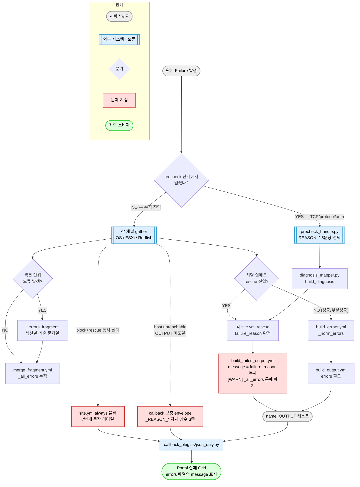

# errors[].message 전수조사 보고서

- 작성일: 2026-08-11
- 대상 브랜치: `main`
- 성격: **조사 전용**. 코드 / 문구 / Schema / failure_code / failure_stage / Portal / 테스트 기대값 **변경 0건**
- 판단 기준: `CLAUDE.md` §2 Source of Truth — **현재 실제 코드**가 정본. 문서 서술이 코드와 다르면 코드를 사실로 기록하고 문서 쪽을 문제로 표시했다

---

## 0. 조사 개요

### 0-1. 조사 범위 (14 영역, 실제 확인 파일 282개)

| 영역 | 코드 | 확인 대상 |
|---|---|---|
| Precheck 라이브러리 | `PB` | `common/library/precheck_bundle.py` 전체 + `common/library/**` |
| Callback | `CB` | `callback_plugins/json_only.py` 전체 |
| Common Normalize | `NM` | `common/tasks/normalize/**` (11파일) + `common/tasks/precheck/**` + `common/vars/**` + `filter_plugins/**` |
| OS Linux | `OL` | `os-gather/site.yml` PLAY 2 + `os-gather/tasks/linux/**` + preflight + raw fallback |
| OS Windows / 감지 | `OW` | `os-gather/site.yml` PLAY 1 · 1.5 · 3 + `os-gather/tasks/windows/**` |
| ESXi | `EX` | `esxi-gather/**` 전체 (17파일, library 포함) |
| Redfish Tasks | `RT` | `redfish-gather/site.yml` + `redfish-gather/tasks/**` + `adapters/**` + `lookup_plugins/**` + `module_utils/**` |
| Redfish Library | `RL` | `redfish-gather/library/redfish_gather.py` 전체 5,361줄 |
| 소비 / 계약 층 | `JK` | `Jenkinsfile*`, `jenkins/**`, `schema/**`(baseline·examples·output_examples 포함), `inventory/`, `ansible.cfg`, `tools/` |
| 테스트 층 | `TS` | `tests/**` (unit / e2e / integration / regression / fixtures) |

문자열 검색(`message:`)만이 아니라 `_errors_fragment` → `_all_errors` → `_norm_errors` → `errors[]` 로 이어지는
**간접 경로 95건**을 변수 단위로 역추적했다.

### 0-2. 검증 방식 (신뢰도 구분)

| 구분 | 내용 |
|---|---|
| 병렬 조사 | 10개 영역 조사 + 4개 렌즈(A·B / C·D / E·F·G / H) 교차 분석. 렌즈는 조사 결과를 **재확인 없이 인용 금지** 조건으로 실행 |
| 직접 재검증 | 보고서 작성자가 Critical·High 주장 중 **11건을 원본 코드로 직접 재확인** (§0-3) |
| 등급 부여 | 렌즈가 실코드로 검증해 지목한 라인은 렌즈 등급 우선. 나머지는 §6-0 의 기계 규칙 |

### 0-3. 작성자 직접 재검증 결과 (11건 — 전부 주장과 일치)

| # | 검증 대상 | 명령/방법 | 결과 |
|---|---|---|---|
| V1 | `redfish-gather/site.yml:314-330` 의 삼항 조건 불일치 | 원문 판독 | **일치** — `failure_reason` 은 `collected` 만, `failure_stage`/`failure_code`/`auth_success` 는 `(rejected and not collected)` |
| V2 | `ip_in_use` 를 set 하는 코드 부재 | `grep -n ip_in_use precheck_bundle.py` | **일치** — 정의 3줄 + `.get()` 읽기 3곳(`:1252`,`:1314`,`:1324`)뿐, set 0건 |
| V3 | `account_service.yml` 이 모듈 errors 를 안 읽음 | `grep -c errors` = 0 | **일치** — `_rf_acct_result` 는 meta 7키만 읽음 |
| V4 | 성공 fallback 이 `errors` 에 append + 섹션 failed 강등 | `redfish_gather.py:2534,:2542,:3755-3756` 판독 | **일치** — `if errs: failed.append(section)` |
| V5 | `esxi_disks.py` 가 예외를 성공으로 반환 | `:190-193` 판독 | **일치** — `except Exception: module.exit_json(..., error=str(e))` |
| V6 | `schema/field_dictionary.yml` 에 errors 정의 부재 | `grep -c '^  errors'` = 0 | **일치** |
| V7 | `schema/output_examples/redfish_failed.jsonc` 존재 | `ls` | **일치** |
| V8 | `_e_disks_ok` / `_e_config_ok` / `_e_dns_ok` 소비처 부재 | `grep -rn` (각 1~3건 = 정의·주석뿐) | **일치** |
| V9 | 위 예시 파일의 message ≠ failure_reason | `:41` vs `:69` 판독 | **일치** — 서로 다른 문장, 둘 다 5문장 밖, IP 노출 |
| V10 | `build_failed_output.yml` 이 `_all_errors` 미참조 | `grep -c _all_errors` = 0 | **일치** |
| V11 | `CLAUDE.md:83` ↔ 코드 정본 불일치 | 원문 대조 | **일치** — `대상 IP 사용은 확인됐지만` 누락 |

### 0-4. 이 조사에서 하지 않은 것

코드 수정 / Message 수정 / Refactoring / Schema 변경 / failure_code·failure_stage 변경 / Portal 수정 /
신규 기능 / IPAM·ARP·ICMP 기능 / Credential 구조 변경 / Account Flow 변경 / Vault Rotation /
Git History Cleanup / 테스트 기대값 수정 — **전부 미수행**. 개선 문구도 만들지 않았다.

또한 오래된 `ping -> port -> protocol -> auth` 서술을 코드 동작으로 가정하지 않았다. 실제 코드는
ICMP 를 게이트로 쓰지 않으며, `_check_ports` → `_probe_protocol` → (선택) auth 구조다.

---

## 1. 전체 요약

### 1-1. 수량

```
errors.message 발생 경로 총 개수 : 324
  └ production 생성 경로         : 239
  └ 소비 / 계약 / 테스트 층       :  85   (Jenkins·schema 24 + tests 61)

고유 Message 총 개수             : 284   (production 기준 205)

중앙 정의 Message 사용 지점       :  47   (production 33)
하드코딩 Message                 : 161   (Python 101 + Ansible task 60 / production 135)
Exception · Raw 출력 사용         :  49   (exception_string 26 + module_output 23 / production 34)
다른 변수에서 복사               :  22
Callback 생성                    :  19
Fallback 생성                    :  10
정적 산출물(예시·baseline)        :  16
```

### 1-2. 분류 (§6-0 기준)

| 분류 | 전체 324 | production 239 |
|---|---|---|
| KEEP | 14 | 14 |
| REVIEW | 24 | 12 |
| CHANGE | 223 | 165 |
| DUPLICATE | 33 | 26 |
| CONTRACT ISSUE | 30 | 22 |

### 1-3. `errors[].message` ↔ `diagnosis.failure_reason` 관계 (production 239)

| 관계 | 건수 | 의미 |
|---|---|---|
| `same` — 항상 동일 | 56 | `build_failed_output.yml` 을 지나는 **failed 경로**. failure_reason 을 그대로 복사 |
| `diff` — 서로 다름 | 110 | 주로 **partial / success 섹션 오류**. failure_reason 은 null 인데 message 는 기술 문자열 |
| `none` — failure_reason 자체 없음 | 66 | 섹션 단위 오류·정보성 로그 |
| `?` — 확정 불가 | 7 | 조건부 경로 |

**결론: "errors[].message == diagnosis.failure_reason" 은 항상 참이 아니다.**
`failed` 경로에서만 참이고, 실제로 더 흔한 `partial` / `success` 경로에서는 성립하지 않는다.
`common/vars/failure_reasons.yml:9-10` 과 `build_failed_output.yml:45-46` 의
"두 값은 **항상 일치**한다" 라는 주석은 **failed 경로에 한정된 서술**이다.

### 1-4. 부재 / 소실

- `errors[].message` 가 null / 빈 문자열 / 필드 부재 / `errors` 자체 부재가 되는 경로: **101건** (§5)
- 간접 생성 경로(변수 체인): **95건**

---

## 2. Message 생성 구조 (실제 코드 기준)

> 이 그림이 말하는 것: `errors[].message` 로 가는 길은 **하나가 아니라 둘**이고, 두 길에 적용되는 문구 규칙이 서로 다르다.



> 읽는 법: 위에서 아래로. 파란 상자는 외부 시스템·모듈, 빨간 상자는 이번 조사에서 문제로 지목한 지점.
> 핵심 분기는 가운데 `치명 실패로 rescue 진입?` 하나이며, 여기서 **좌우 두 파이프라인의 문구 규칙이 갈린다**.

### 2-1. 두 파이프라인의 규칙 차이 (이 조사의 핵심 발견)

| | **파이프라인 A — failed 경로** | **파이프라인 B — partial / success 경로** |
|---|---|---|
| 경로 | rescue → `build_failed_output.yml` | fragment → `merge_fragment.yml` → `build_errors.yml` → `build_output.yml` |
| message 출처 | `diagnosis.failure_reason` **그대로 복사** (`:56-58`) | 각 gather / 모듈이 만든 **문자열 무변형 통과** (`build_errors.yml:42`) |
| 문구 검열 | 중앙 5문장으로 강제 | **없음** |
| 금지어 규칙 적용 | 적용 (`failure_reasons.yml:15-18`) | **미적용** |
| errors 개수 | **항상 정확히 1건** (누적 errors 폐기) | 누적된 만큼 N건 |
| CI 게이트 | `tests/e2e/test_errors_message_contract.py` 15케이스 | **0건** |
| 실제 발생 빈도 | 낮음 (완전 실패 시) | **높음** (미지원 endpoint·권한 부족은 상시) |

**같은 `errors[].message` 필드가 두 개의 상충하는 계약을 동시에 담고 있다.**
Portal 은 status 와 무관하게 같은 배열을 읽으므로, 사용자는 한 화면에서
정제된 한국어 5문장과 `Processor /redfish/v1/Systems/1/Processors/CPU1 실패: 401` 을 섞어 보게 된다.

---

## 3. 중앙화 현황

### 3-1. `common/vars/failure_reasons.yml` 이 담당하는 범위

| 항목 | 내용 |
|---|---|
| **담당** | precheck 가 멈춘 실패(reachable / port / protocol / auth) + 각 채널 rescue 가 만드는 `status=failed` envelope 의 `errors[0].message` |
| **담당하는 문장 수** | 5 |
| **담당하지 않는 것** | ① `status=partial` / `success` 의 섹션 단위 errors 전부 ② callback 보충 envelope 의 6번째 문장 ③ `site.yml always` 블록의 7번째 문장 ④ `build_failed_output.yml` 의 인라인 fallback 문장 ⑤ Redfish 모듈이 만드는 섹션 문자열 전부 ⑥ 계정 처리 모듈이 만드는 문장 전부(사용자에게 도달 안 함) |

### 3-2. 실제로 사용자에게 나가는 문장은 5개가 아니라 **7개** (+ 잠재 1)

| # | 문장 | 정의 위치 | 중앙 여부 |
|---|---|---|---|
| 1 | `대상 IP에서 응답을 확인할 수 없습니다. IP 사용 여부와 네트워크 상태를 확인하세요.` | `failure_reasons.yml:25` + `precheck_bundle.py:133-135` | 중앙 (2곳 복제) |
| 2 | `대상 IP 사용은 확인됐지만 관리 포트에 연결할 수 없습니다. 방화벽과 관리 서비스 상태를 확인하세요.` | `failure_reasons.yml:28` + `precheck_bundle.py:137-140` | 중앙 (2곳 복제) — **도달 불가 (H3)** |
| 3 | `관리 포트에는 연결됐지만 서버 정보 수집에 필요한 응답을 확인할 수 없습니다. 관리 서비스 설정과 상태를 확인하세요.` | `failure_reasons.yml:31` + `precheck_bundle.py:142-145` | 중앙 (2곳 복제) |
| 4 | `대상에 접속할 수 없습니다. 자격증명과 계정 권한을 확인하세요.` | `failure_reasons.yml:34` + `precheck_bundle.py:147-149` + `json_only.py:102-104` | 중앙 (**3곳** 복제) |
| 5 | `대상 접속은 확인됐지만 정보 수집에 실패했습니다. 대상 상태와 수집 로그를 확인하세요.` | `failure_reasons.yml:37` + `precheck_bundle.py:151-153` + `json_only.py:106-108` | 중앙 (**3곳** 복제) |
| 6 | `수집에 실패했습니다. 대상 상태와 수집 로그를 확인하세요.` | `build_failed_output.yml:60` | **중앙 밖 / 단일 리터럴** |
| 7 | `수집 결과를 생성하지 못했습니다. 실행 로그를 확인하세요.` | `json_only.py:111` + `os-gather/site.yml:441,444,666,669` + `esxi-gather/site.yml:304,307` + `redfish-gather/site.yml:375,378` | **중앙 밖 / 9곳 리터럴 중복** |
| (8) | `프로토콜 확인 실패` | `precheck_bundle.py:1356-1358` 의 `.get()` 기본값 | **중앙 밖 / 현재 도달 불가** |

문자열 일치 실측: 1~5번은 `failure_reasons.yml` 과 `precheck_bundle.py` 사이에 **글자 단위 일치**를 확인했다.
그러나 이 동기화는 코드 구조가 아니라 `tests/e2e/test_errors_message_contract.py` **테스트 1개**에만 걸려 있다.
`json_only.py` 는 Ansible 로더 제약으로 import 불가라는 기술적 이유가 있으나,
`failure_reasons.yml` ↔ `precheck_bundle.py` 사이에는 그런 제약이 없다.

### 3-3. 중앙 밖에서 개별 정의된 message 규모

| 위치 | 개별 정의 수 |
|---|---|
| `redfish-gather/library/redfish_gather.py` (`_err()` 계열) | 86 경로 / 고유 문자열 다수 |
| `os-gather/tasks/**` (Linux 24 + Windows 19) | 43 경로 |
| `esxi-gather/**` | 19 경로 |
| `redfish-gather/tasks/**` + adapters | 30 경로 |
| `callback_plugins/json_only.py` | 15 경로 |
| `common/tasks/normalize/**` | 19 경로 |
| **중앙 5문장이 커버하는 production 경로** | **33 / 239 (13.8%)** |

즉 **production 경로의 86%는 중앙 정의 밖에서 문장이 만들어진다.**

---

## 4. 문제 목록 (중복 제거 34건, 중요도 순)

렌즈 4종이 보고한 71건에서 동일 사안을 병합했다. 각 항목은 `문제 / 위치 / 현재 Message / 왜 문제인지 / 영향 범위` 로만 기술하며 **개선 문구는 만들지 않았다.**

### Critical (6)

#### C1. Redfish rescue 에서 `failure_reason` 과 `failure_stage`/`failure_code`/`auth_success` 가 **서로 다른 조건**으로 갈린다 — `CONTRACT ISSUE`

- **위치**: `redfish-gather/site.yml:314-330` (특히 `:324-329`)
- **현재 Message**: `대상에 접속할 수 없습니다. 자격증명과 계정 권한을 확인하세요.`
- **왜 문제인지**: 같은 `set_fact` 안에서
  `failure_stage`/`failure_code`/`auth_success` 는 `(rejected and not collected)` 로 갈리는데
  `failure_reason` 만 `collected` 하나로 갈린다. `rejected=false, collected=false` 일 때
  `failure_stage='gather'` + `failure_code='GATHER_FAILED'` + `auth_success=null` 인데
  message 는 자격증명을 지목한다. Portal 은 message 를, 로그·대시보드는 stage/code 를 읽으므로
  **같은 결과를 두 소비자가 다르게 해석한다.** `CLAUDE.md` §9·§10 계약 위반. (작성자 V1 재검증 완료)
- **영향 범위**: Redfish 실패 중 401 실증이 안 된 전부(timeout / TLS / 403 / 5xx / 펌웨어 / OEM / 데이터 문제).
  `rejected=true` 는 "후보 전원이 정확히 401" 이라는 좁은 조건이라 실제 사이트 실패 대부분이 이 분기로 수렴한다.

#### C2. `status=partial` / `success` 경로의 message 가 5문장 계약을 전혀 통과하지 않는 raw 기술 문자열 — `CONTRACT ISSUE`

- **위치**: `redfish_gather.py` 의 `_err()` 호출 53곳(`:1871`, `:2061`, `:2111`, `:2120`, `:2232-2234`, `:2448`, `:2899-2900`, `:3406`, `:3490`, `:457-458` 등)
  → `redfish-gather/tasks/normalize_standard.yml:619` → `merge_fragment.yml:61-66` → `build_errors.yml:39-44` → `build_output.yml`
- **현재 Message**: `manager_uri 없음` / `chassis_uri 없음 (detect_vendor 에서 Chassis 미발견)` /
  `f'Processor {uri} 실패: {perr or st}'` / `f'Memory 컬렉션 실패: {err or st}'` /
  `f'NetworkAdapters 미지원 또는 실패: {sig}'` / `f'SmartStorage.{coll_key} 실패: {cerr or cst}'` /
  `f'collection 멤버 {len(seq)} > 상한 {MAX_COLLECTION_MEMBERS} — 절단(DoS 방어)'`
- **왜 문제인지**: `failure_reasons.yml:15-18` 이 금지한 항목(HTTP status / 내부 용어 / raw exception / 긴 대시)이 전부 들어간다.
  `normalize_standard.yml:619` 는 타입만 검사하고 문자열은 **무변형 통과**시키며, 이후 어느 단계에도 검열이 없다.
- **영향 범위**: Redfish `status=success`/`partial` 전부. 실장비에서 일부 endpoint 미지원은 흔하므로 **정상 수집 결과에 상시 노출**.

#### C3. Redfish 공통계정 처리 실패 8종의 원인별 문장이 코드에서 **통째로 버려진다** — `CHANGE`

- **위치**: 생성 `redfish_gather.py:4793-4798, :4812-4822, :4900-4923, :4931-4935, :4962-4966, :5028-5034` /
  반환 `:5247` / **폐기** `redfish-gather/tasks/account_service.yml:129-141`
- **현재 Message**(전부 사용자에게 도달하지 않음):
  `동일한 사용자 이름이 여러 계정 슬롯에 존재해 자동 처리를 중단했습니다. 중복 슬롯을 정리한 뒤 다시 시도하세요.` /
  `대상 계정이 잠금 상태입니다. 비밀번호 불일치가 아니라 계정 잠금이 원인일 수 있습니다.` /
  `대상 계정이 비활성 상태입니다. …` /
  `기존 계정의 비밀번호를 맞춘 뒤 인증 확인에 실패했습니다. …`
- **왜 문제인지**: `account_service.yml` 에 `errors` 라는 문자열이 **0건**이며, `_rf_acct_result` 에서 meta 7키만 읽고 `.errors` 는 읽지 않는다.
  결과적으로 Primary 명시적 거부 / Recovery 인증 실패 / 계정 생성 실패 / Password Sync 실패 / 재인증 실패 /
  AccountService 조회 실패 / 계정 잠금 / 계정 비활성 **8종이 전부 rescue 의 4번 문구 하나로 수렴**한다.
  저장소에서 가장 사용자 친화적인 문장들이 폐기되고 있다. (작성자 V3 재검증 완료)
- **영향 범위**: Redfish 계정 자동 정리 경로 전체. **계정 잠금은 재시도할수록 악화되는데 사용자는 "자격증명 확인" 만 안내받아 재시도를 반복하게 된다.**

#### C4. Redfish 만 "인증 성공 + 수집 실패" 를 자격증명 문제로 단정한다 — os/esxi 와 판정 입력 자체가 다름 — `CHANGE`

- **위치**: `redfish-gather/site.yml:328-329` vs `esxi-gather/site.yml:256-258` vs `os-gather/site.yml:397, :621`
- **현재 Message**: redfish `(_fr_gather_failed if collected else _fr_credential_failed)` — 여기서 `collected = _rf_collect_ok`
- **왜 문제인지**: os/esxi 는 **자격 probe 전용 결과**(`_os_auth_ok` / `_e_auth_ok`)로 4번↔5번을 가른다.
  redfish 만 **전체 수집 결과**(`_rf_collect_ok` = `try_one_account.yml:38-40` 의 `_rf_attempt.status != 'failed'`)로 가른다.
  인증이 완벽히 성공해도 수집 도중 실패하면 자격증명 문구가 나간다.
  **같은 파일 `site.yml:112-116` 주석이 이미 이 문제를 명시**한다 — "이 지점에서 '인증 실패' 를 확정할 근거가 없다".
- **영향 범위**: Redfish 채널 전체. precheck 통과 후 모든 실패가 이 rescue 를 지난다. Portal 노출 빈도 최상위.

#### C5. `status=partial` / `failed` 인데 `errors[]` 가 **빈 배열**인 경로가 정상 코드로 만들어진다 — `CHANGE`

- **위치**: `esxi-gather/tasks/normalize_storage.yml:78-86` / `os-gather/tasks/linux/gather_network.yml:684-690` /
  `os-gather/tasks/linux/gather_users.yml:109-111, :248-250` / `os-gather/tasks/windows/gather_users.yml:81-83` /
  `common/tasks/normalize/build_sections.yml:39-41` (미분류 else 분기) /
  `esxi-gather/library/esxi_disks.py:190-193` + `collect_disks.yml:23` · `collect_config.yml:19` · `collect_dns.yml:36`
- **현재 Message**: **없음** (`_errors_fragment: []` 인데 `_sections_failed_fragment` 에는 섹션명이 들어감)
- **왜 문제인지**: Linux raw fallback 은 `_sections_failed_fragment: ['network']` 바로 다음 줄이 `_errors_fragment: []` 다.
  ESXi 는 datastore 모듈이 통째로 실패하면 `_e_unsized_ds` 가 비어 errors 가 0건이 된다.
  `esxi_disks.py` 는 어떤 예외도 `exit_json(..., error=str(e))` 로 성공 처리하는데 그 `error` 키를 읽는 코드가 없고,
  `_e_disks_ok`/`_e_config_ok`/`_e_dns_ok` 세 플래그도 **소비처가 0건**이다.
  `build_status.yml` 은 sections 만 보고 errors 를 보지 않으므로 이 조합은 코드상 정상이다.
  **Portal 은 "부분 실패" 표시는 뜨는데 사유 칸이 비게 된다.** (작성자 V5·V8 재검증 완료)
- **영향 범위**: ESXi(NFS/vSAN 환경 상시 + 물리디스크·컨트롤러·설정·DNS 전 구간 무증상) +
  Linux raw fallback(RHEL 8.10 등 구형 Python 환경의 상시 경로) + OS users 섹션 전 경로.

#### C6. vault accounts 가 비면 수집 실패가 "자격증명 실패" 로 라벨링되고, **같은 errors 원소의 message 와 detail 이 정면 모순** — `CONTRACT ISSUE`

- **위치**: `esxi-gather/site.yml:71-80, :88-94, :248-266` + `esxi-gather/tasks/try_credentials.yml:17-26` /
  동일 구조 `os-gather/site.yml:388-404, :611-629` + `os-gather/tasks/try_credentials.yml:22-32`
- **현재 Message**: `message = "대상에 접속할 수 없습니다. 자격증명과 계정 권한을 확인하세요."`
  ↔ 같은 원소의 `detail = "[task: esxi | abort if facts failed] … 인증과 네트워크는 정상이나 vSphere API 호출이 실패했습니다."`
- **왜 문제인지**: `try_credentials.yml:17-21` 이 `_e_auth_ok`/`_os_auth_ok` 를 false 로 초기화하고,
  accounts 가 0건이면 iterate 가 `when` 으로 skip 되어 **끝까지 false 로 남는다**.
  동시에 `abort if all credentials failed` 는 `length > 0` 조건이라 함께 skip 된다.
  그 상태로 진행해 `abort if facts failed` 가 터지면 rescue 는 auth_ok 하나로 분기하므로
  `stage='auth'` + `code='AUTH_PROBE_FAILED'` + 4번 문장을 설정한다.
  **한 원소 안에서 message 는 "자격증명 확인" 을, detail 은 "인증과 네트워크는 정상" 을 말한다.**
- **영향 범위**: esxi + os(linux/windows) 3 play. accounts 가 비었거나 precheck 이후~자격 probe 이전에 죽는 모든 실패. 사용자를 vault 로 잘못 유도한다.

### High (13)

#### H1. rescue 진입 순간 **섹션 단위 errors 가 전부 폐기**되고 `errors[]` 가 항상 1건으로 축약된다 — `CHANGE`
- **위치**: `common/tasks/normalize/build_failed_output.yml:52-74`(리터럴 1원소 list), `:107`
- **왜 문제인지**: 이 파일은 `_all_errors` 를 **한 번도 참조하지 않는다**(`grep -c` = 0). 그때까지 누적된 식별자 진단·OEM 경고·Redfish 섹션 실패·dmidecode 경고가 통째로 사라진다. 같은 파일이 `data` 는 `_merged_data | default(...)` 로 보존하는데 errors 만 버린다 — 비대칭. C3 과 합쳐지면 실패 원인 정보가 이중으로 소실된다. (작성자 V10 재검증 완료)
- **영향 범위**: 3채널 전체의 모든 `status=failed`.

#### H2. 정본 밖 6·7번째 문장 + **9곳 리터럴 중복** — `DUPLICATE` / `CONTRACT ISSUE`
- **위치**: `build_failed_output.yml:60` / `os-gather/site.yml:441,444,666,669` / `esxi-gather/site.yml:304,307` / `redfish-gather/site.yml:375,378` / `json_only.py:111`
- **현재 Message**: `수집에 실패했습니다. 대상 상태와 수집 로그를 확인하세요.` / `수집 결과를 생성하지 못했습니다. 실행 로그를 확인하세요.`
- **왜 문제인지**: 6번째는 정본 5번(`대상 접속은 확인됐지만 정보 수집에 실패했습니다. 대상 상태와 수집 로그를 확인하세요.`)과 **뒷부분이 완전히 동일**하고 앞부분만 다른데 **의미는 정반대**다(5번=접속 확인됨 / 6번=아무것도 확정 못함). 7번째는 각 `site.yml` 의 같은 dict 안에서 `diagnosis.failure_reason` 과 `errors[0].message` 두 자리에 **따로** 적혀 있어 한쪽만 고치면 즉시 어긋난다. 또 6번째가 나오는 경우에 한해 `message ≠ failure_reason(null)` 이 되는데 이는 "항상 일치" 주장의 유일한 예외이며 어디에도 명시돼 있지 않다.
- **영향 범위**: 3채널 always 블록 + callback 보충 envelope 전체.

#### H3. 중앙 5문장 중 **2번이 도달 불가** — RST 관측인데 "IP 사용 여부를 확인하세요" 가 나간다 — `CONTRACT ISSUE`
- **위치**: `precheck_bundle.py:163-179`(`reason_for_connect_failure`), 호출부 `:1252, :1314, :1324`, 초기화 `:1019-1039`
- **왜 문제인지**: `ip_in_use` 키를 result 에 **set 하는 코드가 저장소 전체에 0건**이라 `.get()` 은 항상 None → 항상 1번 문장. 문제는 `:1317-1326` 분기다: RST 를 실제로 관측해 `failure_code=TCP_CONNECTION_REFUSED` 로 확정한 상황에서도 사용자에게는 "응답을 확인할 수 없습니다" 라고 말한다. 시스템은 "포트가 거부됐다", 사용자 문장은 "IP 를 확인하라". docstring(`:166-172`)이 "presence probe 자체는 만들지 않는다(별도 작업 영역)" 로 의도된 미완성임을 밝히고 있어 **버그가 아니라 미완성**이지만, 결과적으로 표준 5문장 중 1개가 실사용 0이다. (작성자 V2 재검증 완료)
- **영향 범위**: 3채널 전부의 port 단계 실패. 방화벽이 RST 로 거절하는 사내망에서 매번 잘못된 조치(IP 대장 확인)를 안내.

#### H4. 원격 `lspci` 의 **raw stderr 원문 200자가 message 에 직접 유입** — `CHANGE`
- **위치**: `os-gather/tasks/linux/gather_network.yml:381`
- **현재 Message**: `('lspci stderr (NIC partial 가능): ' ~ (_l_lspci_nic.stderr | default('') | truncate(200)))`
- **왜 문제인지**: 사용자 문구에 **어떤 문자열이 들어갈지 코드가 통제하지 못한다**. 대상 서버가 뱉는 임의의 커널/라이브러리 오류가 그대로 Portal Grid 에 실린다. 정작 detail 에는 `{'rc': ...}` 만 있어 message/detail 역할이 뒤바뀌었다. `build_status.yml:41` 이 지목한 시나리오 B 라 **`status=success` 에 붙는다**. raw fallback 경로(`:690`)는 같은 상황에 `_errors_fragment: []` 라 비대칭.
- **영향 범위**: Linux python_ok 경로. non-root 수집에서 lspci 권한 부족은 흔함 → 정상 수집 결과에 상시 노출.

#### H5. 식별자 진단 **10문장**이 내부 분류 토큰·영문·긴 대시를 그대로 사용자 문구로 — `CHANGE`
- **위치**: `os-gather/tasks/linux/build_identifier_diagnostics.yml:31,33,35,38,40,42` / `os-gather/tasks/windows/gather_system.yml:167-175`
- **현재 Message**: `식별자 수집 제한 (insufficient_privilege): serial_number — setup fact=NA, DMI direct-read 실패. become 권한을 확인하세요.` 등 10종
- **왜 문제인지**: 영문 내부 enum(`insufficient_privilege`/`identifier_not_available`), Ansible 개념(`setup fact`, `become`), 하드웨어 약어(`DMI direct-read`), 금지된 긴 대시가 한 문장에 3~4개씩 겹친다. 이 진단은 non-fatal 이라 **`status=success` 인 정상 결과에 붙는다**. 추가로 Linux 는 분기 3종·Windows 는 2종으로 **같은 상황에 두 OS 가 다른 이야기**를 한다.
- **영향 범위**: OS 채널 Linux+Windows 전체. serial/uuid 미제공은 VM·권한 제한 환경에서 매우 흔해 host 1대당 최대 2건 동시 발생.

#### H6. message 전체가 **영문**이고 내부 변수명 2개가 그대로 — `CHANGE`
- **위치**: `os-gather/tasks/linux/gather_system.yml:464`
- **현재 Message**: `vendor extraction failed — ansible_system_vendor undefined and _l_raw_vendor unset`
- **왜 문제인지**: 저장소에서 유일하게 message 전체가 영문이다. Ansible fact 이름과 내부 로컬 변수명을 그대로 실었고 긴 대시도 포함한다. detail 은 `'inv_host=' ~ inventory_hostname` 이라 대상 IP 를 노출한다. `status=success` 결과에도 나간다.
- **영향 범위**: Linux. vendor 정보를 못 얻는 VM/화이트박스.

#### H7. `total_basis=os_visible` — 내부 필드 표현이 사용자 문구에 — `CHANGE`
- **위치**: `os-gather/tasks/linux/gather_memory.yml:173-174`
- **현재 Message**: `dmidecode 결과 없음 — total_basis=os_visible fallback (권한 부족 또는 dmidecode 미존재)`
- **왜 문제인지**: 긴 대시 + 내부 필드 표현 + 명령어명. `build_status.yml:40` 이 이 위치를 시나리오 B 의 공식 reference 로 지목할 만큼 상시 경로다. detail 이 문자열이 아니라 dict 라 타입 일관성도 깨진다. raw fallback 경로(`:300-325`)는 같은 상황에 `_errors_fragment: []` 라 비대칭.
- **영향 범위**: Linux python_ok / sudo dmidecode 불가 환경 전부. `status=success` 에서 발생.

#### H8. ESXi storage: **datastore 이름 목록이 message 에 무제한 concat** — `CHANGE`
- **위치**: `esxi-gather/tasks/normalize_storage.yml:84-86`
- **현재 Message**: `'datastore capacity 미수집 (type/accessible 보존, size=null): ' ~ (_e_unsized_ds | join(', '))`
- **왜 문제인지**: 괄호 안은 envelope 내부 필드 상태를 설명하는 개발자 메모다. 뒤에 datastore 이름이 임의 개수로 이어져 **문장 길이가 예측 불가**하고 상한 방어가 없다. detail 은 `{'datastores': [...]}` dict 로 정보 중복이며 ESXi 채널에서 유일한 dict detail 이다.
- **영향 범위**: capacity 를 보고하지 않는 datastore(NFS·vSAN·vVOL) 보유 호스트 전부 — 실환경에서 흔함. `status=success`.

#### H9. `예외 발생` — message 가 사실상 빈 문장 — `CHANGE`
- **위치**: `redfish_gather.py:3763-3766` (`_make_section_runner._run` 의 except 절)
- **왜 문제인지**: 원인은 detail 에만 들어가고 message 는 4글자 고정이다. **섹션명조차 message 에 없다.** Portal 이 message 만 보여주면 사용자는 "예외 발생" 네 글자만 본다. (작성자 V4 재검증 완료)
- **영향 범위**: Redfish 10개 섹션 전부의 공통 catch-all.

#### H10. message 가 **null / 빈 문자열 / dict repr** 이 되는 것을 막는 가드가 없다 — `CHANGE`
- **위치**: `merge_fragment.yml:61-66` / `build_errors.yml:39-44`
- **현재 Message**: `'message': e.message | default(e | string)`
- **왜 문제인지**: Jinja2 `default()` 는 두 번째 인자 없이는 **undefined 일 때만** 치환한다. 따라서 ① `message: None` → null 그대로 ② `''` → 빈 문자열 그대로 ③ message 키 부재 → `e | string` 이 발동해 **파이썬 dict repr** 이 사용자 문장이 된다. 같은 파일의 문자열 원소 분기에는 `e | trim | length > 0` 가드가 있는데 **dict 분기에만 없다** — 비대칭의 근거가 코드/주석 어디에도 없다. `tests/unit/test_errors_normalize.py:139-144` 는 message 키 없는 dict 를 입력하면서 message 값은 검사하지 않는다.
- **영향 범위**: 3채널 공통 정규화 계층. 새 gather/vendor OEM 이 키를 빠뜨리는 순간 내부 자료구조가 Portal 에 노출된다.

#### H11. **성공한 fallback 이 errors[] 에 기록되고, 그 부작용으로 status 가 partial 로 강등** — `CHANGE`
- **위치**: `redfish_gather.py:2534, :2542`(storage) / `:1170-1171, :1180-1181`(vendor 식별) / `:5141-5145, :5164-5167`(POST retry) → `:3755-3756` → `build_sections.yml:35-36` → `build_status.yml:64-65`
- **현재 Message**: `Storage 미지원, SimpleStorage fallback 사용` / `Storage/SimpleStorage 미지원, SmartStorage (HPE OEM legacy) fallback 사용` / `f'WWW-Authenticate realm fallback로 vendor={realm_vendor} 식별 …'`
- **왜 문제인지**: 전부 **수집·식별에 성공한** 정보성 로그인데 errors[] 에 들어간다. storage 는 `if errs: failed.append(section)` 때문에 **데이터를 정상 수집했는데도 overall status 가 partial 로 강등**된다. 더욱이 `:1169/:1179` 는 **message 문자열 부분일치로 앞선 error 를 제거**한다 — 사용자 문구가 제어 로직의 키로 쓰이고 있어 문구를 다듬는 순간 분류가 깨진다. (작성자 V4 재검증 완료)
- **영향 범위**: HPE iLO4 등 구세대 BMC / ServiceRoot 정보가 빈약한 모든 벤더. 해당 장비는 **매 수집마다 partial** 로 보고된다.

#### H12. `status=failed` 인데 `diagnosis.failure_reason=null` 인 envelope 이 정상 경로로 생성 가능 — `CONTRACT ISSUE`
- **위치**: `build_status.yml:53-66` + `build_output.yml:45-63` + `os-gather/site.yml:295-303` + `redfish-gather/site.yml:232-244`
- **왜 문제인지**: "supported 섹션 0건" 또는 "success 가 하나도 없음" 이면 `_out_status='failed'` 가 되는데, 이 경로는 rescue 가 아니라 **정상 `build_output.yml`** 을 지나므로 성공 경로 diagnosis(failure_* 전부 null 하드코딩)가 그대로 실린다. `CLAUDE.md` §9 "실패인데 failure_reason=null 인 Result 를 만들지 않는다" 를 정면으로 깬다.
- **영향 범위**: 3채널 공통. raw fallback 전멸 / adapter capabilities 로 supported 가 비는 경우.

#### H13. `partial` / `success` 경로 message 에 **CI 품질 게이트가 0건** — `CONTRACT ISSUE`
> 렌즈는 Low 로 평가했으나, 위 C2·H4~H8 이 **재발해도 아무도 막지 못한다**는 구조적 의미가 커서 작성자 판단으로 High 로 올렸다.
- **위치**: 게이트 있음 `tests/e2e/test_errors_message_contract.py:192-207`(failed 경로 15케이스만) /
  게이트 없음 `schema/field_dictionary.yml`(errors 정의 **0건**) · `schema/baseline_v1/*.json` 10개 전부 `"errors": []` ·
  `tests/e2e/test_envelope_failure_modes.py:446-454`(키 존재만 검사) · `tests/integration/emulator_harness.py:253-260`(GOLDEN_KEYS 에서 errors 제외)
- **왜 문제인지**: Portal 문구 품질을 강제하는 `_assert_grid_ready` 가 failed 경로에만 적용된다. partial/success 는 ① field_dictionary 에 errors 정의가 없어 Jenkins Stage 3 가 검사할 근거가 없고 ② baseline 10종이 전부 빈 errors 라 회귀가 아무 문자열도 고정하지 않으며 ③ 골든 재생이 errors 를 비교에서 제외한다. 반대로 일부 테스트는 message 에 HTTP status 를 넣도록 **강제**한다(`tests/unit/test_network_adapters_aux_status.py:250`). (작성자 V6 재검증 완료)
- **영향 범위**: 3채널 partial/success 전부. 이번 조사에서 지적한 A계열 문제의 **재발 허용 통로**.

### Medium (12)

| # | 문제 | 위치 | 현재 Message | 왜 문제인지 | 영향 범위 | 분류 |
|---|---|---|---|---|---|---|
| M1 | `best-effort skip` 4종 + schema 밖 section 이름 | `linux/gather_runtime.yml:122-125` · `linux/gather_hba_ib.yml:191-194` · `windows/gather_runtime.yml:235-238` · `esxi/collect_network_extended.yml:266-269` | `runtime 정보 수집 실패 (best-effort skip)` / `fc_host / infiniband / driver_map 수집 실패 (best-effort skip)` / `vmnic/vmhba/vSwitch/portgroup 수집 실패 (best-effort skip)` | 개발자 용어 + 커널·하이퍼바이저 내부 명칭, 조치 정보 0. section 값 4종(`system_runtime`/`windows_runtime`/`linux_hba_ib`/`esxi_network_extended`)이 schema 11섹션 밖이라 **status 에 영향 없이 errors 만 늘어난다** — "성공인데 실패 문장" | os 2 + esxi | CHANGE |
| M2 | vendor OEM 문구 3종 + `severity` 유실 + 6 vendor 침묵 | `vendors/{cisco,huawei,fujitsu}/collect_oem.yml:66,61,69` / 유실 `merge_fragment.yml:62-66` · `build_errors.yml:40-44` / 침묵 `{dell,hpe,lenovo,supermicro,inspur,quanta}` | `Cisco OEM 영역 일부 미수집 (CIMC 1.x / UCS Manager 매개 가능성 — graceful degradation)` 등 | 긴 대시 + `graceful degradation` + **관측되지 않은 추측**을 사용자에게 단정 전달. 세 vendor 가 명시한 `severity: warning` 은 3키 재조립에서 **경고 없이 삭제**되어 경고/오류 구분 불가. detail 키 부재로 detail=null. 같은 사건에 문구 4종 + section 값 2종(`oem`/`bmc`) 분열 | redfish 9 vendor | CHANGE |
| M3 | `errors[].section` 어휘 **17~20종 분열**, schema 정의 0건 | `build_failed_output.yml:53` · `merge_fragment.yml:57,64` · `json_only.py:419,426,431` · 각 site.yml · `redfish_gather.py` 다수 | `gather`/`unknown`/`precheck`/`auth`/`oem`/`redfish_gather`/`esxi_gather`/`linux_gather`/`windows_gather`/`processors`/`network_adapters`/`vendor_detect`/`multi_node.*` … | 동일한 "전체 수집 실패" 에 채널마다 다른 값. redfish 라이브러리는 schema 가 `cpu` 로 정의한 섹션을 `processors` 로 부른다. `field_dictionary.yml` 에 errors 항목 자체가 없어 Stage 3 가 검증할 근거가 없다 | 3채널 + callback | CONTRACT ISSUE |
| M4 | 정본 5문장이 2~3파일에 각각 하드코딩 | `failure_reasons.yml:25,28,31,34,37` / `precheck_bundle.py:133-153` / `json_only.py:102-108` | 5문장 전부 | 세 파일이 주석으로 서로를 "정본" 이라 가리키지만 값은 각자 하드코딩. 현재 글자 단위 일치는 확인했으나 **동기화 보장이 테스트 1개에만** 걸려 있다. `json_only.py` 는 import 제약이라는 이유가 있으나 `failure_reasons.yml ↔ precheck_bundle.py` 사이에는 제약이 없다 | 3채널 전체 | DUPLICATE |
| M5 | errors 정규화 로직이 **2파일에 통째 복제** | `merge_fragment.yml:40-69` ↔ `build_errors.yml:15-47` | (로직 복제) | 문자열/dict/None 방어 가드와 재조립이 글자 단위로 동일하게 존재하고, 양쪽 주석은 "상호참조" 라고만 적어둘 뿐 공유하지 않는다. 한쪽만 고치면 누적 단계와 최종 단계가 갈린다 | 3채널 공통 | DUPLICATE |
| M6 | DoS 절단 경고 문구 + power/thermal **침묵** | `redfish_gather.py:457-458` / 침묵 `:3227`(power), `:3548`(thermal) | `f'collection 멤버 {len(seq)} > 상한 {MAX_COLLECTION_MEMBERS} — 절단(DoS 방어)'` | 긴 대시 + 영문 내부 용어 + 내부 상수값 노출. docstring(`:451`)은 "silent 절단 금지" 라 적어놓고 power/thermal 호출부만 `errors=None` 을 넘겨 **절단 사실이 아무 데도 남지 않는다**. `tests/integration/test_redfish_round16_robustness.py:69-97` 이 이 문구를 부분문자열로 고정 | redfish | REVIEW |
| M7 | `schema/output_examples/redfish_failed.jsonc` stale | `:41`(failure_reason) vs `:69`(errors[0].message) | `Redfish 정보 수집에 실패했습니다 (10.100.15.1). 네트워크/포트/Redfish API 는 정상 확인됨 … 자격증명 불일치, (2) 계정 권한 부족, (3) 펌웨어 호환성 또는 OEM 경로 문제입니다.` | 호출자에게 envelope shape 를 알려주는 예시인데 ① message ≠ failure_reason ② 둘 다 5문장 밖 ③ **IP 그대로 노출** ④ 원인 3종 추측 나열. Phase 6-B 이전 화석이며 이 파일을 로드하는 테스트가 없어 자동 검출 불가 | 문서·계약 층 | CONTRACT ISSUE |
| M8 | `CLAUDE.md:83` 대표 메시지 2번이 코드와 다름 | `CLAUDE.md:83` vs `failure_reasons.yml:28` | 문서: `대상 IP의 관리 포트에 연결할 수 없습니다. …` / 코드: `대상 IP 사용은 확인됐지만 관리 포트에 연결할 수 없습니다. …` | 빠진 부분이 **1번과 2번을 구분하는 유일한 정보**다. 모든 세션이 읽는 최상위 계약 문서라 오염 전파력이 크다 | 하네스 층 | CHANGE |
| M9 | 테스트 fixture 가 폐기 문구를 보존, 죽은 가드 | `tests/e2e/test_envelope_failure_modes.py:217,234,263,274,284,317,328,371,382` / `tests/unit/test_callback_envelope_reconcile.py:130` | `SSH(22) / WinRM(5985/5986) 포트 모두 닫힘` / `대상 호스트에 ICMP/TCP 도달 불가 — BMC 전원/네트워크 확인` / `수집 결과를 생성하지 못했습니다. **수집기 내부 오류이므로** 실행 로그를 확인하세요.` | ① 관리 포트 번호를 message 에 노출 — 같은 저장소 `test_failure_reason_contract.py:505` 가 production 에서 바로 이 패턴을 막고 있다(가드와 fixture 가 반대 방향) ② ICMP 언급은 현 계약과 모순 ③ `수집기 내부 오류이므로` 6글자가 production 에 없어 **문자열 drift** ④ 자기완결형이라 production 과 비교하는 assert 가 없어 **전부 통과** | 테스트 층 | CHANGE |
| M10 | envelope 1:1 계약이 깨질 때 message 는 "틀린 문장" 이 아니라 **아예 없음** | `json_only.py:137`(`JSON_ONLY_NO_RECONCILE`), `:479-480`, `:513-518` / `Jenkinsfile_portal:181-184` | (없음) | ① 환경변수가 truthy 면 보충 전면 무효 → unreachable 호스트가 stdout 에 아무것도 남기지 않음 ② 보충 루프 **전체**가 단일 try 라 첫 호스트 예외 시 나머지 전부 미보충 ③ `gather_output.json` 0바이트면 Callback stage 자체가 미실행 → Portal 수신 0건 | unreachable 전 경로 | REVIEW |
| M11 | precheck auth 경로가 timeout/TLS/5xx/403 에도 "자격증명" 문장 세팅 | `precheck_bundle.py:1161-1190` (특히 `:1188`) | `대상에 접속할 수 없습니다. 자격증명과 계정 권한을 확인하세요.` | 바로 위 `:1170-1178` 은 `rejected = status == 401` 로 401 일 때만 `auth_success=False` 를 세팅하는 신중한 처리를 하는데, `:1188` 은 그 분기와 무관하게 무조건 자격증명 문장을 넣는다 — **기계 판정은 "모른다", 사용자 문장은 "자격증명이다"**. **현재 production 호출부가 username/password 를 omit 해 도달 0**(`run_precheck.yml:43-44`)이나 배선 복구 시 즉시 활성 | 현재 도달 0(잠재) | REVIEW |
| M12 | `errors[].detail` 타입이 string / dict / null / 빈 문자열 혼재 | dict: `redfish_gather.py:2234,2246` · `linux/gather_memory.yml:174` · `linux/gather_network.yml:381` · `esxi/normalize_storage.yml:85` / 빈문자열: `gather_runtime.yml:125` 등 4곳 | `{'status_code': 401}` / `{'rc': 1}` / `{'datastores': [...]}` / `''` / `null` | `build_errors.yml:43` 이 타입 검사 없이 무변형 통과. `field_dictionary.yml` 에 errors 정의가 0건이라 어느 쪽이 옳은지 규정 자체가 없다. Portal 이 detail 을 문자열로 가정하면 dict 케이스에서 깨진다 | 3채널 | REVIEW |

### Low (3)

| # | 문제 | 위치 | 현재 Message | 왜 문제인지 | 영향 범위 | 분류 |
|---|---|---|---|---|---|---|
| L1 | 표준 밖 4단어 fragment (도달 불가) | `precheck_bundle.py:1356-1358` 의 `.get()` 기본값 | `프로토콜 확인 실패` | 완결된 문장이 아니고 마침표도 조치도 없다. `argument_spec` 의 `choices=['redfish','os','esxi']` 와 dict 3키가 모두 채워져 **현재 도달 불가**지만, 새 채널 추가 시 dict 갱신을 잊으면 즉시 노출 | 잠재 | REVIEW |
| L2 | 보충 envelope 의 `sections`/`data` 가 빈 dict | `json_only.py:445-461` / 각 site.yml always 블록 | (message 는 정본 문장) | message 자체는 문제없으나 같은 envelope 의 `sections` 가 `{}` 라 11섹션 키가 없다. 다른 모든 실패 envelope 은 `build_failed_output.yml:29-41` 이 11섹션을 채운다. 13필드 계약(키 존재)은 지켰지만 **화면 일관성이 깨진다** | 3채널 fallback | REVIEW |
| L3 | rescue detail 템플릿이 **4벌 복제** | `redfish-gather/site.yml:352` / `esxi-gather/site.yml:281` / `os-gather/site.yml:418, :643` | `"[task: {{ ansible_failed_task.name \| default('unknown') }}] {{ ansible_failed_result.msg \| default('<채널> 수집 예외') }}"` | 동일 템플릿을 복제하면서 default 값만 채널명으로 갈아끼웠다. detail 전용이라 사용자 문구 규칙 위반은 아니나 포맷 변경 시 4곳을 동시에 고쳐야 한다 | 3채널 | DUPLICATE |

---

## 5. `errors[].message` 가 비거나 사라지는 경로 (중복 제거 101건)

주요 유형:

| 유형 | 대표 위치 | 결과 |
|---|---|---|
| **섹션은 failed 인데 errors 는 `[]`** | `linux/gather_network.yml:687-690`, `esxi/normalize_storage.yml:78-86` | `status=partial` + 사유 칸 공백 |
| **실패가 `not_supported` 로 강등** | `linux/gather_users.yml:107-111`, `windows/gather_users.yml:81-83` | status·errors 양쪽 무흔적 |
| **모듈 예외를 성공으로 반환** | `esxi_disks.py:190-193` (`error=str(e)` 소비처 0건) | 물리디스크·컨트롤러·포트 전 구간 무증상 |
| **미소비 ok 플래그** | `_e_disks_ok` / `_e_config_ok` / `_e_dns_ok` | 실패 판정 자체가 유실 |
| **rescue 가 누적 errors 폐기** | `build_failed_output.yml` (`_all_errors` 0건) | failed envelope 의 errors 항상 1건 |
| **모듈 errors 를 안 읽음** | `account_service.yml` (`errors` 문자열 0건) | 계정 실패 8종 전부 소실 |
| **envelope 자체 미생성** | `json_only.py:137, :479-480, :513-518` / `Jenkinsfile_portal:181-184` | stdout 0건 → Portal 수신 0건 |
| **정규화 else 분기 부재** | `merge_fragment.yml:56-67`, `build_errors.yml:30-45` | string·mapping 이 아닌 원소는 흔적 없이 drop |
| **message 키 부재 시 dict repr** | 동상 (`e.message \| default(e \| string)`) | 사용자 문장 자리에 파이썬 repr |
| **절단 사실 침묵** | `redfish_gather.py:3227`(power), `:3548`(thermal) | 데이터가 잘렸는데 미통보 |

| # | 케이스 | 위치 | 코드 근거 |
|---|---|---|---|
| N01 | envelope 자체 부재 — 보충 기능 전면 무효화. 환경변수 JSON_ONLY_NO_RECONCILE=1/true/yes 이면 _track 이 즉시 return(:252-253), _mark_emitted 도 no-op(:364-365), _reconcile_mis… | callback_plugins/json_only.py:135, :252-253, :364-365, :479-480 | self._reconcile = not _is_truthy(os.getenv('JSON_ONLY_NO_RECONCILE', '')) (:135) — 비상 스위치로 문서화(:29) |
| N02 | envelope 자체 부재 — 보충 루프 예외. _reconcile_missing_envelopes 전체가 v2_playbook_on_stats 의 try 하나로 감싸여 있어(:514-518) 첫 호스트 처리 중 예외가 나면 남은 미방출 호스트 전부가 보충되지 않는다.… | callback_plugins/json_only.py:513-518 | except Exception as e: self._emit_error(error_type='reconcile_failed', message=type(e).__name__) — stdout 출력 없음 |
| N03 | envelope 자체 부재 — ctx 미생성 호스트. `ctx = self._hosts.get(host_name); if ctx is None or ctx.get('emitted'): continue` (:488-490). stats.processed 에 있어도 _tr… | callback_plugins/json_only.py:488-490 | _track 전체가 try/except Exception: pass 로 감싸여 있어(:273-274) ctx 생성 실패가 조용히 삼켜진다 |
| N04 | stdout 출력 없음(그리고 _mark_emitted 도 안 됨) — OUTPUT 태스크가 ok 인데 result._result 에 'msg' 도 'ansible_facts' 도 없는 경우 그냥 return(:334-335). 결과적으로 stats 시점에 분기 (4)… | callback_plugins/json_only.py:329-336 | if 'msg' in res / elif 'ansible_facts' in res / else: return — else 분기가 _mark_emitted 를 건너뜀 |
| N05 | errors 구조가 통째로 문자열이 되는 경우 — _emit 이 str 을 받아 json.loads 에 실패하면 파싱 없이 그대로 print(:147-161). 호출자는 JSON 객체가 아닌 문자열 한 줄을 받으며 errors 필드에 접근할 수 없다. | callback_plugins/json_only.py:146-161 | except (json.JSONDecodeError, ValueError): (경고만) ... print(line) — data 를 dict 로 만들지 못해도 그대로 진행 |
| N06 | errors 구조 강등 — json.dumps TypeError 시 json.dumps(str(data)) 로 fallback(:157-160). envelope 전체가 파이썬 repr 문자열로 직렬화되어 errors[] 접근 불가. | callback_plugins/json_only.py:155-160 | except TypeError: line = json.dumps(str(data), ...) — 'Round 2 #0/#9' 주석 |
| N07 | errors[] 원소에 code/stage 키 부재 — 보충 envelope 의 errors 원소는 {section, message, detail} 3키만 갖는다. failure_code 는 diagnosis 에만 있고 errors 원소에는 없다. | callback_plugins/json_only.py:457-459 | 'errors': [{'section': err_section, 'message': err_message, 'detail': err_detail}] |
| N08 | envelope 필드가 빈 값 — 보충 envelope 은 sections={}, meta={}, correlation={}, data={}, vendor=None 로 고정. 필드는 존재하지만 내용이 비어 있다(13필드 계약은 충족). | callback_plugins/json_only.py:445-461 | 'sections': {}, 'meta': {}, 'correlation': {}, 'data': {}, 'vendor': None |
| N09 | target_type / collection_method 가 null 이 될 수 있음 — 채널을 끝내 확정하지 못하면 _CHANNEL_ENVELOPE.get(channel, (channel, None)) 이 (None, None) 을 반환하고 ctx 값도 없으면 그대로… | callback_plugins/json_only.py:397-400 + _resolve_channel:373-377 | target_type, collection_method = _CHANNEL_ENVELOPE.get(channel, (channel, None)) — channel 이 None 이면 target_type=None |
| N10 | diagnosis 앞단계 3필드가 null — observed 가 비어 있으면(_diagnosis fact 미관측) reachable / port_open / protocol_supported 가 모두 None 으로 나간다. 분기 2/3/4 에서 흔한 상태. | callback_plugins/json_only.py:466-469 (_diagnosis 헬퍼) | 'reachable': observed.get('reachable') 등 — observed = {} 일 때 전부 None |
| N11 | failure_reason 이 null 인 실패 Result 는 만들어지지 않음(안전망 확인) — 분기 1 에서 관측 failure_reason 이 None/공백이면 _REASON_NO_OUTPUT 로 강제 대체한다. 나머지 3분기는 상수를 직접 넣으므로 null 불가… | callback_plugins/json_only.py:417-419 | if not (isinstance(diagnosis.get('failure_reason'), str) and diagnosis['failure_reason'].strip()): diagnosis['failure_reason'] = _REASON_NO_OUTPUT |
| N12 | errors[] 가 빈 배열([]) — status=partial 인데 실패 사유가 하나도 없음. Raw fallback 모드에서 network 섹션이 failed 로 분류되는데 _errors_fragment 는 [] 다. | os-gather/tasks/linux/gather_network.yml:687-690 (task 'linux \| network \| build fragment (raw… | `_sections_failed_fragment: {{ [] if (_l_norm_interfaces_raw\|default([])\|length > 0 or _l_raw_dns\|default([])\|length > 0) else ['network'] }}` 바로 다음 줄이 `_errors_fragm… |
| N13 | errors[] 가 빈 배열 — system 섹션이 failed 인데 대응 error 없음(vendor 조건이 별도라 안 걸리는 경우). | os-gather/tasks/linux/gather_system.yml:450-453 + :464 (task 'linux \| system \| build fragment… | `_sections_failed_fragment: {{ [] if (ansible_distribution is defined or (_l_fb is defined and _l_fb.DIST is defined)) else ['system'] }}`. 이 조건과 :464 의 vendor 에러 조건(`ans… |
| N14 | 섹션이 not_supported 로 조용히 강등 — users 수집 실패가 errors[] 에 전혀 남지 않음. | os-gather/tasks/linux/gather_users.yml:108-111 (python 경로), :247-250 (raw 경로) | `_sections_unsupported_fragment: {{ ['users'] if (getent_passwd is not defined or not getent_passwd) else [] }}` 와 `_errors_fragment: []`. build_sections.yml:31-32 이 unsu… |
| N15 | errors[].detail 이 null — _fail_error_detail 과 _fail_error_message 둘 다 비었을 때. | common/tasks/normalize/build_failed_output.yml:64-74 | `{{ (parts \| join(' \| ')) if parts else none }}` — parts 가 비면 명시적으로 none. |
| N16 | errors[].detail 이 빈 문자열('') — best-effort rescue 에서 ansible_failed_result.msg 가 없을 때. | os-gather/tasks/linux/gather_runtime.yml:125, os-gather/tasks/linux/gather_hba_ib.yml:194 | 둘 다 `detail: "{{ ansible_failed_result.msg \| default('') }}"` — default 가 none 이 아니라 빈 문자열이라 다른 경로(null)와 타입/값이 불일치. |
| N17 | errors[].message 가 null 로 남을 수 있는 구조적 가능성 — fragment dict 가 message 키를 명시적 null 로 넣은 경우. | common/tasks/normalize/merge_fragment.yml:64, common/tasks/normalize/build_errors.yml:42 | `'message': e.message \| default(e \| string)` — Jinja2 `default()` 는 undefined 만 치환하고 None 은 치환하지 않는다. `{'section':'x','message':none}` 이 들어오면 message 가 null 로 그대로 통과한다.… |
| N18 | errors[] 원소가 통째로 사라짐 — fragment 원소가 string 도 mapping 도 아닌 타입(int/None 등)일 때 조용히 drop. | common/tasks/normalize/merge_fragment.yml:56-67, common/tasks/normalize/build_errors.yml:30-45 | for 루프가 `......` 로만 되어 있고 else 가 없다. 또 빈/공백 문자열은 `` 로 명시적으로 버려진다(:58 / :32). |
| N19 | errors[] 자체가 아예 없는 envelope 은 생기지 않음(반증) — 13 필드 계약이 3중으로 보장됨. | common/tasks/normalize/build_output.yml:61, common/tasks/normalize/build_failed_output.yml:107,… | 성공 경로는 `'errors': _norm_errors`, 실패 경로는 `'errors': _norm_errors`(항상 1원소 list), always fallback 은 하드코딩 1원소 list. callback 보충도 :457-459 로 1원소 list. errors 키가 누락되는 경로는 발견하지 … |
| N20 | precheck 원본 detail 소실 — callback 이 보충한 envelope 에서는 포트별 원본 오류가 사라진다. | callback_plugins/json_only.py:420-421 | `err_detail = 'envelope reconciled by callback; precheck diagnosis preserved'` 고정 문자열로 덮어써지고, _precheck_raw.detail 은 ctx 에 실리지 않아 전달 경로가 없다. |
| N21 | errors[] 가 빈 배열 — Windows 정상 수집 시. 7개 Windows gather 중 5개(cpu/memory/storage/network/hardware)는 `_errors_fragment: []` 를 무조건 set 하고, gather_users 는 :8… | os-gather/tasks/windows/gather_cpu.yml:140, gather_memory.yml:133, gather_storage.yml:499, gath… | grep 결과 Windows 경로에서 비어 있지 않은 _errors_fragment 를 만드는 곳은 gather_system.yml:239(_w_id_diagnostics)와 gather_runtime.yml:235-238 두 곳뿐 |
| N22 | [중요] Windows 는 status=partial 이 **구조적으로 발생하지 않는다** — 어떤 Windows gather 도 정식 11 섹션 이름을 `_sections_failed_fragment` 에 넣지 않는다. 유일한 실패 표기 gather_runtime.y… | os-gather/tasks/windows/*.yml (`_sections_failed_fragment: []` 전량), gather_runtime.yml:234, com… | build_sections.yml:30 `` 의 all_sec 에 'system_runtime' 없음 → :36 `` 미매치 → :37 `` 로 'system'='succ… |
| N23 | [중요] 누적 errors 전량 소실 — rescue 진입 시 build_failed_output.yml 이 `_norm_errors` 를 새 리스트로 set_fact 하므로, 그 전에 merge_fragment 로 쌓인 `_all_errors`(식별자 진단 2건, r… | common/tasks/normalize/build_failed_output.yml:52-75, :107 (`'errors': _norm_errors`) | build_failed_output.yml 은 build_errors.yml 을 호출하지 않고 _norm_errors 를 직접 리터럴로 정의한다 |
| N24 | errors[].message 가 표준 5문장 밖의 6번째 문장이 되는 경우 — _diagnosis 가 없거나 failure_reason 이 null/빈문자 | common/tasks/normalize/build_failed_output.yml:56-61 | `` else → `'수집에 실패했습니다. 대상 상태와 수집 로그를 확인하세요.'` |
| N25 | errors[].detail 이 null — _fail_error_detail 과 _fail_error_message 가 둘 다 비어 있으면 `{{ (parts \| join(' \| ')) if parts else none }}` 로 null | common/tasks/normalize/build_failed_output.yml:64-74 | tests/e2e/test_errors_message_contract.py:243-248 test_errors_detail_is_null_when_nothing_technical 가 이 계약을 고정 |
| N26 | errors[].detail 이 빈 문자열('') — gather_runtime rescue 에서 `ansible_failed_result.msg` 가 undefined 면 `\| default('')` 가 '' 를 넣는다. build_errors.yml 의 `e.de… | os-gather/tasks/windows/gather_runtime.yml:238, common/tasks/normalize/build_errors.yml:43 | Jinja2 default 필터는 None/'' 을 치환하지 않는다(두 번째 인자 boolean=true 미사용) |
| N27 | errors[].message 가 null 이 될 수 있는 구조적 경로 — fragment dict 가 `message: None` 을 명시하면 `e.message \| default(e \| string)` 이 None 을 그대로 통과시킨다(default 는 unde… | common/tasks/normalize/build_errors.yml:42, common/tasks/normalize/merge_fragment.yml:64 | 두 곳 모두 `\| default(...)` 만 쓰고 `\| default(..., true)`(boolean 모드)를 쓰지 않음 |
| N28 | errors 항목이 조용히 통째로 버려지는 경우 — gather_system.yml:239 의 방어 가드가 `_w_id_diagnostics` 가 string/mapping 으로 렌더되면 빈 list 로 강등한다(정보 손실보다 char iteration 회귀 차단 우선… | os-gather/tasks/windows/gather_system.yml:234-239 | `_errors_fragment: "{{ _w_id_diagnostics if (... is iterable and ... is not string and ... is not mapping) else [] }}"` |
| N29 | envelope 자체가 없어 errors 필드도 없는 경우 — 환경변수 `JSON_ONLY_NO_RECONCILE` 이 truthy 이면 callback 의 누락 envelope 보충이 꺼진다 | callback_plugins/json_only.py:135 (`self._reconcile = not _is_truthy(os.getenv('JSON_ONLY_NO_RE… | _reconcile=False 면 _reconcile_missing_envelopes 가 즉시 return |
| N30 | envelope 자체가 없는 경우 — inventory.sh 가 stderr 로 에러 출력 후 sys.exit(1). 플레이북이 시작조차 못 하므로 errors[] 는커녕 envelope 이 0개. 메시지는 `[inventory] ERROR: ...` 로 JSON 이 … | os-gather/inventory.sh:31-33, :61, :80-91 | `def error(msg): print(f"[inventory] ERROR: {msg}", file=sys.stderr); sys.exit(1)` |
| N31 | OUTPUT 이 stdout 에 나가지 않는 경우 — callback 은 태스크 이름을 **완전일치**로 비교한다. os-gather 의 3개 OUTPUT 태스크(site.yml:197, :430, :655)는 모두 `- name: OUTPUT` 이라 현재는 정상이나,… | callback_plugins/json_only.py:127 (`self._output_task = os.getenv('ANSIBLE_JSON_OUTPUT_TASK','O… | os-gather/site.yml:197, :430, :655 모두 `- name: OUTPUT` 완전일치 |
| N32 | status=partial 인데 errors[] 가 완전히 빈 배열 — 사용자가 사유를 볼 수 없음 | esxi-gather/tasks/normalize_storage.yml:78-86 | vmware_datastore_info 실패(collect_datastores.yml:13 failed_when:false 로 흡수) → `_e_ds_ok=false` → :80-81 `_sections_failed_fragment=['storage']`. 동시에 `_e_raw_ds` 가 빈 list 이… |
| N33 | errors[].detail = 빈 문자열 '' | esxi-gather/tasks/collect_network_extended.yml:269 | `detail: "{{ ansible_failed_result.msg \| default('') }}"` — 실패 결과에 msg 키가 없으면(예: Jinja2 렌더 오류가 msg 대신 다른 키로 오는 경우) 빈 문자열. build_errors.yml:43 `e.detail \| default(none)`… |
| N34 | errors[].detail 이 string 이 아니라 dict | esxi-gather/tasks/normalize_storage.yml:85 | `'detail':{'datastores':_e_unsized_ds}` 로 dict 를 그대로 싣고, merge_fragment.yml:65 / build_errors.yml:43 모두 `e.detail \| default(none)` 로 타입 변환 없이 통과. 같은 envelope 의 다른 errors… |
| N35 | errors[].detail = null (rescue 경로에서 두 재료가 모두 비었을 때) | common/tasks/normalize/build_failed_output.yml:64-74 | `{{ (parts \| join(' \| ')) if parts else none }}`. ESXi rescue 는 site.yml:281 이 항상 `[task: ...]` prefix 를 붙여 non-empty 이므로 실무상 null 은 안 나오지만, `_fail_error_message` 를 set… |
| N36 | 수집 실패했는데 errors[] 항목 자체가 아예 생성되지 않음 (침묵 실패) | esxi-gather/tasks/collect_disks.yml:23-25 / collect_config.yml:19-20 … | `_e_disks_ok` / `_e_config_ok` / `_e_dns_ok` 를 소비하는 코드가 저장소 전체에 0건(grep '_e_disks_ok\|_e_config_ok\|_e_dns_ok' 결과가 정의 라인과 주석뿐). esxi_disks.py:190-193 은 예외를 `exit_json(...… |
| N37 | 섹션 단위 errors[] 가 rescue 진입으로 통째로 소실 | common/tasks/normalize/build_failed_output.yml:52 + C:/github/server-… | build_failed_output.yml 의 `_norm_errors` 는 set_fact 로 단일 원소 list 를 **덮어쓴다**. site.yml:157-159 build_errors 이후 단계(build_meta/build_correlation/build_output, :215-230)에서 예외… |
| N38 | message 가 표준 5문장이 아닌 '6번째/7번째' 문장 | esxi-gather/site.yml:307 및 common/tasks/nor… | site.yml:307 = '수집 결과를 생성하지 못했습니다. 실행 로그를 확인하세요.' (failure_reasons.yml 에 없음, json_only.py:111 에 복제). build_failed_output.yml:60 = '수집에 실패했습니다. 대상 상태와 수집 로그를 확인하세요.' (표준 5… |
| N39 | failure_reason=null 인데 errors[].message 는 존재 (역방향 불일치) | esxi-gather/tasks/normalize_storage.yml:84-86, collect_network_extend… | 성공/부분 경로에서는 precheck 가 failure_reason=None 을 주고(diagnosis_mapper.py:76) build_output.yml:55-58 이 그 diagnosis 를 그대로 싣는다. 반면 errors[] 에는 datastore/extended 메시지가 들어간다 → Port… |
| N40 | REASON_PORT_UNREACHABLE(_fr_port_unreachable, 표준 2번 문장)이 도달 불가 | common/library/precheck_bundle.py:163-179, :1252/:1314/:1324 | `reason_for_connect_failure(result.get('ip_in_use'))` 에서 `ip_in_use` 키를 result 에 넣는 코드가 저장소에 없다(_init_result :1019-1039 에도 없음). 항상 None → else 분기 → 1번 문장 고정. port 단계 실패도 … |
| N41 | 모듈 errors 전체 소실 — 모든 자격 후보 실패(status=failed). errors[] 는 build_failed_output 이 만든 단 1건(message=diagnosis.failure_reason)으로 대체된다 | redfish-gather/tasks/try_one_account.yml:76-87 (성공 시에만 _rf_raw_collec… | try_one_account.yml:77 `when: _rf_attempt_ok \| bool` 가 `_rf_raw_collect: "{{ _rf_attempt }}"` 를 감싼다. 실패하면 _rf_raw_collect 가 정의되지 않아 normalize_standard.yml:619 의 `_rf_raw… |
| N42 | _errors_fragment = [] — _rf_raw_collect 는 있으나 .errors 가 list 가 아니거나 없을 때(방어 가드가 조용히 drop) | redfish-gather/tasks/normalize_standard.yml:619 | `_errors_fragment: "{{ _rf_raw_collect.errors if (_rf_raw_collect is defined and _rf_raw_collect.errors is defined and _rf_raw_collect.errors is iterable and _rf_raw_coll… |
| N43 | 섹션 errors 통째 drop — 404-only 이고 결과가 비었으면 errors[] 에서 제거되고 unsupported 로만 분류(사용자는 실패 사유를 못 본다) | redfish-gather/library/redfish_gather.py:3750-3752 (_make_section_run… | `if unsupported is not None and _is_404_only_error(errs) and _is_empty_result(val): unsupported.append(section); return val` — all_errors.extend(errs) 를 타지 않고 즉시 반환. |
| N44 | errors 자체 미생성 — /Thermal, /PowerSubsystem, /LogServices, /CompositionService, /Fabrics 가 404 면 빈 list 반환 | redfish-gather/library/redfish_gather.py:3259, :3582, :3797, :4245, :… | 예: `:3259 return {}, [_err('power', f'PowerSubsystem 미지원: {perr or st}')] if st != 404 else []` / `:3582 return {}, ([] if st == 404 else [...])` |
| N45 | errors 미생성(silent) — 개별 멤버 GET 실패인데 error 를 만들지 않고 continue 하는 지점들 | redfish-gather/library/redfish_gather.py:2997-2998(Port), :2469-2470(… | 모두 `if ...st != 200: continue` 형태로 errors.append 없음 — 부분 누락이 envelope 에 흔적을 남기지 않는다. |
| N46 | errors 미생성 — Volumes 컬렉션 GET 실패는 의도적으로 무시(HBA 모드 정상 판단) | redfish-gather/library/redfish_gather.py:2313-2315 | `if verr or vst != 200: # Volumes 미지원(HBA 모드 등)은 정상 — 에러 추가하지 않음 / return volumes, errors` |
| N47 | _capped 절단 사실이 errors 에 안 남음 — errors=None 으로 호출한 두 곳 | redfish-gather/library/redfish_gather.py:3227, :3548 | `_capped(_dicts(_safe(coll, 'Members')), 'power', None)` / `_capped(_dicts(_safe(coll,'Members')), 'thermal', None)` — _capped:456 `if errors is not None and section:` 가드… |
| N48 | smart_errors drop — SmartStorage 시도했으나 controllers 가 비면 그 errors 를 버림 | redfish-gather/library/redfish_gather.py:2538-2546 (gather_storage) | `ctrls, vols, smart_errors = _gather_smart_storage(...)` 후 `if ctrls:` 안에서만 `errors.extend(smart_errors)`. ctrls 가 비면 smart_errors 는 사용되지 않고 `f'Storage/SimpleStorage/Smar… |
| N49 | account_provision errors 전량 소실 (23건) | redfish-gather/tasks/account_service.yml:129-141 | `_rf_account_service_meta` 가 `_rf_acct_result.account_service` 의 recovered/method/action/account_existed/verification/dryrun/slot_uri/vendor 만 읽는다. `.errors` 를 참조하는 라인이 저… |
| N50 | probe(무인증) errors 전량 소실 | redfish-gather/tasks/detect_vendor.yml:19-76 | `register: _rf_probe_result` 이후 `_rf_probe_result.vendor` / `.data` / `.probe_facts` 만 참조. `.errors` 참조 없음. |
| N51 | fail_json msg 소실 (2건) | redfish-gather/library/redfish_gather.py:5214, :5233 + 모든 호출부의 failed… | try_one_account.yml:33 / collect_standard.yml:49 / detect_vendor.yml:20 / account_service.yml:120 이 모두 `failed_when: false`. 따라서 `_rf_attempt is failed` 가 False 가 되고 `.st… |
| N52 | main() 조기 exit_json 3경로의 errors 소실 (system_uri 부재 / Dell 시리얼 미확보 / Dell 시리얼 실을 자리 없음) | redfish-gather/library/redfish_gather.py:5277-5282, :5303-5308, :5330… | 세 경로 모두 `status='failed'` 로 exit_json → try_one_account.yml:38-40 이 실패로 판정 → _rf_raw_collect 미승격 → 최종적으로 site.yml rescue 의 failure_reason 문장으로 대체. |
| N53 | errors[].detail 이 문자열이 아니라 dict 로 나가는 두 곳(타입 불일치) | redfish-gather/library/redfish_gather.py:2234, :2246 | `detail={'status_code': cst}` / `detail={'status_code': cst2}`. build_errors.yml 은 `'detail': e.detail \| default(none)` 로 무변형 통과시키므로 envelope errors[].detail 이 object 가 … |
| N54 | errors[].message 가 null/빈 문자열이 되는 경로는 없음 | redfish-gather/library/redfish_gather.py:402-403 (_err) | `return {'section': section, 'message': str(message), 'detail': detail}` — message 를 항상 str() 로 감싸며, 모든 호출부가 비어있지 않은 리터럴 또는 f-string 을 넘긴다. 빈 문자열을 넘기는 호출부는 grep 결과 0건. |
| N55 | precheck 성공 시 failure_reason=None → errors[] 자체가 비어 있음(원소 0개). 모듈이 _init_result 에서 failure_reason/failure_code/failure_stage/detail 을 모두 None 으로 초기화하고… | common/library/precheck_bundle.py:1019-1039 (_init_result), :1389 (성공 exit_json); common/tasks/… | _init_result 는 "failure_stage": None, "failure_code": None, "failure_reason": None, "detail": None 을 세팅한다(:1025-1030). run_precheck.yml:65-72 의 _precheck_ok 판정이 `failure_… |
| N56 | diagnosis.failure_reason 이 None/빈문자열인 채로 build_failed_output.yml 이 호출되면 message 가 **표준 5문장에 없는 6번째 하드코딩 문구**로 대체된다: '수집에 실패했습니다. 대상 상태와 수집 로그를 확인하세요.'… | common/tasks/normalize/build_failed_output.yml:56-61 (`{{- '수집에 실패했습니다. 대상 상태와 수집 로… | 조건은 `reason is string and (reason\|trim\|length) > 0` (:57). _diagnosis 가 None 이거나 mapping 이 아니거나 failure_reason 이 none 이면 else 로 간다(:56 `if (d is mapping) else none`). 3… |
| N57 | errors[0].detail = null. _fail_error_detail 과 _fail_error_message 가 **둘 다** 비어 있으면 detail 이 none 이 된다. | common/tasks/normalize/build_failed_output.yml:64-74 (`{{ (parts \| join(' \| ')) if parts else… | precheck 성공 후 gather 단계에서 실패하면 _precheck_raw.detail 이 None 이라 _fail_error_detail 은 none 이 된다(run_precheck.yml:86, :83 주석이 명시). 이때 _fail_error_message 도 없으면 parts 가 빈 리스트가… |
| N58 | result['detail'] 이 빈 문자열(""). `"; ".join([])` 결과. port_errors/tcp_errors 가 빈 리스트인 채로 실패 분기에 도달하면 발생하며, 이 빈 문자열은 build_failed_output.yml:68 의 `(dt\|tri… | common/library/precheck_bundle.py:1315, :1325, :1253, :1240 (`"; ".join(...)`); 소비처 build_faile… | ports 가 빈 리스트여야 발생하는데 run_module:1290 `ports = module.params["ports"] or CHANNEL_DEFAULT_PORTS.get(channel, [])` 는 빈 리스트를 falsy 로 보고 채널 기본값으로 대체하고, channel 은 choices 3종이 … |
| N59 | probe_protocol=false + 포트 열림 → failure_reason=None 인 채로 성공 종료하지만 protocol_supported 는 False 로 남는다('확인 안 함'). errors[] 는 생성되지 않는다. | common/library/precheck_bundle.py:1345-1347 (`if not module.params["probe_protocol"]: result["p… | run_precheck.yml:65-72 의 _precheck_ok 가 `or not (protocol_checked \| default(true) \| bool)` 로 이 경우를 통과시킨다. 현재 호출부는 os-gather 가 true 를 명시(:69), redfish/esxi 는 미지정→모듈 기본값 … |
| N60 | 모듈이 result 를 반환하지 못하는 경우(미포착 예외) → _diagnosis 의 모든 필드가 None. build_diagnosis 가 non-dict 입력을 {} 로 치환하므로 failure_reason=None 이 되고, 위 2번 케이스(하드코딩 fallbac… | filter_plugins/diagnosis_mapper.py:32-33 (`if not isinstance(precheck_result, dict): precheck_r… | precheck_bundle.py 에 fail_json 은 0건(grep 전수)이므로 이 상황은 미포착 Python 예외에서만 발생한다. run_precheck.yml:32-54 에 ignore_errors/failed_when 이 없어 태스크 실패 → block/rescue 로 진입한다. |
| N61 | errors[].detail = null — OEM 경고 4종 중 vendor rescue 3종(cisco/huawei/fujitsu)은 원 dict 에 detail 키가 없다. merge_fragment 의 `e.detail \| default(none)` 로 항상 … | redfish-gather/tasks/vendors/cisco/collect_oem.yml:64-67, huawei/coll… | 원 entry 키는 section/message/severity 3개. merge_fragment 는 section/message/detail 만 append → severity 소실, detail=none. |
| N62 | errors[].severity 필드 소실 — vendor OEM 경고가 `severity: warning` 을 달아도 envelope 에 도달하지 못한다. Portal 이 경고와 오류를 구분할 수 없다. | common/tasks/normalize/merge_fragment.yml:62-66 및 C:/github/server-ex… | 두 곳 모두 out.append({'section':..., 'message':..., 'detail':...}) 3키 고정. |
| N63 | errors[].message 가 dict 문자열이 됨 — 모듈/OEM 이 message 키 없는 dict 를 넣으면 `e.message \| default(e \| string)` 로 dict 의 str() 표현이 그대로 사용자 문구가 된다. | common/tasks/normalize/merge_fragment.yml:64 및 C:/github/server-expor… | `'message': e.message \| default(e \| string)` — 현재 redfish_gather._err() 는 항상 message 를 채우므로 실발동 미확인이나 가드가 없다. |
| N64 | errors[] 가 빈 배열 — 정상 수집 시. build_errors.yml 이 _all_errors=[] 를 그대로 _norm_errors=[] 로 만들고 build_output.yml:61 이 실는다. status=success 이고 diagnosis.failur… | common/tasks/normalize/init_fragments.yml:79 (_all_errors: []) → buil… | init_fragments 가 []로 초기화, merge_fragment 가 union 없이 append 만 하므로 기여가 없으면 [] 유지. |
| N65 | errors[] 가 비었는데 status=partial — 섹션 수집이 실패했지만 모듈이 errors 를 안 남긴 경우(예: 404 로 unsupported 분류되면 errors 없음). 또는 실패 후보의 모듈 errors 는 애초에 envelope 에 실리지 않는다(… | redfish-gather/tasks/normalize_standard.yml:619 (성공 후보만), C:/github/s… | try_one_account 는 실패 시 _rf_raw_collect 를 갱신하지 않고 debug 로만 first_error 를 찍는다(:100). |
| N66 | envelope 자체 부재 — inventory.sh 가 INVENTORY_JSON 파싱/IP 검증 실패로 sys.exit(1). host 가 인벤토리에 등록되지 않아 play 가 돌지 않고 always 블록의 OUTPUT 도 실행되지 않는다. | redfish-gather/inventory.sh:32-34 (error → sys.exit(1)), :39, :62, :8… | 메시지 예: "[inventory] ERROR: 유효하지 않은 IP 형식: '<ip>' (항목[N])", "[inventory] ERROR: IP 가 중복됩니다: ...", "[inventory] ERROR: INVENTORY_JSON 환경변수와 .inventory_input.json 파일 모두 비어있습… |
| N67 | errors[0].detail = null (문자열 비었을 때) — _fail_error_detail 과 _fail_error_message 가 둘 다 빈 문자열/None 이면 parts 가 비어 detail=none. | common/tasks/normalize/build_failed_output.yml:64-74 | `{{ (parts \| join(' \| ')) if parts else none }}` |
| N68 | errors[0].message fallback 문자열 — _diagnosis 가 mapping 이 아니거나 failure_reason 이 빈 문자열이면 5문장이 아닌 6번째 하드코딩 문장이 나온다: '수집에 실패했습니다. 대상 상태와 수집 로그를 확인하세요.' | common/tasks/normalize/build_failed_output.yml:56-61 | `{{- '수집에 실패했습니다. 대상 상태와 수집 로그를 확인하세요.' -}}` — common/vars/failure_reasons.yml 의 5문장 어디에도 없는 문자열. |
| N69 | errors[0].detail 이 '[task: unknown] Redfish 수집 예외' 로 정보 소실 — ansible_failed_task/ansible_failed_result 가 없거나(no_log 검열 가능성) msg 키가 없을 때. | redfish-gather/site.yml:352 | `"[task: {{ ansible_failed_task.name \| default('unknown') }}] {{ ansible_failed_result.msg \| default('Redfish 수집 예외') }}"` — 두 default 모두 실제 원인을 지운다. 동일 패턴이 OEM rescue … |
| N70 | errors[] 가 정확히 1건으로 축약 — rescue 경로에서는 그때까지 누적된 _all_errors 를 **버리고** _norm_errors 를 새로 1건짜리 리스트로 덮어쓴다. 섹션별로 쌓인 기술 오류가 전부 사라진다. | common/tasks/normalize/build_failed_output.yml:52-74 (_norm_errors 를 … | build_failed_output 은 build_errors.yml 을 호출하지 않고 _norm_errors 를 직접 리터럴 리스트로 만든다. 반면 data 는 `_merged_data \| default(...)` 로 누적본을 쓴다 — errors 만 버려진다. |
| N71 | account_service 관련 오류 전무 — Recovery 인증 실패 / Standard Account 생성 실패 / Password Sync 실패 / 재인증 실패 / AccountService 조회 실패가 errors[] 에 0건. | redfish-gather/tasks/account_service.yml (전 167줄에 _errors_fragment / … | grep 결과 account_service.yml 에 'errors' 문자열 자체가 없다. 모듈은 redfish_gather.py:5247 에서 result['errors'] 를 채워 exit_json(account_service=result) 로 반환하지만 record meta 는 8개 키만 뽑는다. |
| N72 | Jenkinsfile_portal: Validate stage 실패 시 Portal 로 아무것도 전달되지 않음 (errors[] 자체 부재 — envelope 0건). loc 누락/target_type 오류/inventory_json 파싱 실패/IP 필드 누락/call… | C:\github\server-exporter\Jenkinsfile_portal:64-110 (error 호출 8곳: :65,:70,:75,:81,:86,:93,:98,:… | Declarative pipeline 의 stage 는 순차 실행이며 Validate 에 catchError 가 없다. `error` step 은 즉시 파이프라인을 FAILURE 로 종료하므로 Stage 4 'Callback'(:226) 이 실행되지 않는다. 호출자는 Jenkins build 실패만 관측… |
| N73 | Jenkinsfile_portal: Gather stage 에서 gather_output.json 미생성 또는 0바이트 → 파이프라인 abort → Portal 수신 0건. ansible-playbook 이 완전 실패(문법 오류/inventory 파싱 실패/vault … | C:\github\server-exporter\Jenkinsfile_portal:181-184 `if (!fileExists(gatherOut) \|\| readFile(… | 이 `error` 는 catchError(:152-177) **블록 바깥**에 있다(catchError 는 withCredentials/sh 만 감쌈). 따라서 UNSTABLE 로 흡수되지 않고 stage 를 FAILURE 로 만든다. 주석 :179-180 이 '부분 수집은 파일에 내용이 있어 통과'라고… |
| N74 | Jenkinsfile_portal: Stage 3 'Validate Schema' 실패 시 Portal 전달이 통째로 취소됨. **gather 는 성공했고 errors[].message 도 이미 만들어져 있는데** field_dictionary 정합 검증이 깨지면 Ca… | C:\github\server-exporter\Jenkinsfile_portal:201-223 (stage 'Validate Schema', `python3 tests/v… | sh step 이 non-zero exit 하면 stage FAILURE → 후속 stage skip. validate_field_dictionary.py 는 errors[].message 와 무관한 이유(help_ko 누락, priority 오타, 중복 key)로도 exit 1 을 반환한다(:214 `… |
| N75 | Jenkinsfile_portal: Callback stage 의 httpRequest 3회 재시도 전부 실패 → build UNSTABLE, Portal 수신 0건. envelope 과 errors[].message 는 정상 생성되었으나 전달만 실패. | C:\github\server-exporter\Jenkinsfile_portal:281-325 (maxRetries=3, backoff attempt*10s), :323-… | `validResponseCodes: '100:599'`(:296) 라 비-2xx 도 예외 없이 status 판정으로 처리(:305). 3회 실패 후 `unstable` 만 호출하고 재전송 큐/보존 로직은 없다. `post { always { deleteDir() } }`(:328-332) 로 워크스페이… |
| N76 | Jenkinsfile_portal: stage timeout 으로 abort → Portal 수신 0건. Gather 60분(:126), Validate 2분(:58), Validate Schema 2분(:209), Callback 15분(:231), 전체 120분(:… | C:\github\server-exporter\Jenkinsfile_portal:43 (options timeout 120 MINUTES), :58, :126, :209,… | timeout 초과 시 Jenkins 가 stage 를 ABORTED 로 중단한다. Gather 가 60분 초과하면 :181-184 검사에도 도달하지 못하고 Callback 도 실행되지 않는다. Jenkins 는 대체 envelope 을 만들지 않으므로 요청된 target 에 대한 결과 자체가 소실된다 … |
| N77 | 메인 Jenkinsfile: Stage 3 'Validate Schema' 또는 Stage 4 'E2E Regression' 실패 → build FAILURE. 단 envelope 은 이미 Stage 2 에서 stdout 에 출력되었으므로 console log 에는 남… | C:\github\server-exporter\Jenkinsfile:193-203 (Validate Schema), :208-236 (E2E Regression), :24… | 이 파이프라인은 callback POST 단계가 없고(post 블록은 echo + archiveArtifacts 만), 호출자가 console log 를 파싱한다(:245-246 주석). 따라서 Stage 3/4 실패는 build 상태만 바꾸고 이미 출력된 JSON 라인을 지우지 못한다. 다만 archi… |
| N78 | errors[].message 의 값 자체가 빈 문자열/누락이 되는 경우를 schema 가 막지 못함 (검증 부재로 인한 잠재 null/empty). | C:\github\server-exporter\schema\field_dictionary.yml (errors entry 0건), C:\github\server-expor… | field_dictionary 에 errors[].message 정의가 없어 Stage 3 는 타입/null 을 검사하지 않는다. Stage 4 의 test_envelope_failure_modes.py:454 는 `assert "message" in err` 로 **키 존재만** 확인하므로 빈 문자열이… |
| N79 | status=partial 의 섹션 단위 errors[].message 는 schema/ 어디에도 실측 기준선이 없다 — 회귀로 잡히지 않는 사각지대. | C:\github\server-exporter\schema\baseline_v1\ (10개 전부 "errors": []), C:\github\server-exporter\… | partial 케이스를 담은 baseline 이 0건이고 output_examples(실장비 캡처) 에도 partial 이 0건이다. 유일한 partial 레퍼런스인 schema/examples/os_partial.json:56 의 message('스토리지 수집 실패: lsblk 명령어를 찾을 수 없습니… |
| N80 | diagnosis 가 {} / failure_reason=None / failure_reason=' ' / _diagnosis=None 인 4가지 — message 가 빈 칸이 되지 않고 고정 fallback 문장으로 대체된다 | tests/e2e/test_errors_message_contract.py:222-227 (test_errors_message_falls_back_when_reason_m… | `` 가 거짓이면 '수집에 실패했습니다. 대상 상태와 수집 로그를 확인하세요.' 를 emit. 테스트는 _assert_grid_ready + '[task:' 부재만 검사하고 문자열 원문은 고정하… |
| N81 | errors[].detail 이 null — _fail_error_message 와 _fail_error_detail 이 둘 다 미정의/빈문자열일 때 | tests/e2e/test_errors_message_contract.py:243-248 (test_errors_detail_is_null_when_nothing_tech… | assert rendered["detail"] is None. 명시적으로 계약화된 유일한 null 경로. |
| N82 | errors[] 원소에 detail 키 자체가 없음 — test_envelope_failure_modes 의 12 fixture 전부 section+message 2키만 가진다 | tests/e2e/test_envelope_failure_modes.py:140-146 (_failed_envelope), :197-203 (_partial_envelop… | _assert_failed_envelope_invariants(L445-454)가 section/message 존재만 요구하고 detail 은 요구하지 않아 통과. production build_failed_output.yml 은 detail 키를 항상 만든다(값이 none 일 뿐) → fixture 가… |
| N83 | errors 배열 전체가 비어 있는데 status=failed — test_callback_envelope_reconcile 의 합성 failed envelope | tests/unit/test_callback_envelope_reconcile.py:314-320 (test_ignore_unreachable_probe_alone_doe… | 이 envelope 은 d.output() 으로 그대로 emit 되고 테스트는 failure_code 만 assert 한다. test_envelope_failure_modes 의 'status=failed 면 errors 비어있으면 안 됨' 불변식을 위반하지만 그 검사를 거치지 않는다. |
| N84 | errors 값이 null (list 아님) — 골든 스냅샷 파일 | tests/fixtures/redfish/real_hpe_csus3200/expected_output.json ("errors": null), tests/expected/… | PYTHONIOENCODING=utf-8 python -c 로 로드 확인. emulator_harness.GOLDEN_KEYS(L256-260)가 'errors' 를 제외하므로 비교 대상이 아니어서 무해하나, 이 파일을 envelope 으로 오해해 소비하면 tests/regression/test_cros… |
| N85 | errors 원소가 조용히 사라짐 — merge_fragment/build_errors 가 string 도 mapping 도 아닌 원소(int/float/None)를 for 루프에서 append 하지 않고 버린다 | tests/unit/test_errors_normalize.py:108-114 (test_none_returns_empty / test_int_returns_empty);… | _merge(None) == [] , _merge(42) == []. 리스트 안에 섞인 비-string 비-mapping 원소도 같은 이유로 소실되지만 그 케이스는 테스트가 없다. |
| N86 | whitespace-only string 원소가 drop 되어 errors 개수가 줄어듦 | tests/unit/test_errors_normalize.py:69-73 (test_string_blank_input_returns_empty), :76-86 (test… | _merge('') == [], _merge(' ') == [], _merge('\n\n') == []; ['[',']','\n','}','}'] 입력 시 '\n' 만 사라지고 나머지 4개는 message 로 살아남는다. |
| N87 | message 가 dict 문자열 표현으로 채워짐 (사실상 무의미한 값) — dict 원소에 message 키가 없을 때 | tests/unit/test_errors_normalize.py:139-144 (test_dict_missing_keys_get_defaults); 구현 = merge_f… | 입력 [{'detail':'raw stderr'}] 에 대해 테스트는 section=='unknown' 과 detail=='raw stderr' 만 assert 하고 message 값은 확인하지 않는다. 실제로는 "{'detail': 'raw stderr'}" 가 Portal 에 노출될 수 있다. |
| N88 | errors[].severity 키 소실 — vendor OEM 태스크가 넣은 severity 를 정규화가 버린다 | redfish-gather/tasks/vendors/cisco/collect_oem.yml:67, vendors/huawei/collect_oem.yml:62 (`seve… | tests/ 전체에 'severity' grep 히트 0건 — 이 소실을 검증하거나 의도로 고정한 테스트가 없다. 동시에 detail 도 명시 안 했으므로 `e.detail \| default(none)` 에 의해 none 이 된다. |
| N89 | status=partial 인데 diagnosis.failure_reason 이 null — errors[].message 는 있으나 대표 사유는 없음 | schema/examples/os_partial.json; 검증 = tests/e2e/test_failure_code_contract.py:236-242 (test_cas… | assert diag["failure_stage"] is None / assert diag["failure_code"] is None — partial 이라는 이유로 대표 stage/code/reason 을 만들지 않는 것이 정책. 따라서 partial 의 errors[].message 는 failure… |
| N90 | errors[].message = null (JSON null). error dict 에 'message' 키가 존재하는데 값이 None 인 경우. Jinja2/Ansible 의 `default()` 는 undefined 일 때만 치환하고 None 은 치환하지 않으므로… | common/tasks/normalize/merge_fragment.yml:64 와 C:/github/server-expor… | 코드 원문 `'message': e.message \| default(e \| string)` — default 의 두 번째 인자(boolean=true)가 없다. 같은 파일 :48/:22 의 string 분기는 `\| trim \| length > 0` 로 빈 값을 걸러내지만 dict 분기에는 그런 가… |
| N91 | errors[].message = '' (빈 문자열). error dict 의 message 가 빈 문자열이면 그대로 보존되어 Portal Grid 에 빈 칸이 표시된다. | common/tasks/normalize/merge_fragment.yml:61-67, C:/github/server-exp… | dict 분기에 trim/length 가드가 없다. 반면 문자열 원소 분기(:57-60, :31-38)는 `e \| trim \| length > 0` 로 빈 값을 drop 한다 — 두 분기의 가드가 비대칭이다. |
| N92 | errors[].message = Python dict 문자열 표현 (예: "{'section': 'cpu', 'detail': 'raw stderr'}"). error dict 에 'message' 키 자체가 없을 때 사용자 메시지 자리에 내부 자료구조가 노출된다. | common/tasks/normalize/merge_fragment.yml:64 (`\| default(e \| string… | tests/unit/test_errors_normalize.py:139-145 `test_dict_missing_keys_get_defaults` 가 이 입력을 통과시키면서 section/detail 만 assert 하고 message 값은 assert 하지 않는다 — dict repr 이 message… |
| N93 | errors[].message 가 문자열이 아닌 타입(list/dict/int). gather 가 message 에 비문자열을 넣으면 정규화 단계가 타입 검사를 하지 않고 그대로 통과시킨다. | common/tasks/normalize/merge_fragment.yml:62-66, C:/github/server-exp… | 두 정규화 블록 어디에도 `message is string` 검사가 없다. section 은 default('unknown'), detail 은 default(none) 만 적용된다. |
| N94 | errors[] 원소 자체가 조용히 사라짐(silent drop). `_errors_fragment` / `_all_errors` list 안에 string 도 mapping 도 아닌 원소(None, int, 중첩 list)가 있으면 if/elif 어느 쪽에도 걸리지 … | common/tasks/normalize/merge_fragment.yml:56-67 (else 절 없음), C:/githu… | for 루프가 ` …  … ` 로만 구성돼 있고 else 가 없다. tests/unit/test_errors_normalize.py:112-115 가 int 입력 → [] 를 '정상' 으로 고정한다… |
| N95 | errors[] 원소가 공백만 있는 문자열이면 drop 되어 errors 길이가 줄어든다(결과적으로 빈 배열이 될 수 있음). | common/tasks/normalize/merge_fragment.yml:58, C:/github/server-export… | `` — tests/unit/test_errors_normalize.py:69-74 가 ''/' '/'\n\n' → [] 를 고정한다. |
| N96 | status=failed / partial 인데 errors[] 가 빈 배열. build_sections.yml 의 '미분류' 분기가 supported 에는 있는데 collected/failed/unsupported 어디에도 없는 섹션을 'failed' 로 마킹하는데,… | common/tasks/normalize/build_sections.yml:39-41 (` out.up… | build_sections 는 _all_errors 를 전혀 참조하지 않고 build_status 도 `_norm_sections` 만 읽는다(:54). 즉 '실패인데 사유 문장이 하나도 없는' envelope 이 정상 코드 경로로 생성 가능하다. |
| N97 | status=success 인데 errors[] 가 비어 있지 않음 (시나리오 B). 의도된 설계이므로 message 가 있지만 failure_reason 은 null 이다. | common/tasks/normalize/build_status.yml:21-42 | 코드 주석이 4시나리오 매트릭스를 명시하고 실제 구현(:53-66)이 sections 만 본다. 주석이 발생 위치 3곳을 지목: os-gather/tasks/linux/gather_memory.yml:171-175, os-gather/tasks/linux/gather_network.yml:208-209,… |
| N98 | status=failed 인데 앞서 수집된 섹션 단위 errors 가 전부 사라지고 errors[] 길이가 항상 1. rescue 경로가 build_errors.yml 을 호출하지 않고 _norm_errors 를 리터럴로 덮어쓰기 때문이다. | common/tasks/normalize/build_failed_output.yml:52-61 (그리고 :107 이 그 값을… | build_failed_output.yml 전문에 `_all_errors` / `build_errors.yml` 참조가 0건이다. _merged_data 는 :108 에서 보존되는데 errors 만 리셋된다. |
| N99 | errors 필드를 포함한 envelope 전체가 site.yml 하드코딩 fallback 으로 대체됨. build_output.yml 이 `_norm_errors` 를 default 없이 참조하므로 build_errors 미호출 시 태스크 실패 → _output 미생… | common/tasks/normalize/build_output.yml:61 (`'errors': _norm_errors`) | 같은 dict 안의 meta/correlation 은 `\| default(none)` 을 갖는데(:59-60) errors/sections/status 는 default 가 없다. 실패 시 redfish-gather/site.yml:366 `_output \| default({...})` 가 발동해 e… |
| N100 | errors[].detail = null. (a) string 원소 분기는 detail 을 항상 none 으로 하드코딩, (b) dict 에 detail 키가 없으면 none, (c) 완전 실패 경로에서 _fail_error_detail 과 _fail_error_mes… | common/tasks/normalize/merge_fragment.yml:48,:59 / build_errors.yml:2… | 각 위치의 `'detail': none` 리터럴과 build_failed_output.yml:74 `{{ (parts \| join(' \| ')) if parts else none }}`. tests/e2e/test_errors_message_contract.py:243-248 이 detail=None… |
| N101 | diagnosis 가 통째로 null 이 되어 message 복사가 불가능해지는 경우. build_diagnosis() 가 precheck_result 를 dict 가 아니라고 판정하면 모든 키가 None 인 diagnosis 를 반환하고, 그 상태로 build_fai… | filter_plugins/diagnosis_mapper.py:32-33 → … | diagnosis_mapper.py:32-33 `if not isinstance(precheck_result, dict): precheck_result = {}` → :76 `precheck_result.get("failure_reason")` 는 None. build_failed_output.yml:5… |

---

## 6. 전체 Message Inventory

### 6-0. 표 읽는 법 / 분류 기준

- **ID**: 영역코드(§0-1) + 일련번호. `PB`/`CB`/`NM`/`OL`/`OW`/`EX`/`RT`/`RL` = production 생성 경로, `JK`/`TS` = 소비·계약·테스트 층
- **reason**: `errors[].message` 와 `diagnosis.failure_reason` 의 관계 — `same`(항상 동일) / `diff`(서로 다름) / `none`(failure_reason 자체 없음) / `?`(조건부)
- **분류 부여 규칙** (재현 가능):
  1. 렌즈 4종이 **실제 코드를 재확인해 지목한 file:line** → 그 렌즈 등급을 우선 적용 (56건)
  2. 중앙 5문장 + `generation_kind=central` → `KEEP` (14건)
  3. 중앙 5문장인데 별도 위치에 복제 정의 → `DUPLICATE` (6건)
  4. 6·7번째 문장 → `DUPLICATE` (18건)
  5. 예외 문자열 / 모듈 출력 유입 → `CHANGE` (46건)
  6. 기술 Evidence(포트·HTTP·timeout·stderr·URI·예외) 포함 → `CHANGE` (55건)
  7. 금지된 긴 대시(`—`) 포함 → `CHANGE` (43건)
  8. 내부 용어 / 영문 비율 70% 초과 → `CHANGE` (61건)
  9. 조치 정보 없는 문장 → `CHANGE` (3건)
  10. 정적 산출물(예시·baseline) → `REVIEW` (5건)
  11. 그 외 → `REVIEW` (17건)
- 셀은 표 가독성을 위해 절단(`…`)했다. **message 원문 전체가 필요한 항목은 표의 "생성 위치" 로 원본을 확인**할 것

### 6-1. Production 생성 경로 (239건)

| ID | Ch | Stage/Sec | 발생 조건 | 현재 message | 생성 위치 | detail | reason | 분류 |
|---|---|---|---|---|---|---|---|---|
| CB-01 | callback | output-build | 모듈 로드 시 무조건 정의되는 파이썬 상수. 사용처는 _build_fallback_envelope 분기 (3) — `elif ctx.get('lost'):` (json_only.py:429). 정본 복제본이며 콜백이 문구를 새로 정의… | 대상에 접속할 수 없습니다. 자격증명과 계정 권한을 확인하세요. | callback_plugins/json_only.py:102-104 (_REASON_CREDENTIAL_FAILED, 모듈 레벨 상수) | 이 상수 자체는 detail 과 무관. 사용 지점의 detail 은 별도 entry 참조. | same | DUPLICATE |
| CB-02 | callback | output-build | 모듈 로드 시 무조건 정의. 사용처는 _build_fallback_envelope 분기 (2) — `elif ctx.get('lost') and ctx.get('auth_proven'):` (json_only.py:422). | 대상 접속은 확인됐지만 정보 수집에 실패했습니다. 대상 상태와 수집 로그를 확인하세요. | callback_plugins/json_only.py:106-108 (_REASON_GATHER_FAILED, 모듈 레벨 상수) | 이 상수 자체는 detail 과 무관. | same | DUPLICATE |
| CB-03 | callback | output-build | 모듈 로드 시 무조건 정의. 사용처 2곳 — (a) 분기 (1) 안에서 관측 진단의 failure_reason 이 비어 있을 때 대체(json_only.py:417-419), (b) 분기 (4) `else:` OUTPUT 미실행(js… | 수집 결과를 생성하지 못했습니다. 실행 로그를 확인하세요. | callback_plugins/json_only.py:111 (_REASON_NO_OUTPUT, 모듈 레벨 상수) | 이 상수 자체는 detail 과 무관. | same | CONTRACT ISSUE |
| CB-04 | callback | port\|protocol\|auth\|gather (… | envelope 미방출 호스트에 대해 `if observed.get('failure_stage'):` 참 (json_only.py:413). observed 는 ctx['diagnosis'] 로, Ansible set_fact 가 만… | {{ observed.failure_reason }} — 관측된 diagnosis 의 failure_reason 문자열을 그대로 복사 (코드: `err_message = diagnosis['failure_reason']`, json_only.py:443). 실제로는 p… | callback_plugins/json_only.py:413-421 (_build_fallback_envelope 분기 1) + :443 + :457-459 (errors 조립), 호출자 _reco… | 고정 영문 문자열: 'envelope reconciled by callback; precheck diagno… | same | CHANGE |
| CB-05 | callback | port\|protocol\|auth\|gather (… | 분기 (1) 안에서 `if not (isinstance(diagnosis.get('failure_reason'), str) and diagnosis['failure_reason'].strip())` 참일 때 (json_only.py:… | 수집 결과를 생성하지 못했습니다. 실행 로그를 확인하세요. | callback_plugins/json_only.py:417-419 (_REASON_NO_OUTPUT 대입) -> :443 err_message | 'envelope reconciled by callback; precheck diagnosis preserv… | same | DUPLICATE |
| CB-06 | callback | gather / gather | `elif ctx.get('lost') and ctx.get('auth_proven'):` (json_only.py:422). lost=치명 unreachable 관측(_track:258-260, ignore_unreachable 이… | 대상 접속은 확인됐지만 정보 수집에 실패했습니다. 대상 상태와 수집 로그를 확인하세요. | callback_plugins/json_only.py:422-428 (분기 2) -> _diagnosis(:463-475) -> :443 -> :457-459 | 'envelope reconciled by callback; host became unreachable af… | same | DUPLICATE |
| CB-07 | callback | auth / auth | `elif ctx.get('lost'):` (json_only.py:429) — 치명 unreachable 은 관측했지만 auth_proven 증거 없음. observed.failure_stage 없음. | 대상에 접속할 수 없습니다. 자격증명과 계정 권한을 확인하세요. | callback_plugins/json_only.py:429-435 (분기 3) -> _diagnosis(:463-475) -> :443 -> :457-459 | 'envelope reconciled by callback; host unreachable with no e… | same | DUPLICATE |
| CB-08 | callback | fallback / gather | `else:` (json_only.py:436) — observed.failure_stage 없음 + lost 아님 + envelope 미방출. 실제 트리거: OUTPUT 태스크가 ok 인데 result 에 msg/ansible_fa… | 수집 결과를 생성하지 못했습니다. 실행 로그를 확인하세요. | callback_plugins/json_only.py:436-441 (분기 4) -> _diagnosis(:463-475) -> :443 -> :457-459 | 'envelope reconciled by callback; OUTPUT task did not run' (… | same | DUPLICATE |
| CB-09 | callback | output-build / n/a (envelope 전… | v2_runner_on_ok 에서 `self._task_name(result) == self._output_task` (기본값 'OUTPUT', 완전일치 비교, json_only.py:127,326) 이고 result._result … | n/a — 콜백이 errors 를 만들지도 고치지도 않는다. build_output.yml 이 만든 envelope 의 errors[] 배열이 그대로 stdout 으로 직렬화된다 (`self._emit(res['msg'])`, json_only.py:330). | callback_plugins/json_only.py:324-336 (v2_runner_on_ok) + _emit:139-174 | 상류(build_errors.yml / build_failed_output.yml)가 넣은 detail 그대… | none | CHANGE |
| CB-10 | callback | 기타 (stderr 진단, envelope 아님) | v2_runner_on_failed 에서 실패 태스크 이름이 OUTPUT 과 완전일치일 때만 (json_only.py:340). | result._result.get('msg') or result._result.get('stderr') or 'task failed' — 즉 Ansible 모듈의 msg, 없으면 stderr 원문, 둘 다 없으면 하드코딩 'task failed' (json_only.p… | callback_plugins/json_only.py:338-350 (v2_runner_on_failed) -> _emit_error:176-185 | none (payload 키는 error_type/message/host/task — detail 키 없음) | diff | CHANGE |
| CB-11 | callback | 기타 (stderr 진단, envelope 아님) | v2_runner_on_unreachable 에서 태스크 이름이 OUTPUT 과 완전일치일 때만 (json_only.py:354). | result._result.get('msg', 'host unreachable') — Ansible 커넥션 플러그인이 만든 unreachable msg 원문, 없으면 하드코딩 'host unreachable' (json_only.py:356) | callback_plugins/json_only.py:352-361 (v2_runner_on_unreachable) -> _emit_error:176-185 | none (payload 키: error_type/message/host) | diff | CHANGE |
| CB-12 | callback | output-build | _reconcile_missing_envelopes 가 호스트 하나를 보충할 때마다 (json_only.py:495-499). 즉 fallback envelope 을 stdout 에 낸 직후 항상. | envelope['diagnosis']['failure_code'] — 'GATHER_FAILED' / 'AUTH_PROBE_FAILED' / 'OUTPUT_BUILD_FAILED' / (분기1 이면 precheck 가 준 코드: TCP_CONNECT_FAILED 등)… | callback_plugins/json_only.py:494-499 -> _emit_error(error_type='envelope_reconciled') | none (payload 키: error_type/message/host) | diff | CHANGE |
| CB-13 | callback | output-build | v2_playbook_on_stats 에서 _reconcile_missing_envelopes 가 예외를 던졌을 때 (json_only.py:516-518). | type(e).__name__ — 예외 클래스 이름만 (예: 'KeyError', 'AttributeError'). 예외 메시지 본문은 의도적으로 버림. | callback_plugins/json_only.py:513-518 (v2_playbook_on_stats) -> _emit_error(error_type='reconcile_failed') | none | diff | CHANGE |
| CB-14 | callback | 기타 (stderr 경고, JSON 아님) | _emit 이 str 을 받았는데 json.loads 실패 + 환경변수 JSON_ONLY_DEBUG in (1,true,yes) (json_only.py:149-150). | '[json_only] _emit: JSON 파싱 실패, 문자열 그대로 출력 (reason={}, head={!r})\n'.format(type(e).__name__, data[:120]) — 평문 stderr 경고(JSON 아님). data 앞 120자가 그대로 노출… | callback_plugins/json_only.py:146-154 (_emit) | none | diff | CHANGE |
| CB-15 | callback | 기타 (stderr 경고, JSON 아님) | ANSIBLE_JSON_OUTPUT_FILE 이 설정됐고 append 쓰기가 OSError/IOError 로 실패 (json_only.py:163-167). | '[json_only] WARNING: OUTPUT 파일 쓰기 실패 ({}): {}\n'.format(self._output_file, type(e).__name__) — 평문 stderr | callback_plugins/json_only.py:163-174 (_emit) | none | diff | CHANGE |
| EX-01 | esxi | section / storage | normalize_storage.yml:84-86. `when` 절이 아니라 Jinja2 인라인 조건: `if (_e_unsized_ds \| default([]) \| length > 0) else []`. _e_unsized_ds… | 'datastore capacity 미수집 (type/accessible 보존, size=null): ' ~ (_e_unsized_ds \| join(', ')) → 렌더 예: `datastore capacity 미수집 (type/accessible 보존, size=n… | esxi-gather/tasks/normalize_storage.yml:84-86 (task: "esxi \| normalize storage \| build fragment", set_fact _… | dict — `{'datastores': _e_unsized_ds}` (문자열이 아님). 예: `{"data… | diff | DUPLICATE |
| EX-02 | esxi | section / network + storage (확… | collect_network_extended.yml:252-270. block(:17-251) 이 예외를 던질 때만 rescue 진입. 단 block 안 4개 community.vmware 모듈은 모두 `failed_when: fal… | "vmnic/vmhba/vSwitch/portgroup 수집 실패 (best-effort skip)" (Jinja2 없음 — 완전 고정 문자열) | esxi-gather/tasks/collect_network_extended.yml:266-269 (task: "esxi \| extended \| rescue (best-effort skip)")… | `{{ ansible_failed_result.msg \| default('') }}` — 실패한 태스크의 … | diff | DUPLICATE |
| EX-03 | esxi | reachable / n/a (errors[0].sec… | site.yml:56-63 `esxi \| abort if precheck failed` (when: not (_precheck_ok\|bool)) 이 rescue 를 트리거. rescue 첫 태스크(:247-266)의 `when: … | "대상 IP에서 응답을 확인할 수 없습니다. IP 사용 여부와 네트워크 상태를 확인하세요." (precheck_bundle.REASON_IP_UNCONFIRMED / failure_reasons.yml _fr_ip_unconfirmed 와 글자 동일) | 생성: common/library/precheck_bundle.py:133-135 (REASON_IP_UNCONFIRMED), 대입: :1314 `reason_for_connect_failure(r… | `_fail_error_detail \| ' \| ' \| _fail_error_message` 조합 (bu… | same | CONTRACT ISSUE |
| EX-04 | esxi | port / n/a (errors[0].section … | precheck_bundle.py:1317-1326 — 443 에서 RST(ConnectionRefused) 관측(`any_response=True` but `target_port_open=False`). ESXi 채널 포트는 [44… | "대상 IP에서 응답을 확인할 수 없습니다. IP 사용 여부와 네트워크 상태를 확인하세요." ← **주의**: port 단계인데도 2번 문장이 아니라 1번 문장이 나간다. precheck_bundle.py:1324 가 `reason_for_connect_failure(… | common/library/precheck_bundle.py:1317-1326 (run_module), 문구 :133-135 / :137-140. 복사: common/tasks/normalize/b… | precheck detail = `port=443: 연결 거부됨 (port=443)` + ' \| ' + `… | same | CONTRACT ISSUE |
| EX-05 | esxi | protocol / n/a (errors[0].sect… | vSphere RetrieveServiceContent 확인 실패. precheck_bundle.py:1350-1360 — `_probe_protocol('esxi', ...)` → :1156-1157 `probe_esxi()` → … | "관리 포트에는 연결됐지만 서버 정보 수집에 필요한 응답을 확인할 수 없습니다. 관리 서비스 설정과 상태를 확인하세요." (precheck_bundle.py:1356 `CHANNEL_PROTOCOL_MESSAGES.get(channel, '프로토콜 확인 실패')` → … | common/library/precheck_bundle.py:1353-1360 + 문구 :142-145 / :156-160, probe: :979-1014 probe_esxi(). 복사: commo… | precheck detail = probe_esxi 의 err 문자열. 원문 후보: `vSphere API … | same | CONTRACT ISSUE |
| EX-06 | esxi | auth / n/a (errors[0].section … | precheck 통과 후 자격증명 실패. site.yml:71-80 `esxi \| abort if all credentials failed` (when: `_e_accounts\|length > 0` AND `not (_e_auth… | "대상에 접속할 수 없습니다. 자격증명과 계정 권한을 확인하세요." (site.yml:256 변수 `_fr_credential_failed`, 정본 common/vars/failure_reasons.yml:34) | 문구 정본: common/vars/failure_reasons.yml:34 (_fr_credential_failed, site.yml:30 vars_files 로 로드). 대입: esxi-gathe… | _fail_error_detail 은 precheck 성공이라 None (run_precheck.yml:86… | same | CONTRACT ISSUE |
| EX-07 | esxi | gather / n/a (errors[0].sectio… | 인증은 통과(_e_auth_ok=true)했는데 이후 단계에서 예외 → rescue. 대표 트리거: site.yml:88-94 `esxi \| abort if facts failed` (when: `not (_e_facts_ok\|b… | "대상 접속은 확인됐지만 정보 수집에 실패했습니다. 대상 상태와 수집 로그를 확인하세요." (site.yml:258 변수 `_fr_gather_failed`, 정본 common/vars/failure_reasons.yml:37) | 문구 정본: common/vars/failure_reasons.yml:37 (_fr_gather_failed). 대입: esxi-gather/site.yml:247-266. 복사: common/ta… | `[task: esxi \| abort if facts failed] ESXi 정보 수집에 실패했습니다 (1… | same | CONTRACT ISSUE |
| EX-08 | esxi | auth | **오분류 경로.** rescue 진입 시 `_diagnosis` 가 아예 미정의이면 site.yml:266 의 `when` 이 참이 되고, `_e_auth_ok` 도 미정의라 :256-257 의 `not (_e_auth_ok\|de… | "대상에 접속할 수 없습니다. 자격증명과 계정 권한을 확인하세요." (실제 원인이 REPO_ROOT 미설정/모듈 예외여도 이 문장) | esxi-gather/site.yml:247-266 (when 절 :266) + common/tasks/normalize/init_fragments.yml:22-29 (assert fail_msg) | `[task: normalize \| validate REPO_ROOT] REPO_ROOT 환경변수가 설정되… | same | REVIEW |
| EX-09 | esxi | fallback / n/a (errors[0].sect… | block 과 rescue 가 **둘 다** 실패해 `_output` 이 끝내 생성되지 않은 경우. site.yml:291-309 always 블록의 OUTPUT 태스크가 `_output \| default({...})` 로 13필드… | "수집 결과를 생성하지 못했습니다. 실행 로그를 확인하세요." (하드코딩 dict 리터럴 안 문자열 — 표준 5문장에 없는 '6번째' 문장) | esxi-gather/site.yml:307 (task: `OUTPUT`, ansible.builtin.debug msg 안 default() dict 리터럴). 동일 문자열이 :304 의 diag… | 고정 문자열 `'_output 미생성 (block/rescue 모두 실패)'` | same | DUPLICATE |
| EX-10 | esxi | output-build | build_failed_output.yml:56-61 의 else 분기 — `_diagnosis` 가 mapping 이 아니거나 `failure_reason` 이 문자열이 아니거나 trim 후 길이 0 일 때. ESXi 는 rescu… | "수집에 실패했습니다. 대상 상태와 수집 로그를 확인하세요." (build_failed_output.yml:60 하드코딩 — 표준 5번 문장 '대상 접속은 확인됐지만 정보 수집에 실패했습니다...' 와 **다른 7번째 문장**) | common/tasks/normalize/build_failed_output.yml:56-61 (task: "normalize \| build_failed_output \| build section… | _fail_error_detail / _fail_error_message 조합(정상 규칙 동일) | diff | DUPLICATE |
| EX-11 | esxi | 기타 (message 아님 — detail 재료) | site.yml:56-63 `esxi \| abort if precheck failed`, when: `not (_precheck_ok \| bool)`. ansible.builtin.fail 이 던진 msg 가 `ansible_fa… | ESXi 호스트 연결 진단에 실패했습니다 ({{ _e_ip }}). 단계={{ (_diagnosis \| default({})).failure_stage \| default('unknown') }}, 사유={{ (_diagnosis \| default({})).fail… | esxi-gather/site.yml:56-63 (task: "esxi \| abort if precheck failed", ansible.builtin.fail.msg) → :281 `_fail_… | 자기 자신이 detail 재료. 최종 detail = `[task: esxi \| abort if prech… | diff | CHANGE |
| EX-12 | esxi | 기타 (message 아님 — detail 재료) | site.yml:71-80 `esxi \| abort if all credentials failed`, when: `(_e_accounts\|default([]))\|length > 0` AND `not (_e_auth_ok\|def… | ESXi 자격증명 후보 {{ _e_accounts \| default([]) \| length }}개가 모두 실패했습니다. vault/esxi.yml 의 accounts 와 ESXi 호스트의 lockdown, local user 설정을 확인하세요. | esxi-gather/site.yml:71-80 (ansible.builtin.fail.msg) → :281 _fail_error_message → build_failed_output.yml:64-… | detail 재료 자체. tests/e2e/test_errors_message_contract.py:140-… | diff | CHANGE |
| EX-13 | esxi | 기타 (message 아님 — detail 재료) | site.yml:88-94 `esxi \| abort if facts failed`, when: `not (_e_facts_ok \| bool)`. 즉 precheck OK + 인증 OK 인데 vmware_host_facts 가 an… | ESXi 정보 수집에 실패했습니다 ({{ _e_ip }}). 인증과 네트워크는 정상이나 vSphere API 호출이 실패했습니다. 사용 계정: {{ (_e_attempts_meta \| default({})).used_label \| default('?') }}. 가능… | esxi-gather/site.yml:88-94 (ansible.builtin.fail.msg) → :281 _fail_error_message → build_failed_output.yml:64-… | detail 재료 자체. `used_label` 은 try_credentials.yml:42 의 `(_e_u… | diff | CHANGE |
| EX-14 | esxi | 기타 (message 로 이어지지 않는 예외 문자열) … | esxi_disks.py:190-193 — SmartConnect/RetrieveContent 중 어떤 예외든 `except Exception as e` 로 잡아 **exit_json(성공)** 으로 반환하며 `error=str(e)… | (errors[].message 로 도달하는 문자열 없음) — 모듈이 만드는 문자열은 `str(e)` (pyVmomi vim.fault.* / SOAP Fault / SSL 예외 원문) 와 `'pyvmomi (pyVim/pyVmomi) 미설치'` | esxi-gather/library/esxi_disks.py:190-193 (main, except 절) + :174-175 (fail_json). 소비: esxi-gather/tasks/colle… | none — `_e_disks_result.error` 를 읽어 errors[] 로 옮기는 코드가 저장소에 … | none | CHANGE |
| EX-15 | esxi | section / system/hardware/cpu/… | normalize_system.yml:117-118 `_sections_failed_fragment: {{ [] if _e_facts_ok\|bool else ['system','hardware','cpu','memory'] }}`.… | (없음 — normalize_system.yml:119 는 `_errors_fragment: []` 로 고정. 섹션을 failed 로 표시할 뿐 message 를 만들지 않는다) | esxi-gather/tasks/normalize_system.yml:114-119 (task: "esxi \| normalize system \| build fragment") | none | none | CHANGE |
| EX-16 | esxi | section / storage | normalize_storage.yml:78-81 `_sections_collected_fragment: {{ ['storage'] if _e_ds_ok\|bool else [] }}` / `_sections_failed_fragme… | (없음 — _errors_fragment 는 :84-86 조건이 거짓이면 `[]`) | esxi-gather/tasks/normalize_storage.yml:78-86 (task: "esxi \| normalize storage \| build fragment") → build_se… | none | none | CHANGE |
| EX-17 | esxi | 기타 (advisory 로그 — envelope 미도달… | try_credentials.yml:23-26 (`when: (_e_accounts\|default([]))\|length == 0`) 과 try_one_credential.yml:52-58 (`when: not (_e_probe_o… | "vault accounts 비어 있음 (esxi) — 자격증명 없이 진행 시도." / "esxi auth attempt failed — label={{ _try_cred.label \| default('unlabeled') }}, role={{ _try_cred.ro… | esxi-gather/tasks/try_credentials.yml:23-26, esxi-gather/tasks/try_one_credential.yml:52-58 | none — envelope 에 도달하지 않는다 | none | CHANGE |
| EX-18 | esxi | output-build / n/a (섹션명은 fragm… | 공통 정규화 계층. build_errors.yml:30-45 가 _all_errors 각 원소를 `{'section': e.section\|default('unknown'), 'message': e.message\|default(e\… | `e.message \| default(e \| string)` — dict 에 message 키가 없으면 **dict 전체를 문자열화한 값**이 message 가 된다. 예: `{'section': 'storage', 'foo': 1}` | common/tasks/normalize/build_errors.yml:39-45 (task: "normalize \| build_errors") 및 common/tasks/normalize/mer… | `e.detail \| default(none)` — 타입 변환 없음(dict/str/None 모두 그대로) | diff | CHANGE |
| EX-19 | callback | fallback / precheck \| gather … | esxi 호스트인데 OUTPUT 태스크 결과가 callback 에 도달하지 않은 경우(호스트 unreachable, play 중단 등). json_only.py 가 채널을 'esxi-gather'→'esxi'(:70) 로 해석하고 t… | (1) 보존된 diagnosis.failure_reason (문자열 아니면 `'수집 결과를 생성하지 못했습니다. 실행 로그를 확인하세요.'`) / (2) `'대상 접속은 확인됐지만 정보 수집에 실패했습니다. 대상 상태와 수집 로그를 확인하세요.'` / (3) `'대상에… | callback_plugins/json_only.py:408-460 (envelope 보충 함수) + 상수 :102-111 (_REASON_CREDENTIAL_FAILED / _REASON_GATH… | 경로별 고정 영문 문자열: `'envelope reconciled by callback; precheck d… | same | DUPLICATE |
| NM-01 | common | output-build / n/a (모든 섹션 공통) | 각 gather 후 merge_fragment.yml 호출 시 `_errors_fragment` 가 **문자열**인 경우. `` (merge_fragment.yml:47). 실제 발생 … |  → message = ef_raw (원본 문자열 통째로, 예: "… | common/tasks/normalize/merge_fragment.yml:46-48 (task: "normalize \| merge_fragment \| accumulate sections and… | none (하드코딩 detail:none — merge_fragment.yml:48) | none | CHANGE |
| NM-02 | common | output-build | `_errors_fragment` 가 list 이고 그 **원소가 문자열**인 경우 (merge_fragment.yml:57 ``). `e \| trim \| length > 0` 인 원소만 채… |  → message = e (원소 문자열 원문) | common/tasks/normalize/merge_fragment.yml:56-60 | none (하드코딩) | none | CHANGE |
| NM-03 | common | output-build / e.section (없으면 … | `_errors_fragment` 원소가 dict 인 경우 (merge_fragment.yml:61 ``). 정상 gather 경로의 대부분이 여기로 들어온다. | 'message': e.message \| default(e \| string) → message = 원소 dict 의 message 값. **'message' 키가 없으면 dict 전체의 문자열 표현**(예: "{'section': 'cpu', 'detail': 'r… | common/tasks/normalize/merge_fragment.yml:61-67 (message 는 :64) | e.detail \| default(none) — gather 가 넣은 raw stderr / HTTP st… | none | CHANGE |
| NM-04 | common | output-build | build_errors.yml 호출 시 `_all_errors` 자체가 **문자열**인 경우 (build_errors.yml:21). 정상 경로에서는 init_fragments.yml:79 가 [] 로 초기화하고 merge_fragm… |  → message = _all_errors 문자열 전체 | common/tasks/normalize/build_errors.yml:20-22 (task: "normalize \| build_errors") | none (하드코딩) | none | CHANGE |
| NM-05 | common | output-build | `_all_errors` list 의 원소가 문자열이고 trim 길이 > 0 (build_errors.yml:31-32). | 'message': e (원소 문자열 원문) | common/tasks/normalize/build_errors.yml:30-38 (message 는 :35) | none (하드코딩 :36) | none | REVIEW |
| NM-06 | common | output-build / e.section (없으면 … | `_all_errors` 원소가 dict (build_errors.yml:39). **정상 success/partial 경로의 표준 경로** — 3채널 모두 build_output 직전에 이 태스크를 통과한다(os-gather/tas… | 'message': e.message \| default(e \| string) → 최종 errors[].message. 'message' 키 부재 시 dict 전체 문자열 표현 | common/tasks/normalize/build_errors.yml:39-44 (message 는 :42) | e.detail \| default(none) — 섹션 gather 가 넣은 기술 근거가 그대로 보존된다 (… | none | CHANGE |
| NM-07 | common | fallback / _fail_error_section… | 완전 실패 경로. rescue 블록 또는 os PLAY 1.5(_os_failed)에서 build_failed_output.yml 을 include 하고, `_diagnosis` 가 mapping 이며 `failure_reason` … | {%- if reason is st… | common/tasks/normalize/build_failed_output.yml:52-61 (task: "normalize \| build_failed_output \| build section… | _fail_error_detail(precheck 원본 오류) + _fail_error_message('[t… | same | CHANGE |
| NM-08 | common | fallback / _fail_error_section… | build_failed_output.yml 이 호출됐는데 `_diagnosis` 가 undefined / mapping 이 아님 / failure_reason 키 부재 / None / 비문자열 / 공백만인 문자열 인 경우 (else … | '수집에 실패했습니다. 대상 상태와 수집 로그를 확인하세요.' | common/tasks/normalize/build_failed_output.yml:59-61 (하드코딩 리터럴은 :60) | 동일 규칙(_fail_error_detail \| _fail_error_message) | diff | DUPLICATE |
| NM-09 | common | output-build | 성공/부분 성공 경로의 최종 조립. build_errors.yml 이 만든 `_norm_errors` 를 무변형으로 envelope errors 필드에 넣는다. 조건 없음(항상). | 'errors': _norm_errors (문자열 생성/변형 없음 — 그대로 통과) | common/tasks/normalize/build_output.yml:61 (task: "normalize \| build_output") | _norm_errors 원소의 detail 을 그대로 통과 | ? | CHANGE |
| NM-10 | common | fallback / _fail_error_section | 완전 실패 경로에서 errors[0].detail 조립. `_fail_error_detail`(precheck 원본 오류)과 `_fail_error_message`(rescue 가 넘긴 기술 메시지) 중 문자열이고 trim 길이 > … | detail 템플릿 원문: {%- if d… | common/tasks/normalize/build_failed_output.yml:62-74 | 예: 'port=443: 연결 시간 초과 (timeout=3.0s) \| [task: redfish \| a… | none | CHANGE |
| NM-11 | common | gather | run_precheck.yml 이 precheck_bundle 결과의 `detail` 을 `_fail_error_detail` 로 승격. 항상 실행(precheck 성공 시 None). 이 값이 build_failed_output.y… | _fail_error_detail: "{{ _precheck_raw.detail \| default(none) }}" (message 가 아니라 detail 기여) | common/tasks/precheck/run_precheck.yml:84-86 (task: "precheck \| 실패 detail 을 errors[].detail 로 전달") | precheck_bundle 이 만든 기술 오류 문자열 (DNS 해석 실패 / TCP timeout / 연결… | none | CHANGE |
| NM-12 | common | reachable | IP 사용 여부 미확인(presence 판정 없음/False) 상태에서 관리 연결 실패. precheck_bundle.reason_for_connect_failure(None\|False) 반환 → precheck_result.fai… | 대상 IP에서 응답을 확인할 수 없습니다. IP 사용 여부와 네트워크 상태를 확인하세요. | common/vars/failure_reasons.yml:25 (`_fr_ip_unconfirmed`) == common/library/precheck_bundle.py:133-135 (REASON… | port 별 관측 오류(예: 'port=5986: 연결 시간 초과 (timeout=2.0s); port=59… | same | KEEP |
| NM-13 | common | port | IP presence 가 True 로 확인된 상태에서 관리 포트 연결 실패. reason_for_connect_failure(True). **현재 저장소의 모든 호출부는 ip_in_use 판정 수단이 없어 None 을 넘기므로 실측 … | 대상 IP 사용은 확인됐지만 관리 포트에 연결할 수 없습니다. 방화벽과 관리 서비스 상태를 확인하세요. | common/vars/failure_reasons.yml:28 (`_fr_port_unreachable`) == precheck_bundle.py:137-140 (REASON_PORT_UNREACH… | precheck 원본 오류 + _fail_error_message | same | KEEP |
| NM-14 | common | protocol | TCP 연결은 됐지만 프로토콜 확인 실패. precheck_bundle.CHANNEL_PROTOCOL_MESSAGES[channel](redfish/os/esxi 모두 동일 문자열) → failure_reason → build_fai… | 관리 포트에는 연결됐지만 서버 정보 수집에 필요한 응답을 확인할 수 없습니다. 관리 서비스 설정과 상태를 확인하세요. | common/vars/failure_reasons.yml:31 (`_fr_protocol_unconfirmed`) == precheck_bundle.py:142-145, :156-160 | 예: 'HTTP 500', 'vim25 SOAP 응답 아님' | same | KEEP |
| NM-15 | common | auth | 자격증명 단계 실패. (a) precheck_bundle.py:1188 이 REASON_CREDENTIAL_FAILED 설정, 또는 (b) 각 채널 rescue 의 'Portal 표시용 failure_reason 보장' 태스크가 `_… | 대상에 접속할 수 없습니다. 자격증명과 계정 권한을 확인하세요. | common/vars/failure_reasons.yml:34 (`_fr_credential_failed`) == precheck_bundle.py:147-149 (REASON_CREDENTIAL_… | 'HTTP 401' 또는 '[task: …] 자격증명 후보 N개가 모두 실패했습니다.' 등 | same | KEEP |
| NM-16 | common | gather | 인증/접속은 확인됐고 수집 단계에서 실패. 각 채널 rescue 가 `_fr_gather_failed` 선택(redfish: _rf_collect_ok=true → site.yml:329 / esxi: _e_auth_ok=true →… | 대상 접속은 확인됐지만 정보 수집에 실패했습니다. 대상 상태와 수집 로그를 확인하세요. | common/vars/failure_reasons.yml:37 (`_fr_gather_failed`) == precheck_bundle.py:151-153 (REASON_GATHER_FAILED) | '[task: <실패 태스크명>] <ansible_failed_result.msg>' | same | KEEP |
| NM-17 | common | 기타 | filter_plugins/diagnosis_mapper.py 의 build_diagnosis(). precheck 결과를 diagnosis dict 로 변환한다. `failure_reason` 을 **가공 없이 get() 으로 통과… | (message 생성 없음) — "failure_reason": precheck_result.get("failure_reason") 만 통과. 이 값이 나중에 build_failed_output.yml:58 에서 message 가 된다. | filter_plugins/diagnosis_mapper.py:67-78 (함수 build_diagnosis, failure_reason 은 :76) | none — 이 함수는 precheck 의 detail 을 **의도적으로 버린다**(:35-44 주석). d… | same | CHANGE |
| NM-18 | common | output-build | init_fragments.yml 이 `_all_errors: []` 로 초기화. gather 시작 시 반드시 호출된다. 이 초기화가 없으면 build_errors 의 `_all_errors \| default([])` 가 undef… | (message 생성 없음 — 누적 컨테이너 초기화) _all_errors: [] | common/tasks/normalize/init_fragments.yml:79 (task: "normalize \| init_fragments") | none | none | CHANGE |
| NM-19 | common | output-build | merge_fragment.yml 마지막이 fragment 변수를 리셋(`_errors_fragment: []`). 리셋이 없으면 이전 gather 의 errors 가 다음 gather 에서 중복 누적된다. | (message 생성 없음 — 오염 방지 리셋) _errors_fragment: [] | common/tasks/normalize/merge_fragment.yml:110-118 (task: "normalize \| merge_fragment \| reset fragment vars") | none | none | CHANGE |
| OL-01 | os-linux | reachable / os_detect | PLAY 1 precheck(_precheck_probe_protocol: true)에서 5986/5985/22 전부 TCP 연결 실패(거부 RST 없음). precheck_bundle.py:1249-1253 `else: result… | 대상 IP에서 응답을 확인할 수 없습니다. IP 사용 여부와 네트워크 상태를 확인하세요. | common/library/precheck_bundle.py:133-135 (REASON_IP_UNCONFIRMED 상수), :163-179 (reason_for_connect_failure), :… | precheck 원본 오류 + 포트 목록 문자열이 ' \| ' 로 join 되어 들어감. (1) _fail_… | same | CONTRACT ISSUE |
| OL-02 | os-linux | port / os_detect | PLAY 1 precheck 에서 어떤 포트든 RST(연결 거부)를 관측했고 프로토콜 확인까지 성공한 포트는 없음. precheck_bundle.py:1245-1248 `if TCP_FAIL_REFUSED in tcp_kinds: r… | 대상 IP에서 응답을 확인할 수 없습니다. IP 사용 여부와 네트워크 상태를 확인하세요. | common/library/precheck_bundle.py:1245-1254 (_run_os_candidate_flow) + :179 (reason_for_connect_failure return… | _fail_error_detail = '; '.join(tcp_errors) ("port=22: 연결 거부"… | same | CONTRACT ISSUE |
| OL-03 | os-linux | protocol / os_detect | 22(또는 5985/5986)번 TCP 는 열렸는데 SSH identification / WinRM Identify 를 하나도 확인 못 함. precheck_bundle.py:1232-1241 `if tcp_open_ports: ..… | 관리 포트에는 연결됐지만 서버 정보 수집에 필요한 응답을 확인할 수 없습니다. 관리 서비스 설정과 상태를 확인하세요. | common/library/precheck_bundle.py:142-145 (REASON_PROTOCOL_UNCONFIRMED), :156-160 (CHANNEL_PROTOCOL_MESSAGES),… | _fail_error_detail = `'; '.join(proto_errors + tcp_errors)` … | same | CONTRACT ISSUE |
| OL-04 | os-linux | auth / linux_gather | PLAY 2(hosts: _os_linux) block 안에서 실패했고 `_os_auth_ok` 가 false. 대표 진입 경로는 site.yml:237-246 `linux \| abort if all credentials faile… | 대상에 접속할 수 없습니다. 자격증명과 계정 권한을 확인하세요. | common/vars/failure_reasons.yml:34 (_fr_credential_failed 정본, os-gather/site.yml:214 vars_files 로 로드) → os-gat… | site.yml:418 `_fail_error_message: "[task: {{ ansible_failed… | same | CONTRACT ISSUE |
| OL-05 | os-linux | gather / linux_gather | PLAY 2 block 안에서 실패했고 `_os_auth_ok` 가 true(자격 probe 통과 후). rescue set_fact 의 삼항이 ok=true → failure_stage='gather', failure_code='G… | 대상 접속은 확인됐지만 정보 수집에 실패했습니다. 대상 상태와 수집 로그를 확인하세요. | common/vars/failure_reasons.yml:37 (_fr_gather_failed 정본) → os-gather/site.yml:388-404 (task 'linux \| rescue … | site.yml:418 `[task: {{ ansible_failed_task.name }}] {{ ansi… | same | CONTRACT ISSUE |
| OL-06 | os-linux | 기타 / linux_gather / os_detect | build_failed_output.yml 이 호출됐는데 `_diagnosis` 가 mapping 이 아니거나 failure_reason 이 없거나 빈 문자열/비-string 인 경우. `{%- if reason is string a… | 수집에 실패했습니다. 대상 상태와 수집 로그를 확인하세요. | common/tasks/normalize/build_failed_output.yml:59-61 (task 'normalize \| build_failed_output \| build sections… | _fail_error_detail / _fail_error_message 가 있으면 그대로 (없으면 null… | none | CONTRACT ISSUE |
| OL-07 | os-linux | fallback / gather | PLAY 2 의 block 과 rescue 가 **둘 다** _output 생성에 실패해 always 블록의 OUTPUT 태스크에서 `_output` 이 undefined 인 경우. `_output \| default({...})` … | 수집 결과를 생성하지 못했습니다. 실행 로그를 확인하세요. | os-gather/site.yml:428-446 (PLAY 2 always 블록, `- name: OUTPUT`), 특히 :444 `'errors': [{'section':'gather','mess… | 고정 문자열 '_output 미생성 (block/rescue 모두 실패)' | same | DUPLICATE |
| OL-08 | os-linux | section / system | `ansible_system_vendor is not defined and (_l_raw_vendor \| default(none)) is none`. 즉 (a) raw fallback 모드에서 /sys/class/dmi/id/sys… | vendor extraction failed — ansible_system_vendor undefined and _l_raw_vendor unset | os-gather/tasks/linux/gather_system.yml:464 (task 'linux \| system \| build fragment' 의 _errors_fragment) → co… | `'inv_host=' ~ inventory_hostname` → 예: "inv_host=10.1.2.3" … | diff | CONTRACT ISSUE |
| OL-09 | os-linux | section / system | python_ok 모드 전용(build_identifier_diagnostics.yml:19 `when: _l_python_mode == 'python_ok'`). `serial_na = (_l_serial_val\|default(n… | 식별자 수집 제한 (insufficient_privilege): serial_number — setup fact=NA, DMI direct-read 실패. become 권한을 확인하세요. | os-gather/tasks/linux/build_identifier_diagnostics.yml:30-31 (task 'linux \| system \| build identifier diagno… | "affected_fields: serial_number, source: none" (고정 문자열) | diff | CHANGE |
| OL-10 | os-linux | section / system | python_ok 모드. `serial_na` AND `not serial_dmi_tried` (= `_l_dmi_serial_direct is defined` 가 false). DMI direct-read block 자체가 when… | 식별자 수집 제한 (insufficient_privilege): serial_number — setup fact 미정의, DMI fallback 미시도. | os-gather/tasks/linux/build_identifier_diagnostics.yml:32-33 → gather_system.yml:464 → merge_fragment.yml:56-6… | "affected_fields: serial_number, source: none" | diff | CHANGE |
| OL-11 | os-linux | section / system | python_ok 모드. `serial_na` 이면서 위 두 조건 모두 아님 (DMI direct-read 를 시도했고 rc==0 인데 값이 sentinel 이거나 빈 문자열 — gather_system.yml:357-367 reso… | 식별자 값 미제공 (identifier_not_available): serial_number — setup fact 및 DMI direct-read 모두 유효한 값을 반환하지 않았습니다. | os-gather/tasks/linux/build_identifier_diagnostics.yml:34-35 → gather_system.yml:464 → merge_fragment.yml:56-6… | "affected_fields: serial_number, source: none" | diff | CHANGE |
| OL-12 | os-linux | section / system | python_ok 모드. `uuid_na = (_l_uuid_val\|default(none)) is none` AND (`dmi_block_failed` OR `uuid_dmi_failed = _l_dmi_uuid_direct is… | 식별자 수집 제한 (insufficient_privilege): system_uuid — setup fact=NA, DMI direct-read 실패. become 권한을 확인하세요. | os-gather/tasks/linux/build_identifier_diagnostics.yml:37-38 → gather_system.yml:464 → merge_fragment.yml:56-6… | "affected_fields: system_uuid, source: none" | diff | CHANGE |
| OL-13 | os-linux | section / system | python_ok 모드. `uuid_na` AND `not uuid_dmi_tried` (`_l_dmi_uuid_direct is defined` 가 false). | 식별자 수집 제한 (insufficient_privilege): system_uuid — setup fact 미정의, DMI fallback 미시도. | os-gather/tasks/linux/build_identifier_diagnostics.yml:39-40 → gather_system.yml:464 → merge_fragment.yml:56-6… | "affected_fields: system_uuid, source: none" | diff | CHANGE |
| OL-14 | os-linux | section / system | python_ok 모드. `uuid_na` 이면서 위 두 조건 모두 아님 (DMI direct-read rc==0 인데 값이 sentinel/빈값). | 식별자 값 미제공 (identifier_not_available): system_uuid — setup fact 및 DMI direct-read 모두 유효한 값을 반환하지 않았습니다. | os-gather/tasks/linux/build_identifier_diagnostics.yml:41-42 → gather_system.yml:464 → merge_fragment.yml:56-6… | "affected_fields: system_uuid, source: none" | diff | CHANGE |
| OL-15 | os-linux | section / memory | **python_ok 모드 전용**(gather_memory.yml:177 `when: _l_python_mode == 'python_ok'`). `(_l_mem_phys_raw.stdout \| default('') \| trim … | dmidecode 결과 없음 — total_basis=os_visible fallback (권한 부족 또는 dmidecode 미존재) | os-gather/tasks/linux/gather_memory.yml:173-175 (task 'linux \| memory \| build fragment' 의 _errors_fragment) … | **dict** `{'rc': _l_mem_phys_raw.rc \| default(none)}` — 문자열… | diff | CHANGE |
| OL-16 | os-linux | section / network | **python_ok 모드 전용**(gather_network.yml:383 `when: _l_python_mode == 'python_ok'`). `(_l_lspci_nic.stderr \| default('') \| trim \|… | Jinja2 템플릿 원문: ('lspci stderr (NIC partial 가능): ' ~ (_l_lspci_nic.stderr \| default('') \| truncate(200))) — 즉 최종 문자열 = "lspci stderr (NIC partial 가능)… | os-gather/tasks/linux/gather_network.yml:381 (task 'linux \| network \| build fragment' 의 _errors_fragment) → … | **dict** `{'rc': (_l_lspci_nic.rc \| default(none))}` | diff | CHANGE |
| OL-17 | os-linux | section / system_runtime | gather_runtime.yml 의 block(:9-111)이 예외로 실패해 rescue(:112-126) 진입. 내부 raw 4종은 모두 `failed_when: false` 라 실제 진입은 parse/set_fact 템플릿 오류… | runtime 정보 수집 실패 (best-effort skip) | os-gather/tasks/linux/gather_runtime.yml:122-125 (task 'linux \| runtime \| rescue (best-effort skip — gather_… | `{{ ansible_failed_result.msg \| default('') }}` — **raw/모듈 … | diff | CHANGE |
| OL-18 | os-linux | section / linux_hba_ib | gather_hba_ib.yml block(:13-178)이 예외로 실패해 rescue(:179-195) 진입. raw 3종은 `failed_when: false` 라 실제 진입은 parse set_fact 템플릿 오류/연결 오류에 … | fc_host / infiniband / driver_map 수집 실패 (best-effort skip) | os-gather/tasks/linux/gather_hba_ib.yml:191-194 (task 'linux \| hba_ib \| rescue (best-effort skip)' 의 _errors… | `{{ ansible_failed_result.msg \| default('') }}` — raw/모듈 예외… | diff | CHANGE |
| OL-19 | common | output-build / unknown | `_errors_fragment` 가 list 가 아니라 **문자열**로 들어온 경우(과거 gather_system.yml 의 block scalar 잉여 '}}' 로 실제 발생한 회귀). merge_fragment.yml:47-48… | 동적 — _errors_fragment 문자열 전체가 그대로 message 가 됨 (section 은 'unknown', detail 은 none) | common/tasks/normalize/merge_fragment.yml:46-55 + :56-60 (task 'normalize \| merge_fragment \| accumulate sect… | none (하드코딩) | ? | CHANGE |
| OL-20 | common | output-build / unknown | errors fragment 원소가 mapping 인데 `message` 키가 **undefined** 인 경우. merge_fragment.yml:64 / build_errors.yml:42 의 `'message': e.messag… | 동적 — `e \| string` (해당 error dict 의 Python repr, 예: "{'section': 'memory', 'detail': {'rc': 1}}") | common/tasks/normalize/merge_fragment.yml:62-66, common/tasks/normalize/build_errors.yml:40-44 | e.detail \| default(none) | ? | CHANGE |
| OL-21 | callback | gather / gather | Linux 호스트가 인증된 태스크 성공 이후 unreachable 이 되어 PLAY 2 의 block/rescue/always 를 **모두 건너뛰고** play 에서 제거된 경우(Ansible 의 unreachable 은 block/… | 대상 접속은 확인됐지만 정보 수집에 실패했습니다. 대상 상태와 수집 로그를 확인하세요. | callback_plugins/json_only.py:106-108 (_REASON_GATHER_FAILED 복제 상수), :422-428 (_build_fallback_envelope 분기 2),… | 고정 영문 문자열 'envelope reconciled by callback; host became unre… | same | DUPLICATE |
| OL-22 | callback | auth / auth | Linux 호스트가 unreachable 인데 인증 성공 증거(_proves_authentication)가 없는 경우. json_only.py:429 `elif ctx.get('lost')`. try_credentials 가 igno… | 대상에 접속할 수 없습니다. 자격증명과 계정 권한을 확인하세요. | callback_plugins/json_only.py:101-104 (_REASON_CREDENTIAL_FAILED 복제 상수), :429-435 (_build_fallback_envelope 분기… | 고정 영문 'envelope reconciled by callback; host unreachable wit… | same | DUPLICATE |
| OL-23 | callback | fallback / gather | unreachable 도 아닌데 OUTPUT 태스크가 실행되지 않아 envelope 이 없는 경우. json_only.py:436-441 else 분기. | 수집 결과를 생성하지 못했습니다. 실행 로그를 확인하세요. | callback_plugins/json_only.py:111 (_REASON_NO_OUTPUT), :436-441 (_build_fallback_envelope 분기 4), :443, :457-45… | 고정 영문 'envelope reconciled by callback; OUTPUT task did not … | same | CONTRACT ISSUE |
| OL-24 | callback | 기타 / precheck | envelope 이 없는 호스트인데 ctx 에 precheck 진단(failure_stage 존재)이 남아 있는 경우. json_only.py:413-421 분기 1 — precheck 가 만든 failure_reason 을 그대로 … | 동적 — precheck 가 만든 diagnosis.failure_reason 원문 그대로(위 REASON_IP_UNCONFIRMED / REASON_PROTOCOL_UNCONFIRMED 중 하나). 비어 있으면 '수집 결과를 생성하지 못했습니다. 실행 로그를 확인하세… | callback_plugins/json_only.py:413-421 (_build_fallback_envelope 분기 1), :443 (err_message = diagnosis['failure_… | 고정 영문 'envelope reconciled by callback; precheck diagnosis p… | same | DUPLICATE |
| OW-01 | os-common | reachable / os_detect | PLAY 1 precheck(os 채널, probe_protocol=true) → _run_os_candidate_flow: 5986/5985/22 전 포트 TCP 실패, RST 없음, DNS 실패 없음. 코드: precheck_bu… | 대상 IP에서 응답을 확인할 수 없습니다. IP 사용 여부와 네트워크 상태를 확인하세요. | common/library/precheck_bundle.py:133-135 (REASON_IP_UNCONFIRMED), :163-179 (reason_for_connect_failure), :124… | `_fail_error_detail \| trim` + ' \| ' + `_fail_error_message… | same | CONTRACT ISSUE |
| OW-02 | os-common | reachable / os_detect | 동일 경로이나 `socket.getaddrinfo` 가 gaierror → tcp_check_ex 가 TCP_FAIL_DNS 반환 (precheck_bundle.py:208-209 `except socket.gaierror as e:… | 대상 IP에서 응답을 확인할 수 없습니다. IP 사용 여부와 네트워크 상태를 확인하세요. | common/library/precheck_bundle.py:207-209, :1096-1097 (_tcp_failure_code), :1250-1253 → build_failed_output.ym… | `port=5986: DNS 해석 실패: <gaierror>` 형태가 detail 앞부분 + ' \| 확인한… | same | KEEP |
| OW-03 | os-common | port / os_detect | 포트 중 하나 이상에서 RST 관측 (ConnectionRefusedError → TCP_FAIL_REFUSED). precheck_bundle.py:1245 `if TCP_FAIL_REFUSED in tcp_kinds:` → sta… | 대상 IP에서 응답을 확인할 수 없습니다. IP 사용 여부와 네트워크 상태를 확인하세요. | common/library/precheck_bundle.py:223-225, :1245-1252 → build_failed_output.yml:52-61 | `port=5986: 연결 거부됨 (port=5986); port=5985: ...` + ' \| 확인한 관… | same | KEEP |
| OW-04 | os-common | protocol / os_detect | TCP 는 열렸으나 후보 전체에서 기대 프로토콜 미확인. precheck_bundle.py:1232 `if tcp_open_ports:` → protocol_supported=False, stage='protocol', code='P… | 관리 포트에는 연결됐지만 서버 정보 수집에 필요한 응답을 확인할 수 없습니다. 관리 서비스 설정과 상태를 확인하세요. | common/library/precheck_bundle.py:142-145 (REASON_PROTOCOL_UNCONFIRMED), :156-160 (CHANNEL_PROTOCOL_MESSAGES),… | `"; ".join(proto_errors + tcp_errors)` (precheck_bundle.py:1… | same | KEEP |
| OW-05 | os-common | port / os_detect | PLAY 1.5 진입 시 무조건 set_fact (조건 없음). 2026-08-11 Phase 6-B 이전에는 이 값이 errors[].message 였으나 현재는 **detail 전용** | 확인한 관리 포트: WinRM 5986, WinRM 5985, SSH 22 | os-gather/site.yml:153-167 (failed-output \| set port-fail vars, `_fail_error_message`) → common/tasks/normali… | 자기 자신이 detail 의 뒷부분 (앞부분은 _fail_error_detail) | diff | CHANGE |
| OW-06 | common | output-build / gather (또는 _fai… | build_failed_output.yml:56-61 `` 의 else 분기 — _diagnosis 가 undefined/… | 수집에 실패했습니다. 대상 상태와 수집 로그를 확인하세요. | common/tasks/normalize/build_failed_output.yml:59-61 | 평소와 동일 (_fail_error_detail \| _fail_error_message) | diff | CONTRACT ISSUE |
| OW-07 | os-windows | auth / windows_gather | `windows \| abort if all credentials failed` 가 fail → rescue. when: `(_os_accounts\|default([])) \| length > 0` AND `not (_os_auth… | 대상에 접속할 수 없습니다. 자격증명과 계정 권한을 확인하세요. (템플릿 원문: `'failure_reason': (_fr_gather_failed if ok else _fr_credential_failed)` — os-gather/site.yml:621) | os-gather/site.yml:478-487 (abort if all credentials failed), :611-629 (windows \| rescue \| Portal 표시용 diagno… | `[task: windows \| abort if all credentials failed] Windows … | same | CONTRACT ISSUE |
| OW-08 | os-windows | gather / windows_gather | 자격 probe 통과(_os_auth_ok=true) 후 windows block 내 임의 태스크가 fail → rescue. `` 에서 ok=… | 대상 접속은 확인됐지만 정보 수집에 실패했습니다. 대상 상태와 수집 로그를 확인하세요. (템플릿 원문: `'failure_reason': (_fr_gather_failed if ok else _fr_credential_failed)` — os-gather/site.ym… | os-gather/site.yml:611-629, :631-643, :645-647 → common/vars/failure_reasons.yml:37 (_fr_gather_failed) → comm… | `[task: {실패 태스크명}] {ansible_failed_result.msg}` — 예: `[task:… | same | CONTRACT ISSUE |
| OW-09 | os-windows | fallback / gather | block 과 rescue 가 **모두** 실패해 `_output` 이 undefined 인 채로 always 블록 도달. `msg: "{{ (_output \| default({...})) \| to_json }}"` 의 defau… | 수집 결과를 생성하지 못했습니다. 실행 로그를 확인하세요. | os-gather/site.yml:653-671 (always \| OUTPUT), errors 리터럴은 :669 `'errors': [{'section':'gather','message':'수집 … | `_output 미생성 (block/rescue 모두 실패)` (고정 문자열) | same | DUPLICATE |
| OW-10 | os-windows | gather / system | gather_system.yml:167 `` — `_w_serial_val` 이 None(ansible_product_serial 이 ''/NA/None/N… | 식별자 수집 제한 (insufficient_privilege): serial_number — 권한 또는 수집 경로 제한으로 fact를 취득하지 못했습니다. | os-gather/tasks/windows/gather_system.yml:159-178 (build identifier diagnostics), 문자열 :168 → :239 `_errors_fra… | `affected_fields: serial_number` (고정 문자열) | none | CONTRACT ISSUE |
| OW-11 | os-windows | gather / system | gather_system.yml:169 `` — fact 는 정의됐으나 값이 센티널/빈값이라 `_w_serial_val` 이 None 으로 정규화된 경우 (ga… | 식별자 값 미제공 (identifier_not_available): serial_number — source에서 유효한 값을 반환하지 않았습니다. | os-gather/tasks/windows/gather_system.yml:170 → :239 → merge_fragment.yml:62-66 → build_errors.yml:39-45 → bui… | `affected_fields: serial_number` | none | DUPLICATE |
| OW-12 | os-windows | gather / system | gather_system.yml:172 `` — `_w_uuid_val` None 이면서 `ansible_product_uuid is defined` 가 false | 식별자 수집 제한 (insufficient_privilege): system_uuid — 권한 또는 수집 경로 제한으로 fact를 취득하지 못했습니다. | os-gather/tasks/windows/gather_system.yml:173 → :239 → merge_fragment.yml:62-66 → build_errors.yml:39-45 | `affected_fields: system_uuid` | none | DUPLICATE |
| OW-13 | os-windows | gather / system | gather_system.yml:174 `` — fact 정의됐으나 값이 ''/NA/None/Not Specified (gather_system.yml:88-90) | 식별자 값 미제공 (identifier_not_available): system_uuid — source에서 유효한 값을 반환하지 않았습니다. | os-gather/tasks/windows/gather_system.yml:175 → :239 → merge_fragment.yml:62-66 → build_errors.yml:39-45 | `affected_fields: system_uuid` | none | DUPLICATE |
| OW-14 | os-windows | gather / windows_runtime | gather_runtime.yml:10 의 `- block:` 내부 태스크 실패 → :225 `rescue:` 진입. 4개 win_shell 은 모두 `failed_when: false` 라 실패하지 않으므로 실질 유발자는 :137-… | Windows runtime 정보 수집 실패 (best-effort skip) | os-gather/tasks/windows/gather_runtime.yml:225-239 (rescue), 문자열 :237, detail :238 → :241-243 merge fragment →… | `{{ ansible_failed_result.msg \| default('') }}` — **raw 예외 … | none | CHANGE |
| OW-15 | callback | gather / gather | json_only.py:422 `elif ctx.get('lost') and ctx.get('auth_proven'):` — Windows host 가 치명 unreachable(ignore_unreachable 미설정 태스크, 예:… | 대상 접속은 확인됐지만 정보 수집에 실패했습니다. 대상 상태와 수집 로그를 확인하세요. | callback_plugins/json_only.py:106-108 (_REASON_GATHER_FAILED), :422-428, :443, :457-459 (errors 조립), :477-500 … | `envelope reconciled by callback; host became unreachable af… | same | DUPLICATE |
| OW-16 | callback | auth / auth | json_only.py:429 `elif ctx.get('lost'):` — 치명 unreachable 이지만 인증 성공 증거(_proves_authentication, :294-320)가 없는 경우. vault accounts 가 … | 대상에 접속할 수 없습니다. 자격증명과 계정 권한을 확인하세요. | callback_plugins/json_only.py:102-104 (_REASON_CREDENTIAL_FAILED), :429-435, :443, :457-459 | `envelope reconciled by callback; host unreachable with no e… | same | DUPLICATE |
| OW-17 | callback | 기타 / precheck | json_only.py:413 `if observed.get('failure_stage'):` — PLAY 1 precheck 가 실패 진단을 남긴 host 인데 PLAY 1.5 가 envelope 를 내지 못한 경우(예: init_… | (precheck 가 만든 diagnosis.failure_reason 을 그대로 복사 — entry #1~#4 의 3개 표준 문장 중 하나). 비어 있으면 json_only.py:417-419 `if not (isinstance(...) and strip()): di… | callback_plugins/json_only.py:413-421, :443, :457-459 ; _REASON_NO_OUTPUT 은 :111 | `envelope reconciled by callback; precheck diagnosis preserv… | same | DUPLICATE |
| OW-18 | callback | fallback / gather | json_only.py:436 `else:` — unreachable 도 아니고 precheck 실패 진단도 없는데 OUTPUT 태스크가 한 번도 실행되지 않은 경우. 대표: PLAY 1 의 `detect \| 공통 precheck`… | 수집 결과를 생성하지 못했습니다. 실행 로그를 확인하세요. | callback_plugins/json_only.py:111 (_REASON_NO_OUTPUT), :436-441, :443, :457-459 | `envelope reconciled by callback; OUTPUT task did not run` | same | CONTRACT ISSUE |
| OW-19 | common | output-build / unknown | build_errors.yml:39-45 ` 'message': e.message \| default(e \| string)` — 누적된 errors 원소가 dict 인데 'message'… | (원본 dict 의 `\| string` 결과가 그대로 message 가 된다. 템플릿 원문: `'message': e.message \| default(e \| string)`) | common/tasks/normalize/build_errors.yml:39-45 ; 동일 로직 복제본 common/tasks/normalize/merge_fragment.yml:61-66 | `e.detail \| default(none)` | ? | CONTRACT ISSUE |
| PB-01 | common | reachable | run_module() 메인 흐름. `_check_ports` 결과 `any_response == False` — 즉 순회한 모든 포트에서 RST(ConnectionRefusedError)를 한 번도 관측하지 못했고 TCP 연결도 못… | 대상 IP에서 응답을 확인할 수 없습니다. IP 사용 여부와 네트워크 상태를 확인하세요. | common/library/precheck_bundle.py:1310-1316 (run_module, `if not any_response:` 블록) → :1314 `result["failure_r… | result['detail'] = `"; ".join(port_errors)` (:1315). port_er… | same | KEEP |
| PB-02 | common | port | run_module() 메인 흐름. `any_response == True` 이지만 `target_port_open == False`. 이 조합은 `_check_ports` 에서 `kind == TCP_FAIL_REFUSED` 일 때… | 대상 IP에서 응답을 확인할 수 없습니다. IP 사용 여부와 네트워크 상태를 확인하세요. | common/library/precheck_bundle.py:1317-1326 (run_module, `if not target_port_open:` 블록) → :1324 `result["failu… | result['detail'] = `"; ".join(port_errors)` (:1325) — 대표적으로 … | same | KEEP |
| PB-03 | common | protocol | run_module() Stage 3. reachable+port_open 성공 후 `probe_protocol=true` 상태에서 `_probe_protocol(...)` 이 ok=False 반환. 코드 원문: `ok, err, f… | 관리 포트에는 연결됐지만 서버 정보 수집에 필요한 응답을 확인할 수 없습니다. 관리 서비스 설정과 상태를 확인하세요. | common/library/precheck_bundle.py:1353-1360 → :1356-1358 `result["failure_reason"] = CHANNEL_PROTOCOL_MESSAGES… | result['detail'] = err (:1359) — 채널별 probe 가 만든 기술 문자열 원문 그대… | same | KEEP |
| PB-04 | common | protocol | `CHANNEL_PROTOCOL_MESSAGES.get(channel, ...)` 의 **기본값 인자**. channel 이 redfish/os/esxi 셋 중 어느 것도 아닐 때만 사용된다. | 프로토콜 확인 실패 | common/library/precheck_bundle.py:1356-1358 (`CHANNEL_PROTOCOL_MESSAGES.get(channel, "프로토콜 확인 실패")` 의 두 번째 인자) | result['detail'] = err (:1359) | same | REVIEW |
| PB-05 | redfish | auth | `_try_redfish_auth()` 안에서 `http_get(https://<host>:<port>/redfish/v1/Systems, auth=(user,pass))` 가 ok=False 반환. 코드 원문: `if not ok:… | 대상에 접속할 수 없습니다. 자격증명과 계정 권한을 확인하세요. | common/library/precheck_bundle.py:1161-1190 (`_try_redfish_auth`) → :1188 `result["failure_reason"] = REASON_C… | result['detail'] = err (:1189) — http_get 이 만든 문자열: "HTTP 40… | same | REVIEW |
| PB-06 | os-common | protocol | `_run_os_candidate_flow()` — os 채널 + probe_protocol=true 전용 흐름. `_search_os_candidates` 가 selected=None 을 반환했고 `tcp_open_ports` 는 … | 관리 포트에는 연결됐지만 서버 정보 수집에 필요한 응답을 확인할 수 없습니다. 관리 서비스 설정과 상태를 확인하세요. | common/library/precheck_bundle.py:1232-1241 → :1239 `result["failure_reason"] = CHANNEL_PROTOCOL_MESSAGES["os"… | result['detail'] = `"; ".join(proto_errors + tcp_errors)` (:… | same | KEEP |
| PB-07 | os-common | reachable\|port | `_run_os_candidate_flow()` 에서 selected=None 이고 `tcp_open_ports` 도 빔 — 5986/5985/22 전부 TCP 연결 실패. 코드 원문 :1243-1253. failure_stage/c… | 대상 IP에서 응답을 확인할 수 없습니다. IP 사용 여부와 네트워크 상태를 확인하세요. | common/library/precheck_bundle.py:1243-1254 → :1252 `result["failure_reason"] = reason_for_connect_failure(res… | result['detail'] = `"; ".join(tcp_errors)` (:1253) — 포트 3개분 … | same | KEEP |
| PB-08 | common | reachable\|port | `reason_for_connect_failure(ip_in_use)` 의 True 분기. 코드 원문: `return REASON_PORT_UNREACHABLE if ip_in_use is True else REASON_IP_UNCO… | 대상 IP 사용은 확인됐지만 관리 포트에 연결할 수 없습니다. 방화벽과 관리 서비스 상태를 확인하세요. | common/library/precheck_bundle.py:163-179 (`reason_for_connect_failure`) → :179; 상수 정의 :136-140 REASON_PORT_UN… | 호출 분기에 따라 `"; ".join(port_errors)` 또는 `"; ".join(tcp_errors)… | same | CONTRACT ISSUE |
| PB-09 | common | gather | precheck_bundle.py 안에서는 **어떤 조건에서도 사용되지 않는다**. 상수 정의만 존재. gather 단계는 precheck 이후이므로 이 모듈의 책임 범위 밖이다. | 대상 접속은 확인됐지만 정보 수집에 실패했습니다. 대상 상태와 수집 로그를 확인하세요. | common/library/precheck_bundle.py:150-153 (REASON_GATHER_FAILED 정의). 모듈 내 참조 0건(grep 전수 — :151 정의 라인이 유일). | none (이 모듈에서는 생성 안 함) | same | KEEP |
| PB-10 | common | 기타 | `_probe_protocol()` dispatcher 가 redfish/os/esxi 중 어느 것에도 매칭되지 않을 때. 코드 원문: `return False, "알 수 없는 채널: {0}".format(channel), None`… | (none — errors[].message 로 가지 않는다) 템플릿 원문: "알 수 없는 채널: {0}".format(channel) | common/library/precheck_bundle.py:1150-1158 (`_probe_protocol`) :1158 | 이 문자열 자체가 errors[].detail 의 일부가 된다 | diff | CHANGE |
| PB-11 | common | port | `tcp_check_ex()` — `socket.getaddrinfo(host, port, type=SOCK_STREAM)` 가 `socket.gaierror` 를 던짐. 코드 원문: `except socket.gaierror as … | (none — detail 전용) 템플릿 원문: "DNS 해석 실패: {0}".format(e) — {0} 은 socket.gaierror 예외 객체의 str | common/library/precheck_bundle.py:193-235 (`tcp_check_ex`) :208-209 | "port=<n>: DNS 해석 실패: <gaierror str>" 형태로 errors[].detail 에 … | diff | CHANGE |
| PB-12 | common | port | `tcp_check_ex()` — `sock.connect(sockaddr)` 가 `socket.timeout`. 코드 원문: `except socket.timeout: last_err = "연결 시간 초과 (timeout={0}s)… | (none — detail 전용) 템플릿 원문: "연결 시간 초과 (timeout={0}s)".format(timeout) — {0} 은 초 단위 float (redfish=_rf_timeout, esxi=3.0 기본, os=2.0) | common/library/precheck_bundle.py:220-222 | "port=<n>: 연결 시간 초과 (timeout=3.0s)" | diff | CHANGE |
| PB-13 | common | port | `tcp_check_ex()` — `sock.connect()` 가 `ConnectionRefusedError`(RST 관측). 코드 원문: `except ConnectionRefusedError: last_err = "연결 거부됨 … | (none — detail 전용) 템플릿 원문: "연결 거부됨 (port={0})".format(port) | common/library/precheck_bundle.py:223-225 | "port=443: 연결 거부됨 (port=443)" | diff | CHANGE |
| PB-14 | common | port | `tcp_check_ex()` — 그 외 `OSError` (no route to host, EAFNOSUPPORT 등). 코드 원문: `except OSError as e: last_err = str(e); last_kind = T… | (none — detail 전용) 템플릿 원문: str(e) — OSError 예외 문자열 **원문 그대로, 길이 제한 없음** | common/library/precheck_bundle.py:226-228 | "port=<n>: [Errno 113] No route to host" 같은 OS 원문 메시지 | diff | CHANGE |
| PB-15 | common | port | `tcp_check_ex()` 진입 시 초기화되는 기본값. `getaddrinfo` 는 성공했으나 반환된 addr_infos 가 **빈 리스트**여서 for 루프가 한 번도 돌지 않은 경우에만 이 값이 반환된다. 코드 원문: `las… | (none — detail 전용) 원문: "주소 해석 실패" | common/library/precheck_bundle.py:204 (초기화), :235 (반환) | "port=<n>: 주소 해석 실패" | diff | CHANGE |
| PB-16 | common | port | `tcp_check_budget()` — poll_interval > 0 (os 채널만, os-gather/site.yml:76 이 1.0 전달) 일 때 예산 안에서 반복 시도 후 전부 실패. 대표 err 선택 코드 원문: `err … | (none — detail 전용) 이 함수는 새 문자열을 만들지 않고 tcp_check_ex 가 만든 err 중 **대표 종류에 해당하는 마지막 것**을 골라 전달한다 | common/library/precheck_bundle.py:266-312 (`tcp_check_budget`) :306-312; `_dominant_kind` :251-263 | 선택된 tcp_check_ex err 문자열 1개 | diff | CHANGE |
| PB-17 | redfish\|esxi\… | protocol\|auth | `http_get()` 의 4개 except 절. (a) `urllib.error.HTTPError` → "HTTP {code}" (:404-405), (b) `socket.timeout` → "요청 시간 초과 (timeout={0}… | (none — detail 전용) 템플릿 원문 4종: "HTTP {0}".format(e.code) / "요청 시간 초과 (timeout={0}s)".format(timeout) / "연결 실패: {0}".format(str(e.reason)[:200]) / str(e… | common/library/precheck_bundle.py:369-416 (`http_get`) :404-416 | 위 4종 문자열이 그대로 errors[].detail 에 포함 | diff | CHANGE |
| PB-18 | redfish | protocol | `probe_redfish()` — http_get 이 ok=True 인데 `parse_service_root` 가 is_root=False. 코드 원문: `return False, "Redfish ServiceRoot 아님 (HTT… | (none — detail 전용) 템플릿 원문: "Redfish ServiceRoot 아님 (HTTP {0}, {1})".format(status_code, why) — {1} why 는 parse_service_root 가 만든 사유 문자열 | common/library/precheck_bundle.py:561-611 (`probe_redfish`) :597-598 | "Redfish ServiceRoot 아님 (HTTP 200, ServiceRoot 리소스가 아님 (@oda… | diff | CHANGE |
| PB-19 | redfish | protocol | `probe_redfish()` — http_get ok=False 이지만 payload 는 존재(HTTP 응답은 왔고 2xx 가 아님). 코드 원문: `if payload is not None: return False, "Redfi… | (none — detail 전용) 템플릿 원문: "Redfish ServiceRoot 응답 아님 (HTTP {0})".format(payload.get("status_code")) | common/library/precheck_bundle.py:600-604 | "Redfish ServiceRoot 응답 아님 (HTTP 404)" | diff | CHANGE |
| PB-20 | redfish | protocol | `parse_service_root()` 의 5개 반환 사유(why). 조건 순서: 본문 non-dict → @odata.type 이 '#ServiceRoot.' 접두 아님 → @odata.id 가 '/redfish/v1' 계열 아님… | (none — detail 전용, why 로만 쓰임) 원문 5종: "본문이 JSON object 가 아님 ({0})".format(type(json_data).__name__) / "ServiceRoot 리소스가 아님 (@odata.type={0})".format(st… | common/library/precheck_bundle.py:528-558 (`parse_service_root`) :535-536, :540-541, :545-546, :550, :558 | probe_redfish err 문자열 안에 내포되어 errors[].detail 에 도달 | diff | CHANGE |
| PB-21 | os-linux | protocol | `ssh_banner_check()` (port 22). 4개 실패 문자열: (a) getaddrinfo gaierror → "DNS 해석 실패: {0}" (:473-474), (b) identification 줄을 못 찾음(iden… | (none — detail 전용) 템플릿 원문: "DNS 해석 실패: {0}".format(e) / "SSH identification 미수신" / "지원하지 않는 SSH protoversion: {0}".format(ident[:40]) / str(e)[:120] /… | common/library/precheck_bundle.py:460-503 (`ssh_banner_check`) :470, :473-474, :486-487, :492-493, :495-496 | "port=22: 지원하지 않는 SSH protoversion: SSH-1.5-OpenSSH_3.9p1" 형… | diff | CHANGE |
| PB-22 | os-windows | protocol | `probe_os()` port 5985/5986 분기의 3개 실패 문자열: (a) payload is None(TLS handshake 실패/timeout/연결 오류) → `err or "WinRM endpoint 응답 없음"` (… | (none — detail 전용) 템플릿 원문: "WinRM endpoint 응답 없음" / "WS-Management IdentifyResponse 아님 (HTTP {0}, {1})".format(payload.get('status_code'), why) / "WS-… | common/library/precheck_bundle.py:784-824 (`probe_os`) :811-813, :816-818, :819-822, :824 | "port=5986: WS-Management 는 응답하나 Windows WinRM 이 아님 (vendor=… | diff | CHANGE |
| PB-23 | os-windows\|es… | protocol | `http_post_soap()` 의 3개 실패 문자열: (a) 비-2xx status → "HTTP {0}".format(status) (:723), (b) socket.timeout → "요청 시간 초과 (timeout={0}s)… | (none — detail 전용) 템플릿 원문: "HTTP {0}".format(status) / "요청 시간 초과 (timeout={0}s)".format(timeout) / "연결 실패: {0}".format(str(e)[:200]) | common/library/precheck_bundle.py:671-733 (`http_post_soap`) :721-727 | probe_os / probe_esxi 의 err 로 내포되어 detail 도달 | diff | CHANGE |
| PB-24 | os-windows | protocol | `parse_identify_response()` 의 6개 사유(why): 본문 없음 / 상한 초과 / XML 파싱 실패 / IdentifyResponse 요소 없음 / ProtocolVersion 이 WS-Man URI 아님 / P… | (none — detail 전용, why 로만) 원문 6종: "응답 본문 없음" / "응답 본문이 상한을 초과" / "XML 파싱 실패: {0}".format(str(e)[:80]) / "IdentifyResponse 없음 (WS-Management 네임스페이스 불일치… | common/library/precheck_bundle.py:736-781 (`parse_identify_response`) :746, :748, :751-752, :762-763, :774-776… | probe_os err 안에 내포 | diff | CHANGE |
| PB-25 | esxi | protocol | `probe_esxi()` 의 2개 실패 문자열: (a) 본문 자체 없음 → `err or "vSphere API endpoint 응답 없음"` (:997-999), (b) parse_service_content 실패 → "vSphe… | (none — detail 전용) 템플릿 원문: "vSphere API endpoint 응답 없음" / "vSphere ServiceContent 응답 아님 ({0})".format(why) 뒤에 조건부로 "{0} [HTTP {1}]".format(detail, sta… | common/library/precheck_bundle.py:979-1014 (`probe_esxi`) :997-999, :1002-1006 | "vSphere ServiceContent 응답 아님 (SOAP 1.1 Envelope 아님 (root=ht… | diff | CHANGE |
| PB-26 | esxi | protocol | `parse_service_content()` + `_parse_service_content_returnval()` 의 사유(why) 문자열들. | (none — detail 전용, why 로만) 원문 10종: "응답 본문 없음" / "응답 본문이 상한을 초과" / "XML 파싱 실패: {0}".format(str(e)[:80]) / "SOAP 1.1 Envelope 아님 (root={0})".format(str(… | common/library/precheck_bundle.py:919-953 (`parse_service_content`) :931, :933, :936-937, :940, :951, :953; :9… | probe_esxi err 안에 내포 | diff | CHANGE |
| PB-27 | common | 기타 | 모듈 실행 중 위 except 절들이 잡지 못한 예외 발생(예: AnsibleModule 초기화 실패, 예상 외 예외). `module.fail_json(...)` 호출은 precheck_bundle.py 전체에 **0건**(grep… | (모듈이 만들지 않음) 이 경우 최종 message 는 precheck_bundle 이 아니라 site.yml rescue 경로가 결정한다 | common/library/precheck_bundle.py 전체 — `fail_json` 부재, `exit_json` 만 8곳(:1230, :1241, :1254, :1316, :1326, :13… | ansible_failed_result.msg 가 _fail_error_message 로 들어가 detail… | ? | CHANGE |
| RL-01 | redfish | 기타 / n/a (HTTP 유틸 — 모든 섹션에 주입됨… | _get_impl 성공(2xx)했지만 body 가 JSON 파싱 불가. `except (json.JSONDecodeError, ValueError, UnicodeDecodeError): data, decode_err = {}, ...… | f'HTTP {resp.status}: body not JSON' | redfish-gather/library/redfish_gather.py:267 (_get_impl), :761 (_get_noauth) | none (이 문자열 자체가 상위 _err 의 message 안으로 f-string 보간됨) | diff | CHANGE |
| RL-02 | redfish | 기타 / n/a (HTTP 유틸) | urllib.error.HTTPError 발생 (401/403/404/400/500/503 등 모든 HTTP 오류). `except urlerr.HTTPError as e: return e.code, body, ...` | f'HTTP {e.code}: {e.reason}' | redfish-gather/library/redfish_gather.py:272 (_get_impl), :304 (_post), :327 (_delete), :360 (_patch), :766 (_… | none — 상위 _err message 로 보간 | diff | CHANGE |
| RL-03 | redfish | 기타 / n/a (HTTP 유틸) | urllib.error.URLError (DNS/TLS handshake/connection refused/네트워크 오류). `except urlerr.URLError as e` | f'URLError: {e.reason}' | redfish-gather/library/redfish_gather.py:274, :306, :329, :362, :768 | none — 상위 _err message 로 보간 | diff | CHANGE |
| RL-04 | redfish | 기타 / n/a (HTTP 유틸) | socket.timeout. `except socket.timeout` | f'Timeout after {timeout}s' | redfish-gather/library/redfish_gather.py:276, :308, :331, :364, :770 | none — 상위 _err message 로 보간 | diff | CHANGE |
| RL-05 | redfish | 기타 / n/a (HTTP 유틸) | 기타 OSError/ValueError. `except (OSError, ValueError) as e` | f'Unexpected: {type(e).__name__}: {e}' | redfish-gather/library/redfish_gather.py:278, :310, :333, :366, :772 | none — 상위 _err message 로 보간 | diff | CHANGE |
| RL-06 | redfish | section / 호출자 지정 (memory / sto… | collection Members 수가 MAX_COLLECTION_MEMBERS(1024) 초과 시 절단. `if len(seq) > MAX_COLLECTION_MEMBERS: if errors is not None and secti… | f'collection 멤버 {len(seq)} > 상한 {MAX_COLLECTION_MEMBERS} — 절단(DoS 방어)' | redfish-gather/library/redfish_gather.py:457-458 (_capped) | none (detail 인자 미전달 → None) | diff | CHANGE |
| RL-07 | redfish | protocol / vendor_detect | ServiceRoot 무인증 GET 실패 후 인증 GET 도 실패. `if err or st != 200:` 두 번 (_fetch_service_root) | f'ServiceRoot 실패: {err or st}' | redfish-gather/library/redfish_gather.py:864 (_fetch_service_root) | none | diff | CHANGE |
| RL-08 | redfish | protocol / vendor_detect | ServiceRoot 200 이지만 JSON 최상위가 dict 가 아님. `if not isinstance(root, dict)` | 'ServiceRoot JSON 이 object 아님' | redfish-gather/library/redfish_gather.py:867 (_fetch_service_root) | none | diff | CHANGE |
| RL-09 | redfish | protocol / generic (section_na… | primary 404 → fallback 도 404 아닌 오류. `errors.append(_err(section_name, f'fallback {fallback_path} 실패: {err_fb or st_fb}'))` | f'fallback {fallback_path} 실패: {err_fb or st_fb}' | redfish-gather/library/redfish_gather.py:912-913 (_endpoint_with_fallback) | none | diff | CHANGE |
| RL-10 | redfish | protocol / generic | primary GET 이 404 도 200 도 아님. `errors.append(_err(section_name, f'{primary_path} 실패: {err or st}'))` | f'{primary_path} 실패: {err or st}' | redfish-gather/library/redfish_gather.py:916 (_endpoint_with_fallback) | none | diff | CHANGE |
| RL-11 | redfish | protocol / vendor_detect | _detect_vendor_from_service_root 가 None 반환. `if vendor is None: vendor='unknown'; errors.append(...)` | 'ServiceRoot에서 벤더 식별 불가' | redfish-gather/library/redfish_gather.py:1126 (detect_vendor) | none | diff | CHANGE |
| RL-12 | redfish | protocol / vendor_detect | ServiceRoot 에 Systems 링크 부재. `if not systems_uri` | 'ServiceRoot 에 Systems 링크 없음' | redfish-gather/library/redfish_gather.py:1130 (detect_vendor) | none | diff | CHANGE |
| RL-13 | redfish | protocol / vendor_detect | Systems 컬렉션 GET 실패 또는 Members 부재. `if not system_uri` | f'Systems 컬렉션 실패: {serr}' | redfish-gather/library/redfish_gather.py:1137 (detect_vendor); serr 원천 = _resolve_first_member_uri:930 `err or… | none | diff | CHANGE |
| RL-14 | redfish | protocol / vendor_detect | vendor=unknown 일 때 Chassis/Managers/Systems 의 Manufacturer 로 vendor 를 **성공적으로 식별한** 경우 (정상 동작인데 error 로 기록) | f'{fb_label} Manufacturer fallback로 vendor={fb_vendor} 식별 (ServiceRoot 정보 부족)' (fb_label ∈ 'Chassis'\|'Managers'\|'Systems') | redfish-gather/library/redfish_gather.py:1170-1171 (detect_vendor) | none | diff | CHANGE |
| RL-15 | redfish | protocol / vendor_detect | G3 까지 실패 후 401/403 응답의 WWW-Authenticate realm 으로 vendor **식별 성공** | f'WWW-Authenticate realm fallback로 vendor={realm_vendor} 식별 (ServiceRoot/Resources 본문 부족)' | redfish-gather/library/redfish_gather.py:1180-1181 (detect_vendor) | none | diff | CHANGE |
| RL-16 | redfish | gather / system | System GET 실패. `if err or st != 200` (gather_system 진입 직후) | f'System 수집 실패: {err or st}' | redfish-gather/library/redfish_gather.py:1722 (gather_system) | none | diff | CHANGE |
| RL-17 | redfish | gather / bmc | detect_vendor 가 Managers 첫 멤버를 못 찾아 manager_uri 가 None. `if not manager_uri` | 'manager_uri 없음' | redfish-gather/library/redfish_gather.py:1871 (gather_bmc) | none | diff | CHANGE |
| RL-18 | redfish | gather / bmc | Manager GET 실패. `if err or st != 200` | f'BMC 수집 실패: {err or st}' | redfish-gather/library/redfish_gather.py:1876 (gather_bmc) | none | diff | CHANGE |
| RL-19 | redfish | gather / processors | Processors 컬렉션 GET 실패. `if err or st != 200` | f'Processor 컬렉션 실패: {err or st}' | redfish-gather/library/redfish_gather.py:2051 (gather_processors) | none | diff | CHANGE |
| RL-20 | redfish | gather / processors | 개별 Processor 멤버 GET 실패. `if perr or st != 200: ... continue` | f'Processor {uri} 실패: {perr or st}' | redfish-gather/library/redfish_gather.py:2061 (gather_processors) | none | diff | CHANGE |
| RL-21 | redfish | gather / processors | 멤버는 있으나 전부 Status.State ∈ (Absent, Disabled). `if not processors and _absent > 0` | f'모든 CPU({_absent})가 Absent/Disabled (펌웨어 오류 또는 미장착 가능)' | redfish-gather/library/redfish_gather.py:2093-2094 (gather_processors) | none | diff | REVIEW |
| RL-22 | redfish | gather / memory | Memory 컬렉션 GET 실패. `if err or st != 200` | f'Memory 컬렉션 실패: {err or st}' | redfish-gather/library/redfish_gather.py:2111 (gather_memory) | none | diff | CHANGE |
| RL-23 | redfish | gather / memory | 개별 DIMM GET 실패. `if merr or st != 200: ... continue` | f'Memory {uri} 실패: {merr or st}' | redfish-gather/library/redfish_gather.py:2120 (gather_memory) | none | diff | CHANGE |
| RL-24 | redfish | gather / storage | SimpleStorage 멤버 GET 실패. `if serr or st != 200` | f'SimpleStorage {uri} 실패: {serr or st}' | redfish-gather/library/redfish_gather.py:2181 (_gather_simple_storage) | none | diff | CHANGE |
| RL-25 | redfish | gather / storage | Storage.Controllers 컬렉션 GET 실패(401/403/503 등). `if cerr or cst != 200` | f'Controllers 컬렉션 fetch 실패 ({ctrl_link}): {cerr or cst}' | redfish-gather/library/redfish_gather.py:2232-2234 (_extract_storage_controller_info) | **dict** — `{'status_code': cst}` (문자열이 아님) | diff | CHANGE |
| RL-26 | redfish | gather / storage | Controllers 첫 멤버 상세 GET 실패. `if cerr2 or cst2 != 200` | f'Controller fetch 실패 ({c_uri}): {cerr2 or cst2}' | redfish-gather/library/redfish_gather.py:2244-2246 (_extract_storage_controller_info) | **dict** — `{'status_code': cst2}` | diff | CHANGE |
| RL-27 | redfish | gather / storage | Drive 개별 GET 실패. `if derr or dst != 200` | f'Drive {d_uri} 실패: {derr or dst}' | redfish-gather/library/redfish_gather.py:2267 (_extract_storage_drives) | none | diff | CHANGE |
| RL-28 | redfish | gather / storage | Volume 개별 GET 실패. `if verr2 or vst2 != 200` | f'Volume {v_uri} 실패: {verr2 or vst2}' | redfish-gather/library/redfish_gather.py:2330 (_extract_storage_volumes) | none | diff | CHANGE |
| RL-29 | redfish | gather / storage | Storage 멤버 GET 실패. `if serr or st != 200` | f'Storage {uri} 실패: {serr or st}' | redfish-gather/library/redfish_gather.py:2396 (_gather_standard_storage) | none | diff | CHANGE |
| RL-30 | redfish | gather / storage | HPE iLO4 SmartStorage 루트 GET 실패. `if err or st != 200` | f'SmartStorage 미지원: {err or st}' | redfish-gather/library/redfish_gather.py:2437 (_gather_smart_storage) | none | diff | CHANGE |
| RL-31 | redfish | gather / storage | SmartStorage 의 ArrayControllers/HostBusAdapters 컬렉션 GET 실패 | f'SmartStorage.{coll_key} 실패: {cerr or cst}' (coll_key ∈ 'ArrayControllers'\|'HostBusAdapters') | redfish-gather/library/redfish_gather.py:2448 (_gather_smart_storage) | none | diff | CHANGE |
| RL-32 | redfish | gather / storage | SmartStorage 개별 controller GET 실패 | f'SmartStorage controller {ctrl_uri} 실패: {ctrl_err or ctrl_st}' | redfish-gather/library/redfish_gather.py:2456 (_gather_smart_storage) | none | diff | CHANGE |
| RL-33 | redfish | gather / storage | 표준 /Storage 실패 후 /SimpleStorage 200 성공 — **정상 fallback 성공인데 error 기록**. `use_simple = True; errors.append(...)` | 'Storage 미지원, SimpleStorage fallback 사용' | redfish-gather/library/redfish_gather.py:2534 (gather_storage) | none | diff | CHANGE |
| RL-34 | redfish | gather / storage | Storage/SimpleStorage 모두 실패 후 SmartStorage 성공. `if ctrls:` | 'Storage/SimpleStorage 미지원, SmartStorage (HPE OEM legacy) fallback 사용' | redfish-gather/library/redfish_gather.py:2542 (gather_storage) | none | diff | CHANGE |
| RL-35 | redfish | gather / storage | Storage / SimpleStorage / SmartStorage 세 경로 모두 실패 | f'Storage/SimpleStorage/SmartStorage 모두 실패: {err or st}' | redfish-gather/library/redfish_gather.py:2545 (gather_storage) | none | diff | CHANGE |
| RL-36 | redfish | gather / network | Systems/{id}/EthernetInterfaces 컬렉션 GET 실패 | f'EthernetInterfaces 실패: {err or st}' | redfish-gather/library/redfish_gather.py:2564 (gather_network) | none | diff | CHANGE |
| RL-37 | redfish | gather / network | 개별 NIC GET 실패 | f'NIC {uri} 실패: {nerr or st}' | redfish-gather/library/redfish_gather.py:2573 (gather_network) | none | diff | CHANGE |
| RL-38 | redfish | gather / network_adapters | Chassis/{id}/NetworkAdapters 와 Systems/{id}/NetworkAdapters 후보 **둘 다** 200 실패. `if coll is None:` | f'NetworkAdapters 미지원 또는 실패: {sig}' (sig = 1순위 후보의 err or st) | redfish-gather/library/redfish_gather.py:2899-2900 (gather_network_adapters_chassis) | `'tried: ' + ' / '.join(candidates)` (시도한 Redfish path 전체) +… | diff | CHANGE |
| RL-39 | redfish | gather / network_adapters | 개별 NetworkAdapter GET 실패 | f'NetworkAdapter {adp_uri} 실패: {aerr or st2}' | redfish-gather/library/redfish_gather.py:2909 | none | diff | CHANGE |
| RL-40 | redfish | gather / network_adapters | NetworkPorts/Ports 컬렉션 GET 실패 | f'Ports {ports_link} 실패: {perr or st3}' | redfish-gather/library/redfish_gather.py:2989-2990 | none | diff | CHANGE |
| RL-41 | redfish | gather / firmware | UpdateService/FirmwareInventory GET 실패 | f'FirmwareInventory 실패: {err or st}' | redfish-gather/library/redfish_gather.py:3143 (gather_firmware) | none | diff | CHANGE |
| RL-42 | redfish | gather / power | /Power 404 후 /PowerSubsystem 도 실패하고 그 status 가 404 가 **아닐 때만**. `return {}, [_err(...)] if st != 404 else []` | f'PowerSubsystem 미지원: {perr or st}' | redfish-gather/library/redfish_gather.py:3259 (_gather_power_subsystem) | none | diff | CHANGE |
| RL-43 | redfish | gather / power | detect_vendor 가 Chassis 를 못 찾아 chassis_uri 가 falsy. `if not chassis_uri` | 'chassis_uri 없음 (detect_vendor 에서 Chassis 미발견)' | redfish-gather/library/redfish_gather.py:3406 (gather_power) | none | diff | CHANGE |
| RL-44 | redfish | gather / power | /Power GET 이 404 도 200 도 아님 | f'Power 정보 실패: {perr or st}' | redfish-gather/library/redfish_gather.py:3417 (gather_power) | none | diff | CHANGE |
| RL-45 | redfish | gather / thermal | chassis_uri falsy. `if not chassis_uri` | 'chassis_uri 없음' | redfish-gather/library/redfish_gather.py:3490 (gather_thermal) | none | diff | CHANGE |
| RL-46 | redfish | gather / thermal | /Thermal GET 이 404 도 200 도 아님 | f'Thermal 정보 실패: {terr or st}' | redfish-gather/library/redfish_gather.py:3500 (gather_thermal) | none | diff | CHANGE |
| RL-47 | redfish | gather / thermal | /Thermal 404 후 /ThermalSubsystem 도 실패하고 그 status 가 404 가 아닐 때 | f'ThermalSubsystem 미지원: {terr or st}' | redfish-gather/library/redfish_gather.py:3582 (_gather_thermal_subsystem) | none | diff | CHANGE |
| RL-48 | redfish | gather / boot | system_uri 가 falsy. `if not system_uri` | 'system_uri 없음' | redfish-gather/library/redfish_gather.py:3651 (gather_boot) | none | diff | CHANGE |
| RL-49 | redfish | gather / 호출 섹션명 그대로 (system/bm… | 섹션 collector 함수에서 **처리되지 않은 Python 예외** 발생. `except Exception as e:` (_make_section_runner) | '예외 발생' (고정 문자열) | redfish-gather/library/redfish_gather.py:3763-3766 (_make_section_runner._run) | `"%s: %s" % (type(e).__name__, str(e)[:200])` — 예외 클래스명 + 예외… | diff | CHANGE |
| RL-50 | redfish | gather / log_services | manager_uri falsy | 'manager_uri 없음' | redfish-gather/library/redfish_gather.py:3785 (gather_manager_logs) | none | diff | CHANGE |
| RL-51 | redfish | gather / log_services | LogServices 컬렉션 GET 이 404 가 아닌 실패 | f'LogServices 컬렉션 실패: {cerr or cst}' | redfish-gather/library/redfish_gather.py:3797 (gather_manager_logs) | none | diff | CHANGE |
| RL-52 | redfish | gather / multi_node.managers | Managers 컬렉션 멤버 해석 실패. `if err:` (_resolve_all_member_uris 반환 err) | f'Managers 컬렉션 실패: {err}' | redfish-gather/library/redfish_gather.py:3834-3835 (gather_managers_multi) | none | diff | CHANGE |
| RL-53 | redfish | gather / multi_node.partitions | Systems 컬렉션 멤버 해석 실패 | f'Systems 컬렉션 실패: {err}' | redfish-gather/library/redfish_gather.py:4089-4090 (gather_systems_multi) | none | diff | CHANGE |
| RL-54 | redfish | gather / multi_node.chassis | Chassis 컬렉션 멤버 해석 실패 | f'Chassis 컬렉션 실패: {err}' | redfish-gather/library/redfish_gather.py:4166-4167 (gather_chassis_multi) | none | diff | CHANGE |
| RL-55 | redfish | gather / multi_node.chassis | 개별 Chassis GET 실패 (멤버는 append 하되 error 기록). `if not get_ok:` | f"Chassis {m['id']} GET 실패: {cerr or cst}" | redfish-gather/library/redfish_gather.py:4175-4176 (gather_chassis_multi) | none | diff | CHANGE |
| RL-56 | redfish | gather / multi_node.compositio… | CompositionService GET 이 404 가 아닌 실패 | f'CompositionService 실패: {cerr or st}' | redfish-gather/library/redfish_gather.py:4246 (gather_composition_service) | none | diff | CHANGE |
| RL-57 | redfish | gather / multi_node.compositio… | ResourceBlocks 컬렉션 GET 이 404 가 아닌 실패 | f'ResourceBlocks 컬렉션 실패: {rerr or rst}' | redfish-gather/library/redfish_gather.py:4254-4255 | none | diff | CHANGE |
| RL-58 | redfish | gather / multi_node.fabrics | Fabrics 컬렉션 GET 이 404 가 아닌 실패 | f'Fabrics 컬렉션 실패: {ferr or st}' | redfish-gather/library/redfish_gather.py:4365 (gather_fabrics) | none | diff | CHANGE |
| RL-59 | redfish | gather / system | vendor='dell' 이고 ServiceRoot.Oem.Dell.ServiceTag 를 (인증 재조회 포함) 확보 실패. `if _serial_err is not None:` | 세 변형: (1) '서버 대표 시리얼을 확인하지 못했습니다 — ServiceRoot.Oem.Dell.ServiceTag 없음' (2) '서버 대표 시리얼을 확인하지 못했습니다 — ServiceRoot.Oem.Dell.ServiceTag 가 문자열이 아님' (3) '서버… | redfish-gather/library/redfish_gather.py:1377-1384 (_resolve_serial_dell._pick) → :5302 `all_errors.append(_er… | none | diff | CHANGE |
| RL-60 | redfish | gather / system | Dell 대표 시리얼은 얻었으나 system 섹션이 비어(수집 실패) 실을 자리가 없음. `if isinstance(_sys_section, dict) and _sys_section: ... else:` | '서버 대표 시리얼을 결과에 실을 수 없습니다 — system 섹션 수집 실패' | redfish-gather/library/redfish_gather.py:5327-5329 (main) | none | diff | CHANGE |
| RL-61 | redfish | auth / account_service | mode=account_provision. GET /redfish/v1/AccountService 실패 | f'GET AccountService 실패' (f-prefix 만 있고 보간 변수 없음 — 사실상 상수) | redfish-gather/library/redfish_gather.py:4594 (account_service_get) | `err or f'HTTP {code}'` | none | CHANGE |
| RL-62 | redfish | auth / account_service | AccountService 200 이나 Accounts 링크 부재 | 'AccountService.Accounts 링크 없음' | redfish-gather/library/redfish_gather.py:4598 | `str(root_data)[:200]` — **AccountService 응답 body 원문 200자** | none | CHANGE |
| RL-63 | redfish | auth / account_service | Accounts 컬렉션 GET 실패 | 'GET Accounts 컬렉션 실패' | redfish-gather/library/redfish_gather.py:4602 | `err or f'HTTP {code}'` | none | REVIEW |
| RL-64 | redfish | auth / account_service | 개별 계정 슬롯 GET 실패 | f'GET {slot_uri} 실패' | redfish-gather/library/redfish_gather.py:4614 | `err_a or f'HTTP {code_a}'` | none | CHANGE |
| RL-65 | redfish | auth / account_service | account_service_get 의 errs 가 404-only. `if _is_404_only_error(errs)` | f'AccountService 미지원 (vendor={vendor}, HTTP 404)' | redfish-gather/library/redfish_gather.py:4771-4774 (account_service_provision) | none | none | CHANGE |
| RL-66 | redfish | auth / account_service | target_username 과 일치하는 슬롯이 2개 이상. `if len(matches) > 1` | '동일한 사용자 이름이 여러 계정 슬롯에 존재해 자동 처리를 중단했습니다. 중복 슬롯을 정리한 뒤 다시 시도하세요.' | redfish-gather/library/redfish_gather.py:4793-4798 | `'duplicate slots: ' + ', '.join(slot_ids)` | none | REVIEW |
| RL-67 | redfish | auth / account_service | 기존 대상 계정의 Enabled 가 명시적 False. `if existing.get('enabled') is False` | '대상 계정이 비활성 상태입니다. 비밀번호 불일치가 아니라 계정 비활성이 원인일 수 있습니다.' | redfish-gather/library/redfish_gather.py:4812-4816 | f'slot={existing.get("id")} Enabled=false' | none | REVIEW |
| RL-68 | redfish | auth / account_service | 기존 대상 계정의 Locked 가 True. `if existing.get('locked') is True` | '대상 계정이 잠금 상태입니다. 비밀번호 불일치가 아니라 계정 잠금이 원인일 수 있습니다.' | redfish-gather/library/redfish_gather.py:4818-4822 | f'slot={existing.get("id")} Locked=true' | none | REVIEW |
| RL-69 | redfish | auth / account_service | full-body PATCH 가 400/405 → Locked 제거 후 retry **성공** | 'Locked 필드 PATCH 거부 — Locked 빼고 retry 성공 (BMC 펌웨어가 Locked read-only)' | redfish-gather/library/redfish_gather.py:4856-4859 | none | none | CHANGE |
| RL-70 | redfish | auth / account_service | 기존 계정 PATCH 가 200/204 아님 | f'PATCH 기존 사용자 실패 (slot={existing.get("id")})' | redfish-gather/library/redfish_gather.py:4861-4865 | `err or f'HTTP {code}'` | none | CHANGE |
| RL-71 | redfish | auth / account_service | PATCH 성공 후 새 자격 인증 검증 실패 + allow_delete_recreate=False (기본값). `if not allow_delete_recreate:` | '기존 계정의 비밀번호를 맞춘 뒤 인증 확인에 실패했습니다. 계정을 지우고 다시 만드는 자동 복구는 하지 않았습니다. 계정 상태를 확인하세요.' | redfish-gather/library/redfish_gather.py:4900-4906 | `(verify_err or f'verify HTTP {verify_code}') + f'; slot={ex… | none | CHANGE |
| RL-72 | redfish | auth / account_service | PATCH 성공 후 verify 실패 + allow_delete_recreate=True | f'PATCH 200 후 verify {verify_code} (권한 cache 손상 의심) — DELETE+POST 재생성 fallback 시도 (slot={existing.get("id")})' | redfish-gather/library/redfish_gather.py:4912-4917 | `verify_err or f'verify HTTP {verify_code}'` | none | CHANGE |
| RL-73 | redfish | auth / account_service | 위 fallback 진입 시 vendor=='dell' | 'Dell iDRAC PATCH-only — DELETE+POST fallback 미지원 (수동 복구 필요)' | redfish-gather/library/redfish_gather.py:4920-4923 | none | none | CHANGE |
| RL-74 | redfish | auth / account_service | DELETE 가 200/204 아님 | f'DELETE 실패 (slot={existing.get("id")}) — fallback 불가' | redfish-gather/library/redfish_gather.py:4931-4935 | `del_err or f'HTTP {del_code}'` | none | CHANGE |
| RL-75 | redfish | auth / account_service | DELETE 성공 후 POST 재생성 실패 | 'DELETE+POST 재생성 실패' | redfish-gather/library/redfish_gather.py:4962-4966 | `post_err or f'HTTP {post_code}'` | none | REVIEW |
| RL-76 | redfish | auth / account_service | vendor=='dell' 신규 생성인데 빈 슬롯(슬롯1 제외) 없음 | 'Dell iDRAC 빈 슬롯 없음 — 사용자 정리 필요' | redfish-gather/library/redfish_gather.py:4984-4986 | none | none | CHANGE |
| RL-77 | redfish | auth / account_service | Dell 빈 슬롯 PATCH 가 200/204 아님 (슬롯당 1건, 최대 3슬롯) | f'Dell PATCH 빈 슬롯 실패 (slot={slot.get("id")}) — 다음 빈 슬롯으로 retry' | redfish-gather/library/redfish_gather.py:5010-5015 | `err or f'HTTP {code}'` | none | CHANGE |
| RL-78 | redfish | auth / account_service | Dell PATCH 200 이지만 새 자격 인증 실패 (silent fail) | f'Dell PATCH 200 응답이지만 인증 실패 (slot={slot.get("id")}, verify HTTP {verify_code}) — Password 가 Security Strengthen Policy 미충족 가능. vault password 강화 필요 (… | redfish-gather/library/redfish_gather.py:5028-5034 | `verify_err or f'verify HTTP {verify_code}'` | none | CHANGE |
| RL-79 | redfish | auth / account_service | Dell 모든 빈 슬롯 시도 실패 | f'Dell PATCH 모든 빈 슬롯 실패 (시도={len(empty_slots[:3])})' | redfish-gather/library/redfish_gather.py:5044-5048 | `last_err or f'HTTP {last_code}'` | none | CHANGE |
| RL-80 | redfish | auth / account_service | vendor=='cisco' 신규 생성인데 2~15 중 빈 Id 없음 | 'Cisco CIMC: 빈 Account Id (2-15) 없음 — 사용자 정리 필요' | redfish-gather/library/redfish_gather.py:5075-5078 | none | none | CHANGE |
| RL-81 | redfish | auth / account_service | Cisco POST /AccountService/Accounts 실패 | f'Cisco POST /AccountService/Accounts 실패 (Id={target_id})' | redfish-gather/library/redfish_gather.py:5095-5099 | `err or f'HTTP {code}'` | none | CHANGE |
| RL-82 | redfish | auth / account_service | POST 1차 400/405 후 PasswordChangeRequired:false 재시도 **성공** | 'POST 1차 실패 → PasswordChangeRequired:false 추가 후 retry 성공 (Lenovo XCC password policy)' | redfish-gather/library/redfish_gather.py:5141-5145 | none | none | CHANGE |
| RL-83 | redfish | auth / account_service | vendor=='hpe' 이고 POST 2차도 실패 후 Oem.Hpe.Privileges 3차 재시도 **성공** | 'POST 1차 실패 → Oem.Hpe.Privileges 추가 후 retry 성공' | redfish-gather/library/redfish_gather.py:5164-5167 | none | none | CHANGE |
| RL-84 | redfish | auth / account_service | 모든 POST retry 실패 (HPE/Lenovo/Supermicro/Huawei/Inspur/Fujitsu/Quanta 경로 끝) | 'POST /AccountService/Accounts 실패 (모든 vendor fallback 시도 후)' | redfish-gather/library/redfish_gather.py:5176-5180 | `err or f'HTTP {code}'` | none | CHANGE |
| RL-85 | redfish | 기타 | HAS_URLLIB False (urllib import 실패). `if not HAS_URLLIB: module.fail_json(...)` | 'Python urllib 를 import 할 수 없습니다' | redfish-gather/library/redfish_gather.py:5214 (main, module.fail_json) | none (fail_json 은 errors 구조체를 만들지 않음) | diff | CHANGE |
| RL-86 | redfish | auth | mode=account_provision 인데 target_username 또는 target_password 미전달. `module.fail_json(...)` | 'mode=account_provision 시 target_username/target_password 필수' | redfish-gather/library/redfish_gather.py:5233-5235 (main, module.fail_json) | none | none | CHANGE |
| RT-01 | redfish | reachable\|port\|protocol / re… | precheck 실패. `when: not (_precheck_ok \| bool)` (redfish-gather/site.yml:61). _precheck_ok 는 run_precheck.yml:65-72 가 reachable AN… | Redfish 호스트 연결 진단에 실패했습니다 ({{ _rf_ip }}). 단계={{ (_diagnosis \| default({})).failure_stage \| default('unknown') }}, 사유={{ (_diagnosis \| default({})).… | redfish-gather/site.yml:54-61 (task: "redfish \| abort if precheck failed", ansible.builtin.fail) | errors[0].detail = "<precheck detail> \| [task: redfish \| a… | diff | CHANGE |
| RT-02 | redfish | reachable\|port\|protocol / re… | precheck 실패로 rescue 진입. rescue 의 failure_reason 보장 태스크는 `when: ((_diagnosis\|default({},true)).failure_reason \| default(none)) is… | (precheck_bundle.py REASON_* 5문장 중 하나. common/vars/failure_reasons.yml 과 글자 동일: _fr_ip_unconfirmed / _fr_port_unreachable / _fr_protocol_unconfirmed /… | redfish-gather/site.yml:296-356 (rescue) → common/tasks/normalize/build_failed_output.yml:52-61 (task: "normal… | 위 entry 의 detail (precheck detail + [task: ...] fail msg) | same | DUPLICATE |
| RT-03 | redfish | gather / redfish_gather | `when: not (_rf_collect_ok \| bool)` (site.yml:133). _rf_collect_ok 는 try_one_account.yml:38-40 의 `_rf_attempt is not failed and (… | Redfish 정보 수집에 실패했습니다. BMC({{ _rf_ip }})에 도달하지 못했습니다. 네트워크 경로와 … | redfish-gather/site.yml:116-133 (task: "redfish \| abort if collect completely failed", ansible.builtin.fail) | errors[0].detail 안에 "[task: redfish \| abort if collect comp… | diff | CHANGE |
| RT-04 | redfish | gather\|auth / redfish_gather | precheck 통과 후 block 안 어디서든 예외/fail 발생 → rescue. `when: failure_reason is none` 이 성립할 때만 실행 (site.yml:330). 문장 선택은 **collected(_rf_… | (_fr_gather_failed if collected else _fr_credential_failed) — 즉 collected=true → "대상 접속은 확인됐지만 정보 수집에 실패했습니다. 대상 상태와 수집 로그를 확인하세요." / collected=false … | redfish-gather/site.yml:314-330 (task: "redfish \| rescue \| Portal 표시용 failure_reason 보장") + 문자열 정본 common/va… | errors[0].detail = _fail_error_message (site.yml:352) = "[ta… | same | DUPLICATE |
| RT-05 | redfish | auth / redfish_gather | rescue 진입 시 401 실증 판정. `attempted = (_rf_accounts\|default([]))\|length` 가 0 초과 AND 관측 수 == 후보 수 AND 모든 관측이 정수 401. 관측은 try_one_ac… | {{ attempted > 0 and (statuses \… | redfish-gather/site.yml:296-303 (task: "redfish \| rescue \| 인증 거부 실증 판정") + redfish-gather/tasks/try_one_acco… | none (별도 detail 없음) | diff | CHANGE |
| RT-06 | redfish | output-build / gather | block 과 rescue 가 **둘 다** 실패해 _output 이 만들어지지 않은 경우. always 블록의 OUTPUT 태스크가 `_output \| default({...})` 로 13필드 fallback envelope 을 … | 수집 결과를 생성하지 못했습니다. 실행 로그를 확인하세요. | redfish-gather/site.yml:378 (task: OUTPUT, errors 인라인 리터럴) — 같은 문자열이 site.yml:375 diagnosis.failure_reason 에도 … | '_output 미생성 (block/rescue 모두 실패)' | same | DUPLICATE |
| RT-07 | redfish | section / oem | adapter 의 collect.oem_tasks 또는 normalize.oem_tasks include 가 예외를 던질 때. site.yml:174-201 의 **로컬 block/rescue** 가 잡아 표준 섹션을 보존하고 경고만… | 일부 제조사 확장 정보를 수집하지 못했습니다. 표준 항목은 정상 수집되었습니다. | redfish-gather/site.yml:186-198 (task: "redfish \| vendor adapter \| OEM 비치명 실패 → 경고만 (표준 섹션 유지)") → site.yml:… | "[task: {{ ansible_failed_task.name \| default('vendor OEM')… | none | REVIEW |
| RT-08 | redfish | section / system\|bmc\|cpu\|me… | redfish_gather 모듈이 반환한 errors 리스트를 **그대로** _errors_fragment 로 넘긴다. 가드는 타입만 본다: `_rf_raw_collect is defined and .errors is defined … | _errors_fragment: "{{ _rf_raw_collect.errors if (_rf_raw_collect is defined and _rf_raw_collect.errors is defined and _rf_raw_collect.errors is iterab… | redfish-gather/tasks/normalize_standard.yml:619 (task: "redfish \| normalize_standard \| build standard fragme… | library 의 `_err(section, message, detail)` 3번째 인자. 대부분 None(… | diff | CHANGE |
| RT-09 | redfish | section / bmc | cisco collect_oem 의 내부 block(Oem.Cisco / Oem.Cisco_RackUnit 추출)이 예외를 던질 때 rescue. adapter 가 cisco_bmc / cisco_cimc / cisco_ucs_xse… | Cisco OEM 영역 일부 미수집 (CIMC 1.x / UCS Manager 매개 가능성 — graceful degradation) | redfish-gather/tasks/vendors/cisco/collect_oem.yml:58-68 (task: "redfish \| cisco \| collect_oem \| rescue (CI… | none — 원 dict 에는 `severity: warning` 만 있고 detail 키가 없다. merg… | none | CHANGE |
| RT-10 | redfish | section / bmc | huawei collect_oem 내부 block(Oem.Huawei 추출) 예외 시 rescue. adapter=huawei_ibmc 일 때만. | Huawei OEM 영역 일부 미수집 (iBMC 1.x 가능성 — graceful degradation) | redfish-gather/tasks/vendors/huawei/collect_oem.yml:52-63 (task: "redfish \| huawei \| collect_oem \| rescue (… | none (severity: warning 은 merge_fragment 에서 소실, detail 키 없음 … | none | CHANGE |
| RT-11 | redfish | section / bmc | fujitsu collect_oem 내부 block 예외 시 rescue → _fujitsu_oem_errors 에 담김 → normalize_oem.yml:25 이 _errors_fragment 로 옮겨 merge. | Fujitsu OEM 영역 부재 또는 추출 실패 (iRMC S2 Redfish 미지원 가능성) | redfish-gather/tasks/vendors/fujitsu/collect_oem.yml:60-69 (task: "redfish \| fujitsu \| OEM 영역 부재 — iRMC S2 가… | none (severity: warning 소실, detail 키 없음 → null) | none | CHANGE |
| RT-12 | redfish | section / bmc | quanta collect_oem rescue 진입 시. 단 rescue 는 errors 를 **비운다** (`_quanta_oem_errors: []`). | (없음 — 빈 리스트) `_quanta_oem_errors: [] # Quanta OEM 부재는 정상 (OpenBMC base)` → normalize_oem.yml:24 `_errors_fragment: "{{ _quanta_oem_errors \| default([… | redfish-gather/tasks/vendors/quanta/collect_oem.yml:67-80 + redfish-gather/tasks/vendors/quanta/normalize_oem.… | none | none | CHANGE |
| RT-13 | redfish | section / bmc | inspur collect_oem rescue — 명시적으로 빈 errors (`_errors_fragment: [] # Inspur OEM 부재는 fail 아님`). | (없음 — 빈 리스트) | redfish-gather/tasks/vendors/inspur/collect_oem.yml:52-60 | none | none | CHANGE |
| RT-14 | redfish | section | dell / hpe / lenovo / supermicro collect_oem 은 placeholder 로 `_errors_fragment: []` 만 set. normalize_oem 은 debug no-op. | (없음 — 빈 리스트) `_errors_fragment: []` | redfish-gather/tasks/vendors/dell/collect_oem.yml:16, redfish-gather/tasks/vendors/hpe/collect_oem.yml:110, re… | none | none | CHANGE |
| RT-15 | redfish | section | adapter 선택 결과가 hpe_superdome_flex / hpe_csus_3200 이고 probe model 이 regex 매칭될 때 Superdome/CSUS OEM fragment 생성. | _errors_fragment: [] (hpe/normalize_oem.yml:37). when 가드: "(((_rf_probe_facts \| default({})).model \| default('')) \| regex_search('(?i)Superdome\|Fl… | redfish-gather/tasks/vendors/hpe/normalize_oem.yml:26-58 | none | none | CHANGE |
| RT-16 | redfish | fallback / redfish_gather | adapter_loader lookup 이 AnsibleError 를 던질 때 (site.yml:68-75 'redfish \| select adapter' set_fact 실패) → block 깨짐 → rescue. | (AnsibleError 문자열 6종, 모두 errors[].detail 재료) 1) "adapter_loader: REPO_ROOT를 결정할 수 없습니다. repo_root 파라미터 또는 REPO_ROOT 환경변수를 설정하세요." 2) "adapter_loader: … | lookup_plugins/adapter_loader.py:59-62 (_resolve_repo_root), :84-88 (_import_adapter_common), :101-104 및 :119-… | "[task: redfish \| select adapter] <위 AnsibleError 문자열>" — 단… | diff | CHANGE |
| RT-17 | redfish | 기타 | adapter YAML 파일 하나가 파싱 실패할 때. 예외를 잡아 warning 만 남기고 그 파일을 건너뛴다. | "adapter_loader: {0} 로드 실패: {1}".format(path, str(e)) | lookup_plugins/adapter_loader.py:115-118 (_scan_adapters 내 except) | none | none | CHANGE |
| RT-18 | redfish | 기타 | vendor_aliases.yml 로드 실패 (IOError/OSError/YAMLError/AttributeError/TypeError). | f"[adapter_common] vendor_aliases 로드 경고: {exc}" (print to sys.stderr) | module_utils/adapter_common.py:38-41 (load_vendor_aliases) | none | none | CHANGE |
| RT-19 | redfish | auth | `when: _rf_vault_profile == ''` — adapter 의 credentials.profile 이 빈 문자열일 때. redfish_generic.yml:37 이 `profile: ""` 이므로 vendor 미매칭 … | adapter({{ _selected_adapter.adapter_id \| default('unknown') }})에 credential profile이 없습니다. 빈 자격증명으로 수집을 시도합니다. | redfish-gather/tasks/load_vault.yml:21-26 (task: "redfish \| load_vault \| warn no profile", ansible.builtin.d… | none | none | CHANGE |
| RT-20 | redfish | auth | `_rf_vault_profile != '' and _rf_vault_load is defined and _rf_vault_load is failed` — vault 파일 부재 또는 ansible-vault 복호화 실패. includ… | vault 파일 로드 실패: vault/redfish/{{ _rf_vault_profile }}.yml — 파일 존재 여부와 ansible-vault 복호화 키를 확인하세요. | redfish-gather/tasks/load_vault.yml:38-46 (task: "redfish \| load_vault \| warn vault load failed", ansible.bu… | none | none | CHANGE |
| RT-21 | redfish | auth | 항상 실행 (진단용). | vault profile={{ _rf_vault_profile }}, accounts={{ _rf_accounts \| length }}, labels={{ _rf_accounts \| map(attribute='label') \| list }} | redfish-gather/tasks/load_vault.yml:83-88 (task: "redfish \| load_vault \| summary", debug) | none | none | CHANGE |
| RT-22 | redfish | auth | `when: (_rf_accounts \| default([])) \| length == 0` — vault 에 계정이 하나도 없을 때. 이후 빈 자격 1회 시도로 진행. | vault accounts 비어 있음 (vault/redfish/{{ _rf_vault_profile \| default('?') }}.yml). 자격증명 없이 수집 시도. | redfish-gather/tasks/collect_standard.yml:29-34 (task: "redfish \| collect_standard \| warn no accounts", debu… | none | none | CHANGE |
| RT-23 | redfish | auth | `when: not (_rf_attempt_ok \| bool)` — 후보 계정 1건 실패 시마다. | attempt failed — label={{ _try_account.label \| default('unlabeled') }}, role={{ _try_account.role \| default('primary') }}, username={{ _try_account.… | redfish-gather/tasks/try_one_account.yml:91-100 (task: "redfish \| try_account \| log failure (advisory)", deb… | none | none | CHANGE |
| RT-24 | redfish | auth | account_service 진입 후 vault accounts 에 role=primary 후보가 없을 때 (`(_rf_target_account\|default({})).username \| default('') == ''`). | account_service skip — vault accounts 에 role=primary 후보 없음. vault/redfish/{{ _rf_vault_profile }}.yml 갱신 후 재시도. | redfish-gather/tasks/account_service.yml:72-77 (task: "redfish \| account_service \| abort if no primary targe… | none | none | CHANGE |
| RT-25 | redfish | auth | account_service 실행 결과 로깅 (항상). | account_service result — recovered={{ _rf_account_service_meta.recovered }}, method={{ _rf_account_service_meta.method }}, action={{ _rf_account_servi… | redfish-gather/tasks/account_service.yml:143-151 (task: "redfish \| account_service \| log result", debug); in… | none | none | CHANGE |
| RT-26 | redfish | auth | account_service 가 recovered=true & dryrun=false 로 primary 재인증 재수집을 수행. 재수집 실패 시. | (전용 message 없음) — `_rf_collect_ok: false` 로 되돌린 뒤 collect_standard.yml 재실행. 실패해도 abort 태스크(site.yml:116-133)는 이미 지나갔으므로 fail 이 발생하지 않는다. | redfish-gather/tasks/account_service.yml:154-167 (block when recovered and not dryrun → "rotate to primary cre… | none | none | CHANGE |
| RT-27 | redfish | 기타 | detect_vendor 의 무인증 probe. `failed_when: false` + `ignore_errors: true` (detect_vendor.yml:20-21). | (전용 message 없음) — probe 실패해도 어떤 errors[] 도 만들지 않는다. `_rf_detected_vendor` 가 'unknown' 이 되고 `_rf_probe_facts` 가 빈 값이 될 뿐. | redfish-gather/tasks/detect_vendor.yml:12-77 (task: "redfish \| detect_vendor \| probe" / "normalize vendor") | none | none | CHANGE |
| RT-28 | redfish | 기타 | adapter 선택 성공 후 항상 실행. | adapter={{ _selected_adapter.adapter_id \| default('none') }} | redfish-gather/site.yml:77-79 (task: "redfish \| adapter selected", debug) | none | none | CHANGE |
| RT-29 | redfish | 기타 | adapters/redfish/*.yml 의 `diagnosis.not_supported_message` 키. | 예: "이 장비는 Redfish를 지원하지 않거나 구현이 제한적입니다." (redfish_generic.yml:50, cisco_cimc.yml:132) / "Dell 장비이나 Redfish를 지원하지 않습니다 (iDRAC 7 등 구 세대 추정)." (dell_idra… | adapters/redfish/*.yml 31개 전부 (각 파일 diagnosis.not_supported_message) | none | ? | CHANGE |
| RT-30 | redfish | 기타 | adapters/registry.yml 의 description 문자열. | "Redfish REST API 기반 BMC 하드웨어 수집" / "SSH/WinRM 기반 OS 정보 수집" / "vSphere API 기반 ESXi 호스트 수집" | adapters/registry.yml:30,35,40 | none | ? | REVIEW |

### 6-2. 소비 / 계약 / 테스트 층 (85건)

`JK` = Jenkins·schema·baseline(계약과 회귀 기준선), `TS` = 테스트가 기대하는 message.
이 층은 사용자에게 직접 노출되지 않지만, **문구 재도입 통로이자 회귀 검출 실패 지점**이라 함께 기록한다.

| ID | Ch | Stage/Sec | 발생 조건 | 현재 message | 생성 위치 | detail | reason | 분류 |
|---|---|---|---|---|---|---|---|---|
| JK-01 | jenkins | output-build | Jenkinsfile_portal 의 Stage 4 'Callback' 이 실행될 때 (= Validate / Gather / Validate Schema 3 stage 가 모두 통과했을 때만). 코드 근거: `unstash 'gat… | (변형 없음 — Ansible 이 만든 envelope 문자열을 바이트 그대로 전달) `'{' + '"loc":"' + <escaped loc> + '",' + '"deploymentEnvironmentId":"' + <escaped id> + '",' + '"gath… | Jenkinsfile_portal:226-274 (stage 'Callback' / script 블록), 특히 :243 readFile, :252-258 라인 분해, :266 join, :268-2… | 변경 없음. errors[].detail 도 그대로 통과. | ? | CHANGE |
| JK-02 | jenkins | output-build | Jenkinsfile_portal_test 의 Stage 4 'Callback'. Jenkinsfile_portal 과 로직 완전 동일(파일 전체가 사실상 복제본, 유일한 차이는 inventory_json 의 defaultValue … | (변형 없음 — Jenkinsfile_portal 과 동일한 join/조립 문자열) | Jenkinsfile_portal_test:227-326 (stage 'Callback'), :244 readFile, :253-259 라인 분해, :267 join, :269-273 callbac… | 변경 없음 | ? | CHANGE |
| JK-03 | jenkins | output-build | 메인 Jenkinsfile(포털 미사용 파이프라인)으로 실행될 때. 이 파이프라인은 `ANSIBLE_JSON_OUTPUT_FILE` 을 set 하지 않는다(파일 헤더 주석 :20-21 이 명시). 따라서 gather_output.js… | (생성/변형 없음 — envelope 이 stdout 으로만 나가고 Jenkins 는 손대지 않음) | Jenkinsfile:17-21 (출력 설명 주석), :132-188 stage 'Gather' (ansiblePlaybook step), :240-254 post always (echo + arc… | 변경 없음 | ? | CHANGE |
| JK-04 | jenkins | 기타 | Jenkinsfile / Jenkinsfile_portal / Jenkinsfile_portal_test 의 Validate stage 에서 inventory_json 파싱 실패 시. `catch (groovy.json.JsonExc… | "[Validate] inventory_json JSON 파싱 실패: ${e.message}" (Groovy GString — e.message 는 JsonSlurper 예외 문자열) | Jenkinsfile:99, Jenkinsfile_portal:81, Jenkinsfile_portal_test:82 | none | none | CHANGE |
| JK-05 | jenkins | output-build | Callback stage 에서 gather_output.json 읽기 실패. `try { jsonContent = readFile(...) } catch (Exception e) { error "[Callback] gather_ou… | "[Callback] gather_output.json 읽기 실패: ${e.message}" | Jenkinsfile_portal:242-246, Jenkinsfile_portal_test:243-247 | none | none | CHANGE |
| JK-06 | jenkins | output-build | httpRequest POST 3회 재시도 전부 실패 시. `catch (Exception e) { lastError = "httpRequest 예외 (연결 실패/timeout): ${e.message}" }` (:301-303) 또… | "[Callback] ${maxRetries}회 재시도 실패 -- ${lastError} (수집 결과는 console log/artifact 확인)" / lastError 템플릿 2종: "httpRequest 예외 (연결 실패/timeout): ${e.message}"… | Jenkinsfile_portal:281-325, Jenkinsfile_portal_test:282-326 | none (respBody snippet 은 Portal 응답 본문이지 envelope detail 이 아님… | none | CHANGE |
| JK-07 | jenkins | 기타 | jenkins/jobs/redfish-account-provision-verify/config.xml — Freestyle job. shell 로 scripts/verify_account_provision.sh 실행 후 tests/e… | (errors[].message 를 읽거나 만드는 코드 없음) | jenkins\jobs\redfish-account-provision-verify\config.xml:84-132 (builders/publishers) | none | none | REVIEW |
| JK-08 | jenkins | output-build | scripts/verify_account_provision.sh 가 ansible 로그에서 envelope 을 추출해 요약 출력할 때. 추출한 env 에서 읽는 키는 status / vendor / diagnosis.details.a… | (envelope errors[] 를 읽지 않음 — 요약 문자열: "status={}\|vendor={}\|used_label={}\|used_role={}\|acct_method={}\|acct_recovered={}") | scripts\verify_account_provision.sh:110-146 (envelope 추출 python heredoc), :147-174 (parsed 요약) | none | none | CHANGE |
| JK-09 | jenkins | output-build | ansible.cfg 가 stdout callback 을 json_only 로 고정. `stdout_callback = json_only` (:23), `callbacks_enabled = json_only` (:25). 여기서 en… | (문자열 생성 없음 — 전달 경로 설정만) | ansible.cfg:21-25 (stdout callback 설정), :17 callback_plugins = ./callback_plugins | none | none | CHANGE |
| JK-10 | callback | output-build | json_only 의 `_emit_error(error_type, message, ...)` 가 호출될 때 (task_failed / host_unreachable / envelope_reconciled / reconcile_fail… | {'error_type': <str>, 'message': str(message), 'host': <opt>, 'task': <opt>} — message 인자는 각각 `result._result.get('msg') or result._result.get('stderr… | callback_plugins\json_only.py:176-185 (_emit_error), :345-347, :357-359, :495-497, :518 | none | diff | CHANGE |
| JK-11 | jenkins | output-build | Jenkins Stage 3 'Validate Schema' 가 실행하는 `python3 tests/validate_field_dictionary.py`. 이 검증기는 field_dictionary.yml 의 help_ko/help_… | (errors[].message 에 대한 검증 0건 — 타입/필수/null 허용 여부 어디에도 정의 없음) | tests\validate_field_dictionary.py:73-214 (validate()), :29-32 SCHEMA_EXAMPLES, :34-35 VALID_* / 호출: Jenkinsfi… | none | ? | CHANGE |
| JK-12 | jenkins | output-build | Jenkins Stage 4 'E2E Regression' 이 실행하는 `python3 -m pytest tests/e2e/`. 그 안의 test_errors_message_contract.py 가 build_failed_output… | 검증 대상 템플릿 원문(추출 대상): common/tasks/normalize/build_failed_output.yml 의 `_norm_errors[0].message` — `{%- … | tests\e2e\test_errors_message_contract.py:83-98 (_error_templates/_render_error), :192-219 (grid-ready / no-po… | 검증: detail 은 `_fail_error_detail` + `_fail_error_message` 를 … | same | DUPLICATE |
| JK-13 | jenkins | output-build | Jenkins Stage 4 가 실행하는 tests/e2e/test_envelope_failure_modes.py. status=failed envelope 에 대해 errors[] 비어있지 않음 + 각 항목에 section/mess… | (문자열 값 검증 없음 — 키 존재만) `assert "message" in err, f"errors[] 항목에 message 키 누락: {err!r}"` | tests\e2e\test_envelope_failure_modes.py:446-454, 고정 fixture errors[] 5건 :140,:197,:271,:325,:379 | none | ? | CHANGE |
| JK-14 | os-linux | section / storage | schema/examples/os_partial.json — status=partial 의 **유일한 schema 레퍼런스**. sections.storage="failed", 나머지 success/not_supported. diag… | "스토리지 수집 실패: lsblk 명령어를 찾을 수 없습니다." | schema\examples\os_partial.json:53-59 (errors[0]), status :8, failure_reason :28 | "lsblk: command not found" (raw 명령 오류 문자열) | none | REVIEW |
| JK-15 | redfish | protocol / precheck | schema/examples/redfish_failed.json — status=failed, failure_stage="protocol", failure_code="PROTOCOL_CHECK_FAILED", protocol_supp… | "관리 포트에는 연결됐지만 서버 정보 수집에 필요한 응답을 확인할 수 없습니다. 관리 서비스 설정과 상태를 확인하세요." | schema\examples\redfish_failed.json:52-58 (errors[0]), failure_reason :28 | "HTTP 404 (/redfish/v1/ 응답 없음)" | same | REVIEW |
| JK-16 | redfish | protocol / diagnosis | schema/examples/redfish_not_supported.json — status=failed, 모든 sections=not_supported, failure_stage="protocol", failure_code="PRO… | "관리 포트에는 연결됐지만 서버 정보 수집에 필요한 응답을 확인할 수 없습니다. 관리 서비스 설정과 상태를 확인하세요." | schema\examples\redfish_not_supported.json:51-57 (errors[0]), failure_reason :28 | "/redfish/v1/ 응답 없음 (HTTP 연결 거부)" | same | REVIEW |
| JK-17 | redfish | output-build | schema/examples/redfish_success.json — status=success 정상 케이스. | (errors 배열 자체가 빈 list — message 없음) `"errors": []` | schema\examples\redfish_success.json:53 | none | none | CHANGE |
| JK-18 | redfish | gather / redfish_gather | schema/output_examples/redfish_failed.jsonc — 2026-05-07 캡처 실장비 예시(Cisco UCS BMC root 503). status=failed, failure_stage="gather",… | "Redfish 정보 수집에 실패했습니다 (10.100.15.1). 네트워크/포트/Redfish API 는 정상 확인됨 (Redfish ? / Unknown). 가능한 원인은 (1) 자격증명 불일치, (2) 계정 권한 부족, (3) 펌웨어 호환성 또는 OEM 경로 문제… | schema\output_examples\redfish_failed.jsonc:66-72 (errors[0], message 는 :69) | null | diff | CHANGE |
| JK-19 | common | output-build | schema/output_examples/ 의 나머지 10개 성공 케이스 예시 — 모두 `"errors": []`. | `"errors": []` (주석: "수집 중 errors (warning 수준이면 status=success 와 공존 가능 — rule 13 R8)") | schema\output_examples\os_linux_ubuntu2404.jsonc:73, os_linux_rhel810_raw_fallback.jsonc:71, os_linux_baremeta… | none | none | CHANGE |
| JK-20 | common | output-build | schema/baseline_v1/ 의 vendor 회귀 기준선 10종 전부 — `"errors": []`. | `"errors": []` | schema\baseline_v1\cisco_baseline.json:666, dell_baseline.json:54, hpe_baseline.json:54, hpe_csus_3200_baselin… | none | none | CHANGE |
| JK-21 | common | output-build | schema/field_dictionary.yml 전수 조사 결과 — `errors`, `errors[]`, `errors[].message`, `errors[].section`, `errors[].detail` 중 어느 것도 `fi… | (정의 없음 — 타입/enum/priority/channel/null 허용 여부 미정의) | schema\field_dictionary.yml — `^ errors` 매치 0건. errors 언급은 산문 주석 5곳뿐: :1322, :1337, :1345, :1357, :1373 (모두 di… | none | ? | CHANGE |
| JK-22 | common | output-build | schema/sections.yml 전수 조사 — 11 섹션(system/hardware/bmc/cpu/memory/storage/network/firmware/users/power/thermal) 정의만 있고 errors 관련 정의… | (정의 없음) | schema\sections.yml:24-129 (sections 전체), schema\fields\common.yml / os.yml / esxi.yml / redfish.yml | none | ? | REVIEW |
| JK-23 | common | output-build | scripts/ai/hooks/output_schema_drift_check.py 와 envelope_change_check.py 가 'errors' 를 다루는 방식 — 둘 다 envelope top-level 필드 이름으로만 취급하… | (검증 없음) output_schema_drift_check.py:77 `ENVELOPE_FIELDS = {"status", "sections", "errors", "meta", "diagnosis", "correlation"}` — field_dictionary pr… | scripts\ai\hooks\output_schema_drift_check.py:77, :96-112, :114-131 (baseline 점검은 sections 만 확인, errors 미검사), … | none | ? | CHANGE |
| JK-24 | common | output-build | scripts/ai/scan_suspicious_patterns.py 의 의심 패턴 #6 — '빈 callback message (errors[]에 message 없이 빈 dict)'. 정규식 `errors\s*:\s*\[\s*\{\… | (하네스 advisory 문구) "errors entry는 message 필드 필수" | scripts\ai\scan_suspicious_patterns.py:115-118 | none | ? | CHANGE |
| TS-01 | common | output-build | test_errors_message_contract.py 가 production YAML(common/tasks/normalize/build_failed_output.yml)의 `_norm_errors[0].message` Jinja… | {%- if reason is st… | tests/e2e/test_errors_message_contract.py:83-98 (_error_templates / _render_error), 원본 = common/tasks/normaliz… | 별도 detail 템플릿(build_failed_output.yml:64-74) = `_fail_error_… | same | CONTRACT ISSUE |
| TS-02 | common | output-build | _CASES 15건 전수(precheck 6 + rescue 9)에 대해 렌더된 message 가 Portal Grid 품질 기준을 통과해야 한다 | _assert_grid_ready 기준: str 타입 / strip 후 비어있지 않음 / 10자 이상 / 200자 이하 / 특수구분자 ('—','·','–') 금지 / 내부잡음 ('Traceback','ansible_failed','{{','}}','None','nul… | tests/e2e/test_errors_message_contract.py:192-195 (test_errors_message_is_grid_ready), 판정 함수는 tests/e2e/test_f… | n/a (message 만 검사) | same | CONTRACT ISSUE |
| TS-03 | common | output-build | §25 §26 — 렌더된 message 에 태스크명 / IP / 이중마침표가 없어야 한다 (grid_ready 보다 강한 추가 검사) | assert "[task:" not in msg / assert not re.search(r"\b\d{1,3}(\.\d{1,3}){3}\b", msg) / assert ".." not in msg | tests/e2e/test_errors_message_contract.py:198-207 (test_errors_message_has_no_ports_or_noise) | n/a | same | CHANGE |
| TS-04 | common | output-build / gather | _diagnosis 가 {} / {'failure_reason': None} / {'failure_reason': ' '} / None 인 4가지 경우 — message 가 빈 칸이 되면 안 된다 | 수집에 실패했습니다. 대상 상태와 수집 로그를 확인하세요. | tests/e2e/test_errors_message_contract.py:222-227 (test_errors_message_falls_back_when_reason_missing); 문자열 정본… | _fail_error_message 만 있으면 그 값, 없으면 none | diff | CONTRACT ISSUE |
| TS-05 | common | output-build / gather | §34 — 기술 메시지(_fail_error_message)와 precheck 원본 오류(_fail_error_detail)가 detail 에 모두 보존돼야 한다 | detail 템플릿: ...{{ (part… | tests/e2e/test_errors_message_contract.py:233-240 (test_errors_detail_preserves_technical_evidence) | _fail_error_detail + ' \| ' + _fail_error_message | none | CHANGE |
| TS-06 | common | output-build / gather | _fail_error_message / _fail_error_detail 둘 다 미정의이면 detail 이 null 이어야 한다 | assert rendered["detail"] is None | tests/e2e/test_errors_message_contract.py:243-248 (test_errors_detail_is_null_when_nothing_technical) | None | none | CHANGE |
| TS-07 | os-common | port / gather | §25 — OS 관리 포트 전멸 시 포트 번호는 message 가 아니라 detail 에만 있어야 한다 | detail 입력 원문(테스트 하드코딩): "port=5986: 연결 시간 초과 (timeout=2.0s); port=22: 연결 거부됨 (port=22)" / message 입력 원문: "확인한 관리 포트: WinRM 5986, WinRM 5985, SSH 22" | tests/e2e/test_errors_message_contract.py:251-258 (test_errors_detail_holds_port_numbers_for_os_portfail), _TE… | 포트 번호 5986/5985/22 가 detail 에 존재 + message 에는 부재를 동시에 assert | diff | CHANGE |
| TS-08 | redfish | fallback / gather | always 블록 fallback envelope (block/rescue 모두 실패, `_output \| default({...})`) 을 production site.yml 에서 추출해 _output 미정의 상태로 렌더 | 수집 결과를 생성하지 못했습니다. 실행 로그를 확인하세요. | tests/e2e/test_errors_message_contract.py:271-283 (test_fallback_envelope_message_matches_reason) + tests/e2e/… | '_output 미생성 (block/rescue 모두 실패)' | same | DUPLICATE |
| TS-09 | esxi | fallback / gather | 동일 — esxi-gather/site.yml always 블록 | 수집 결과를 생성하지 못했습니다. 실행 로그를 확인하세요. | tests/e2e/test_errors_message_contract.py:271-283; 정본 = esxi-gather/site.yml:307 | '_output 미생성 (block/rescue 모두 실패)' | same | DUPLICATE |
| TS-10 | os-common | fallback / gather | os-gather/site.yml 은 OUTPUT 태스크가 3개이며 그중 `default(` 를 쓰는 always 블록 2개(linux/windows)만 fallback envelope 대상 | 수집 결과를 생성하지 못했습니다. 실행 로그를 확인하세요. | tests/e2e/test_errors_message_contract.py:271-283; 정본 = os-gather/site.yml:444 (linux), os-gather/site.yml:669… | '_output 미생성 (block/rescue 모두 실패)' | same | DUPLICATE |
| TS-11 | common | 기타 | 문구 정본 2곳 drift 차단 — common/vars/failure_reasons.yml 의 5키와 common/library/precheck_bundle.py 의 REASON_* 상수가 글자까지 같아야 한다 | _CANONICAL = {'_fr_ip_unconfirmed':'REASON_IP_UNCONFIRMED', '_fr_port_unreachable':'REASON_PORT_UNREACHABLE', '_fr_protocol_unconfirmed':'REASON_PROTO… | tests/e2e/test_errors_message_contract.py:289-303 (test_failure_reason_sources_do_not_drift) | n/a | same | CHANGE |
| TS-12 | common | 기타 | failure_reasons.yml 은 정확히 5문장이어야 하며 각각 grid-ready 여야 한다. 추가/삭제는 사용자 확정 필요 | 1. "대상 IP에서 응답을 확인할 수 없습니다. IP 사용 여부와 네트워크 상태를 확인하세요." / 2. "대상 IP 사용은 확인됐지만 관리 포트에 연결할 수 없습니다. 방화벽과 관리 서비스 상태를 확인하세요." / 3. "관리 포트에는 연결됐지만 서버 정보 수집에 … | tests/e2e/test_errors_message_contract.py:306-311 (test_failure_reasons_yaml_has_exactly_the_five_sentences); … | n/a | same | DUPLICATE |
| TS-13 | common | 기타 | §25 §28 — Portal 은 IPv4 만 넘기므로 5문장에 DNS 계열 안내가 있으면 안 된다 | 금지어: ("DNS", "호스트 이름", "도메인", "이름 확인") | tests/e2e/test_errors_message_contract.py:314-318 (test_standard_sentences_have_no_dns_guidance) | n/a | same | REVIEW |
| TS-14 | common | 기타 | precheck_bundle 이 만드는 사유가 5문장 표준 밖으로 나가지 않아야 한다 (produced <= standard 부분집합 검사) | produced = set(pb.CHANNEL_PROTOCOL_MESSAGES.values()) \| {pb.reason_for_connect_failure(None), pb.reason_for_connect_failure(False), pb.reason_for_con… | tests/e2e/test_errors_message_contract.py:321-331 (test_precheck_bundle_emits_only_standard_sentences) | n/a | same | CHANGE |
| TS-15 | common | reachable | IP presence 판정값 None/False/True 에 따른 1번/2번 문구 분기. 현재 저장소 모든 호출부는 None 을 넘긴다 | reason_for_connect_failure(None) == REASON_IP_UNCONFIRMED / (False) == REASON_IP_UNCONFIRMED / (True) == REASON_PORT_UNREACHABLE | tests/e2e/test_errors_message_contract.py:334-342 (test_presence_branch_point_exists_and_defaults_to_unconfirm… | n/a | same | CHANGE |
| TS-16 | common | 기타 | 중복 문자열 정의 금지 — 3채널 rescue 의 _diagnosis set_fact 템플릿이 `_fr_` 정본 변수를 참조해야 하고 5문장을 하드코딩하면 안 된다 | assert "_fr_" in tpl / for sentence in FAILURE_REASONS.values(): assert sentence not in tpl | tests/e2e/test_errors_message_contract.py:345-359 (test_site_yml_rescues_reference_shared_constants_not_litera… | n/a | same | CHANGE |
| TS-17 | common | 기타 | _fr_* 를 쓰는 play 는 vars_files 에 common/vars/failure_reasons.yml 을 반드시 로드해야 한다 (미정의 변수 방지) | assert "common/vars/failure_reasons.yml" in files | tests/e2e/test_errors_message_contract.py:362-374 (test_site_yml_loads_failure_reason_vars_where_needed) | n/a | same | CHANGE |
| TS-18 | common | output-build | 렌더된 errors dict 전체(message+detail)에 민감정보가 없어야 한다 | 금지 토큰: ("password", "Passw0rd", "Authorization", "Cookie", "Basic ", "token") | tests/e2e/test_errors_message_contract.py:376-380 (test_no_secrets_in_rendered_errors) | 검사 대상에 detail 포함 | n/a | CHANGE |
| TS-19 | redfish | gather / gather | 테스트가 하드코딩한 redfish rescue 기술 메시지 — _fail_error_message 입력값으로 쓰여 detail 로만 흘러야 한다 | "[task: redfish \| abort if collect completely failed] Redfish 정보 수집에 실패했습니다 (192.0.2.10). 시도된 계정 수 2개." | tests/e2e/test_errors_message_contract.py:138-140 (_TECHNICAL['redfish']); production 대응 = redfish-gather/site… | 이 문자열 자체가 detail 내용 | diff | CHANGE |
| TS-20 | esxi | auth / gather | 테스트가 하드코딩한 esxi 기술 메시지 | "[task: esxi \| abort if all credentials failed] ESXi 자격증명 후보 2개가 모두 실패했습니다." | tests/e2e/test_errors_message_contract.py:140-141 (_TECHNICAL['esxi']); production 대응 태스크 실재 확인 = esxi-gather/… | 이 문자열 자체 | diff | CONTRACT ISSUE |
| TS-21 | os-linux | gather / gather | 테스트가 하드코딩한 OS 기술 메시지 | "[task: linux \| gather cpu] Linux 수집 예외" | tests/e2e/test_errors_message_contract.py:142 (_TECHNICAL['os']); 태스크 실재 확인 = os-gather/site.yml:272 'linux \|… | 이 문자열 자체 | diff | CHANGE |
| TS-22 | redfish | fallback / gather | [DRIFT] test_envelope_failure_modes.py 의 합성 fixture 3종(redfish/os/esxi __block_rescue_failed)이 production 과 다른 fallback 문장을 하드코딩 | 테스트 fixture: "수집 결과를 생성하지 못했습니다. 수집기 내부 오류이므로 실행 로그를 확인하세요." ←→ production: "수집 결과를 생성하지 못했습니다. 실행 로그를 확인하세요." | tests/e2e/test_envelope_failure_modes.py:263,274 (redfish) / :317,328 (os) / :371,382 (esxi); production = red… | detail 키 자체 없음 (section+message 2키만) | same | CONTRACT ISSUE |
| TS-23 | redfish | reachable / gather | [DRIFT] test_envelope_failure_modes.py 의 _failed_envelope() 합성 fixture — Phase 5-A/6-B 이전의 폐기된 문구를 그대로 보존 | "대상 호스트에 ICMP/TCP 도달 불가 — BMC 전원/네트워크 확인" | tests/e2e/test_envelope_failure_modes.py:217 (errors[0].message = failure_reason, L143) | detail 키 없음 | same | CHANGE |
| TS-24 | redfish | auth / gather | 동일 fixture — redfish auth 실패 | "BMC 인증 실패 — 자격증명 후보 모두 실패" | tests/e2e/test_envelope_failure_modes.py:234 | detail 키 없음 | same | CHANGE |
| TS-25 | os-common | port / gather | 동일 fixture — OS 포트 전멸 | "SSH(22) / WinRM(5985/5986) 포트 모두 닫힘" | tests/e2e/test_envelope_failure_modes.py:284 | detail 키 없음 | same | CHANGE |
| TS-26 | os-common | auth / gather | 동일 fixture — OS 자격 전멸 | "OS 자격증명 후보 모두 실패 (1차/2차)" | tests/e2e/test_envelope_failure_modes.py:291 | detail 키 없음 | same | REVIEW |
| TS-27 | esxi | reachable / gather | 동일 fixture — ESXi 도달 실패 | "ESXi/vCenter 호스트 도달 불가" | tests/e2e/test_envelope_failure_modes.py:338 | detail 키 없음 | same | REVIEW |
| TS-28 | esxi | auth / gather | 동일 fixture — ESXi 자격 전멸 | "ESXi 자격증명 후보 모두 실패 (1차/2차)" | tests/e2e/test_envelope_failure_modes.py:345 | detail 키 없음 | same | REVIEW |
| TS-29 | common | section / storage/network/firm… | status=partial 합성 fixture — 실패한 각 섹션마다 errors 원소 1개를 f-string 으로 생성 | f"{name} collection failed: timeout" (예: "storage collection failed: timeout", "network collection failed: timeout", "firmware collection failed: time… | tests/e2e/test_envelope_failure_modes.py:197-203 (_partial_envelope), 사용처 = ENVELOPES['redfish__collect_partia… | detail 키 자체 없음 (section+message 2키만) | none | CHANGE |
| TS-30 | common | output-build | status=failed 인 모든 envelope 은 errors[] 가 비어있지 않고 각 원소에 section/message 키가 있어야 한다 (내용 무검사) | assert len(envelope["errors"]) > 0 / assert "section" in err / assert "message" in err | tests/e2e/test_envelope_failure_modes.py:445-454 (_assert_failed_envelope_invariants), 실행 = L489-492 TestEnvel… | detail 키 존재를 요구하지 않음 | ? | CHANGE |
| TS-31 | callback | fallback / gather/auth/prechec… | json_only.py 가 보충한 envelope 의 errors[0].message 가 diagnosis.failure_reason 과 같아야 한다. Ansible 을 돌리지 않고 콜백 인터페이스만 대역(_Host/_Task/_Re… | assert err["message"] == diag["failure_reason"] + _assert_grid_ready(err["message"]) | tests/unit/test_callback_envelope_reconcile.py:593-630 (TestReconciledMessageEqualsFailureReason._assert_pair … | err_detail 4종 중 하나 (아래 별도 entry) | same | CHANGE |
| TS-32 | callback | gather / gather | 인증 통과 관측(ctx['auth_proven']) 후 호스트 소실 → GATHER_FAILED | '대상 접속은 확인됐지만 정보 수집에 실패했습니다. 대상 상태와 수집 로그를 확인하세요.' (json_only._REASON_GATHER_FAILED) | tests/unit/test_callback_envelope_reconcile.py:558-563 (test_gather_sentence_matches_canonical) — failure_reas… | 'envelope reconciled by callback; host became unreachable af… | same | DUPLICATE |
| TS-33 | callback | auth / auth | 인증 통과 증거 없이 호스트 소실 → AUTH_PROBE_FAILED | '대상에 접속할 수 없습니다. 자격증명과 계정 권한을 확인하세요.' (json_only._REASON_CREDENTIAL_FAILED) | tests/unit/test_callback_envelope_reconcile.py:551-556 (test_credential_sentence_matches_canonical); productio… | 'envelope reconciled by callback; host unreachable with no e… | same | DUPLICATE |
| TS-34 | callback | fallback / gather | OUTPUT 태스크가 실행되지 않음 → OUTPUT_BUILD_FAILED. 또는 precheck 진단은 있으나 failure_reason 이 비어있을 때의 보충값 | '수집 결과를 생성하지 못했습니다. 실행 로그를 확인하세요.' (json_only._REASON_NO_OUTPUT) | tests/unit/test_callback_envelope_reconcile.py:565-575 (test_no_output_sentence_matches_site_yml_always_block … | 'envelope reconciled by callback; OUTPUT task did not run' (… | same | CONTRACT ISSUE |
| TS-35 | callback | output-build | 콜백이 표준 밖 사용자 문장을 새로 정의하지 않는지 — dir(json_only) 중 '_REASON' 으로 시작하는 모든 속성값이 허용 3종 안에 있어야 한다 | allowed = {_REASON_CREDENTIAL_FAILED, _REASON_GATHER_FAILED, _REASON_NO_OUTPUT} | tests/unit/test_callback_envelope_reconcile.py:577-590 (test_callback_defines_no_extra_user_sentences) | n/a | same | CHANGE |
| TS-36 | callback | output-build | §34 — 보충 envelope 의 message 에 내부 어휘가 없어야 한다 | 금지 토큰: ("callback", "unreachable", "OUTPUT") | tests/unit/test_callback_envelope_reconcile.py:632-644 (test_technical_context_lives_in_detail_not_message) | err['detail'] 이 비어있지 않아야 함을 함께 assert | same | CHANGE |
| TS-37 | callback | port / precheck | [DRIFT] precheck 실패 진단을 콜백이 덮어쓰지 않는지 검증할 때 쓰는 PRECHECK_PORT_FAIL fixture 의 failure_reason 이 5문장 표준 밖 문자열 | "대상 서버의 관리 포트가 연결을 거부했습니다. 방화벽과 관리 서비스 상태를 확인하세요." ←→ 현재 표준 2번: "대상 IP 사용은 확인됐지만 관리 포트에 연결할 수 없습니다. 방화벽과 관리 서비스 상태를 확인하세요." | tests/unit/test_callback_envelope_reconcile.py:126-132 (PRECHECK_PORT_FAIL), 사용처 = L330-343 test_precheck_fail… | 'envelope reconciled by callback; precheck diagnosis preserv… | same | REVIEW |
| TS-38 | os-linux | auth | [DRIFT] rescue 정상 동작 시 콜백이 개입하지 않음을 검증할 때 쓰는 합성 failed envelope 의 failure_reason | "SSH 서비스는 확인되었지만 Linux 서버에 접속하지 못했습니다. 자격증명과 SSH 설정을 확인하세요." | tests/unit/test_callback_envelope_reconcile.py:314-320 (test_ignore_unreachable_probe_alone_does_not_lose_host… | none (errors=[]) | ? | REVIEW |
| TS-39 | common | output-build / unknown | merge_fragment.yml 의 _all_errors 정규화 로직을 Python Jinja2 로 재현. _errors_fragment 가 string 일 때 char iteration 을 차단하고 단일 error 로 wrap | {'section':'unknown','message': <원본 문자열>, 'detail': none} — 실제 검증값: _merge("[]\n}}") → message == "[]\n}}" | tests/unit/test_errors_normalize.py:22-48 (MERGE_TPL), :60-66 (test_string_input_wrapped_as_single_error); pro… | none | none | CHANGE |
| TS-40 | common | output-build / unknown | list 안의 개별 원소가 string 일 때 — trim 후 길이 0 이면 drop, 아니면 wrap | {'section':'unknown','message': e, 'detail': none} — _merge(["[","]","\n","}","}"]) → messages == ["[","]","}","}"] (\n 은 drop) | tests/unit/test_errors_normalize.py:76-86 (test_char_list_keeps_meaningful_chars_drops_whitespace), :117-127 (… | none | none | CONTRACT ISSUE |
| TS-41 | common | output-build / unknown | dict 원소에 message 키가 없을 때 — `e.message \| default(e \| string)` 로 dict 전체의 문자열 표현이 message 가 된다 | 'message': e.message \| default(e \| string) (예: 입력 [{"detail":"raw stderr"}] → message == "{'detail': 'raw stderr'}") | tests/unit/test_errors_normalize.py:139-144 (test_dict_missing_keys_get_defaults) — section=='unknown' 과 detai… | e.detail 그대로 | none | CHANGE |
| TS-42 | os-linux | section / memory | dmidecode 결과 없음 → os_visible fallback. status 는 success 인데 errors[] 에 warning 이 남는 시나리오 B | "dmidecode 결과 없음 — total_basis=os_visible fallback (권한 부족 또는 dmidecode 미존재)" | fixture = tests/fixtures/outputs/status_success_with_warnings.json (errors[0].message); assert = tests/unit/te… | {"rc": 1} (dict 타입 detail — 문자열이 아님) | none | CHANGE |
| TS-43 | os-linux | section / network | lspci stderr 가 비어있지 않으면 NIC partial enumeration 의심 → errors[] 에 warning | ('lspci stderr (NIC partial 가능): ' ~ (_l_lspci_nic.stderr \| default('') \| truncate(200))) — fixture 실현값: "lspci stderr (NIC partial 가능): pcilib: Can… | fixture = tests/fixtures/outputs/status_success_with_warnings.json:68; production = os-gather/tasks/linux/gath… | {"rc": 0} (dict 타입) | none | CHANGE |
| TS-44 | common | output-build | errors[] 각 원소는 section/message 키를 가지고 둘 다 str 이며 message 는 비어있으면 안 된다 (status=success 시나리오 B 에서도) | assert isinstance(err["message"], str) / assert err["message"], "errors[].message 는 비어있을 수 없음" | tests/unit/test_status_scenario_b_invariants.py:104-111 (test_errors_have_section_and_message) | 검사 안 함 | none | CHANGE |
| TS-45 | common | output-build | baseline envelope 전수 — errors 가 list 이고 각 원소가 dict 인지만 검사 (message 키·내용 무검사) | assert isinstance(errors, list) / assert isinstance(err, dict) | tests/regression/test_cross_channel_consistency.py:280-292 (T8 test_errors_is_list) | 검사 안 함 | ? | CHANGE |
| TS-46 | redfish | section / storage | SmartStorage root 404 → controllers/volumes 빈 list + errors 1건. 모듈 함수 rg._gather_smart_storage 를 직접 호출 | assert 'SmartStorage' in errors[0]['message'] — production 템플릿: f'SmartStorage.{coll_key} 실패: {cerr or cst}' (redfish_gather.py:2448), f'SmartStorage … | tests/unit/test_section_variant_helpers_m_i.py:49-59 (test_smart_storage_404_returns_graceful_empty) | rg._err(section, message, detail=None) — 이 경로는 detail=None | none | CHANGE |
| TS-47 | redfish | section / cpu | Processors 멤버는 있으나 전부 Absent/Disabled → processors=[] + warning | assert any("Absent" in (e.get("message") or "") for e in errors) | tests/unit/test_round15_fixes.py:143-157 (test_gather_processors_all_absent_emits_warning), 반대 케이스 = :159-170 | 미검사 | none | CHANGE |
| TS-48 | redfish | section / system/hardware/bmc | MAX_COLLECTION_MEMBERS(1024) 초과 시 절단 + DoS 방어 경고를 errors 에 append | f'collection 멤버 {len(seq)} > 상한 {MAX_COLLECTION_MEMBERS} — 절단(DoS 방어)' (redfish_gather.py:458, _capped) | tests/integration/test_redfish_round16_robustness.py:69-97 (gather_systems_multi / gather_chassis_multi / gath… | 미검사 | none | CHANGE |
| TS-49 | redfish | section / bmc/chassis | 비-404 chassis GET 실패 → 멤버 append + power/thermal={} + 'GET 실패' error 정확히 1건 (doomed sub-GET noise 없음) | assert len([e for e in out['errors'] if 'Broken' in (e.get('message') or '')]) == 1 / assert not any('정보 실패' in message) | tests/unit/test_csus_extended_topology.py:430-450 (test_chassis_get_fail_appends_member_without_doomed_subcall… | 미검사 | none | CHANGE |
| TS-50 | redfish | section / network | NetworkAdapters 두 경로(Chassis/Systems) 모두 실패 → errors 1건, message 에 HTTP status, detail 에 시도 경로 + BMC ExtendedInfo | f'NetworkAdapters 미지원 또는 실패: {sig}' (redfish_gather.py:2900) — 테스트 assert: "HTTP 400" in errors[0]["message"] | tests/unit/test_network_adapters_aux_status.py:234-256 (test_network_adapters_all_paths_fail_records_detail), … | 시도한 두 경로 URI + rg._extended_info(body) 결과 (code / Message / … | none | CHANGE |
| TS-51 | redfish | section / power/storage/networ… | 404-only errors 는 unsupported 로 분류되어 errors[] 에서 **제외**된다 (message 가 사라지는 경로) | 입력 예: {'section':'power','message':'Power 정보 실패: HTTP 404','detail':'HTTP 404: Not Found'} → all_errors == [] (제외) | tests/unit/test_redfish_404_unsupported.py:71-85 (test_run_404_only_goes_unsupported), 판정 = rg._is_404_only_er… | 제외되므로 없음 | none | CHANGE |
| TS-52 | redfish | section / n/a (status 판정 입력) | errors[].detail 에 HTTP 401/403 흔적이 있으면 partial 을 failed 로 강등 | 입력 fixture: {'section':'system','message':'GET /Systems 실패','detail':'HTTP 401: Unauthorized'} / {'section':'memory','message':'access denied','detail… | tests/unit/test_redfish_compute_final_status.py:56-95 (test_auth_401_in_errors_forces_failed / test_auth_403_i… | HTTP status 문자열 — 이 값이 status 판정 입력으로 쓰인다 | none | CHANGE |
| TS-53 | redfish | section / multi_node.managers | 멀티노드 topology errors 를 all_errors 에 merge 해야 401 이 status 에 반영된다 | 입력 fixture: {"section": "multi_node.managers", "message": "HTTP 401: Unauthorized", "detail": "auth denied"} / 기존 {"section":"system","message":"ok-is… | tests/integration/test_redfish_round10_robustness.py:13-23 (test_multi_node_auth_error_forces_failed), :35-41 … | 'auth denied' | none | CHANGE |
| TS-54 | redfish | 기타 / account_service | account_service_provision 실패 사유들이 out['errors'] 에 message 로 기록되는지 부분문자열 검사 | assert 되는 부분문자열들: 'POST /AccountService/Accounts' / '권한 cache 손상' / 'Dell iDRAC PATCH-only' / '빈 슬롯 없음' / '빈 Account Id' / 'AccountService 미지원' / ('si… | tests/unit/test_account_provision_f49_vendor_compat.py:153-154, 255-256, 320-321, 362-364, 390-392; tests/unit… | HTTP status 원문 보존 검사 (예: test_provision_hpe_500... 는 detail … | none | CHANGE |
| TS-55 | redfish | section / storage | DMTF 표준 mockup 재생 시 modern Storage 부재 → SimpleStorage fallback, 이때 notice 를 errors[] 에 남겨 storage 를 failed 로 분류 | 'Storage 미지원, SimpleStorage fallback 사용' (테스트 docstring 이 인용하는 production notice) | tests/integration/test_dmtf_mockup_replay.py:128-135 (test_simplestorage_fallback_parsed docstring) | 미검사 | none | CHANGE |
| TS-56 | redfish | section / processors/memory/st… | CSUS 3200 fixture replay 시 error 는 graceful 404 섹션 4종만 나와야 하고 모두 dict + section + message 키를 가져야 한다 | assert all(isinstance(e, dict) and e.get("section") and "message" in e for e in errs) — 값 무검사 | tests/unit/test_csus_fixture_replay.py:143-155 (test_replay_errors_are_only_graceful_404) | 미검사 | none | CHANGE |
| TS-57 | redfish | section | [커버리지 공백] 실장비 4대 미러 골든 재생 — GOLDEN_KEYS 에 'errors' 가 **의도적으로 제외**되고 'error_count' 만 포함 | GOLDEN_KEYS = ("vendor", "status", "collected", "failed_sections", "unsupported_sections", "data", "multi_node", "probe_facts", "error_count") | tests/integration/emulator_harness.py:253-260 (주석: 'errors[] 리스트 자체(메시지 verbose)는 제외하되, error_count 는 포함'), 사용… | 골든 비교 대상 아님 | none | CONTRACT ISSUE |
| TS-58 | test | 기타 | schema/examples/*.json 을 순회하며 failed 이면 stage/code 조합 + failure_reason 존재를 검사 (errors[].message 는 검사 안 함) | schema/examples/redfish_failed.json errors[0].message = "관리 포트에는 연결됐지만 서버 정보 수집에 필요한 응답을 확인할 수 없습니다. 관리 서비스 설정과 상태를 확인하세요." (표준 3번, failure_reason 과 동… | tests/e2e/test_failure_code_contract.py:296-306 (test_schema_examples_follow_stage_code_policy) | redfish_failed: "HTTP 404 (/redfish/v1/ 응답 없음)" / redfish_no… | same | CHANGE |
| TS-59 | os-linux | section / storage | schema/examples/os_partial.json — status=partial 의 유일한 저장소 예제 | "스토리지 수집 실패: lsblk 명령어를 찾을 수 없습니다." | schema/examples/os_partial.json (errors[0]); 참조 테스트 = tests/e2e/test_failure_code_contract.py:236-242 (test_ca… | "lsblk: command not found" | none | REVIEW |
| TS-60 | test | 기타 | 실장비 SSH 로 ansible 을 돌려 envelope 을 회수한 뒤 identifier 관련 errors[].message 를 수집·출력 (assert 아님) | msg = e.get("message", ""); if "serial" in msg.lower() or "uuid" in msg.lower() or "identifier" in msg.lower(): result["diagnostics"].append(msg) | tests/scripts/remote_identifier_test.py:193-199; 유사 = tests/scripts/identifier_verify.sh:75-89 | 수집 안 함 | ? | CHANGE |
| TS-61 | test | 기타 | Jenkins 전수 sweep 결과 envelope 에서 errors[].message 를 뽑아 문제 분석 리포트 생성 (assert 아님) | msg = err.get("message", "") if isinstance(err, dict) else str(err) | tests/evidence/2026-04-29-full-lab-sweep/_runner_problem_analysis.py:67 | 수집 안 함 | ? | CHANGE |

---

## 7. 다음 단계 제안 (이번 작업에서는 미수행)

개선 문구는 만들지 않았다. 아래는 **범위 구분 제안**이며 실행 여부는 사용자 결정 사항이다.

| Phase | 범위 | 근거 | 성격 |
|---|---|---|---|
| **P1 — 계약 자기모순 제거** | C1 / C6 / H12 — 같은 envelope 안에서 `message` ↔ `failure_stage`/`failure_code`/`detail` 이 서로 다른 이야기를 하는 곳 | 문구를 바꾸지 않고 **조건식만 정합화**해도 해소된다. 사용자 노출 문장은 그대로 유지 가능 | 로직 정합 (문구 변경 없음) |
| **P2 — 소실 경로 복구** | C3 / C5 / H1 — 코드가 이미 알고 있는 원인이 사용자에게 도달하지 못하는 곳 | 새 문장을 만들 필요 없이 **이미 존재하는 문장을 배선**하는 작업이 대부분 | 배선 |
| **P3 — partial/success 문구 계약 도입** | C2 / H4~H9 / M1 / M2 — 섹션 단위 message | 현재 **86%의 경로가 규칙 밖**이다. 문구를 손대기 전에 "섹션 오류 message 의 규칙" 을 먼저 정의해야 한다. 규칙 없이 개별 문장만 고치면 다시 흩어진다 | 규칙 정의 → 문구 |
| **P4 — 정본 단일화** | H2 / M4 / M5 / L3 — 6·7번째 문장 9곳 리터럴, 5문장 3파일 복제, 정규화 로직 2파일 복제 | 문장 자체는 문제없고 **정의 위치만** 문제다 | 리팩토링 |
| **P5 — 게이트 신설** | H13 / M3 / M12 — `field_dictionary` 의 errors 정의, partial 경로 문구 검사, section enum, detail 타입 | 이게 없으면 P1~P4 를 해도 **재발을 막지 못한다** | CI |
| **P6 — 문서·예시·fixture 정합** | M7 / M8 / M9 — `output_examples/redfish_failed.jsonc`, `CLAUDE.md:83`, 폐기 문구 fixture | 순수 문서·테스트 층. 코드 영향 0 | 문서 |
| **보류 판단 필요** | H3 / M11 / L1 — `ip_in_use` 미구현, precheck auth 배선, 새 채널 잠재 문자열 | **의도된 미완성**(docstring 명시)이라 "고칠 것" 인지 "그대로 둘 것" 인지가 사용자 결정 사항 | 결정 대기 |

---

## 8. 완료 조건 점검

| # | 조건 | 상태 | 근거 |
|---|---|---|---|
| 1 | OS Linux 전체 확인 | 완료 | `OL` 24 entry / `site.yml` PLAY 2 + `tasks/linux/**` + preflight + raw fallback |
| 2 | OS Windows 전체 확인 | 완료 | `OW` 19 entry / PLAY 1·1.5·3 + `tasks/windows/**` |
| 3 | ESXi 전체 확인 | 완료 | `EX` 19 entry / 17파일 (library 포함) |
| 4 | Redfish 전체 확인 | 완료 | `RT` 30 + `RL` 86 entry / `site.yml`·`tasks/**`·`adapters/**`·`library` 5,361줄 |
| 5 | Common Normalize 전체 확인 | 완료 | `NM` 19 entry / `normalize/**` 11파일 + `vars/**` + `filter_plugins/**` |
| 6 | Callback / Fallback 전체 확인 | 완료 | `CB` 15 entry / `json_only.py` 전체 + 4개 always 블록 |
| 7 | Partial Section Error 전체 확인 | 완료 | `statuses` 에 partial 포함 entry **production 103건**(전체 128건). `success` 포함도 production 69건 — 정상 수집 결과에 붙는 errors 를 함께 조사 |
| 8 | `errors.message` 직접 정의 전체 확인 | 완료 | hardcoded 161 + central 47 |
| 9 | 간접 생성 / 복사 경로 확인 | 완료 | 변수 체인 95건 역추적 |
| 10 | `diagnosis.failure_reason` 관계 확인 | 완료 | §1-3 (same 56 / diff 110 / none 66 / ? 7) |
| 11 | `errors.detail` 관계 확인 | 완료 | 표 `detail` 열 + M12 |
| 12 | 중복 Message 확인 | 완료 | DUPLICATE 33건 + §3-2 정의 위치 표 |
| 13 | Null / Empty / 누락 Case 확인 | 완료 | 101건 (§5) |
| 14 | Test / Fixture 기대 Message 확인 | 완료 | `TS` 61 entry (§6-2) + M9 / H13 |
| 15 | Message Inventory 작성 완료 | 완료 | §6 (324행) |

### 이 보고서의 한계 (정직 고지)

- 324 entry 중 **작성자가 원본 코드로 직접 재확인한 것은 §0-3 의 11건**이다. 나머지는 병렬 조사원이 file:line 을 명시해 보고한 내용이며, 렌즈 단계에서 **재확인 조건**을 걸었으나 전수 재검증은 하지 않았다.
- 분류(KEEP/REVIEW/CHANGE/DUPLICATE/CONTRACT ISSUE)는 §6-0 의 기계 규칙 + 렌즈 검증 결과 우선 적용이다. **사람의 최종 판단이 아니다.** 특히 `REVIEW` 24건은 판단 보류 상태다.
- **실장비 검증은 하지 않았다.** 모든 판정은 정적 코드 판독이며, 실제 Portal 화면에 어떤 문장이 뜨는지는 확인하지 않았다.
- 테스트를 실행하지 않았다. `tests/` 는 읽기만 했다.
