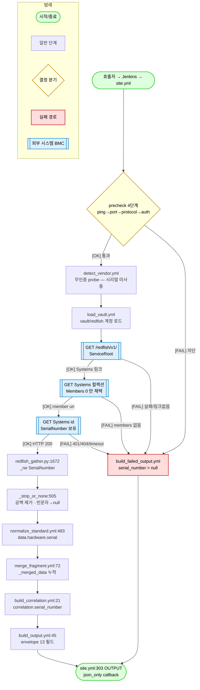

# BMC(Redfish) 시리얼 번호 수집 — 코드 기준 전수 추적

> **작성일**: 2026-08-11
> **범위**: BMC 채널(`redfish-gather`)에서 **시리얼 번호(Serial Number)** 하나만. 다른 필드는 흐름 설명에 필요한 최소한만 언급한다.
> **기준**: **문서가 아니라 코드**. 모든 진술에 `파일:라인` 을 붙였고, 문서(`docs/01~23`)는 근거로 쓰지 않았다.
> **검증**: 실장비 미러 4대(`tests/fixtures/redfish/real_*`)를 오프라인 재생해 값과 GET 경로를 직접 관측했다(12절).

---

## 0. 한 줄 결론

BMC 시리얼의 **정본 경로는 단 하나**다.

```
GET https://<BMC_IP>/redfish/v1/Systems/{첫 멤버}
   → 응답 JSON 의 "SerialNumber"
   → redfish_gather.py:1672  result['serial']
   → normalize_standard.yml:483  data.hardware.serial
   → build_correlation.yml:21-26 correlation.serial_number
```

폴백은 **없다**. System 응답에 `SerialNumber` 가 없으면 `null` 이다 (Chassis / Manager 값으로 대체하지 않는다 — 5절).

---

## 1. 시리얼이 최종 JSON(envelope)에 나타나는 위치 — 전수

정본 envelope 조립: `common/tasks/normalize/build_output.yml:45-63` (13 필드).

### 1-A. 실제로 emit 되는 시리얼 (9곳)

| # | envelope 경로 | 원천 Redfish 필드 | 원천 endpoint | 추출 코드 | envelope 배선 코드 |
|---|---|---|---|---|---|
| 1 | `data.hardware.serial` | `ComputerSystem.SerialNumber` | `Systems/{id}` | `redfish_gather.py:1672` | `normalize_standard.yml:483` |
| 2 | `correlation.serial_number` | (1)의 복사 | — | — | `build_correlation.yml:21-26` |
| 3 | `data.bmc.serial` | `Manager.SerialNumber` | `Managers/{id}` | `redfish_gather.py:1804` | `normalize_standard.yml:502` (passthrough) |
| 4 | `data.memory.slots[].serial` | `Memory.SerialNumber` | `Systems/{id}/Memory/{dimm}` | `redfish_gather.py:2057` | `normalize_standard.yml:544` (passthrough) |
| 5 | `data.storage.physical_disks[].serial` | `Drive.SerialNumber` | `Systems/{id}/Storage/{c}/Drives/{d}` | `redfish_gather.py:2184` | `normalize_standard.yml:198` |
| 6 | `data.network.adapters[].serial_number` | `NetworkAdapter.SerialNumber` | `Chassis/{id}/NetworkAdapters/{a}` | `redfish_gather.py:2859` | `normalize_standard.yml:562` (passthrough) |
| 7 | `data.power.power_supplies[].serial` | `PowerSupply.SerialNumber` | `Chassis/{id}/Power` 또는 `/PowerSubsystem/PowerSupplies/{p}` | `redfish_gather.py:3334` / `:3179` | `normalize_standard.yml:565-570` (passthrough) |
| 8 | `data.hardware.oem.*` (벤더별) | `Oem.<Vendor>.*SerialNumber` | `Systems/{id}` + `Chassis/{id}` | `redfish_gather.py:1318`(lenovo) / `:1346`(cisco) | `normalize_standard.yml:501` (passthrough) |
| 9 | `data.multi_node.*` (CSUS/Superdome 전용) | Partition/Chassis/Manager 각각의 `SerialNumber` | 다중 | `:3999` / `:4100` / `:3717` | `normalize_standard.yml:579` (passthrough) |

### 1-B. 수집은 되지만 envelope 에 **안 나오는** 시리얼 (3곳 — 확인된 사실)

| 대상 | 모듈 내부 수집 여부 | envelope 도달 | 근거 |
|---|---|---|---|
| **CPU 시리얼** (`Processor.SerialNumber`) | 수집함 → `data.processors[].serial_number` (`redfish_gather.py:1987`) | **[NG] 도달 안 함** | Ansible `_data_fragment` 의 `cpu` 블록(`normalize_standard.yml:503-528`)이 per-processor 리스트를 만들지 않는다. 멀티노드 경로 `_normalize_cpu_raw`(`:3894-3931`)도 동일. 실측: `dell_baseline.json` 의 `data.cpu` 키 = `sockets/cores_physical/logical_threads/model/max_speed_mhz/architecture/summary` (serial 없음) |
| **컨트롤러 하위 drive 시리얼** | 수집함 (`:2184`) | **[NG] 도달 안 함** | `normalize_standard.yml:163-172` 의 `controllers[].drives[]` 재구성이 `serial` 키를 뺀다. 같은 원본이 `physical_disks[]`(`:198`)로는 나간다 |
| **Chassis 시리얼 (단일 노드)** | `gather_system` 이 Chassis 를 **fetch 는 함** (`:1628-1631`) | **[NG] 도달 안 함** | 그 응답은 OEM 추출과 manufacturer/model 폴백에만 쓰인다(`:1710-1747`). Chassis `SerialNumber` 를 읽는 코드 자체가 단일노드 경로에 없다. 멀티노드에서만 `:4100` 으로 노출 |

---

## 2. 메인 경로 — `data.hardware.serial` 전 단계 추적

### 단계 0 — 진입점

호출자 → Jenkins → `ansible-playbook redfish-gather/site.yml`.
모듈 탐색 경로는 `ansible.cfg:18` (`library = ./common/library:./redfish-gather/library`), 출력 callback 은 `ansible.cfg:23` (`stdout_callback = json_only`).

### 단계 1 — fragment 초기화

`site.yml:36-38` → `common/tasks/normalize/init_fragments.yml`.

### 단계 2 — precheck (4단계 진단)

`site.yml:41-47` → `common/tasks/precheck/run_precheck.yml`.
실패 시 `site.yml:49-56` 에서 `fail` → 이후 전부 skip → **시리얼은 수집 시도조차 되지 않는다** (10절 실패 경로).

### 단계 3 — vendor 감지 (무인증 probe)

`site.yml:59-60` → `tasks/detect_vendor.yml`.

```yaml
# redfish-gather/tasks/detect_vendor.yml:12-22
- name: "redfish | detect_vendor | probe"
  redfish_gather:
    bmc_ip:   "{{ _rf_ip }}"
    username: ""          # 무인증
    password: ""
```

[INFO] 이 probe 는 모듈 전체를 무인증으로 1회 더 돌린다. 하지만 **probe 의 수집 결과는 시리얼로 쓰이지 않는다** — `detect_vendor.yml:24-76` 이 사용하는 값은 `vendor` / `model` / `firmware` 힌트뿐이다. 시리얼은 단계 6의 인증 수집 결과(`_rf_raw_collect`)에서만 온다.

### 단계 4 — adapter 선택 → vault 프로파일 결정

`site.yml:63-70` (`adapter_loader` lookup) → `site.yml:87-88` → `tasks/load_vault.yml`.
`load_vault.yml:17` 이 `_selected_adapter.credentials.profile` 로 `vault/redfish/{profile}.yml` 을 정하고, `:29-36` 에서 로드, `:64-81` 에서 `_rf_accounts` (username/password/label/role 리스트)로 정규화한다.

**시리얼과의 관계**: `Systems/{id}` 는 인증 필요 endpoint 다(`ServiceRoot` 만 무인증). 여기서 자격증명을 못 얻으면 시리얼은 `null` 이 된다.

### 단계 5 — 계정 순차 시도

`site.yml:91-92` → `tasks/collect_standard.yml:52-60` → `tasks/try_one_account.yml`.

```yaml
# redfish-gather/tasks/try_one_account.yml:21-34
- name: "redfish | try_account | attempt"
  redfish_gather:
    bmc_ip:   "{{ _rf_ip }}"
    username: "{{ _try_account.username | default('') }}"
    password: "{{ _try_account.password | default('') }}"
```

성공 판정 `try_one_account.yml:38-40` → 성공분만 `_rf_raw_collect` 로 승격(`:51-62`). 실패 시 5초 backoff(`:84-88`, BMC lockout 회피).

### 단계 6 — 모듈 `main()` 진입

`redfish_gather.py:4958`. gather 모드 흐름:

| 순서 | 코드 | 하는 일 |
|---|---|---|
| 6-1 | `:5028-5030` | `detect_vendor()` → `(vendor, system_uri, manager_uri, chassis_uri, errors, service_root)` |
| 6-2 | `:5041-5047` | `system_uri` 가 없으면 즉시 `status='failed'`, `data={}` 로 종료 → **시리얼 없음** |
| 6-3 | `:5049-5056` | `_collect_all_sections(...)` — 여기서 `gather_system` 이 불린다 |
| 6-4 | `:5072-5078` | `exit_json(data=result_data, ...)` |

### 단계 7 — `system_uri` 결정 (시리얼을 읽을 주소)

`detect_vendor()` (`redfish_gather.py:1079-1151`):

1. `_fetch_service_root()` (`:821-837`) — `GET /redfish/v1/` 를 **무인증**(`_get_noauth`, `:713-740`)으로 시도하고, 실패하면 인증(`_get`)으로 재시도.
2. `systems_uri = root['Systems']['@odata.id']` (`:1096`). 없으면 `system_uri=None` → 시리얼 없음(`:1097-1099`).
3. `_resolve_first_member_uri()` (`:888-902`) — `GET {systems_uri}` 후 **`Members[0]['@odata.id']`** 를 취한다.

> [WARN] **항상 컬렉션의 첫 멤버만** 쓴다(`:902`). 다중 System(nPartition) 장비의 2번째 이후 파티션 시리얼은 단일노드 경로에 안 나오고, `multi_node` 경로(7절)로만 나온다.

실측 URI:

| 장비 | `system_uri` | 시리얼 |
|---|---|---|
| Dell R740 | `/redfish/v1/Systems/System.Embedded.1` | `CNIVC0098G0600` |
| HPE DL380 | `/redfish/v1/Systems/1` | `SGHD3KHHRP` |
| Lenovo SR650 | `/redfish/v1/Systems/1` | `J902E57T` |
| HPE CSUS 3200 | `/redfish/v1/Systems/Partition0` | `SGHD3TLNDD-000` |

### 단계 8 — 섹션 dispatch

`_collect_all_sections()` (`:4376-4419`):

```python
# redfish_gather.py:4400-4403
eff_chassis_uri = _resolve_system_chassis_uri(
    bmc_ip, system_uri, chassis_uri, username, password, timeout, verify_ssl)
return {
    'system': _run('system', gather_system, bmc_ip, system_uri, vendor, *creds,
                   eff_chassis_uri, product_hint),
    ...
```

`_run` 은 `_make_section_runner()` (`:3630-3669`)가 만든 래퍼다. 시리얼 관점에서의 의미:

- `gather_system` 이 errors 를 반환하면 `collected` + `failed` 양쪽에 `system` 이 들어간다(`:3653-3656`).
- 404 만 있고 결과가 비면 `unsupported` 로 분류(`:3650-3652`).
- 예외가 나면 `failed` + `data.system = None` (`:3658-3668`).

### 단계 9 — `gather_system()` — **시리얼을 실제로 읽는 곳**

`redfish_gather.py:1609-1752`.

```python
# :1619  ← 시리얼이 들어 있는 단 하나의 HTTP 호출
st, data, err = _get(bmc_ip, _p(system_uri), username, password, timeout, verify_ssl)
if err or st != 200:
    errors.append(_err('system', f'System 수집 실패: {err or st}'))
    return {}, errors          # :1621-1623  → 시리얼 없음
```

```python
# :1665-1667  빈문자/공백 정규화 헬퍼
def _ne(*keys):
    return _strip_or_none(_safe(data, *keys))

# :1672  ← 시리얼 추출 (정본 1줄)
'serial': _ne('SerialNumber'),
```

`gather_system` 이 하는 두 번째 GET(`:1628-1631`, Chassis)은 **시리얼과 무관**하다 — OEM 추출과 manufacturer/model 폴백 전용(5절).

### 단계 10 — 모듈 → Ansible 변수

`main()` 이 `exit_json(data=result_data)` (`:5072-5078`) 하고, Ansible 은 이를 `_rf_raw_collect` 에 담는다(`try_one_account.yml:32,54`).

```yaml
# redfish-gather/tasks/normalize_standard.yml:7
_rf_d_system:  "{{ _rf_raw_collect.data.system | default({}) }}"
```

### 단계 11 — fragment 로 배선 (`system` → `hardware` 이름 변경)

```yaml
# redfish-gather/tasks/normalize_standard.yml:480-483
hardware:
  vendor:  "{{ _rf_d_system.manufacturer | default(none) }}"
  model:   "{{ _rf_d_system.model        | default(none) }}"
  serial:  "{{ _rf_d_system.serial       | default(none) }}"
```

[INFO] 모듈의 `data.system` → envelope 의 `data.hardware` 로 **이름이 바뀐다**. envelope 의 `data.system` 은 OS 정보용이라 Redfish 에선 대부분 null 이다(`:470-478`).
[INFO] `ansible.cfg:44` 에 `jinja2_native = True` 라 `{{ ... | default(none) }}` 결과가 문자열 `"None"` 이 아니라 **진짜 `None` → JSON `null`** 로 나간다.

섹션 상태 이름 매핑은 `normalize_standard.yml:441-452`(`_rf_proc_map`), `system` 수집 성공 시 `hardware` 를 보강하는 규칙은 `:592`.

### 단계 12 — fragment 누적 병합

`normalize_standard.yml:622-624` → `common/tasks/normalize/merge_fragment.yml:72-106` 재귀 병합 → `_merged_data`.
병합 규칙상 **fragment 값이 `None` 이면 기존 값을 유지**한다(`merge_fragment.yml:82-83, 89-93`). 표준 정규화가 redfish 채널의 유일한 `hardware` 생산자라 실제 충돌은 없다.

### 단계 13 — correlation 생성

```yaml
# common/tasks/normalize/build_correlation.yml:21-26
serial_number: >-
  {{ (_merged_data.hardware.serial | default(none))
     if _merged_data.hardware is defined and _merged_data.hardware is mapping
     else (_merged_data.system.serial_number | default(none))
     if _merged_data.system is mapping
     else none }}
```

redfish 채널은 `hardware` 가 항상 존재하므로 **항상 첫 분기**를 탄다. 두 번째 분기(`system.serial_number`)는 OS/ESXi 채널용이다.

### 단계 14 — envelope 조립 → 출력

`site.yml:233-235` → `build_output.yml:45-63` (`data` = `:62`, `correlation` = `:60`) → `site.yml:237-239` schema_version 주입 → `site.yml:303` **`- name: OUTPUT`** 태스크 → `callback_plugins/json_only.py` 가 이 태스크만 골라 JSON 으로 방출.

---

## 3. HTTP 계층 — 시리얼을 가져오는 실제 요청

`redfish_gather.py:214-246`:

```python
def _get(bmc_ip, path, username, password, timeout, verify_ssl):
    url = f'https://{bmc_ip}/redfish/v1/{path.lstrip("/")}'   # :215
    req = urlreq.Request(url, headers={
        'Authorization': _auth(username, password),           # :219  Basic 인증
        'Accept': 'application/json',                         # :220
        'OData-Version': '4.0',                               # :221
    })
```

| 항목 | 값 | 코드 |
|---|---|---|
| 메서드 | `GET` (읽기 전용) | `:214` |
| 스킴 | 항상 `https` (평문 HTTP 경로 없음) | `:215` |
| 인증 | HTTP Basic (`base64(user:pass)`) | `:211-212` |
| 헤더 | `Accept`, `OData-Version: 4.0` 만. **`User-Agent` 는 의도적으로 없음** (Lenovo XCC 일부 펌웨어가 reject — `:216-217` 주석) | `:218-222` |
| TLS | `_ctx(verify_ssl)` (`:166`), 기본 `verify_ssl=false` (`main()` `:4965`) | `:224` |
| 타임아웃 | 기본 30초 (`:4964`), Ansible 은 `_rf_timeout=30` 전달 (`site.yml:29`) | `:224` |
| 외부 라이브러리 | 없음. `urllib`/`ssl`/`socket`/`json` 만 (rule 10 R2) | `:16, :47` |

경로 정규화 `_p()` (`:336-348`): `@odata.id` 가 문자열이 아니거나 빈 경로로 퇴화하면 `'__invalid_odata_id__'` 로 바꿔 404 로 깨끗이 실패시킨다(`:344-348`).

오류 처리(시리얼이 `null` 이 되는 HTTP 사유):

| 상황 | 반환 | 코드 |
|---|---|---|
| 4xx/5xx | `(code, body, 'HTTP {code}: {reason}')` | `:237-240` |
| 연결 실패 | `(0, {}, 'URLError: ...')` | `:241-242` |
| 타임아웃 | `(0, {}, 'Timeout after {n}s')` | `:243-244` |
| 200 인데 본문이 JSON 아님 | `(200, {}, 'body not JSON')` | `:231-235` |

이 중 무엇이든 `gather_system:1621` 에서 `return {}, errors` → `data.hardware.serial = null` + `errors[]` 에 `section: "system"` 기록.

---

## 4. 값 정규화 — 원본 문자열이 어떻게 변형되는가

시리얼에 적용되는 변형은 정확히 두 개뿐이다.

**(a) `_safe()`** — `redfish_gather.py:350-355`
중첩 키 안전 접근. 중간이 dict 가 아니거나 값이 `None` 이면 `default`(=`None`).

**(b) `_strip_or_none()`** — `redfish_gather.py:505-517`

```python
if value is None:            return None
if not isinstance(value, str): return value      # 비문자열은 그대로
s = value.strip()
return s or None                                 # 공백 제거 후 빈 문자열이면 None
```

즉 **`""` 와 `"   "` 는 `null` 로 정규화**된다. 근거 주석(`:508-510`): Cisco BMC 가 trailing space 를 붙여 emit 하는 사례.

실측 확인: HPE DL380 의 `Systems/1/Processors/1.SerialNumber` 가 `''` → `_ne_p`(`:1970-1972`)로 `None` (12절 트레이스 출력).

> 대소문자 변환·하이픈 제거·prefix 제거 같은 추가 가공은 **없다.** BMC 가 준 문자열이 그대로 나간다.

---

## 5. 폴백 매트릭스 — 시리얼에는 폴백이 없다

`gather_system` 은 폴백 로직을 갖고 있지만, **시리얼은 대상이 아니다**:

```python
# redfish_gather.py:1735-1747
if result['model'] is None and product_hint:        # ServiceRoot.Product → model
    ...
if isinstance(chassis_data, dict):
    if result['manufacturer'] is None:              # Chassis.Manufacturer → manufacturer
        ...
    if result['model'] is None:                     # Chassis.Model → model
        ...
```

| 필드 | 1차 | 폴백 | 코드 |
|---|---|---|---|
| `manufacturer` | `System.Manufacturer` | `Chassis.Manufacturer` | `:1740-1743` |
| `model` | `System.Model` | `ServiceRoot.Product` → `Chassis.Model` | `:1735-1747` |
| **`serial`** | `System.SerialNumber` | **없음** | `:1672` |

실측 근거(HPE CSUS 3200): `Systems/Partition0.SerialNumber='SGHD3TLNDD-000'`, `Chassis/r001u01.SerialNumber='SGHD3TLNDD'` — 서로 다른 값인데 `data.hardware.serial` 은 파티션 값(`SGHD3TLNDD-000`)을 그대로 유지한다. Chassis 값으로 덮이지 않는다.

> [INFO] 이건 버그가 아니라 설계다. Chassis 시리얼(섀시)과 System 시리얼(논리 시스템/파티션)은 다른 식별자다. 다만 **"System 이 시리얼을 안 주면 null"** 이라는 사실은 운영상 알고 있어야 한다.

---

## 6. 부품별 시리얼 상세

### 6-1. BMC 자신의 시리얼 — `data.bmc.serial`

```python
# redfish_gather.py:1804
'serial': _strip_or_none(_safe(data, 'SerialNumber')),
```

- endpoint: `GET {manager_uri}` (`:1773`), `manager_uri` = `Managers` 컬렉션 첫 멤버(`detect_vendor:1109-1112`)
- 2026-06-16 추가(`:1801-1803` 주석). 대부분 vendor(iDRAC/iLO/XCC)는 Manager 가 이 필드를 주지 않아 `null`.
- 실측: Dell/HPE/Lenovo = `None`, HPE CSUS RMC = `'SGHD3TLNDD'`.

### 6-2. DIMM 시리얼 — `data.memory.slots[].serial`

```python
# redfish_gather.py:2057
'serial': _strip_or_none(_safe(mdata, 'SerialNumber')),
```

- endpoint: `GET {system_uri}/Memory` → 멤버별 `GET {system_uri}/Memory/{id}` (`:2007, :2018`)
- `Status.State == 'Absent'` 슬롯은 제외(`:2022-2023`)
- 컬렉션 순회 상한 1024 (`_capped`, `:415-428`, `MAX_COLLECTION_MEMBERS=56`행 `:56`)
- envelope 로는 `normalize_standard.yml:544` 가 slots 를 통째로 passthrough (가공 없음)

### 6-3. 디스크 시리얼 — `data.storage.physical_disks[].serial`

3개 수집 경로가 fallback chain 을 이룬다(`gather_storage:2415-2455`):

| 우선순위 | 경로 | 시리얼 추출 | 비고 |
|---|---|---|---|
| 1 | `Systems/{id}/Storage` (표준) | `:2184` `Drive.SerialNumber` | 정상 경로 |
| 2 | `Systems/{id}/SimpleStorage` (구형 BMC) | `:2090` **하드코딩 `None`** | SimpleStorage 스키마에 시리얼이 없음 |
| 3 | `Systems/{id}/SmartStorage/...` (HPE iLO4 OEM) | `:2389` `PhysicalDrive.SerialNumber` | `:2319-2412` |

- Empty Bay 필터: 용량 0 이거나 이름에 `empty` 포함 시 제외(`:2169-2175`)
- envelope 배선 시 `name+model+serial` 조합으로 dedup (`normalize_standard.yml:191-193`)
- **컨트롤러 하위 `drives[]` 에는 serial 이 빠진다** (`normalize_standard.yml:163-172`) — `physical_disks[]` 만 보유

### 6-4. NIC 카드 시리얼 — `data.network.adapters[].serial_number`

```python
# redfish_gather.py:2859
'serial_number': _safe(adata, 'SerialNumber') or None,
```

- endpoint: `Chassis/{eff_chassis_uri}/NetworkAdapters/{id}` (`:2803-2807`), 실패 시 Systems 경로 fallback(`:4414-4418` 주석)
- 여기만 `_strip_or_none` 이 아니라 `or None` 을 쓴다 → 빈 문자열은 `None` 이 되지만 **trailing space 는 남는다** (다른 필드와 미세하게 다른 정규화)
- 실측: `hpe_csus_3200_baseline.json` → `'MT2210CSUS01'`

### 6-5. PSU 시리얼 — `data.power.power_supplies[].serial`

DMTF 스키마 변천 때문에 두 경로가 있고, 둘 다 나오면 병합한다.

| 경로 | endpoint | 코드 |
|---|---|---|
| legacy | `Chassis/{id}/Power` → `PowerSupplies[]` | `:3334` |
| 신규 | `Chassis/{id}/PowerSubsystem/PowerSupplies/{id}` | `:3179` |
| 병합 | `_merge_power_dual()` | `:3250-3291` |

**시리얼이 dedup 키로 쓰인다** (`:3275-3283`):

```python
_ps_serial = psu.get('serial') or ''
if _ps_serial:
    key = ('serial', _ps_serial)          # 시리얼 있으면 시리얼로만 dedup
else:
    key = ('name_model', psu.get('name') or '', psu.get('model') or '')
```

같은 PSU 를 legacy/subsystem 이 다른 `name` 으로 내보내도 시리얼이 같으면 1개로 합친다. 즉 **PSU 시리얼은 데이터일 뿐 아니라 병합 로직의 입력**이다.

---

## 7. multi_node (HPE CSUS 3200 / Superdome Flex) 시리얼

`manager_layout` (adapter 의 `vendor_notes.manager_layout`, `site.yml:81-84`)이 `rmc_primary` 계열일 때만 활성(`_collect_multi_node_topology:4294-4315`). 그 외 vendor 는 `None` 이라 영향 0.

| envelope 경로 | 원천 | 코드 |
|---|---|---|
| `data.multi_node.partitions[].system.serial` | 각 `Systems/{partition}` 의 `SerialNumber` | `gather_systems_multi:3999` → `gather_system:1672` |
| `data.multi_node.chassis[].serial_number` | 각 `Chassis/{id}` 의 `SerialNumber` | `gather_chassis_multi:4100` |
| `data.multi_node.managers[].bmc.serial` | 각 `Managers/{id}` 의 `SerialNumber` | `gather_managers_multi:3717` → `gather_bmc:1804` |
| `data.multi_node.partitions[].memory.slots[].serial` | DIMM | `_normalize_memory_raw:3967` (slots passthrough) |
| `data.multi_node.partitions[].storage.physical_disks[].serial` | Drive | `_normalize_storage_raw:3820-3825` |

[INFO] 멀티노드 partition 의 `network.adapters` 는 항상 `[]` 다(`_normalize_network_raw:3891`) → **멀티노드 경로에는 NIC 시리얼이 없다.**

컬렉션 전수 순회는 `_resolve_all_member_uris()` (`:905-939`) 사용 — 단일노드의 `_resolve_first_member_uri` 와 대비된다.

실측(`real_hpe_csus3200` 재생):

```
partitions: [('Partition0', 'SGHD3TLNDD-000')]
chassis   : [('RackGroup','SGHD3TLNDD'), ('Rack1', None), ('r001u01','SGHD3TLNDD')]
managers  : [('RMC', 'SGHD3TLNDD')]
```

---

## 8. OEM 시리얼 (벤더 확장 영역)

dispatch: `gather_system:1710-1719` + `_OEM_EXTRACTORS` (`:1543-1551`). 반환값은 `data.hardware.oem` 으로 passthrough (`normalize_standard.yml:501`).

| vendor | 키 | 원천 | 코드 | 실측 결과 |
|---|---|---|---|---|
| Lenovo | `oem.fru_serial` | `Chassis.Oem.Lenovo.FruSerialNumber` | `:1318` | **[WARN] 항상 `null`** — 아래 참조 |
| Cisco | `oem.board_serial` | `System.Oem.Cisco.BoardSerialNumber` → `Chassis.Oem.Cisco.BoardSerialNumber` | `:1346` | fixture 부재로 미확인 |
| Huawei | `bmc.oem_huawei.board_serial` | `Oem.Huawei.BoardInfo.BoardSerialNumber` | `tasks/vendors/huawei/collect_oem.yml:45` | lab 부재 |
| HPE | (없음) | — | `:1215-1266` — HPE extractor 는 시리얼을 뽑지 않음 | 실 raw 에 `Oem.Hpe.PCASerialNumber` 존재하나 **미수집** |
| Dell / Supermicro | (없음) | — | `:1269-1296`, `:1328-1334` | — |

### Lenovo `fru_serial` 이 항상 null 인 이유 (실측 확인)

코드는 `FruSerialNumber` 를 찾는데, 실 XCC 응답에는 그 키가 없다:

```
real_lenovo_sr650  Chassis/1  Oem.Lenovo 키 =
  ['@odata.type','BIOSVendor','BaseBoardManufacturer','FanSpeedBoost','FruPartNumber',
   'LEDs','ProductName','SolutionServiceEnabled','SysEncloseSerialNum','SysEncloseVersion',
   'SystemBoardSerialNumber','SystemEncloseManufacturer','SysvpdSettings']
```

실제 키는 `SystemBoardSerialNumber`(`L1HF531003S`) / `SysEncloseSerialNum`(null) 이다.
저장소 전체에서 `FruSerialNumber` 를 포함한 fixture 는 **0건**이고, `SystemBoardSerialNumber` 는 3개 파일에 있다(`tests/fixtures/redfish/lenovo/chassis.json`, `real_lenovo_sr650/recording.json`, `tests/evidence/2026-06-15-lenovo-sr650-v4-audit.md`).
이미 기존 감사에도 기록돼 있다 — `tests/evidence/2026-06-15-lenovo-sr650-v4-audit.md:26-29` ("V4 Chassis.Oem.Lenovo 가 해당 키 미노출 (대신 FruPartNumber/SystemBoardSerialNumber/ProductName 보유)").

> 즉 **Lenovo 보드 시리얼은 BMC 가 주고 있는데 우리가 안 읽고 있다.** 코드를 고칠지는 사용자 결정 사항이며, 본 문서는 사실만 기록한다(13절 [TODO]).

`_hoist_oem_extras()` (`:1354-1379`) 는 `_` 로 시작하는 OEM 키만 상위로 끌어올리는데, 시리얼 관련 키는 `_` prefix 가 없어 **끌어올려지지 않는다** — OEM 시리얼이 `hardware.serial` 을 덮을 가능성은 구조적으로 0.

---

## 9. `correlation.serial_number` — 채널 간 매칭 키

`build_correlation.yml:21-26` (2절 단계 13). 목적은 `:14-16` 주석에 명시: *"같은 물리 장비에 대해 redfish/os/esxi 3개 채널 결과를 serial_number나 system_uuid로 매칭"*.

- redfish 채널 값 = `data.hardware.serial` 의 **복사본** (별도 가공 없음)
- 실패 경로에서는 `null` (`build_failed_output.yml:62-67`)
- 스키마 계약: `field_dictionary.yml:142-151` (`correlation`, priority **must**)

---

## 10. 시리얼이 `null` 이 되는 모든 경우 (실패 경로 전수)

| # | 조건 | 결과 | 코드 |
|---|---|---|---|
| 1 | precheck 실패 (ping/port/protocol) | 수집 자체 미실행, rescue → `build_failed_output` → `correlation.serial_number=null`, `data` 최소 shape | `site.yml:49-56`, `:293-295` |
| 2 | ServiceRoot GET 실패 | `detect_vendor` → `system_uri=None` → `main:5041-5047` early exit, `data={}` | `:821-837`, `:5041-5047` |
| 3 | ServiceRoot 에 `Systems` 링크 없음 | 동일 | `:1097-1099` |
| 4 | Systems 컬렉션 GET 실패 / `Members` 비었음 | 동일 | `:1101-1106`, `:899-901` |
| 5 | 전 계정 인증 실패 | `_rf_collect_ok=false` → `site.yml:111-128` fail → rescue | `try_one_account.yml:38-40` |
| 6 | `GET {system_uri}` 가 non-200 | `gather_system` 이 `{}` 반환 → `hardware.serial=null` + `errors[section=system]` | `:1619-1623` |
| 7 | 200 인데 `SerialNumber` 키 부재 | `_safe` → `None` → `null` | `:350-355`, `:1672` |
| 8 | `SerialNumber` 가 `""` 또는 공백 | `_strip_or_none` → `null` | `:505-517` |
| 9 | 모듈 예외 | `_run` 이 `data.system=None` + `failed` | `:3658-3668` |
| 10 | `_output` 자체 생성 실패 | `site.yml:303-319` 최종 fallback envelope (13 필드, `correlation:{}`) | `site.yml:305-319` |

모든 경우 **envelope 13 필드 shape 은 유지**된다 (rule 13 R5 / rule 20 R1).

---

## 11. 스키마 계약

| 필드 | type | priority | channel | 정의 위치 |
|---|---|---|---|---|
| `hardware.serial` | `string\|null` | **must** | `[esxi, redfish]` | `schema/field_dictionary.yml:257-262` |
| `memory.slots[].serial` | `string\|null` | nice | `[redfish, os]` | `:501-506` |
| `storage.physical_disks[].serial` | `string\|null` | nice | `[redfish, os, esxi]` | `:552-569` |
| `network.adapters[]` (serial_number 포함) | `object[]` | nice | `[redfish, esxi]` | `:1485-1494` |
| `multi_node.chassis[]` (serial_number 포함) | `object[]` | nice | `[redfish]` | `:2017-2027` |
| `correlation` (serial_number 포함) | `object` | **must** | 3채널 | `:142-151` |

`hardware.serial` 설명 원문(`:261`): *"서버 시리얼번호 (Redfish System.SerialNumber). 빈 문자열은 null 로 정규화."* — 코드(`:1672` + `:505-517`)와 일치한다.

**[NG] 미등록**: `bmc.serial`, `power.power_supplies[].serial`, `network.adapters[].serial_number`(개별 키), `hardware.oem.*` 시리얼 키는 field_dictionary 에 개별 entry 가 없다.

---

## 12. 실측 증거

### 12-A. 회귀 테스트 (실장비 미러 4대 오프라인 재생)

```
$ python -m pytest tests/integration/test_real_capture_replay.py -q
21 passed in 0.39s
```

### 12-B. 계측 재생 — 시리얼이 나온 GET 을 직접 지목

`tests/integration/emulator_harness.py` 의 seam(`make_replayer` `:171-199`, `run_gather` `:63-`)에 GET 로거를 끼워 재생한 결과:

| 장비 | `data.system.serial` | 값을 담고 있던 응답 | `data.bmc.serial` | 총 GET |
|---|---|---|---|---|
| Dell R740 | `CNIVC0098G0600` | `Systems/System.Embedded.1` (+ `Chassis/System.Embedded.1` 도 동일 값 보유) | `None` | 166 |
| HPE DL380 | `SGHD3KHHRP` | `Systems/1` (+ `Chassis/1` 동일 값) | `None` | 130 |
| Lenovo SR650 | `J902E57T` | `Systems/1` (+ `Chassis/1` 동일 값) | `None` | 122 |
| HPE CSUS 3200 | `SGHD3TLNDD-000` | `Systems/Partition0` | `SGHD3TLNDD` | 216 |

싱글턴 리소스 GET 횟수(중복 관측):

```
Dell R740 (단일노드)   : Systems/System.Embedded.1 × 2, Chassis/System.Embedded.1 × 1, Managers/iDRAC.Embedded.1 × 1
HPE CSUS (rmc_primary) : Systems/Partition0 × 5, Chassis/r001u01 × 3, Managers/RMC × 3
```

`Systems/{id}` 가 단일노드에서 2회인 이유: `_resolve_system_chassis_uri:966` 1회 + `gather_system:1619` 1회.
CSUS 5회: 위 2회 + 멀티노드 `gather_systems_multi` 의 `_resolve_system_chassis_uri:3998` + `gather_system:3999` + `gather_boot:3552`.

### 12-C. baseline JSON (실장비 회귀 기준선)

`meta.started_at` 기준 2026-04-01 캡처 (`schema/baseline_v1/*.json`).

| baseline | `data.hardware.serial` | `correlation.serial_number` | `memory.slots[0].serial` | `physical_disks[0].serial` | `power_supplies[0].serial` |
|---|---|---|---|---|---|
| dell | `CNIVC009CP0282` | 동일 | `355C2040` | `S5CNNA0MC03697` | `PHARP009CM01MC` |
| hpe | `SGH504HNZK` | 동일 | `42D8690F` | `S6ESNT0WC10211` | `5XLNV0KLLJO5S5` |
| lenovo | `J30AF7LC` | 동일 | `802C0F2022286493D7` | `S6ESNC0W626124` | `D1DG17W02RC` |
| cisco | `FCH2116V1V0` | 동일 | `88B56DFA` | `BTWA7102007U1P6KGN` | `ART2110FA3B` |
| hpe_csus_3200 (**MOCK**) | `MOCK-CSUS-P0-001` | 동일 | `S0CSUS01` | `S6ESCSUS0001` | `5XLCSUS0001` |

---

## 13. 관측된 사실 · 주의점

1. **[INFO] 시리얼 폴백 없음** — `System.SerialNumber` 단일 소스. manufacturer/model 과 달리 Chassis 폴백이 없다(5절).
2. **[INFO] 첫 멤버만 사용** — `Systems` 컬렉션의 `Members[0]` 만 읽는다(`:1101-1103`, `:902`). 다중 System 장비는 `multi_node` 활성 vendor 만 전수 수집된다.
3. **[WARN] CPU 시리얼은 envelope 에 없다** — 모듈은 뽑지만(`:1987`) Ansible 정규화가 per-processor 리스트를 안 만든다(1-B).
4. **[WARN] Lenovo `oem.fru_serial` 은 구조적으로 항상 null** — 실 XCC 키는 `SystemBoardSerialNumber` (8절). 저장소 fixture 전체에 `FruSerialNumber` 0건.
5. **[INFO] HPE `Oem.Hpe.PCASerialNumber` 미수집** — 실 DL380 응답에 존재하나 `_extract_oem_hpe`(`:1215-1266`)가 읽지 않는다.
6. **[INFO] 정규화 미세 불일치** — `network.adapters[].serial_number` 만 `or None`(`:2859`)이고 나머지는 `_strip_or_none`. trailing space 처리가 다르다.
7. **[INFO] baseline 과 현재 코드의 OEM 키 차이** — baseline 은 2026-04-01 캡처, Lenovo/Cisco OEM 시리얼 키 추가는 2026-04-29 커밋 `0d3058c4`. 그래서 `cisco_baseline.json` 의 `hardware.oem` 은 `{}`, `lenovo_baseline.json` 은 `{"product_name": null}` 로 현재 코드가 emit 할 키 집합보다 적다.
8. **[INFO] Dell 은 System 과 Chassis 시리얼이 같다** (`CNIVC0098G0600`), HPE CSUS 는 다르다 (`...-000` vs 없음). 즉 "둘은 같다"고 가정하면 안 된다.
9. **[TODO]** 위 4·5 는 코드 수정 후보다. 수정 여부는 **사용자 결정**이며 본 문서는 관측만 기록한다(rule 92 R2 — convention 위반 즉시 수정 금지).

---

## 14. 테스트 커버리지 (시리얼 관련)

| 테스트 | 검증 내용 | 위치 |
|---|---|---|
| `test_real_capture_replay.py` | 실장비 4대 미러 → 모듈 산출 golden 전량 비교 (시리얼 포함) | `tests/integration/` |
| `test_dmtf_mockup_replay.py:121-124` | ComputerSystem 표준 식별 필드(`manufacturer/model/serial/uuid`) 파싱 | `tests/integration/` |
| `test_csus_fixture_replay.py:113` | 각 partition `system.serial` 비어있지 않음 | `tests/unit/` |
| `test_csus_mock_consistency.py:74-80` | mock baseline partition serial 이 `MOCK` prefix 유지 | `tests/regression/` |
| `test_round15_fixes.py:100-106` | `_merge_power_dual` 이 같은 serial·다른 name PSU 를 1개로 dedup | `tests/unit/` |
| `test_partition_normalize_grouping.py:130-150` | `physical_disks` dedup 키(name+model+serial) 동작 | `tests/unit/` |
| `test_csus_mirror_audit_fixes.py:102-127` | PSU `SerialNumber` → `power_supplies[].serial` 배선 | `tests/unit/` |
| `conftest.py:35,65,154` | envelope 의 `serial_number` / `correlation.serial_number` 키 존재 | `tests/e2e/` |

---

## 15. 재현 방법

**(a) 회귀 테스트**
```bash
python -m pytest tests/integration/test_real_capture_replay.py -q
```

**(b) 특정 미러에서 시리얼만 뽑기 (네트워크 0)**
```python
import json, sys
sys.path[:0] = ["tests/integration", "redfish-gather/library"]
import emulator_harness as H
rec = json.load(open("tests/fixtures/redfish/real_dell_r740/recording.json", encoding="utf-8"))
g, n, r = H.make_replayer(rec)
out = H.run_gather(g, n, realm_impl=r)
print(out["data"]["system"]["serial"])      # → CNIVC0098G0600
```

**(c) 실 BMC 에서 raw 확인**
```bash
curl -sk -u '<user>:<pass>' -H 'Accept: application/json' -H 'OData-Version: 4.0' \
     "https://<BMC_IP>/redfish/v1/Systems/1" | python -c "import json,sys;print(json.load(sys.stdin)['SerialNumber'])"
```
(`redfish_gather.py:214-222` 의 요청과 동일한 헤더 구성)

**(d) 벤더별 System 멤버 ID 확인**
```bash
curl -sk "https://<BMC_IP>/redfish/v1/" | python -c "import json,sys;print(json.load(sys.stdin)['Systems'])"
```

---

## 부록 A. 전체 흐름도

> 이 그림이 말하는 것: BMC 시리얼 한 값이 HTTP 응답에서 최종 JSON 까지 지나는 경로와, 값이 사라지는 분기.



> 읽는 법: 위→아래 진행. 초록=시작/종료, 파랑=BMC 직접 호출, 노랑=분기, 빨강=실패 경로.
> 핵심 분기는 `GET Systems/{id}` 한 곳 — 여기서 200 이 아니거나 `SerialNumber` 가 없으면 시리얼은 `null` 이 되고, envelope 13 필드 shape 은 그대로 유지된다.

---

## 부록 B. 코드 위치 색인 (시리얼 관련 전량)

| 파일 | 라인 | 내용 |
|---|---|---|
| `redfish-gather/library/redfish_gather.py` | 1672 | **`hardware.serial` 정본** — `System.SerialNumber` |
| | 1804 | `bmc.serial` — `Manager.SerialNumber` |
| | 1987 | `processors[].serial_number` (envelope 미도달) |
| | 2057 | `memory.slots[].serial` — `Memory.SerialNumber` |
| | 2090 | SimpleStorage drive serial = 하드코딩 `None` |
| | 2184 | 표준 `Drive.SerialNumber` |
| | 2389 | SmartStorage(HPE iLO4) `PhysicalDrive.SerialNumber` |
| | 2859 | `network.adapters[].serial_number` |
| | 3179 / 3334 | PSU serial (PowerSubsystem / legacy Power) |
| | 3275-3283 | PSU dedup 키로 serial 사용 |
| | 3820-3825 | 멀티노드 storage 정규화 시 serial 전달 |
| | 4100 | `multi_node.chassis[].serial_number` |
| | 1318 / 1346 | Lenovo `fru_serial` / Cisco `board_serial` |
| | 505-517 | `_strip_or_none` — 시리얼 정규화 |
| | 350-355 | `_safe` — 안전 접근 |
| | 214-246 | `_get` — 실제 HTTP 요청 |
| `redfish-gather/tasks/normalize_standard.yml` | 483 | `data.hardware.serial` 배선 |
| | 191-198 | `physical_disks[].serial` (+dedup 키) |
| | 502 / 544 / 562 / 565-570 / 579 | bmc / memory.slots / adapters / power / multi_node passthrough |
| `redfish-gather/tasks/vendors/huawei/collect_oem.yml` | 45 | Huawei `board_serial` |
| `common/tasks/normalize/build_correlation.yml` | 21-26 | `correlation.serial_number` |
| `common/tasks/normalize/build_failed_output.yml` | 62-67 | 실패 시 `serial_number: none` |
| `common/tasks/normalize/build_output.yml` | 45-63 | envelope 조립 |
| `schema/field_dictionary.yml` | 257-262 | `hardware.serial` 계약 (must) |
