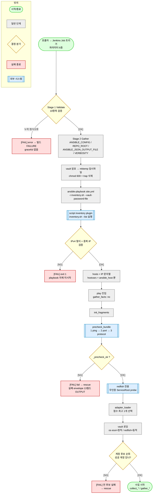

# 개더링 전 구간 — 코드 기준 전수 추적 (Jenkins 파라미터 → 인벤토리 → precheck → adapter → vault)

> **작성일**: 2026-08-11
> **범위**: 호출자가 Jenkins Job 을 트리거한 시점부터 **실제 수집 태스크가 시작되기 직전**까지.
> 수집 본체(`collect_*` / `gather_*`)·정규화·envelope 조립은 범위 밖이다.
> **기준**: **문서가 아니라 코드**. 모든 진술에 `파일:라인` 을 붙였고, `docs/01~23` 은 근거로 쓰지 않았다.
> **라인 번호 기준 커밋**: `dbb58ed1` (2026-08-11, working tree clean). 코드가 바뀌면 라인은 밀린다 —
> 함수명 / 태스크명 / 문자열로 재확인할 것.
> **검증 방법**: 3개 탐색 에이전트 병렬 조사 후 **메인 세션이 원본 파일을 직접 재확인**했다 (rule 25 R7-A).
> 에이전트 보고 중 **2건이 사실과 달라 정정**했고, 그 내역은 0.3 절에 남겼다.
>
> **본문(1~8절)은 사실 기록 전용이다.** 무엇을 고쳐야 하는지는 판단하지 않는다.
> 관찰된 불일치·후보는 **9절(부록)에 목록으로만** 남긴다 — 사용자 결정 대기 (지시: 2026-08-11).

---

## 0. 한 줄 결론

호출자가 보내는 값은 **오직 IP 목록뿐**이고, 그 IP 조차 `ansible-playbook` 의 인자가 아니라
**환경변수 `INVENTORY_JSON` 단일 경로**로만 흘러든다.

```
호출자 → params.inventory_json
       → env INVENTORY_JSON            (Jenkinsfile_portal:38)
       → inventory.sh 가 env 를 읽음    (os-gather/inventory.sh:43-47)
       → {"all":{"hosts":[ip,...]},"_meta":{"hostvars":{ip:{"ansible_host":ip}}}}
       → play 의 hosts: all 에 바인딩
```

### 0.1. 가장 중요한 사실 4가지

| # | 사실 | 근거 |
|---|---|---|
| 1 | `ansible-playbook` 에 **`-e` / `--extra-vars` 가 0개**다. `loc`·`target_type`·`callbackUrl`·`deploymentEnvironmentId` 는 **Ansible 에 전달되지 않는다** (Jenkins 안에서만 쓰인다) | `Jenkinsfile_portal:174`, `Jenkinsfile:174-180` |
| 2 | 인벤토리는 **IP 만** 싣는다. 계정·벤더·그룹·연결방식을 **전혀 싣지 않는다** | `os-gather/inventory.sh:93`, `:96-99` |
| 3 | `inventory.sh` 는 셸 스크립트가 **아니다**. 확장자만 `.sh` 이고 실제는 Python (`#!/usr/bin/python3`) | 3파일 모두 `:1`, git mode `100755` |
| 4 | vault 로딩 방식이 **채널마다 다르다**. os/esxi 는 play 시작 시 정적 `vars_files`, redfish 만 adapter 결과 기반 동적 `include_vars` | `os-gather/site.yml:211-214`, `esxi-gather/site.yml:27-30` vs `redfish-gather/tasks/load_vault.yml:29-36` |

### 0.2. `target_type` 이 실제로 하는 일

Ansible 에 넘어가지 않는데도 채널이 갈리는 이유는, **Jenkins 가 playbook 경로와 inventory 경로를
직접 고르기 때문**이다 (`Jenkinsfile_portal:135-147`).

```groovy
def playbookMap  = ['os': ".../os-gather/site.yml",  'esxi': ..., 'redfish': ...]   // :135-139
def inventoryMap = ['os': ".../os-gather/inventory.sh", 'esxi': ..., 'redfish': ...] // :140-144
def playbook  = playbookMap[params.target_type]     // :146
def inventory = inventoryMap[params.target_type]    // :147
```

즉 `target_type` 은 **실행 대상 파일 선택자**이지 런타임 변수가 아니다.
`bmc_ip` / `service_ip` 키 차이도 변수 분기가 아니라 **서로 다른 `inventory.sh` 파일**로 구현돼 있다.

### 0.3. 에이전트 보고 중 정정한 2건 (기록 목적)

| 오보 | 실제 | 재확인 |
|---|---|---|
| "메인 `Jenkinsfile` 에 `REPO_ROOT` 설정이 없다" | **있다** | `Jenkinsfile:57` `REPO_ROOT = "${WORKSPACE}"` |
| "`docs/operate/05-vault.md` 에 평문 비밀번호가 기재돼 있다" | **이미 제거됨** (Phase 6-B). 해당 문서는 "평문은 vault 안에만" 으로 정리된 상태 | `grep -c` 결과 0건 |

---

## 1. 전체 흐름도

> 이 그림이 말하는 것: 호출자 입력이 어떤 관문을 거쳐 수집 직전까지 도달하는가, 그리고 각 관문에서
> 실패하면 어디로 빠지는가.



> 읽는 법: 위→아래 진행. 초록=진입/도달, 노랑=판정 분기, 빨강=실패 종료, 파랑=외부 시스템 접촉,
> 회색=내부 단계. `DETECT` 는 redfish 채널에만 존재하고 os/esxi 는 건너뛴다(7절 대조표 참조).

---

## 2. Jenkins 파라미터 계약

### 2.1. 파라미터 정의 (`Jenkinsfile_portal:5-35`)

| # | 이름 | 타입 | 기본값 | 설명(원문) | 라인 |
|---|---|---|---|---|---|
| 1 | `loc` | `string` | `''` | Agent 로케이션 (ich \| chj \| yi) | 6-10 |
| 2 | `target_type` | `choice` | 첫 항목 `os` | `['os','esxi','redfish']` | 11-15 |
| 3 | `inventory_json` | `text` | **없음** | 호스트 JSON 배열 (os/esxi: service_ip, redfish: bmc_ip, fallback: ip) | 16-19 |
| 4 | `deploymentEnvironmentId` | `string` | `''` | 포털 개발환경 ID | 20-24 |
| 5 | `callbackUrl` | `string` | `''` | 결과 전달 Callback URL | 25-29 |
| 6 | `verbosity` | `choice` | 첫 항목 `'0'` | `['0','1','2','3','4']` Ansible verbosity | 30-34 |

`choice` 파라미터는 Jenkins 규약상 **첫 항목이 기본값**이다 — `target_type` 을 안 넘기면 `os`,
`verbosity` 를 안 넘기면 `0` 이다.

### 2.2. Stage 1 Validate — 검증 10항목 (`:63-113`)

| 순서 | 대상 | 조건 | 라인 |
|---|---|---|---|
| 1 | `loc` | 공백 아님 (**허용값 검증 없음**) | 64-66 |
| 2 | `target_type` | `['os','esxi','redfish']` 화이트리스트 | 68-71 |
| 3 | `inventory_json` | 공백 아님 | 73-75 |
| 4 | JSON 파싱 | `JsonSlurper().parseText()` | 77-82 |
| 5 | 배열 비어있지 않음 | `hosts.size() > 0` | 84-86 |
| 6 | 호스트별 IP 필드 | `redfish → bmc_ip`, 그 외 `service_ip`, 없으면 `ip` | 88-95 |
| 7 | `callbackUrl` | 공백 아님 | 97-99 |
| 8 | `callbackUrl` 스킴 | `http://` 또는 `https://` 로 시작 | 100-103 |
| 9 | `callbackUrl` 위험문자 | 따옴표·백틱·역슬래시·공백 거부 | 104-106 |
| 10 | `deploymentEnvironmentId` | 공백 아님 | 107-109 |

**전부 `error`** 이므로 위반 시 **즉시 빌드 FAILURE** 다. UNSTABLE 이나 graceful degradation 은 없다.

9번이 이 스테이지의 유일한 정규식 사용처다:

```groovy
// Jenkinsfile_portal:104
if (cbUrl.contains("'") || cbUrl.contains('"') || cbUrl.contains('`') ||
    cbUrl.contains('\\') || cbUrl.replaceAll(/\s/, '') != cbUrl) {
```

**여기에 없는 검증**: IP 형식 검증이 Jenkins 단계에는 **없다**. IPv4 형식과 중복 IP 는
`inventory.sh` 에서만 걸린다 (3.3 절).

### 2.3. Gather stage 환경변수 (`:127-132`)

| 변수 | 값 | 소비처 |
|---|---|---|
| `REPO_ROOT` | `${WORKSPACE}` | 전 채널 `lookup('env','REPO_ROOT')` — vault·common tasks 절대경로 |
| `ANSIBLE_CONFIG` | `${WORKSPACE}/ansible.cfg` | plugin path·callback 등 저장소 설정 적용 |
| `ANSIBLE_JSON_OUTPUT_FILE` | `${WORKSPACE}/gather_output.json` | `callback_plugins/json_only.py` 가 stdout 과 별도로 파일 append |
| `ANSIBLE_VERBOSITY` | `${params.verbosity}` | `-vvv` 플래그 대신 환경변수로 상세도 제어 |

`REPO_ROOT` 가 없으면 `lookup('env','REPO_ROOT')` 가 빈 문자열이 되어 vault·common tasks 경로가
깨진다. 두 Jenkinsfile 모두 설정한다 (`Jenkinsfile:57`, `Jenkinsfile_portal:128`).

### 2.4. vault 암호 주입과 playbook 실행 (`:158-176`)

```bash
# Jenkinsfile_portal:164-175 (원문)
set -eo pipefail
set +x                                  # 명령 에코 차단
cd "${WORKSPACE}"
. /opt/ansible-env/bin/activate         # venv 활성화
chmod +x "${inventory}"                 # exec bit 보증 (아래 3.1 참조)
VAULT_TMP="$(mktemp)"
trap 'rm -f "$VAULT_TMP"' EXIT          # 종료 시 무조건 삭제
printf '%s' "${VAULT_PASSWORD}" > "$VAULT_TMP"   # printf = trailing newline 회피
chmod 600 "$VAULT_TMP"
ansible-playbook "${playbook}" -i "${inventory}" --vault-password-file="$VAULT_TMP"
```

- credential: `withCredentials([string(credentialsId: 'server-gather-vault-password', ...)])` (`:158-163`).
  **Secret text** 타입이다 — 주석(`:157`)이 "Secret File trailing newline 문제 회피" 라고 이유를 밝힌다.
- 실패해도 stage 를 죽이지 않고 `catchError(buildResult:'UNSTABLE', ...)` 로 감싼다 (`:152`) —
  즉 **일부 호스트 실패는 UNSTABLE 로 넘기고 Callback 까지 간다.**
- 다만 산출물이 아예 없으면 여기서 끊는다 (`:181-184`):
  `gather_output.json` 미생성 또는 0바이트 → `error`.

### 2.5. `Jenkinsfile` vs `Jenkinsfile_portal` 차이

| 항목 | `Jenkinsfile` | `Jenkinsfile_portal` |
|---|---|---|
| agent | 파이프라인 전체 `label "${params.loc}"` (`:30`) | `agent none`(`:3`) + stage 별 `node{}`, Callback 만 `built-in`(`:227`) |
| 파라미터 | 3종 (`:32-53`) | 6종 (`:5-35`) |
| `inventory_json` 기본값 | 있음 (`[{"service_ip":""}]`, `:46-50`) | 없음 (`:16-19`) |
| Ansible 실행 | `ansiblePlaybook(...)` 플러그인 스텝 (`:174-180`) | 순수 `sh` + `ansible-playbook` (`:164-175`) |
| JSON 파싱 | `readJSON` (Pipeline Utility Steps 플러그인, `:97`) | `JsonSlurper` (플러그인 불요, `:79`) |
| 호스트 순회 | `eachWithIndex` 클로저 (`:108`) | `for(int idx...)` CPS 안전 루프 (`:89`) |
| redfish `vendor` 경고 | 있음 (`:115-120`) | **없음** |
| `ANSIBLE_JSON_OUTPUT_FILE` | 미설정 (stdout 만) | 설정 → 파일 산출 (`:130`) |
| Stage 4 | E2E Regression (pytest, `:208-236`) | Callback (httpRequest POST, `:226-333`) |
| 글로벌 timeout | 30분 (`:65`) | 120분 (`:43`) |
| workspace 정리 | 없음 | stage 마다 `post always deleteDir()` |
| artifact | `archiveArtifacts` (`:249-253`) | 없음 (대신 `stash`/`unstash`) |

### 2.6. Callback 계약 (`:234-325`) — 참고

수집 후 구간이라 본 문서 범위 밖이지만, 파라미터 2종의 **유일한 소비처**라 여기 기록한다.

```groovy
def baseUrl = params.callbackUrl.trim().replaceAll('/+$', '')          // :237 후행 슬래시 제거
def callbackEndpoint = baseUrl + '/api/jenkins/gather/' + params.target_type.trim()  // :238
```

POST body 스키마 (`:268-272`):

```json
{ "loc": "<string>", "deploymentEnvironmentId": "<string>", "gatherInfoJson": [ <envelope 라인들> ] }
```

`callbackUrl` / `target_type` / `verbosity` 는 body 에 포함되지 않는다.
재시도 3회 + backoff `attempt*10`초, 최종 실패 시 `error` 가 아니라 `unstable` (`:323-325`).

---

## 3. 인벤토리 처리

### 3.1. `inventory.sh` 의 정체

세 파일 모두 **1행이 `#!/usr/bin/python3`** 이다.

```
os-gather/inventory.sh:1       #!/usr/bin/python3
esxi-gather/inventory.sh:1     #!/usr/bin/python3
redfish-gather/inventory.sh:1  #!/usr/bin/python3
```

Ansible 의 `script` 인벤토리 플러그인이 shebang 으로 실행한다. 플러그인 활성화 근거는
`ansible.cfg:68-70`:

```ini
[inventory]
# 동적 인벤토리 스크립트 허용
enable_plugins = script, auto
```

`script` 플러그인은 **실행 권한이 없으면 인벤토리 소스로 인식조차 하지 않는다**. 그래서 두
Jenkinsfile 모두 실행 직전 `chmod +x` 를 건다 (`Jenkinsfile_portal:169`, `Jenkinsfile:172`).
git 에는 이미 `100755` 로 등록돼 있으나, 체크아웃 환경에 따라 exec bit 가 유실되는 경우에 대한 방어다.

### 3.2. 입력 우선순위 (`os-gather/inventory.sh:40-61`)

```python
raw = os.environ.get("INVENTORY_JSON", "").strip()      # :43  1순위
if not raw:
    raw = os.environ.get("inventory_json", "").strip()  # :45  2순위 (Jenkins 파라미터명 그대로)
if raw:
    return raw
# 3순위: $WORKSPACE/.inventory_input.json               # :49-59
error("INVENTORY_JSON 환경변수와 .inventory_input.json 파일 모두 비어있습니다.")  # :61
```

**3순위는 현재 데드 경로다.** 주석(`:12`, `:49`)은 "Jenkinsfile `writeFile` 로 생성됨" 이라 하지만,
두 Jenkinsfile 어디에도 이 파일을 쓰는 코드가 없다 (`grep writeFile` 결과 = vault 임시파일 관련
주석 1건뿐). 로컬 수동 실행용 폴백으로만 남아 있다.

### 3.3. 검증 — Jenkins 에 없고 여기에만 있는 것

```python
# os-gather/inventory.sh:26-29
_IP_PATTERN = re.compile(
    r'^(?:(?:25[0-5]|2[0-4]\d|1\d{2}|[1-9]?\d)\.){3}'
    r'(?:25[0-5]|2[0-4]\d|1\d{2}|[1-9]?\d)$'
)
```

| 검증 | 실패 시 | 라인 |
|---|---|---|
| 최상위가 비어있지 않은 list | `exit 1` | 81-82 |
| IP 필드 존재 (`service_ip`/`bmc_ip` → `ip`) | `exit 1` | 86-88 |
| **IPv4 리터럴 형식** (호스트명·IPv6 불가) | `exit 1` | 89 → 35-38 |
| **IP 중복 거부** | `exit 1` | 90-91 |

IP 하나만 잘못돼도 `sys.exit(1)` 이므로 **playbook 이 시작조차 하지 않는다.** 부분 실패가 아니라
전체 실패다. 특히 **중복 IP** 는 호출자가 실수하기 쉬운데 Jenkins Stage 1 은 잡지 않는다.

### 3.4. 출력 — 인벤토리가 싣는 것의 전부

```python
# os-gather/inventory.sh:93-99
hostvars[ip] = {"ansible_host": ip}
host_keys.append(ip)
...
print(json.dumps({
    "all":   {"hosts": host_keys},
    "_meta": {"hostvars": hostvars}
}, ensure_ascii=False, indent=2))
```

정확히 이것이 전부다:

- **host 이름 = IP 문자열** → `inventory_hostname == ansible_host == IP`
- **hostvars = `{"ansible_host": <ip>}` 단 하나**
- **group = `all` 하나뿐** — 채널별·벤더별 그룹 없음
- `ansible_connection` / `ansible_user` / `ansible_password` / `ansible_port` / vendor 는 **없음**
- 입력 JSON 의 `_distro`·`_vendor`·`_type`·`_notes`·`vendor` 같은 필드는 루프가 읽지 않아 **전부 무시**

계정은 vault(6절), 벤더는 런타임 감지(5절), 연결방식은 play 설정 또는 `add_host`(3.6절)가 채운다.

### 3.5. 세 스크립트의 차이 = 한 줄

`os-gather` 와 `esxi-gather` 는 docstring 채널명을 빼면 동일하다. `redfish-gather` 만 IP 키가 다르다.

```python
# os-gather/inventory.sh:86 , esxi-gather/inventory.sh:86
ip = (host.get("service_ip") or host.get("ip") or "").strip()
# redfish-gather/inventory.sh:88
ip = (host.get("bmc_ip") or host.get("ip") or "").strip()
```

### 3.6. os 채널만 host 를 2차 생성한다

다른 두 채널은 인벤토리가 만든 host 를 그대로 쓰지만, os 채널은 PLAY 1 이 `add_host` 로
**연결 파라미터를 붙인 host 를 다시 만든다** (`os-gather/site.yml:91-135`).

| 조건 (`_detected_os`) | 등록 그룹 | 부여되는 hostvars | 라인 |
|---|---|---|---|
| `unknown` | `_os_failed` | `ansible_connection: local`, `_os_type: unknown` | 91-101 |
| `linux` | `_os_linux` | `ansible_connection: ssh`, `ansible_port: 22`, `ansible_ssh_common_args`(StrictHostKeyChecking=no / ConnectTimeout=15 / ServerAliveInterval=10) | 103-117 |
| `windows` | `_os_windows` | `ansible_connection: winrm`, `ansible_port: {{ _winrm_port }}`, `ansible_winrm_scheme`, `transport: ntlm`, `server_cert_validation: ignore`, `operation_timeout_sec: 60`, `read_timeout_sec: 70` | 119-135 |

세 태스크 모두 `loop: ansible_play_hosts_all` + `run_once: true` + `no_log: true` 다.
`add_host` 가 인벤토리 조작 모듈이라 암시적 run_once 로 동작하기 때문이다 (`:87-88` 주석).

PLAY 1 이 `strategy: free` 를 못 쓰는 이유도 여기 있다 — `add_host`(run_once+loop) 와 충돌해
빌드가 깨졌던 이력이 `:29-30` 주석에 남아 있다.

---

## 4. Precheck 4단계

### 4.1. 래퍼와 모듈

호출은 `common/tasks/precheck/run_precheck.yml` 이 감싸고, 실제 판정은
`common/library/precheck_bundle.py` 가 한다. 모듈은 `delegate_to: localhost` 로 **controller 에서**
실행된다 (대상 호스트에 아무것도 설치하지 않는다).

**타임아웃 매핑에 비대칭이 있다** (`run_precheck.yml:36-42`):

```yaml
timeout_port:     "{{ _precheck_timeout_port | default(3.0) }}"
timeout_protocol: "{{ _precheck_timeout_protocol | default(_precheck_timeout | default(15.0)) }}"
timeout_auth:     "{{ _precheck_timeout_auth | default(_precheck_timeout | default(8.0)) }}"
```

호출자가 넘기는 `_precheck_timeout`(redfish=30, esxi=30)은 **protocol / auth 에만** 적용되고
**port 에는 적용되지 않는다.** 주석(`:37-39`)이 이유를 밝힌다 — dead-host 를 빠르게 걸러내려고
port 는 3.0 초로 유지한다. os 채널만 `_precheck_timeout_port: 2` 를 명시 전달한다
(`os-gather/site.yml:66`).

### 4.2. 모듈 인자 (`precheck_bundle.py:1258-1286`)

| 파라미터 | 타입 | 기본값 | 필수 |
|---|---|---|---|
| `host` | str | — | **yes** |
| `channel` | str | — | **yes** (`redfish`/`os`/`esxi`) |
| `ports` | list[int] | `[]` → 채널 기본값 | no |
| `timeout_port` | float | `3.0` | no |
| `timeout_protocol` | float | `15.0` | no |
| `timeout_auth` | float | `8.0` | no |
| `username` / `password` | str (`no_log`) | — | no |
| `verify_ssl` | bool | `false` | no |
| `probe_protocol` | bool | `true` | no |
| `port_poll_interval` | float | `0.0` | no |

채널별 기본 포트 (`:100-104`):

```python
CHANNEL_DEFAULT_PORTS = {
    "redfish": [443],
    "os":      [5986, 5985, 22],   # Windows(HTTPS) → Windows(HTTP) → Linux
    "esxi":    [443],
}
```

### 4.3. 반환 구조 (`:1017-1039`)

```python
{
  "reachable": False, "port_open": False, "protocol_supported": False, "auth_success": None,
  "failure_stage": None,   # 'reachable' | 'port' | 'protocol' | 'auth' | None
  "failure_code":  None,   # DNS_RESOLUTION_FAILED | TCP_CONNECT_FAILED |
                           # TCP_CONNECTION_REFUSED | PROTOCOL_CHECK_FAILED | AUTH_PROBE_FAILED
  "failure_reason": None,  # 사용자 문구 5문장 중 하나
  "detail": None,          # "port=443: 연결 시간 초과 (timeout=3.0s)" 원본 오류
  "checked_ports": ports,  # 실제 probe 한 포트만 (성공 시 조기 중단)
  "selected_port": None, "probe_facts": {},
}
# channel == "os" 추가: detected_os, detected_port, winrm_scheme   (:1035-1039)
```

### 4.4. 각 단계가 실제로 확인하는 것

**핵심: HTTP status 를 성공 근거로 쓰지 않고 응답 본문 구조로 판정한다.**

| 단계 | 대상 | 판정 근거 | 위치 |
|---|---|---|---|
| 1 reachable / 2 port | TCP | `getaddrinfo` 로 IPv4/IPv6 듀얼스택 연결. 실패를 `dns`/`timeout`/`refused`/`other` 로 구조화. **RST(refused)는 host alive 로 인정** | `:193-235`, `:1042-1074` |
| 3 protocol — redfish | `GET /redfish/v1/` | `@odata.type` 이 `#ServiceRoot.` 로 시작 + `@odata.id ∈ {/redfish/v1, /redfish/v1/}` + `RedfishVersion` 비어있지 않음. 401/403 을 성공으로 치던 예외는 제거됨 | `:528-558`, `:561-611` |
| 3 protocol — os:22 | SSH | RFC4253 §4.2 선행 줄 건너뛰며 최대 8줄/2048B 읽고 `SSH-2.0-`/`SSH-1.99-` 만 인정. **Key Exchange 안 함, 자격증명 안 보냄** | `:429-457`, `:460-503` |
| 3 protocol — os:5985/5986 | WinRM | 비인증 WS-Man **Identify SOAP POST** → `IdentifyResponse` + DMTF `ProtocolVersion` + `ProductVendor` 에 `microsoft` 포함까지 요구 | `:736-781`, `:784-824` |
| 3 protocol — esxi | vSphere | `POST /sdk` vim25 `RetrieveServiceContent` → `about` 의 `apiType`/`apiVersion` 존재. `urn:vim25` 네임스페이스 SOAP Fault 도 성공 근거로 인정 | `:919-953`, `:979-1014` |
| 4 auth | Basic auth | **redfish 이고 username+password 가 모두 있을 때만** 수행 | `:1379-1387` |

WinRM probe 는 `urllib` 이 아니라 `http.client` 를 쓴다 (`:686-698`) — urllib 이 헤더명을
`Wsmanidentify` 로 title-case 해서 실장비가 401 을 주던 사고 때문이다.

### 4.5. Stage 4(auth)는 production 경로에서 **항상 skip** 된다

세 채널 site.yml 중 어느 것도 `_precheck_username` / `_precheck_password` 를 넘기지 않는다.
따라서 `auth_success` 는 precheck 시점에 **항상 `None`** 이다.

이유는 `precheck_bundle.py:1367-1378` 과 `redfish-gather/site.yml:103-108` 주석에 기록돼 있다:

1. redfish 는 이 시점에 **벤더가 확정되지 않아** 어느 vault 를 열지 모른다 — 자격증명이 존재하지 않는다.
2. 여기서 인증을 시도하면 **BMC 계정 잠금** 위험이 커진다.
3. os/esxi 는 인증을 Ansible 본체 모듈이 처리한다.

실제 `auth_success: true` 는 **수집 성공 후** site.yml 이 덮어쓴다
(`redfish-gather/site.yml:230-232`, `esxi-gather/site.yml:202-204`).

또한 Stage 4 를 실제로 수행하더라도 **HTTP 401 을 관측했을 때만** `auth_success=False` 이고,
timeout·5xx·TLS·403 은 `None` 을 유지한다 (`:1176-1178`) — 확정할 수 없는 것을 단정하지 않는 설계다.

### 4.6. `_precheck_ok` 판정 (`run_precheck.yml:63-72`)

```jinja
reachable and port_open
and (protocol_supported or not protocol_checked)
and (failure_stage is none or failure_stage == '')
```

`protocol_checked` 를 함께 보는 이유: `probe_protocol=false` 로 부르면 `protocol_supported` 가
"확인 안 함" 을 뜻하는 초기값 `False` 로 남는데, 이걸 실패로 보면 정상 호스트가 전부 진단 실패가 된다.

### 4.7. os 채널 후보 탐색 (Phase 3-B)

os 는 별도 흐름을 탄다 (`:1297-1299` → `_run_os_candidate_flow`).
**포트가 열려도 기대 프로토콜이 확인되지 않으면 다음 후보로 계속 진행한다** (`:1122-1136`).

```
5986 TCP OK → WS-Man Identify 실패 → [계속] 5985 시도 → 실패 → 22 시도 → SSH banner OK → linux 확정
```

따라서 5986 에 일반 HTTPS 서버가 떠 있어도 Windows 로 오판하지 않는다.

OS 판정 규칙 자체는 **열린 포트 하나**로 결정된다 (`:1141-1147`):

```python
def _detect_os_from_port(open_port):
    if open_port == 22:            return "linux", None
    if open_port in (5985, 5986):  return "windows", "https" if open_port == 5986 else "http"
    return None, None
```

os 채널 타임아웃 예산 (`os-gather/site.yml:37, 66, 72, 76`):

| 항목 | 값 | 근거 |
|---|---|---|
| 포트당 TCP 예산 | 2초 | 2026-04-30 perf (5→2, dead host 200대에서 host당 15→6초) |
| 포트 폴링 간격 | 1초 | 종전 `wait_for` sleep=1 의미 보존 |
| 프로토콜 확인 | 5초 | 살아있는 포트에만 적용 |

---

## 5. Adapter 선택

### 5.1. 인자와 스캔

`lookup_plugins/adapter_loader.py` 는 `terms` 를 쓰지 않고 **kwargs 만** 받는다 (`:202-284`).

| kwarg | 필수 | 처리 |
|---|---|---|
| `channel` | **yes** | 없으면 `AnsibleError` (`:204-205`) |
| `facts` | no | `{}` 기본 (`:207`) |
| `repo_root` | no | kwargs → `env REPO_ROOT` → Ansible 변수 순 (`:53-63`) |

`adapters/<channel>/*.yml` 을 `sorted(glob(...))` 로 **알파벳순 결정적 스캔**한다 (`:93-123`).
dict 이 아닌 YAML 은 skip, 로드 실패는 경고 후 계속, 결과 0개면 `AnsibleError`.

### 5.2. 점수식 (`module_utils/adapter_common.py:336-354`)

```
score = priority × 1000 + specificity × 10 + match_score
단, match_score == -9999 이면 즉시 -9999 (실격)
```

`priority` 는 `int()` 캐스팅 실패 시 0 으로 떨어진다 (`:344-347`) — adapter YAML 의 오타
(`priority: high` 등)가 loader 전체를 죽이지 않게 한 방어다.

**specificity** (`:216-246`): vendor +10 / model_patterns +20 / firmware_patterns +20 /
version_patterns +15 / distribution_patterns +15 / os_type +5, **`generic: true` 면 -40**.

**match_score** (`:249-333`): vendor 일치 +20 / model +25 / firmware +25 / version +15 /
distribution +15 / os_type +5.
판정 원칙 — **"값이 알려져 있는데 불일치" 면 -9999(실격), "값이 빈 문자열" 이면 보너스만 제외하고 통과**.

### 5.3. 동률 tie-break = 파일명 알파벳순

```python
# lookup_plugins/adapter_loader.py:250-254 (주석 원문 포함)
# 유지한다 — 즉 동률 tie-break는 파일명 알파벳 오름차순.
# 동률 발생 자체가 priority/specificity 일관성 위반 신호이므로
# 동률 발견 시 vvv 경고를 남긴다 (rule 10 R5).
matched.sort(key=lambda x: x[0], reverse=True)
best_score, best_adapter = matched[0]
```

Python `sort` 가 stable 이고 스캔이 알파벳순이므로, 동점이면 파일명이 앞선 adapter 가 이긴다.

### 5.4. generic fallback 은 전용 함수가 아니라 "점수 최하위"로 동작한다

`_pick_generic_fallback()` (`:174-198`) 은 `if not matched:` 일 때만 불린다. 그런데 3채널 모두
generic adapter 가 `match: {}` 또는 `os_type` 만 가져서 **항상 `matched` 에 들어간다.**
따라서 이 함수는 사실상 도달 불가이고, 실제 degrade 경로는 **정렬**이다 —
generic 은 specificity `-40` → `-400`점이라 최하위에 있다가, 다른 후보가 전부 `-9999` 로 실격되면 1위가 된다.
(근거: `:176-188` 주석이 이 사실을 명시)

### 5.5. 호출부 4곳 — 채널마다 넘기는 facts 가 다르다

| 호출부 | channel | facts |
|---|---|---|
| `os-gather/site.yml:262-266` | `os` | `{os_type: linux, distribution: _l_distro_name or ansible_distribution}` |
| `os-gather/site.yml:508-512` | `os` | `{os_type: windows, version: ansible_kernel}` |
| `esxi-gather/site.yml:112-115` | `esxi` | `{version: _e_raw_facts.ansible_distribution_version}` |
| `redfish-gather/site.yml:68-75` | `redfish` | `_rf_probe_facts` = `{vendor, firmware, model}` |

---

## 6. Vault 처리

### 6.1. 암호 공급 경로 — CLI 단일 경로

`ansible.cfg` 의 vault 설정은 **비활성**이다:

```ini
# ansible.cfg:56-57
# Vault 비밀번호 파일 (Jenkins에서는 credentials binding으로 대체)
# vault_password_file = .vault_pass
```

`vault_identity_list` / `vault_identity` 는 파일 전체에 **없다** → `vault_id` 라벨을 쓰지 않는
**단일 마스터 키** 운영이다. `ANSIBLE_VAULT_PASSWORD_FILE` 환경변수를 설정하는 코드도 없다.

따라서 암호는 **`--vault-password-file` CLI 인자 하나로만** 공급된다 (2.4절).

### 6.2. vault 파일 구성

| 경로 | 채널 | 암호화 |
|---|---|---|
| `vault/linux.yml` | os-gather Linux | `$ANSIBLE_VAULT;1.1;AES256` |
| `vault/windows.yml` | os-gather Windows | 동일 |
| `vault/esxi.yml` | esxi-gather | 동일 |
| `vault/redfish/{9 vendor}.yml` | redfish-gather | 동일 |
| `vault/.lab-credentials.yml` | 로컬 lab 전용 | **평문** (gitignored, 미추적) |

redfish 9종은 adapter 의 `credentials.profile` 값과 1:1 대응한다
(`dell`/`hpe`/`lenovo`/`supermicro`/`cisco`/`huawei`/`inspur`/`fujitsu`/`quanta`).
`redfish_generic` adapter 는 `profile: ""` 이라 대응 vault 파일이 없다 (의도).

**키 구조** (코드가 실제로 읽는 것 기준, `load_vault.yml:66-79`):

```yaml
accounts:                      # 신 스키마 — list of {username, password, label, role}
  - { username: ..., password: ..., label: ..., role: primary }
  - { username: ..., password: ..., label: ..., role: recovery }
ansible_user:     "..."        # legacy 단일 자격 (backward-compat)
ansible_password: "..."
# vault/linux.yml 에만: ansible_become_password  (os-gather/site.yml:221 이 소비)
```

### 6.3. 채널별 로딩 방식이 다르다 — 본 절의 핵심

| 채널 | 방식 | 시점 | 위치 |
|---|---|---|---|
| os / Linux | `vars_files` **정적** | play 시작 시 1회 | `os-gather/site.yml:211-214` |
| os / Windows | `vars_files` **정적** | play 시작 시 1회 | `os-gather/site.yml:457-460` |
| esxi | `vars_files` **정적** | play 시작 시 1회 | `esxi-gather/site.yml:27-30` |
| redfish | `include_vars` **동적** | adapter 확정 **후** | `redfish-gather/tasks/load_vault.yml:29-36` |

redfish 의 play-level `vars_files` 에는 vault 가 **없다** — `common/vars/failure_reasons.yml` 뿐이다
(`redfish-gather/site.yml:28-29`). 어느 vendor vault 를 열지가 런타임에 결정되기 때문이다.

네 위치 모두 `lookup('env','REPO_ROOT')` 기반 절대경로라 `REPO_ROOT` 의존성이 있다 (2.3절).

### 6.4. Redfish 2단계 로딩 — 실제 task 순서

```
redfish-gather/site.yml
  :41-43   init fragments
  :46-52   run precheck            ← 자격증명 미전달 (4.5절)
  :54-61   abort if precheck failed
  :64-65   detect_vendor.yml       ← ★ 1단계: 무인증 probe
  :68-75   select adapter          ← adapter_loader(facts=_rf_probe_facts)
  :86-89   extract manager_layout
  :92-93   load_vault.yml          ← ★ 2단계: vendor vault 로딩
  :96-97   collect_standard.yml    ← 인증 수집 시작
```

1단계 무인증 probe 는 `redfish_gather` 모듈을 `username: ""`, `password: ""` 로 호출한다
(`detect_vendor.yml:12-22`, `failed_when: false` + `ignore_errors: true` + `no_log: true`).
Redfish 표준상 ServiceRoot 는 무인증 접근이 가능하기 때문이다.
결과로 `_rf_probe_facts{vendor, firmware, model}` 를 만든다 (`:24-77`, 정확→부분 매칭 2단계).

vendor 를 모르는 상태에서 vault 를 열지 않는다는 설계가 코드로 확인된다.

### 6.5. vault 로딩 상세 (`load_vault.yml`)

```
:15-19  profile / fallback_profiles 해석 (_selected_adapter.credentials)   no_log
:21-26  profile 이 빈 값이면 경고 후 빈 자격으로 진행
:29-36  primary vault include_vars (failed_when: false — 실패해도 중단 안 함)
:38-46  로드 실패 시 경고 (파일 존재 / 복호화 키 확인 안내)
:49-60  fallback profiles 루프 (_rf_vault_data 가 비었을 때만)
:64-81  accounts 정규화 → _rf_accounts, legacy ansible_user/password fallback
:83-88  summary debug
```

**`cacheable:` 옵션은 어디에도 없다.** 따라서 vault 변경이 다음 run 에 그대로 반영된다
(rule 27 R6 의 단서 1). 회귀는 `tests/unit/test_vault_dynamic_loading_m_c3.py` 가 고정한다.

### 6.6. 다중 계정 후보 순회

**순서 = vault YAML 의 `accounts` 배열 순서 그대로**다. 별도 role 정렬은 없다
(`load_vault.yml:6-7` 주석이 명시).

redfish (`collect_standard.yml:61-69`):

```yaml
- include_tasks: try_one_account.yml
  loop: "{{ _rf_accounts }}"
  loop_control:
    loop_var: _try_account
    label: "{{ _try_account.label }}"
  when: not _rf_collect_ok          # 성공하면 이후 후보 skip (break 시뮬레이션)
```

`try_one_account.yml` 은 block-level `when: not _rf_collect_ok` 로 이중 방어하고(`:18`),
**실패 시 5초 backoff** 를 넣는다 (`:109-113`, `command: sleep 5` + `delegate_to: localhost`).
`pause` 대신 `command: sleep` 인 이유는 `strategy: free` 호환이다.
성공 시 `_rf_used_account` 에 `{username, label, role}` 만 승격하고 **password 는 별도 변수**
(`_rf_used_account_password`, `no_log: true`)로 분리한다 (`:76-87`) — 동일 username 이 여러 password 를
가질 때 vault 재조회가 틀린 항목을 잡던 사고(F49) 대응이다.

os (`try_credentials.yml:34-42` → `try_one_credential.yml`): 후보마다 `set_fact` 로 `ansible_user`/
`ansible_password` 를 갱신하고 `meta: reset_connection` 후 probe(Linux `raw: echo __auth_ok__` /
Windows `win_ping`, 둘 다 `ignore_unreachable: true`).

esxi (`try_credentials.yml:28-36` → `try_one_credential.yml:15-36`): `vmware_host_facts(schema: summary)`
probe. 성공 판정이 `is not failed` **and `ansible_facts is defined`** 인데, 후자는 Round 17 #2 수정 —
`failed_when: false` 때문에 첫 후보가 무조건 승격되던 버그를 막는다.

전 후보 실패 시 `fail` → rescue 로 간다 (`os-gather/site.yml:237-246, 478-487`,
`esxi-gather/site.yml:71-80`).

### 6.7. `no_log` 적용 범위

**적용된 곳**: vault 로딩 전 경로 전량(`load_vault.yml:19,33,53,81`), 자격을 넘기는 모든 모듈 호출
(`try_one_account.yml:34`, `collect_standard.yml:50`, `detect_vendor.yml:22`,
`account_service.yml:105,121`, os/esxi `try_one_credential.yml` 전량).
ESXi 는 password 를 넘기는 **모든** 수집 태스크에 `no_log: true` 가 붙어 있다.

**envelope 에는 password 가 실리지 않는다** — `_rf_used_account` 는 `{username,label,role}` 만,
`_rf_attempts_meta` 는 label/role/count 만이다.

콘솔 억제는 `ansible.cfg:23-25`(`stdout_callback = json_only`) + `:61-62`
(`display_ok_hosts=False`, `display_skipped_hosts=False`) 가 담당한다.

**적용되지 않은 debug 태스크**는 9절에 목록으로 남긴다.

---

## 7. 채널별 진입 순서 대조표

같은 "수집 전 구간" 인데 **네 경로의 순서가 전부 다르다.** 각 차이는 과거 버그 수정의 결과다.

| 단계 | os / Linux | os / Windows | esxi | redfish |
|---|---|---|---|---|
| 1 | precheck (PLAY 1) | precheck (PLAY 1) | init_fragments | **init_fragments** |
| 2 | add_host 분류 | add_host 분류 | precheck | precheck |
| 3 | try_credentials | try_credentials | try_credentials | **detect_vendor** (무인증) |
| 4 | **preflight** | **setup** (hardware/network) | **collect_facts** | **adapter** |
| 5 | init_fragments | init_fragments | hostname 해석 | **vault** |
| 6 | **adapter** | **adapter** | **adapter** | collect 시작 |
| 7 | gather 시작 | gather 시작 | (수집 계속) | — |
| vault 로딩 | play 시작 시 정적 | play 시작 시 정적 | play 시작 시 정적 | 4단계 뒤 동적 |

### 7.1. adapter 선택 시점이 다른 이유 (전부 버그 수정 이력)

| 채널 | adapter 를 늦게 부르는 이유 | 근거 |
|---|---|---|
| os/Linux | preflight 전에는 `ansible_distribution` 이 미정의이고 형식도 `RedHat` 이라 패턴 불일치 → **전 Linux 가 rhel 로 오선택**되던 버그 (2026-06-22 fix) | `os-gather/site.yml:259-261` 주석 |
| esxi | collect 전에 `facts={}` 로 고르면 version 이 빈 값이라 **항상 `esxi_8x` 오선택** (Round 17 #9) | `esxi-gather/site.yml:105-108` 주석 |
| redfish | vendor 를 알아야 adapter 를 고르고, adapter 를 알아야 vault 를 연다 (구조적 필연) | `redfish-gather/site.yml:5-16` 헤더 |

### 7.2. os 채널의 PLAY 분리

os 만 4개 PLAY 다 (`os-gather/site.yml`):

| PLAY | 이름 | hosts | strategy | 목적 |
|---|---|---|---|---|
| 1 | detect | `all` | linear (강제) | 포트 감지 + `add_host` 분류 |
| 1.5 | failed-output | `_os_failed` | **free** | 감지 실패 host 의 실패 envelope 조립 |
| 2 | linux | `_os_linux` | free | Linux 수집 |
| 3 | windows | `_os_windows` | free | Windows 수집 |

PLAY 1.5 를 분리한 이유는 성능이다 — PLAY 1(linear) 안에서 200 dead host 의 OUTPUT 을 누적 처리하면
11분이 걸렸다 (`:89-90`, `:138-140` 주석). PLAY 1.5 는 `_diagnosis` 를 재작성하지 않고 PLAY 1 의
precheck 결과를 그대로 쓴다 (`:169-183`).

---

## 8. 정리 — 호출자 입력이 코드에 닿는 지점 전량

| 파라미터 | Ansible 도달 | 실제 소비처 |
|---|---|---|
| `inventory_json` | **O** (env `INVENTORY_JSON`) | `inventory.sh` → host 목록 |
| `target_type` | X | Jenkins 의 playbook/inventory 경로 선택 (`Jenkinsfile_portal:146-147`) |
| `loc` | X | Jenkins agent label (`:53`), Callback body (`:269`) |
| `callbackUrl` | X | Callback endpoint 조립 (`:237-238`) |
| `deploymentEnvironmentId` | X | Callback body (`:270`) |
| `verbosity` | **O** (env `ANSIBLE_VERBOSITY`) | Ansible 출력 상세도 (`:131`) |
| vault 암호 | **O** (`--vault-password-file`) | ansible-vault 복호화 |

즉 **Ansible 이 호출자로부터 직접 받는 것은 IP 목록과 verbosity, 그리고 vault 암호뿐이다.**

---

## 9. 부록 — 관찰된 불일치 및 개선 후보 (기록 전용)

> 본 절은 **수정하지 않았다.** 사실과 근거만 남긴다. 조치 여부·방법은 사용자 결정 사항이다.
> 상태 태그: `[NG]` 코드와 어긋남 / `[WARN]` 위험 관찰 / `[INFO]` 설계 판단 필요 / `[CRIT]` 치명

### 9.1. 문서 stale

| # | 상태 | 위치 | 내용 |
|---|---|---|---|
| D-1 | `[NG]` | `docs/operate/04-pipeline-runtime.md:35` | "두 Jenkinsfile 은 Stage 1~3 이 같고 Stage 4 만 다르다" — 실제로는 Stage 1 의 `skipDefaultCheckout` + 파라미터 3종 추가 검증, Stage 2 의 실행 방식(`sh` vs `ansiblePlaybook`)·timeout(60 vs 20)·`stash`/`deleteDir` 이 모두 다르다 |
| D-2 | `[NG]` | `docs/17:39-43` | 파라미터 표에 3종만 — portal 의 `deploymentEnvironmentId`/`callbackUrl`/`verbosity` 누락 |
| D-3 | `[NG]` | `docs/17:66-71, 119-135, 161` | `ANSIBLE_CONFIG` 를 "미설정 — 추가 권장 / 우선순위 높음" 으로 안내. 실제로는 `Jenkinsfile:58` + `Jenkinsfile_portal:129` 에 **이미 설정됨** (완료된 작업이 미완료로 남음) |
| D-4 | `[NG]` | `docs/17:103-106` | credential 표가 `vault-pass` (Secret **file**) + "미등록" — 실제는 `server-gather-vault-password` (Secret **text**), 세 곳에서 사용 중 (`Jenkinsfile:159`, `Jenkinsfile_portal:160`, `jenkins/jobs/.../config.xml:22`) |
| D-5 | `[NG]` | `docs/17:91-99` | 필수 플러그인 표에 **HTTP Request 누락** — `Jenkinsfile_portal:290` 이 `httpRequest` 스텝 사용 (2026-06-22 도입) |
| D-6 | `[NG]` | `docs/17:121-125, 137-143` | "artifact 저장 미구현 — 추가 권장" — `Jenkinsfile:249-253` 에 이미 구현됨 |
| D-7 | `[INFO]` | `docs/17` 전체 | Callback stage / `callbackUrl` / `deploymentEnvironmentId` / `verbosity` 스펙이 **문서에 없음**. portal 파이프라인의 핵심인데 사람용 문서 공백 |
| D-8 | `[NG]` | `docs/contract/01-input.md` | **IPv4 형식 검증과 중복 IP 거부가 명세에 없음**. 호출자가 중복 IP 를 보내면 playbook 이 시작조차 못 하는데 계약서에 없다 (`inventory.sh:89-91`) |
| D-9 | `[NG]` | `docs/05:50` vs `Jenkinsfile:115-120` | "`vendor` 는 보내지 않는다(자동 감지)" ↔ "redfish 는 vendor 필드 권장(없으면 WARNING)" 상충. `Jenkinsfile_portal` 에는 vendor 로직 자체가 없다 |
| D-10 | `[NG]` | `docs/operate/05-vault.md` §4.1 | "`ansible.cfg` 에 `vault_password_file` 만 있어야 함" — 실제는 `:57` 주석 처리(비활성). 문서대로 grep 하면 주석이 잡혀 "있다"고 오판한다 |
| D-11 | `[NG]` | `docs/21` §5.2 | `vault_redfish_password` 키 회전 안내 — **이 키를 읽는 코드가 저장소에 없다**. 그대로 따르면 아무 효과 없는 편집을 하게 된다 |
| D-12 | `[NG]` | `docs/21` §6.5 | dryrun 기본값을 `false` 로 안내 — 실제 `account_service.yml:50-53` 은 Phase 6-B 로 뒤집혀 **기본이 시뮬레이션**이고 진입 게이트 성립 시에만 쓰기가 켜진다 |
| D-13 | `[NG]` | `docs/21` §6.5 | account_service 진입 조건 3개로 안내 — 실제는 **`_rf_primary_auth_rejected`(primary 가 401 로 명시 거부)** 조건이 추가돼 있다 (`redfish-gather/site.yml:149-154`). 문서대로면 timeout 으로 primary 가 실패해도 BMC 계정을 덮어쓰는 것으로 읽히는데, 코드가 명시적으로 막은 시나리오다 |

### 9.2. 코드 주석 stale (동작은 정상, 주석만 낡음)

| # | 상태 | 위치 | 내용 |
|---|---|---|---|
| C-1 | `[NG]` | `precheck_bundle.py:92-99` | "os 채널은 production playbook 에서 호출되지 않는다 / os-gather 는 `wait_for` 3연타" — 실제로는 `os-gather/site.yml:60-76` 이 호출하고 `wait_for` 는 저장소에 없다 (Phase 3-A 통합 후 미갱신) |
| C-2 | `[NG]` | `run_precheck.yml:45-47` | "OS 채널은 Stage 3(프로토콜 확인)을 수행하지 않는다" — 실제로는 `os-gather/site.yml:69` 가 `_precheck_probe_protocol: true` 를 명시 전달한다 (Phase 3-B 에서 해제됨) |
| C-3 | `[NG]` | `*/inventory.sh:12, :49` | "`.inventory_input.json` 은 Jenkinsfile `writeFile` 로 생성됨" — 두 Jenkinsfile 어디에도 없다. `docs/05:111`, `docs/06:243` 도 같은 잘못된 전제 |

### 9.3. 설계·운영 후보

| # | 상태 | 위치 | 내용 |
|---|---|---|---|
| S-1 | `[INFO]` | `inventory.sh:49-59` | `.inventory_input.json` 폴백이 CI 에서 절대 실행되지 않는 데드 경로. 유지(로컬 편의) / 제거(혼동 차단) 결정 필요 |
| S-2 | `[WARN]` | `jenkins/jobs/redfish-account-provision-verify/config.xml:97-103` | `.vault_pass` 를 워크스페이스에 쓰고 **삭제하지 않는다**. 두 Jenkinsfile 은 `trap`/`finally` 로 정리하는데 이 job 만 없다 → 워크스페이스에 암호 파일 잔류 |
| S-3 | `[WARN]` | `load_vault.yml:83-88` | `no_log` 없는 debug 가 **vault profile 명 + 계정 label 전체 목록** 출력 |
| S-4 | `[WARN]` | `try_one_account.yml:91-100` | `no_log` 없는 debug 가 실패 시 label·role·**username**·status 출력. `:90` 주석이 "password 는 자동 redact 안 되므로 명시 필드만" 이라고 의도를 밝힘 |
| S-5 | `[WARN]` | `account_service.yml:83-89` | `no_log` 없는 debug 가 **target_username** + recovery label 출력 |
| S-6 | `[WARN]` | `Jenkinsfile_portal:131` | `verbosity` 가 호출자 제어 파라미터(0~4). `no_log` 태스크는 계속 검열되지만 S-3~S-5 는 상세도가 올라간다. 또 `json_only.py:197` 주석대로 **태스크명·라벨은 `no_log` 여도 검열되지 않는다** |
| S-7 | `[WARN]` | `vault/.lab-credentials.yml` | 평문 자격 파일이 워킹트리에 상존 (gitignored + 미추적이라 커밋은 차단됨). `docs/21` 에 이 파일의 존재·용도·삭제 정책이 없다 |
| S-8 | `[CRIT]` | `docs/ai/policy/SECRET-ROTATION-RUNBOOK.md`, `docs/ai/CURRENT_STATE.md` | vault 마스터 암호 평문이 **git 추적 상태**로 남아 있다 (각 10건 / 8건). 하네스 경로라 production 에는 미승격이지만 main 이력에는 존재. **이미 `docs/ai/NEXT_ACTIONS.md` 에 `[CRIT]` 사용자 결정 항목으로 등재됨** — 본 문서는 참조만 하고 판단하지 않는다 |
| S-9 | `[INFO]` | `Jenkinsfile_portal:64-66` | `loc` 에 허용값 검증이 없다. `ich\|chj\|yi` 는 description 문자열일 뿐 코드에 없다. 잘못된 값은 Jenkins 가 agent label 을 못 찾아 대기하는 형태로 드러난다 |
| S-10 | `[INFO]` | `Jenkinsfile:97` vs `Jenkinsfile_portal:79` | JSON 파싱 방식이 다르다 (`readJSON` = Pipeline Utility Steps 플러그인 의존 vs `JsonSlurper` = 플러그인 불요). 두 파이프라인의 플러그인 요구사항이 갈린다 |
| S-11 | `[INFO]` | `run_precheck.yml:36-42` | 호출자의 `_precheck_timeout` 이 **port 단계에는 적용되지 않는다**(의도된 설계, 주석에 근거 있음). 다만 이름만 보면 전 단계에 적용될 것처럼 읽힌다 |
| S-12 | `[INFO]` | `adapter_loader.py:174-198` | `_pick_generic_fallback()` 이 사실상 도달 불가 코드. 주석이 이미 그 사실을 기록하고 있으나 함수는 남아 있다 |

### 9.4. 이번 조사에서 **정상 확인**된 항목 (참고)

- vault 결과를 캐시하지 않는다 — `load_vault.yml` 에 `cacheable` 0건, 저장소 `ansible.cfg` 에
  활성 `fact_caching` 0건, `redfish-gather/site.yml:21` `gather_facts: no`. (rule 27 R6 단서 3개 충족)
- Jenkins credential id 가 세 곳에서 일치 — `Jenkinsfile:159`, `Jenkinsfile_portal:160`,
  `jenkins/jobs/.../config.xml:22` 모두 `server-gather-vault-password`
- envelope 에 password 미포함 (6.7절)
- vault 계정 순회 순서 = vault 파일 배열 순서 (`load_vault.yml:6-7` ↔ `collect_standard.yml:61-69`)
- `.vault_pass` 는 `.gitignore:22` 로 차단되어 있고 **미추적** 상태

---

## 10. 관련

- rule: `27-precheck-guard-first`(4단계 진단 + vault 자동 반영), `12-adapter-vendor-boundary`(점수),
  `20-output-json-callback`(envelope), `80-ci-jenkins-policy`(4-Stage), `31-integration-callback`
- 코드 정본: `Jenkinsfile_portal`, `*/inventory.sh`, `ansible.cfg`,
  `common/library/precheck_bundle.py`, `common/tasks/precheck/run_precheck.yml`,
  `lookup_plugins/adapter_loader.py`, `module_utils/adapter_common.py`,
  `redfish-gather/tasks/load_vault.yml`
- 같은 형식의 선행 문서: `docs/ai/contracts/serial-number.md`
