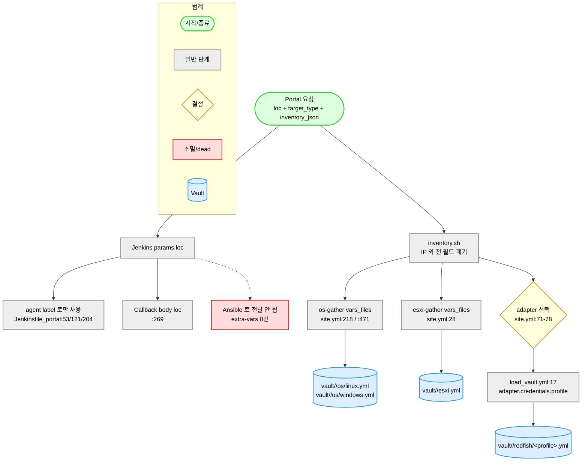
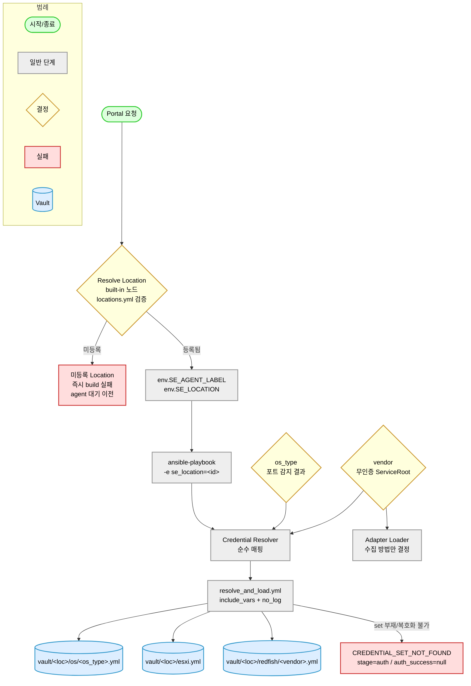

# Location 기반 Vault / Credential Resolver — 설계

> **작성일**: 2026-08-12
> **성격**: 설계 확정용 문서. **코드는 수정하지 않았다.**
> **기준**: 실제 코드. README / docs 서술은 근거로 쓰지 않았다.
> **선행 자료**: 자격증명 선택 추적(정리됨) (코드 전수 조사).
> 그 문서의 인용은 **전부 현재 코드로 재확인한 것만** 이 문서에 옮겼다.
>
> **라인 번호 기준**: HEAD `c7817510`.
> 작성 중 워킹트리에 이 설계와 무관한 수정이 있었다 —
> `esxi-gather/tasks/collect_runtime.yml`, `redfish-gather/tasks/vendors/**` 7개,
> 신규 `tests/unit/test_auth_evidence_contract.py`, `tests/unit/test_fragment_overwrite_and_include_paths.py`.
> **이 문서가 인용하는 파일은 그 목록에 없으며, 인용 라인은 전부 앵커 문자열로 재확인했다.**
> 그래도 읽는 시점에 밀릴 수 있으므로 재확인 시 **태스크명 / 함수명 / 문자열**로 찾을 것.

---

## 0. 결론

### 0.1 한 줄

Credential 선택을 **`Location + Target Type + 최소 식별정보` 단일 Contract** 로 고정하고,
Redfish 에서 Adapter(어떻게 수집하는가)와 Credential(누구로 인증하는가)의 유일한 결합점
(`redfish-gather/tasks/load_vault.yml:17-18`, 2줄)을 끊는다.

### 0.2 가능 / 불가 판정

| # | 요구 | 판정 | 근거 |
|---|---|---|---|
| 1 | `OS = location + os_type` | **가능** | os_type 은 인증 전 포트 감지로 확정되고(`precheck_bundle.py:1161-1167`), Play 자체가 os_type 별로 갈린다(`os-gather/site.yml:210`, `:464`) |
| 2 | `ESXi = location` | **가능** | 2번째 축이 없어 registry 조회만으로 결정 |
| 3 | `Redfish = location + vendor` | **가능** | vendor 는 무인증 ServiceRoot probe 로 확정된다(`detect_vendor.yml:12-22`, `:43`) |
| 4 | Generation 을 선택축에서 제외 | **가능하고, 오히려 필수** | Generation 은 OS/ESXi 는 인증 후, Redfish 는 HPE 외 인증 후에만 알 수 있어 축으로 쓰면 순환 의존이 생긴다 |
| 5 | Location 을 Ansible 로 전달 | **가능 (신규 경로 필요)** | 현재 `loc` 이 Ansible 에 닿는 경로가 **0개**다. extra-vars 를 신설한다 (§3) |
| 6 | Location 하드코딩 금지 + 코드 수정 없는 확장 | **가능** | registry YAML 1곳(`common/vars/locations.yml`) + vault 디렉터리 추가로 끝난다 |
| 7 | 잘못된 Location 을 Agent 대기 전에 실패 | **가능 (조건부)** | controller(`built-in`) 에서 registry 를 읽는 stage 가 필요하다. 그 노드의 SCM checkout 가부는 **코드만으로 확인 불가** → §12 에 2안 병기 |
| 8 | Adapter ↔ Credential 분리 | **가능하고, 동작 무해성을 증명할 수 있다** | non-empty `credentials.profile` 30개의 값 집합이 canonical vendor 9종과 양방향 차집합 0 (§8.2) |
| 9 | Lockout 위험 증가 없음 | **가능** | 대상 1대당 여는 credential set 은 여전히 1개다. 후보 수가 늘지 않는다 |
| 10 | 다른 Location / Vendor 로 폴백 금지 | **가능 (구조적으로)** | Hard cut 이라 resolver 에 폴백 코드가 존재하지 않는다 |

### 0.3 불가하거나, 조건이 붙는 것

| # | 항목 | 내용 |
|---|---|---|
| A | **Generation 기반 Credential** | 불가. 요구사항에서 이미 제외됐지만, 사유를 기록해 둔다 — 세대를 아는 시점이 인증 이후라 순환이다. Redfish 는 HPE 만 예외(`redfish_gather.py` 의 `manager_type` hint) |
| B | **Location 을 host 단위로 다르게** | 이번 설계 범위 밖. Jenkins 빌드 1회 = agent 1개 = Location 1개이며, `inventory.sh` 가 IP 외 모든 필드를 폐기한다(`os-gather/inventory.sh:86,93`). host 단위 Location 은 inventory 계약 변경이 선행돼야 한다 |
| C | **Vendor 정규화 통합 없이 Redfish 전환** | 불가. 현재 정규화 구현이 3개이고(§8.4), Vault 경로가 vendor 에서 파생되는 순간 그 차이가 곧 오선택이다. **선행 필수조건**으로 다룬다 |
| D | **`Jenkinsfile` 삭제 시 E2E Regression 게이트** | `Jenkinsfile:208-236` 의 Stage 4 는 `Jenkinsfile_portal` 에 대응물이 없다. 삭제하면 CI 회귀 게이트가 사라진다 (§12.4, §19-⑦) |

### 0.4 이번 변경에서 **하지 않는** 것 (명시)

- Credential 후보 **순서를 바꾸지 않는다**. vault `accounts` 배열 순서 = 시도 순서 유지 (§9)
- OS/ESXi 에 backoff 를 추가하지 않는다 (§10.2)
- Adapter YAML 의 `credentials:` 블록을 이번에 삭제하지 않는다 (§14, Phase B 로 분리)
- Location 별 Master Password 를 이번에 도입하지 않는다 (§11)
- `inventory.sh` 를 건드리지 않는다 (rule 11 envelope cardinality 보호)

---

## 1. 현재 구조와 목표 구조

### 1.1 AS-IS (실측)

> 이 그림이 말하는 것: 지금 Credential 을 고르는 축은 **채널 1개 + (Redfish 한정) Vendor 1개**뿐이고,
> Location 은 Jenkins 밖으로 나가지 못한다.



> 읽는 법: 위→아래. 빨강 = 정보가 소멸하는 지점. 노랑 = 결정 분기.
> 핵심 문제 둘 — (1) `loc` 이 Ansible 에 닿지 않는다, (2) Redfish 만 Vault 를 Adapter 가 고른다.

### 1.2 TO-BE

> 이 그림이 말하는 것: Location 이 registry 를 거쳐 Ansible 까지 도달하고,
> Credential 선택이 Adapter 와 무관한 별도 경로가 된다.



> 읽는 법: `vendor` 에서 화살표가 **두 갈래**로 갈리는 것이 이 설계의 핵심이다 —
> 하나는 Credential Resolver, 하나는 Adapter Loader. 둘 사이에 데이터 의존이 없다.

### 1.3 핵심 차이 요약

| 항목 | AS-IS | TO-BE |
|---|---|---|
| Location 축 | 없음 | `se_location` extra-var + `common/vars/locations.yml` |
| OS Vault | `vars_files` 정적 (`site.yml:218`,`:471`) | block 내 동적 로딩 |
| ESXi Vault | `vars_files` 정적 (`site.yml:28`) | block 내 동적 로딩 |
| Redfish Vault | `adapter.credentials.profile` (`load_vault.yml:17`) | `(location, vendor)` |
| Vault 경로 | `vault/<loc>/os/{linux,windows}.yml + vault/<loc>/esxi.yml`, `vault/<loc>/redfish/<v>.yml` | `vault/<loc>/...` |
| Credential set 부재 | generic 이면 빈 자격 1회, 아니면 경고 후 진행 | 명시 실패 (`CREDENTIAL_SET_NOT_FOUND`) |
| 후보 순서 | vault 배열 순서 | **불변** (§9) |

---

## 2. 확정 Credential Policy

```
OS      = location + os_type          (linux | windows)
ESXi    = location
Redfish = location + vendor           (canonical 9종)
```

선택축에 **넣지 않는 것**: Generation / Model / Firmware / OS 버전 / 커널 / distribution 버전 /
ESXi 버전 / adapter_id / adapter priority.

책임 분리:

| 컴포넌트 | 질문 | 입력 | 출력 |
|---|---|---|---|
| **Credential Resolver** | 어떤 계정으로 인증할 것인가 | location, target_type, os_type\|vendor | credential_scope, vault_relpath (**Secret 없음**) |
| **Adapter** | 그 대상에서 어떤 방식으로 수집할 것인가 | vendor, model, firmware, version, distribution | collect / normalize task 경로, capabilities |

같은 `vendor` 값을 둘 다 입력으로 쓰지만 **서로의 산출물을 읽지 않는다.** 이것이 분리의 정의다.

---

## 3. Location 모델

### 3.1 현재 사실

- `loc` 사용처는 3종뿐이다: agent label (`Jenkinsfile_portal:53`, `:121`, `:204`),
  공백 검증 (`:65`), Callback body (`:269`).
- Ansible 로 가는 경로는 **0개**다. 3개 Jenkinsfile 전부 `-e` / `--extra-vars` 사용 0건.
  Gather stage env 는 `REPO_ROOT`(`:128`) / `ANSIBLE_CONFIG`(`:129`) /
  `ANSIBLE_JSON_OUTPUT_FILE`(`:130`) / `ANSIBLE_VERBOSITY`(`:131`) 4개뿐이고 `loc` 이 없다.
- `ich/chj/yi` whitelist 는 코드에 없다. 파라미터 description 문자열(`:9`)에만 있다.
- 잘못된 `loc` 은 Validate 에서 실패하지 않는다 — Validate stage 의 agent 자체가
  `label "${params.loc}"`(`:53`)이라 **검증 코드가 실행되기도 전에** 노드 할당에서 멈춘다.

### 3.2 전달 방식 선택 — **extra-vars**

`ansible-playbook ... -e se_location=<id>`

| 후보 | 채택 | 이유 |
|---|---|---|
| **extra-vars** | **채택** | 아래 4가지 |
| 환경변수 | 기각 | `lookup('env','X')` 는 미설정 시 **조용히 `''`** 를 반환한다. Credential 범위를 정하는 값이 조용히 빈 문자열이 되면 잘못된(또는 없는) vault 를 가리키게 된다. 실패는 시끄러워야 한다 |
| inventory hostvars | 기각 | `inventory.sh` 수정이 필요하고(`os-gather/inventory.sh:93` 이 `{"ansible_host": ip}` 만 생성), 그 파일은 rule 11(요청 target 수 == envelope 수) 의 입력이라 손대는 비용이 크다. 게다가 빌드 1회 = agent 1개 = Location 1개라 per-host 값이 필요 없다 |
| 공통 config | 기각 | 전달 수단이 아니라 저장 수단이다. Location 값 자체는 실행 시점 입력이다 |

채택 이유 4가지:
1. **미정의가 즉시 에러**가 된다. `se_location` 이 없으면 Jinja 가 undefined 로 죽고, 그 실패는
   block/rescue 안에서 일어나 정상 failed envelope 으로 보고된다 (§6.3).
2. Ansible 변수 우선순위 최상위 — play vars / role defaults 에 가려지지 않는다.
3. Jenkins 콘솔의 `ansible-playbook` 명령줄에 그대로 남아 **감사 가능**하다.
   (Location 은 secret 이 아니다.)
4. 로컬 재현이 `-e se_location=ich` 한 줄이다 — 테스트 가능성.

변수명은 `se_location` 으로 한다. `location` 은 Redfish 부품 위치(`PartLocation`) 등과
어휘가 겹친다. `SE_` 접두는 기존 `SE_FORCE_LINUX_RAW_FALLBACK`(rule 10 R4) 선례를 따른다.

### 3.3 Location Registry

**신규** `common/vars/locations.yml`:

```yaml
---
# Location 정본. Location 추가 = 이 파일에 3줄 + vault/<id>/ 디렉터리.
# 코드(Python / Playbook / Jenkinsfile) 수정 불필요.
locations:
  ich:
    agent_label: ich
  chj:
    agent_label: chj
  yi:
    agent_label: yi
```

- **Location ID 와 `agent_label` 을 분리**한다. 지금 값이 같다는 사실을 계약으로 굳히지 않는다.
  Jenkins 는 `agent_label` 만 보고, Vault 경로와 `credential_scope` 는 Location ID 만 본다.
- Ansible 로드 방식은 기존 선례를 그대로 쓴다 —
  `lookup('file', lookup('env','REPO_ROOT') ~ '/common/vars/locations.yml') | from_yaml`.
  이 패턴은 `redfish-gather/tasks/detect_vendor.yml:10` 이 `vendor_aliases.yml` 에 이미 쓰고 있고,
  `include_vars` 의 `name:` 옵션 경고를 피하려고 채택된 방식이다(`detect_vendor.yml:6-7` 주석).
- `ich/chj/yi` 문자열은 이 파일에만 존재한다.

### 3.4 확장 절차 (새 Location `newdc`)

1. `common/vars/locations.yml` 에 3줄 추가
2. `vault/<새 loc>/{os/linux.yml, os/windows.yml, esxi.yml, redfish/*.yml}` 을 만들고 암호화한다
3. Jenkins 에 `newdc` label agent 등록

**코드 수정 0줄.** Python / Playbook / Jenkinsfile 어느 것도 바뀌지 않는다.

---

## 4. Credential Resolver

### 4.1 배치 — 기존 adapter 계열과 동일한 2단 분리

| 신규 파일 | 역할 | 테스트 |
|---|---|---|
| `module_utils/credential_common.py` | **순수 함수.** 파일시스템 접근 없음, 절대경로 생성 없음 | pytest 단독 실행 |
| `lookup_plugins/credential_resolver.py` | 얇은 껍데기. `locations.yml` + `vendor_aliases.yml` 로드 후 순수 함수 호출 | Ansible 필요 |
| `common/tasks/credential/resolve_and_load.yml` | resolve → `include_vars` → accounts 정규화 | task/e2e |

`lookup_plugins/adapter_loader.py` + `module_utils/adapter_common.py` 와 정확히 같은 구조다
(`adapter_loader.py:202-208` 이 kwargs 를 받아 `adapter_common` 함수에 위임하는 형태).

### 4.2 순수 함수 시그니처

```python
def resolve_credential_scope(
    location,        # str  — se_location
    target_type,     # str  — 'os' | 'esxi' | 'redfish'
    known_locations, # iterable[str] — locations.yml 의 키
    known_vendors,   # iterable[str] — vendor_aliases.yml 의 canonical 키
    os_type=None,    # str  — 'linux' | 'windows'   (target_type='os' 일 때만)
    vendor=None,     # str  — canonical vendor      (target_type='redfish' 일 때만)
):
    """(location, target_type, 최소 식별정보) → credential scope.

    Secret 을 다루지 않는다. 파일을 열지 않는다. 절대경로를 만들지 않는다.
    """
```

### 4.3 반환값

```yaml
credential_scope: "ich/redfish/dell"          # 사람이 읽는 범위 식별자
vault_relpath:    "vault/ich/redfish/dell.yml"  # 저장소 상대 경로 (절대경로 아님)
selection_basis:
  location:    "ich"
  target_type: "redfish"
  vendor:      "dell"       # os 채널이면 os_type, esxi 면 이 키 없음
reason:           "resolved"
```

`reason` enum:

| 값 | 의미 | `vault_relpath` |
|---|---|---|
| `resolved` | 정상 | 값 있음 |
| `unknown_location` | `location ∉ known_locations` | `null` |
| `unknown_os_type` | `os_type ∉ {linux, windows}` | `null` |
| `vendor_unresolved` | `vendor ∉ known_vendors` (`'unknown'` / 빈 값 포함) | `null` |

**Secret 은 반환값에 없다.** username / password 는 §4.5 의 `include_vars` 이후에만 존재한다.

**절대경로를 만들지 않는 이유** — `REPO_ROOT` 결합을 load task 로 미루면 순수 함수가
파일시스템과 무관해져 단위테스트가 fixture 없이 돌고, 경로 조립 규칙이 한 곳
(`resolve_and_load.yml`)에만 남는다.

### 4.4 경로 조립 규칙 (전부)

```
os      → vault/<location>/os/<os_type>.yml
esxi    → vault/<location>/esxi.yml
redfish → vault/<location>/redfish/<vendor>.yml        (복구 계정 전용)
        + vault/common/redfish/standard.yml            (표준 수집 계정 — 전역 상수)
```

> 2026-08-12 정정 (audit H-6): 본 설계 문서는 Redfish scope 를 1개(`location + vendor`)로
> 적었으나 **구현된 계약은 2개**다. 표준 수집 계정은 `module_utils/credential_common.py:54`
> 의 **모듈 상수**(`REDFISH_STANDARD_SCOPE`)이며 location/vendor 를 인자로 받지 않는다.
> `location + vendor` 축은 **복구 계정에만** 적용된다.
> 이 문서를 따라 새 Location 을 구성하면서 `vault/<loc>/redfish/<vendor>.yml` 에
> `role: primary` 를 넣으면 `recovery_accounts_of()` 가 그것을 버려 복구 후보가 0개가 된다.

`location` / `os_type` / `vendor` 는 **전부 등록된 집합에서만** 온다
(`known_locations` / 리터럴 2종 / `known_vendors`). 임의 문자열이 경로에 들어가지 않는다 —
오타나 경로 주입으로 엉뚱한 파일을 여는 경우가 구조적으로 불가능하다.

### 4.5 Load Task — `common/tasks/credential/resolve_and_load.yml`

입력: `_cred_location`, `_cred_target_type`, (`_cred_os_type` | `_cred_vendor`)
출력: `_cred_scope`, `_cred_accounts`, `_cred_load_outcome`

단계:

1. **resolve** — `set_fact` 로 lookup 호출. `no_log: true`.
2. **존재 확인** — `ansible.builtin.stat` (`delegate_to: localhost`).
   파일 부재와 복호화 실패를 구분하기 위해 `include_vars` 전에 둔다 (§15 테스트 9 vs 10).
3. **로드** — `ansible.builtin.include_vars` with `name: _cred_vault_data`,
   `no_log: true`, `failed_when: false`, `register:`.
   `include_vars` 는 vault 암호화 파일을 자동 복호화한다 —
   `redfish-gather/tasks/load_vault.yml:29-36` 이 이미 이 방식으로 동작 중이다.
   **`cacheable` 옵션을 쓰지 않는다** (rule 27 R6, `test_vault_dynamic_loading_m_c3.py:35,38` 이 고정).
4. **정규화** — `_cred_accounts` 생성. **순서 보존** (§9).
5. **결과 판정** — `_cred_load_outcome` ∈
   `loaded` | `credential_set_missing` | `credential_set_undecryptable` | `empty_accounts`.

### 4.6 accounts 정규화 (3채널 공통)

현재 Redfish 만 갖고 있는 정규화(`load_vault.yml:64-81`)를 공통으로 올린다.

```
_cred_accounts =
    _cred_vault_data.accounts                        if len(accounts) > 0
    else [{username: ansible_user, password: ansible_password,
           label: 'legacy_single', role: 'primary'}] if ansible_user != ''
    else []
```

- **순서를 바꾸지 않는다.** 입력 배열 순서 = 출력 순서 (§9).
- legacy 단일 자격 호환은 유지한다 —
  `test_vault_dynamic_loading_m_c3.py:110,113` 이 `ansible_user` / `ansible_password` 존재를 고정한다.
- OS Linux 는 `ansible_become_password` 를 별도로 꺼내 `_cred_become_password` 로 노출한다 (§6.4).

---

## 5. Vault 디렉터리 및 Schema

### 5.1 구조

```
vault/
  ich/
    os/
      linux.yml
      windows.yml
    esxi.yml
    redfish/
      dell.yml
      hpe.yml
      lenovo.yml
      supermicro.yml
      cisco.yml
      huawei.yml
      inspur.yml
      fujitsu.yml
      quanta.yml
  chj/
    ...
  yi/
    ...
  .lab-credentials.yml        ← 이동하지 않는다 (아래 5.4)
```

### 5.2 왜 esxi 만 평 파일인가 — **디렉터리 깊이 = 선택축 개수**

| 채널 | 선택축 | 경로 |
|---|---|---|
| ESXi | location 1개 | `vault/<loc>/esxi.yml` — 2번째 축이 없으므로 디렉터리도 없다 |
| OS | location + os_type | `vault/<loc>/os/<os_type>.yml` |
| Redfish (표준 수집) | **없음 — 전역 1벌** | `vault/common/redfish/standard.yml` (2026-08-12 정정) |
| Redfish (복구) | location + vendor | `vault/<loc>/redfish/<vendor>.yml` |

균일성을 위해 `vault/<loc>/esxi/default.yml` 로 맞추는 안은 기각한다 — 의미 없는 경로 조각이
하나 늘고, "이 채널은 축이 하나" 라는 사실이 오히려 흐려진다.

### 5.3 요구 조건 대조

| # | 조건 | 충족 방식 |
|---|---|---|
| 1 | 경로만 보고 범위 이해 | `vault/ich/redfish/dell.yml` 이 곧 `credential_scope: ich/redfish/dell` |
| 2 | Location 추가 용이 | 디렉터리 1개 + registry 3줄 (§3.4) |
| 3 | Vendor 추가 용이 | `vault/<loc>/redfish/<vendor>.yml` 1개씩. `vendor_aliases.yml` canonical 키 추가는 기존 vendor 추가 9단계(rule 50 R2)에 이미 포함 |
| 4 | Generation 때문에 파일이 늘지 않음 | 경로에 Generation 축 자체가 없다 |
| 5 | Secret 과 선택 정책 중복 없음 | 선택 정책은 경로 규칙(§4.4) 하나뿐. adapter 의 `recovery_accounts` 가 vault label 을 복제하는 현 중복은 §14 Phase B 에서 제거 |

### 5.4 `vault/.lab-credentials.yml` 은 건드리지 않는다

resolver 대상이 아니고(평문, gitignored, lab 전용), 다음 5개 파일이 경로를 하드코딩한다:
`tests/e2e_browser/lab_loader.py:16`,
cycle-015 의 probe 스크립트 4종 (해당 evidence 디렉터리는 삭제됐다 — git log 참조).

### 5.5 파일 내부 Schema — **변경 없음**

```yaml
accounts:
  - username: "..."
    password: "..."
    label: "..."          # vendor 별 허용 집합은 tests/unit/test_adapter_vault_label_consistency.py:32-68
    role: "primary"       # primary | recovery | secondary
# Linux 전용 (선택)
ansible_become_password: "..."
# legacy 단일 자격 (선택, 호환용)
ansible_user: "..."
ansible_password: "..."
```

키 이름 / 타입 / 의미를 바꾸지 않는다. **바뀌는 것은 파일이 놓이는 경로뿐이다.**

---

## 6. OS 변경 설계

### 6.1 현재 흐름

```
PLAY 1 "os-gather | detect"  (site.yml:25-135, hosts: all, connection: local)
  precheck (:60-76) → _detected_os (:82) → add_host 3분기 (:91-135)
PLAY 1.5 "failed-output"     (:142-205, hosts: _os_failed)   ← 감지 실패 envelope
PLAY 2 "linux"               (:210-459, hosts: _os_linux)
  vars_files: vault/<loc>/os/linux.yml (:218)     ← play 시작 시 정적 로딩
  try_credentials (:237-241, _os_accounts = accounts)
PLAY 3 "windows"             (:464-691, hosts: _os_windows)
  vars_files: vault/<loc>/os/windows.yml (:471)
  try_credentials (:485-489)
```

**중요**: PLAY 1 에는 `vars_files` 가 없다. 즉 vault 는 감지 이후에만 필요하고,
os_type 은 Play 소속으로 이미 확정돼 있다 — **os_type 을 다시 판정할 필요가 없다.**

### 6.2 변경

| 위치 | 현재 | 변경 |
|---|---|---|
| `os-gather/site.yml:218` | `vars_files: .../vault/<loc>/os/linux.yml` | **제거** |
| `os-gather/site.yml:471` | `vars_files: .../vault/<loc>/os/windows.yml` | **제거** |
| `:219-220`, `:472-473` | `failure_reasons.yml` | **유지** (rescue 가 참조) |
| PLAY 2 `:237` 직전 | — | `include_tasks: common/tasks/credential/resolve_and_load.yml` 삽입 (`_cred_os_type: linux`) |
| PLAY 3 `:485` 직전 | — | 동일 (`_cred_os_type: windows`) |
| `:241`, `:252` | `_os_accounts: "{{ accounts \| default([]) }}"` | `"{{ _cred_accounts \| default([]) }}"` |
| `:489`, `:500` | 동일 | 동일 |
| `:247`, `:495` | 실패 메시지의 `vault/<loc>/os/linux.yml` / `vault/<loc>/os/windows.yml` | `{{ _cred_scope }}` 로 교체 |

### 6.3 왜 `vars_files` 템플릿이 아니라 동적 로딩인가 — **rule 11 보호**

`vars_files: "{{ ... }}/vault/{{ se_location }}/os/linux.yml"` 는 문법적으로 가능하지만 **기각**한다.

- 파일이 없거나 `se_location` 이 미정의면 **play 자체가 죽는다.**
- play 가 죽으면 `tasks:` 가 실행되지 않고 OUTPUT 태스크에 도달하지 못한다 →
  **envelope 이 사라진다.** 이는 `requested target count == result envelope count`
  (CLAUDE.md §11, rule 11) 위반이다.
- block 안 `include_tasks` + `failed_when: false` 는 실패가 `rescue:`(`:369`, `:621`)로 잡혀
  `build_failed_output.yml` 을 태우고 정상 failed envelope 을 만든다.

### 6.4 `become` 처리 — 기존 결함을 악화시키지 않기

`os-gather/site.yml:227`:
```yaml
ansible_become_pass: "{{ ansible_become_password | default(ansible_password | default(omit)) }}"
```
이 play var 는 **이미 죽은 값**이다 — `try_one_credential.yml:22-25` 가 후보마다
`ansible_become_pass` 를 host fact 으로 `set_fact` 하고, host fact 이 play var 보다 우선한다.
즉 vault 의 `ansible_become_password` 는 현재도 무시되고 SSH 비밀번호가 sudo 비밀번호로 쓰인다.

- **이번 변경의 방침**: 동작을 그대로 둔다. `include_vars` 가 `name:` 으로 로드하므로
  `ansible_become_password` 가 top-level 로 주입되지 않는 차이가 생기지만,
  값이 어차피 쓰이지 않으므로 **관측 가능한 변화가 없다.**
- 단 `resolve_and_load.yml` 이 `_cred_become_password` 를 명시적으로 노출해 두어,
  이 결함을 고치는 후속 작업이 값을 잃지 않게 한다.
- 이 결함 자체는 **별도 이슈로 기록**한다 (§19 범위 밖 — 동작 변경이므로 이번에 섞지 않는다).

### 6.5 TO-BE 흐름

```
Linux :   Precheck → linux 판정 → (location + linux) → Vault Load → candidates → Auth
Windows:  Precheck → windows 판정 → (location + windows) → Vault Load → candidates → Auth
```

`try_credentials.yml` / `try_one_credential.yml` **두 파일은 수정하지 않는다.**
입력 변수(`_os_accounts`)의 출처만 바뀐다. 이것이 중요한 이유:
`tests/e2e/test_credential_probe_classification.py:31-35` 가 이 두 파일의 경로를 고정하고,
`:73-75` 가 모듈 호출 횟수와 `retries:` 부재를 고정한다.

---

## 7. ESXi 변경 설계

### 7.1 현재 흐름

```
esxi-gather/site.yml  (단일 play, hosts: all, connection: local, strategy: free)
  vars_files: vault/<loc>/esxi.yml (:28)
  vars: _e_user = ansible_user (:35) / _e_pass = ansible_password (:36)
  precheck (:48-54) → abort if failed (:56-63)
  try_credentials (:66-69, _e_accounts = accounts)
  collect_facts (:82-83) → select adapter (:111-118)   ← adapter 는 인증 후
```

### 7.2 변경

| 위치 | 현재 | 변경 |
|---|---|---|
| `esxi-gather/site.yml:28` | `vars_files: .../vault/<loc>/esxi.yml` | **제거** |
| `:29-30` | `failure_reasons.yml` | **유지** |
| `:66` 직전 | — | `include_tasks: common/tasks/credential/resolve_and_load.yml` 삽입 |
| `:69`, `:80` | `_e_accounts: "{{ accounts \| default([]) }}"` | `"{{ _cred_accounts \| default([]) }}"` |
| `:75` | 메시지의 `vault/<loc>/esxi.yml` | `{{ _cred_scope }}` |

### 7.3 감시 항목 — `_e_user` / `_e_pass` play var

`:35-36` 이 `ansible_user` / `ansible_password` 를 **`default()` 없이** 참조한다.
현재 이것이 터지지 않는 이유는 Jinja 지연 평가다 —
`_e_user` 의 첫 소비처가 `collect_facts.yml:8-9` 이고 그 시점에는
`try_one_credential.yml:41-44` 가 이미 `_e_user`/`_e_pass`/`ansible_user`/`ansible_password` 를
host fact 으로 덮어썼다. 인증 실패 시엔 `:71-80` 에서 abort 되어 평가되지 않는다.

- 동적 로딩으로 바뀌어도 이 성질은 그대로다(vault 의 top-level 키는 원래도 쓰이지 않았다).
- 그래도 **취약한 배선**이므로 이관 시 감시 항목으로 둔다. 안전하게 하려면
  `:35-36` 을 `| default('')` 로 감싸는 1줄 방어를 함께 넣는다 (동작 변화 없음).
- `collect_dns.yml:22-23`, `collect_network_extended.yml:21-22,32-33,43-44,54-55` 는
  `_e_user` 대신 `ansible_user`/`ansible_password` 를 직접 읽는다. 이 역시 인증 성공 후 경로라
  영향이 없지만, 일관성 결함으로 기록한다.

### 7.4 ESXi 세대 정보는 계속 쓰지 않는다

`precheck_bundle.probe_esxi` 가 무인증으로 `apiType` / `apiVersion` / `productLineId` / `version`
을 확보하지만(`:999-1034`), 소비처는 `diagnosis.details` 하나뿐이다
(`filter_plugins/diagnosis_mapper.py:62-65`). Credential 선택에 승격하지 않는다 — 정책상 ESXi 는
Location 축 하나뿐이기 때문이다.

---

## 8. Redfish 변경 설계

### 8.1 현재 흐름과 변경 위치

```
site.yml:44-46   init fragments
site.yml:49-55   run precheck
site.yml:57-64   abort if precheck failed
site.yml:67-68   detect vendor          → _rf_detected_vendor (:43), _rf_probe_facts (:75-93)
site.yml:71-78   select adapter         → _selected_adapter
site.yml:89-92   extract manager_layout ← adapter 파생
site.yml:95-96   load vault             ← adapter.credentials.profile (load_vault.yml:17)
site.yml:99-100  collect standard       ← 첫 인증 시도
```

변경 후:

```
site.yml:67-68   detect vendor
       (신규)    resolve & load credentials   ← (se_location, _rf_detected_vendor)
site.yml:71-78   select adapter               ← credential 과 무관
site.yml:89-92   extract manager_layout
site.yml:99-100  collect standard
```

`load_vault.yml` 호출을 adapter 선택 **앞으로** 옮긴다. 옮기지 않아도 데이터 의존은 끊기지만,
순서를 앞으로 두면 "adapter 결과를 볼 수 없으므로 참조할 수 없다" 가 구조로 강제된다.
`load_vault.yml` 이 adapter 에서 읽는 값은 `credentials.profile`(`:17`)과
`credentials.fallback_profiles`(`:18`) 둘뿐이므로 이동에 다른 의존이 없다.

### 8.2 동작 무해성 증명 (2026-08-12 실측)

`adapters/redfish/*.yml` **31개**:

| 구분 | 개수 | 내용 |
|---|---|---|
| non-empty `credentials.profile` | **30** | distinct 9종 |
| empty (`profile: ""`) | **1** | `redfish_generic.yml:37` |

30개의 distinct profile 집합:
```
{cisco, dell, fujitsu, hpe, huawei, inspur, lenovo, quanta, supermicro}
```
`common/vars/vendor_aliases.yml` 의 canonical 키 집합:
```
{cisco, dell, fujitsu, hpe, huawei, inspur, lenovo, quanta, supermicro}
```
**양방향 차집합 0.** `vault/<loc>/redfish/` 의 파일명 9종도 동일 집합이다.

HPE CSUS 3200(`hpe_csus_3200.yml:130`) / Superdome Flex(`hpe_superdome_flex.yml:74`) 도
`profile: "hpe"` 이고 canonical 도 `hpe` 다 — 다른 것은 **출력 표시값**뿐이며
(`vendor_aliases.yml:121-123` `adapter_output_display` → `hpCsus`),
같은 파일 `:98-100` 이 "내부 canonical 은 vault 경로 라우팅에 그대로 쓰인다" 고 명시한다.

비-generic adapter 는 vendor 매치 실패 시 `-9999` 로 실격되므로
(`module_utils/adapter_common.py:277`) **vendor 가 맞지 않으면 선택될 수 없다.**

> 따라서: **선택된 non-generic adapter 의 `credentials.profile` ≡ 감지된 canonical vendor.**
> `adapter.credentials.profile` 을 `_rf_detected_vendor` 로 교체하는 것은
> 이 경우 **문자 그대로 같은 값**이며 vault 선택 결과가 바뀌지 않는다.

### 8.3 의도된 유일한 동작 변경 — generic adapter 경로

`redfish_generic.yml` 은 `match: {}`(`:15`), `priority: 0`(`:12`), `generic: true`(`:13`) 이고
`profile: ""`(`:37`) 이다. 선택되면 현재는:
1. 경고(`load_vault.yml:21-26`) → 2. `include_vars` skip(`:36` `when: _rf_vault_profile != ''`)
→ 3. `_rf_accounts = []` → 4. `collect_standard.yml:41-73` 의 **빈 자격 1회 시도**.

변경 후 규칙:

| 상황 | 현재 | 변경 후 |
|---|---|---|
| vendor = `unknown` (감지 실패) | 빈 자격 1회 시도 | **동일 — 유지** |
| vendor = canonical 9종 중 하나인데 generic adapter 선택됨 | 빈 자격 1회 시도 | 해당 vendor 의 credential set 사용 |
| vendor = canonical 인데 vault 파일 부재 | (발생 불가 — profile 이 곧 파일명) | `CREDENTIAL_SET_NOT_FOUND` (§10.3) |

즉 **빈 자격 1회 시도의 트리거를 "adapter 가 generic" 에서 "vendor 를 식별하지 못함" 으로 옮긴다.**
이것이 옳은 이유: Dell 인 줄 알면서 빈 자격으로 찔러 볼 이유가 없다. 반대로 정체를 모르는 장비에
대한 best-effort 1회 시도는 유지할 가치가 있다(오픈 BMC / 표준 준수 장비).

두 번째 행이 실제로 발생하려면 canonical vendor 인데도 그 vendor 의 adapter 가 전부 실격되어야
한다(예: `model_patterns` 가 있는 adapter 만 있고 model 이 예상 밖). 현재 9 vendor 모두
model/firmware 패턴이 없는 vendor-generic adapter를 갖고 있어 실현 가능성은 낮지만,
**회귀 확인 항목으로 명시**한다 (§15.3-R4).

### 8.4 [선행 필수] Vendor 정규화 SoT 통합

현재 정규화 구현이 **3개**다:

| # | 위치 | 알고리즘 | 미매치 시 |
|---|---|---|---|
| 1 | `redfish-gather/library/redfish_gather.py:721-742` `_normalize_vendor_from_aliases` (+ `_detect_vendor_from_service_root:825`) | `_FALLBACK_VENDOR_MAP:611` ∪ `vendor_aliases.yml`, 정확 매칭 → **양방향** substring | `'unknown'` |
| 2 | `redfish-gather/tasks/detect_vendor.yml:43-65` | Jinja, 정확 매칭 → **양방향** substring, dict 순회 순서 우선 | `'unknown'` |
| 3 | `module_utils/adapter_common.py:67-107` `normalize_vendor` | 정확 매칭 → **정방향만**, 3자 미만 alias 는 토큰 일치, **최장 alias 우선** | **원문 소문자** |

**오늘 사고가 나지 않는 이유**는 세 알고리즘이 같아서가 아니라, 1번이 이미 canonical 을 반환해
(`:742` `return 'unknown'`, `:836` 반환 계약) 2·3번이 사실상 idempotent 하기 때문이다
(9개 canonical 이 각자 자기 alias 목록에 소문자로 들어 있다).

Vault 경로가 vendor 에서 파생되는 순간 이 차이는 곧 **오선택**이 된다. 따라서:

**통합 설계**

1. **데이터 SoT** = `common/vars/vendor_aliases.yml` 의 canonical 키 집합.
   Resolver 가 `vendor ∈ known_vendors` 를 **강제 검증**하고, 아니면 경로를 만들지 않는다(§4.3).
   → 세 정규화기 중 무엇이 이상한 값을 내더라도 **엉뚱한 파일을 열 수는 없다.**
2. **알고리즘 SoT** = `adapter_common.normalize_vendor` 를 filter plugin
   (`filter_plugins/vendor_normalizer.py`) 으로 노출하고
   `detect_vendor.yml:43-65` 의 Jinja 정규화를 **삭제**한다. 구현 3 → 2.
3. `redfish_gather.py` 의 `_FALLBACK_VENDOR_MAP`(`:611`)은 남긴다 —
   rule 10 R2(핵심 library stdlib 우선) + rule 15(보호 경로) 때문에 module_utils import 를
   끌어들이지 않는다. 대신 **`vendor_aliases.yml` 과 동치임을 강제하는 드리프트 테스트를 신설**한다.
   현재는 주석(`:605` "동기화 필요")뿐이고,
   `tests/unit/test_vendor_normalize_aliases.py` 는 모듈 함수 결과만 검증할 뿐 두 맵의 동치는
   검증하지 않는다. (`:80` 이 이미 "채널 divergence" 를 기록해 둔 영역이다.)

**전환 순서 (이 순서를 지켜야 한다)**

```
(a) tests/fixtures/** 에서 관측된 Manufacturer 문자열 전수 추출
(b) 세 구현의 결과가 전부 동일함을 증명하는 테스트 추가 → GREEN 확인
(c) detect_vendor.yml 의 Jinja 정규화 삭제, filter 로 교체 → (b) 재실행
(d) 그 다음에야 vendor 기반 vault 선택 도입
```

### 8.5 Adapter Credential 필드 — 이번 변경에서의 처리

| 필드 | 현재 | 이번(Phase A) |
|---|---|---|
| `credentials.profile` | `load_vault.yml:17` 이 읽는 **유일한 production 소비처** | **읽지 않는다.** YAML 필드는 남긴다 |
| `credentials.fallback_profiles` | `load_vault.yml:18` → `:49-60` 루프. **42/42 adapter 가 `[]`** = dead | **루프를 삭제한다.** 참조 테스트 0건. 의미(다른 vendor vault 로 폴백)가 §10.1 정책과 정면 충돌하므로 남겨 둘 이유가 없다 |
| `credentials.recovery_accounts` | production 소비처 **0건**. `test_adapter_vault_label_consistency.py` 만 강제 | **유지.** 삭제는 Phase B (§14) |

---

## 9. Primary / Recovery 처리

### 9.1 이번 변경에서 **순서를 바꾸지 않는다**

현재 Contract 를 그대로 보존한다: **vault `accounts` 배열 순서 = 시도 순서.**

근거 위치:
- `load_vault.yml:5-8` 주석이 "vault YAML 파일의 accounts list 순서가 곧 multi-account fallback
  시도 순서" 라고 명시
- `os-gather/tasks/try_credentials.yml:36` `loop: "{{ _os_accounts | default([]) }}"`
- `esxi-gather/tasks/try_credentials.yml:30` `loop: "{{ _e_accounts | default([]) }}"`
- `redfish-gather/tasks/collect_standard.yml:79` `loop: "{{ _rf_accounts | default([]) }}"`
- 정렬 코드는 전 저장소에 0건

따라서 §4.6 의 공통 정규화기는 **순서 보존(order-preserving)** 이어야 하며,
이를 검증하는 테스트를 넣는다 (§15.2-T20).

### 9.2 왜 지금 role 기반 정렬을 넣지 않는가

- **암호화된 vault 내부의 실제 배열 순서를 확인하지 않았다** (복호화하지 않음).
  "현재 모두 primary-first 라 정렬을 넣어도 무변화" 라고 **단정할 수 없다.**
  만약 어떤 vault 가 recovery-first 라면, 정렬 도입은 그 대상의 인증 순서를 바꾸는
  **관측 가능한 동작 변경**이고, Redfish 에서는 reconcile 진입 조건까지 건드릴 수 있다.
- `scripts/ai/reorder_windows_vault_admin_primary.py` 의 존재는 과거에 수동 재정렬이 필요했다는
  **정황**이지 현재 상태의 증거가 아니다.
- 이번 변경의 본질은 **경로 선택 축의 추가**다. 시도 순서 변경을 같이 넣으면 회귀 원인 분리가 어렵다.

→ role 기반 정렬은 §19-③ 후속 항목. **선행 작업 = vault 실제 배열 순서 실측.**

### 9.3 `role` 의 현재 실제 효과 (순서와 무관하게 유지된다)

| # | 효과 | 위치 |
|---|---|---|
| 1 | reconcile 대상(공통계정) 선정 | `account_service.yml:33` `selectattr('role','eq','primary') \| first` |
| 2 | primary 인증 거부 판정 | `collect_standard.yml:99-103` — role=primary 관측치 중 status **정수 401** |
| 3 | reconcile 진입 조건 | `site.yml:154` `_rf_account_reconcile_allowed` |
| 4 | `fallback_used` 메타 집계 | `collect_standard.yml:116-125`, `try_credentials.yml:44-53` |

넷 다 **role 기반**이므로 순서를 건드리지 않는 이번 변경에 영향이 없다.
특히 index 기반 식별 금지는 이미 테스트로 못 박혀 있다 —
`tests/unit/test_account_reconcile_entry_gate.py:202-216`
(`[recovery401, primary401]` 순서로 뒤집어도 `True`, `[primary200, recovery401]` 은 `False`).

### 9.4 OS / ESXi 에는 reconcile 개념이 없다

`account_service` / `recovery` / `_rf_primary_auth_rejected` 에 해당하는 로직이 없다.
`role` 값은 `fallback_used` 집계에만 쓰인다(`try_credentials.yml:50-52`).
이번 변경으로 그 상태를 바꾸지 않는다 — **OS/ESXi 에 Redfish reconciliation 을 확장하지 않는다**
(CLAUDE.md §8).

### 9.5 운영 실수 대비 — 런타임이 아니라 검증으로 막는다

recovery 가 배열 첫 번째에 들어가는 실수는 **런타임 정렬이 아니라 이관 검증 단계**에서 잡는다
(§16 2단계, `vault_decrypt_check.py` 확장):

- `accounts` 에 `role: primary` 가 정확히 1개 이상 존재
- `role` 값이 `{primary, recovery, secondary}` 안에 있음
- label 이 vendor 허용 집합(`test_adapter_vault_label_consistency.py:32-68`)과 정합
- **경고**: `accounts[0].role != 'primary'` 인 경우 (차단이 아니라 경고 — 의도적일 수 있으므로)

Secret 값은 출력하지 않는다.

---

## 10. Lockout / 실패 처리

### 10.1 후보 수는 늘지 않는다

| 채널 | 여는 credential set |
|---|---|
| OS | `vault/<loc>/os/<os_type>.yml` **1개** |
| ESXi | `vault/<loc>/esxi.yml` **1개** |
| Redfish | `vault/<loc>/redfish/<vendor>.yml` **1개** |

- 다른 Location 이나 다른 Vendor 의 vault 로 넘어가는 코드가 **존재하지 않는다.**
  Hard cut 이라 폴백 분기 자체를 만들지 않고, `fallback_profiles` 루프(`load_vault.yml:49-60`)도
  이번에 삭제한다.
- `ich + dell` 실패 → `chj + dell` 시도 없음, `ich + hpe` 시도 없음. **구조적으로 불가능.**
- 대상 1대당 인증 시도 횟수 = 그 파일의 `accounts` 개수. **오늘과 동일.**

### 10.2 backoff — 현행 유지

| 채널 | 현재 | 이번 |
|---|---|---|
| Redfish | `try_one_account.yml:133` `sleep 5` | **유지** |
| OS Linux/Windows | 없음 | **추가하지 않음** |
| ESXi | 없음 | **추가하지 않음** |

추가하지 않는 이유:
1. 후보 수가 늘지 않으므로 이번 변경이 잠금 위험을 **증가시키지 않는다**. 근거 없는 확장은
   하지 않는다(요구사항 "불필요한 구조 확장 금지").
2. `tests/e2e/test_credential_probe_classification.py:75,79` 가 OS/ESXi 파일에
   `retries:` / `until:` 이 없음을 고정하고 있고, `:73-74,78` 이 모듈 호출 1회를 고정한다.
   구조를 건드리면 이 계약을 함께 재작성해야 하는데, 이번 변경과 무관한 위험이다.
3. Redfish 의 `sleep 5` 는 `:85` 가 `assert "sleep 5" in rf_text` 로 못 박고 있으므로 반드시 남긴다.
   근거 주석(`try_one_account.yml:124-130`)이 vendor 임계까지 기록해 두었다 —
   Dell iDRAC 5회/5분, HPE iLO 3회, Lenovo XCC 5회.

**다만 실위험은 별도로 기록한다** (§19-④): Linux `pam_faillock`(RHEL STIG 기본 deny=3),
Windows AD 계정 잠금 정책(흔히 5회/30분)은 후보가 3개만 되어도 1회 실행에서 임계에 닿을 수 있고,
이는 **오늘 이미 존재하는 위험**이다. 이번 변경과 분리해 다룬다.

### 10.3 Vendor 미지원 / Credential Set 부재 — 신규 `failure_code`

**문제**: "인증을 시도했는데 거부됐다" 와 "인증을 시도조차 못 했다" 를 같은 code 로 만들면
시스템이 구분할 수 없다.

**우선안**:

| 항목 | 값 |
|---|---|
| `failure_code` | **`CREDENTIAL_SET_NOT_FOUND`** (신설) |
| `failure_stage` | **`auth` 유지** |
| `auth_success` | **`null`** |
| `errors[].message` | 기존 4번 문장 `_fr_credential_failed` **재사용** |
| `errors[].detail` | `credential set not found: <credential_scope>` 또는 `credential set could not be decrypted: <credential_scope>` |

**`failure_stage=auth` 를 유지하는 근거**: `failure_stage` 는 Root Cause 가 아니라
**Workflow 가 멈춘 위치**다 (CLAUDE.md §9, `field_dictionary.yml:1443` "실행이 중단된 단계
(원인이 아니다)"). 멈춘 위치는 자격증명 단계가 맞다. 유효 enum 6종
(`reachable/port/protocol/auth/gather/fallback`) 중 다른 후보가 없다 — `gather` 는 인증 통과를
전제하고, `fallback` 은 결과 객체 생성 실패를 뜻한다.

**`auth_success=null` 근거**: `false` 는 "구조화된 명시적 인증 거부" 를 의미한다(CLAUDE.md §9).
시도 자체를 안 했으므로 `null`(미시도)이 정확하다.

**사용자 문장을 새로 만들지 않는 근거**: 표준 5문장 집합은 사용자 확정 사항이고
(`common/vars/failure_reasons.yml:41-63`), 운영자가 할 일은 결국 "자격증명 설정 확인" 으로 같다.
code 는 **시스템 분기용 안정 식별자**, message 는 **사용자 안내**, detail 은 **기술 증거** —
이 3층 분리는 이미 저장소 계약이다(`build_failed_output.yml:42-51`).

**Diagnosis Contract 영향 (전부 additive)**

| # | 위치 | 변경 |
|---|---|---|
| 1 | `schema/field_dictionary.yml:1460-1462` | enum 7 → 8 |
| 2 | `docs/contract/03-fields.md` | 동기화 의무 (rule 13 R7) |
| 3 | `common/library/precheck_bundle.py:182-190` `REASON_BY_FAILURE_CODE` | `+1` 매핑 → `REASON_CREDENTIAL_FAILED` |
| 4 | `common/vars/failure_reasons.yml:29-36` | 매핑 주석 `+1` (두 정본 글자 동일 — drift 테스트가 강제) |
| 5 | `tests/e2e/test_failure_code_contract.py:55` (코드 집합), `:68` (code→stage frozenset) | `CREDENTIAL_SET_NOT_FOUND: {"auth"}` 추가 |
| 6 | `tests/e2e/test_errors_message_contract.py:366-378` | code↔문장 쌍 추가 |
| 7 | `tests/e2e/test_failure_reason_case_matrix.py` | 케이스 추가 |
| 8 | `schema/baseline_v1/*.json` 10건 | **영향 없음** — 전부 `failure_code: null` |
| 9 | Portal 소비자 | **코드만으로 확인 불가.** 미지 code 에 대한 default 분기가 있는지 → §19-① |

**차선안** (문서에 남기되 권장하지 않음): 기존 `AUTH_PROBE_FAILED` 재사용 + detail 로만 구분.
schema 무변경이라는 장점이 있으나, "시도 후 거부" 와 "미시도" 를 시스템이 구분할 수 없어
이 설계의 목적(정확한 실패 추적성)에 반한다.

**명명 대안**: 부재와 복호화 실패를 한 code 로 묶으므로 `CREDENTIAL_SET_UNAVAILABLE` 이
의미상 더 넓다. 이름 선택은 §19-①에 포함한다.

### 10.4 실패 케이스 전체 매트릭스

| 상황 | stage | code | auth_success | 빈 자격 시도 |
|---|---|---|---|---|
| Location 미등록 (Jenkins 통과 후) | `auth` | `CREDENTIAL_SET_NOT_FOUND` | `null` | 없음 |
| vault 파일 부재 | `auth` | `CREDENTIAL_SET_NOT_FOUND` | `null` | 없음 |
| vault 복호화 실패 | `auth` | `CREDENTIAL_SET_NOT_FOUND` | `null` | 없음 |
| `accounts: []` (파일은 정상) | `auth` | `AUTH_PROBE_FAILED` | `null` | 없음 — 현행 유지 |
| Redfish vendor = `unknown` | (수집 결과에 따름) | — | — | **1회 — 현행 유지** |
| 후보 전부 인증 거부 (401) | `auth` | `AUTH_PROBE_FAILED` | `false` | — |
| 후보 전부 실패, 401 아님 | `auth` | `AUTH_PROBE_FAILED` | `null` | — |

마지막 두 행은 현재 동작 그대로다 (`redfish-gather/site.yml:361-396` 의
`_rf_auth_outcome` 4분기, OS 는 `site.yml:402-416`, ESXi 는 `:260-277`).

---

## 11. Vault Master Password

### 11.1 현재

- Jenkins credential **1개**: `server-gather-vault-password`
  (`Jenkinsfile:159`, `Jenkinsfile_portal:160`, `Jenkinsfile_portal_test:161` — 전부 동일 ID, `string` 타입)
- 공급 경로는 `--vault-password-file` **하나뿐**. `ansible.cfg:57` 의 `vault_password_file` 은
  **주석 처리 = 비활성**. `vault_id` / `vault_identity_list` 는 저장소 전체 0건.
- vault 12개 전부 `$ANSIBLE_VAULT;1.1;AES256` — **1.1 은 vault_id 라벨이 없는 포맷**이다.
  즉 단일 키 운영이 파일 포맷 수준에서 확정돼 있다.

### 11.2 A vs B 비교

| 기준 | **A. 공통 키 + Location별 파일** | **B. Location별 키 + Location별 파일** |
|---|---|---|
| 보안 격리 | 파일은 분리되나 **키 1개** — 어느 agent 든 전 Location 복호화 가능 | agent 는 자기 Location 키만 받음. 침해 영향 범위가 Location 단위로 축소 |
| Jenkins 관리 | credential 1개 | credential N개. 신규 Location 시 **Jenkins 작업 1건 추가** |
| Location 추가 절차 | registry 3줄 + vault 디렉터리 | 위 + credential 생성 + 신규 vault 를 새 키로 암호화 |
| 재암호화 | 불필요 | **기존 12개 전량 rekey 필요** |
| 장애 영향 | 키 유출 = 전 Location 노출 / 키 분실 = 전면 중단 | 유출·분실 모두 Location 단위 |
| 운영 실수 | 적음 | 잘못된 credential 바인딩 → 복호화 실패로 **런타임에** 드러남 |
| Resolver 결합 | 없음 | **없음** (아래 11.4) |

### 11.3 권장 — **A**, B 는 후속 독립 변경

파일 분리만으로 "범위 명확화 + Location 단위 독립 회전" 이라는 운영 이득은 이미 확보된다.
키 분리는 재암호화 + Jenkins credential 증설이 함께 걸리는 **별개 축**이며,
이번 구조 변경과 섞으면 실패 시 원인 분리가 어렵다.

### 11.4 B 로 갈 때 — **`--vault-id` 는 필수가 아니다**

**한 실행 = 한 Location** 이므로 여러 키를 동시에 쥘 필요가 없다.

```groovy
// Resolve Location stage 가 registry 에서 credential id 를 결정
env.VAULT_CREDENTIAL_ID = loc.vault_credential_id ?: 'server-gather-vault-password'

// Gather stage — 기존 구조 그대로
withCredentials([string(credentialsId: env.VAULT_CREDENTIAL_ID, variable: 'VAULT_PASSWORD')]) {
    // ... printf > $VAULT_TMP ...
    // ansible-playbook ... --vault-password-file="$VAULT_TMP"     ← 그대로
}
```

- **Ansible 변경 0. `ansible.cfg` 변경 0. vault 파일 포맷 변경 0** (1.1 유지 가능).
- registry 에 선택적 필드 `vault_credential_id` 하나만 늘어난다.
- `--vault-id` / `vault_identity_list` 는 **한 실행이 여러 Location 의 vault 를 동시에 열어야 할 때만**
  필요하다. 현재 그런 실행은 없으므로 대안으로만 기록한다.

### 11.5 Resolver 와의 결합도 — 0

Resolver 는 **경로만** 반환하고(§4.3) 복호화는 Ansible 이 투명하게 처리한다.
A → B 전환 시 `credential_common.py` / `credential_resolver.py` / `resolve_and_load.yml` 은
**한 줄도 바뀌지 않는다.** 이것이 요구사항 "Master Password 선택 로직이 Credential Resolver 와
과도하게 결합되지 않도록" 의 충족 방식이다.

---

## 12. Jenkins 변경 영향

### 12.1 전제 — 운영 파이프라인은 `Jenkinsfile_portal` 하나 (사용자 확정)

미사용 `Jenkinsfile` 과 `Jenkinsfile_portal_test` 는 **삭제**한다.
따라서 `Jenkinsfile:30` 의 pipeline top-level `agent { label "${params.loc}" }` 문제
(어떤 stage 보다 먼저 agent 가 할당되어 Resolve Location stage 를 앞에 둘 수 없는 구조)는
발생하지 않는다.

`Jenkinsfile_portal` 은 이미 `agent none`(`:3`) + stage별 `node` 구조라 stage 하나만 추가하면 된다.

### 12.2 1안 (기본) — `Resolve Location` stage 신설

```groovy
stage('Resolve Location') {
    agent { label 'built-in' }          // Callback stage(:227) 와 동일 노드
    // skipDefaultCheckout 을 두지 않는다 — registry 파일을 읽어야 하므로 기본 checkout 필요
    options { timeout(time: 2, unit: 'MINUTES') }
    steps {
        script {
            def reg = readYaml file: 'common/vars/locations.yml'
            def key = params.loc?.trim()
            def entry = (reg.locations ?: [:])[key]
            if (!entry) {
                error "[Resolve Location] 등록되지 않은 Location: '${key}' " +
                      "— 허용: ${(reg.locations ?: [:]).keySet().sort()}"
            }
            env.SE_LOCATION    = key
            env.SE_AGENT_LABEL = entry.agent_label
            echo "[Resolve Location] ${key} -> agent label '${entry.agent_label}'"
        }
    }
    post { always { deleteDir() } }
}
```

- **미등록 Location 은 여기서 build 실패** → agent 대기 이전 (요구사항 3 충족).
- `readYaml` 은 Pipeline Utility Steps 플러그인 제공 — 같은 플러그인의 `readJSON` 이
  `Jenkinsfile:97` 에서 이미 쓰이고 있어 설치가 확인된다.
- `built-in` 노드 가용성은 `Jenkinsfile_portal:227` 의 Callback stage 가 이미 그 노드에서 돈다는
  사실로 확인된다.

### 12.3 이어지는 변경 (전부 `Jenkinsfile_portal`)

| 위치 | 현재 | 변경 |
|---|---|---|
| `:53` (Validate agent) | `label "${params.loc}"` | `label "${env.SE_AGENT_LABEL}"` |
| `:121` (Gather agent) | 동일 | 동일 |
| `:204` (Validate Schema agent) | 동일 | 동일 |
| `:174` | `ansible-playbook "${playbook}" -i "${inventory}" --vault-password-file="$VAULT_TMP"` | 끝에 `-e se_location="${env.SE_LOCATION}"` 추가 |
| `:65` | `if (!params.loc?.trim()) error ...` | **유지** (Resolve Location 이 더 앞이지만 이중 방어는 무해) |
| `:269` (Callback body `"loc"`) | `params.loc` | **유지** — Portal 이 보낸 값을 그대로 돌려주는 외부 계약(rule 31 R3, rule 96 R1-B). 값은 어차피 동일하다 |

`:160` 의 `withCredentials` 는 **이번에 바꾸지 않는다** (§11.3 권장안 A).

### 12.4 `Jenkinsfile` / `Jenkinsfile_portal_test` 삭제의 실제 영향

- **`Jenkinsfile_portal_test`**: `Jenkinsfile_portal` 과 **1줄 차이**뿐이다
  (`:18` `defaultValue: 'not-json'` 추가). 삭제해도 잃는 기능이 없다.
- **`Jenkinsfile`**: 잃는 것은 **Stage 4 `E2E Regression` 하나**다 (`:208-236`) —
  `pytest tests/e2e/` + `pytest tests/integration/ -m "not live"`.
  `Jenkinsfile_portal` 에 대응 stage 가 없다.
  - `Validate Schema` 는 손실 없음: portal `:201-223` 이 동일하게
    `python3 tests/validate_field_dictionary.py` 를 실행한다.
  - → **이 게이트를 portal 로 옮길지 / 포기할지는 §19-⑦.**
- **함께 갱신해야 하는 하네스·문서** (별도 커밋 — CLAUDE.md §13 "제품 코드와 Harness 작업을 섞지 않는다"):
  `.claude/rules/80-ci-jenkins-policy.md` R1-A 표(pipeline 2종 → 1종),
  `.claude/rules/00-core-repo.md` ("Jenkins multi-pipeline 2종"),
  `docs/ai/catalogs/JENKINS_PIPELINES.md`,
  `scripts/ai/hooks/pre_commit_jenkinsfile_guard.py` (대상 glob),
  `CLAUDE.md` §15 보호 경로의 `Jenkinsfile*`.

### 12.5 2안 (대체) — controller checkout 불가 시

`built-in` 노드에서 SCM checkout 이 정책상 금지된 경우:

- `loc` 을 `string` → `choice` 파라미터로 바꾸고 값 목록을 Jenkins Job 설정에 둔다.
  잘못된 값 자체가 입력되지 않으므로 agent 대기 문제가 사라진다.
- **대가**: Location 추가 시 Jenkins Job 설정 수정이 필요해져 "코드 수정 없는 확장" 요구가
  일부 완화된다. registry(`locations.yml`)와 Job 설정이 **두 정본**이 되어 drift 위험이 생긴다.
- 이 경우에도 Ansible 쪽 registry 검증(§13.2)은 그대로 둬서, drift 가 발생하면 gather 단계에서
  명시 실패하도록 한다.

`built-in` 노드의 SCM checkout 가부는 **이 저장소 코드만으로 확인할 수 없다** → §19-⑥.

---

## 13. Ansible 변경 영향

### 13.1 신규 변수 전파

```
Jenkins   -e se_location=<id>
   → 전 play 에서 se_location 사용 가능 (extra-vars = 최상위 우선순위)
   → resolve_and_load.yml 이 _cred_location: "{{ se_location }}" 로 수령
```

`os-gather` 는 4개 play 중 PLAY 2 / PLAY 3 에서만 필요하고,
PLAY 1(detect) / PLAY 1.5(failed-output) 는 vault 를 쓰지 않으므로 참조하지 않는다.

### 13.2 Ansible 쪽 registry 검증 (이중 방어)

Jenkins 가 이미 검증하지만, 로컬 실행·2안 채택·Job 설정 drift 를 대비해
`resolve_and_load.yml` 이 `location ∈ known_locations` 를 다시 확인한다(§4.3 `unknown_location`).
실패는 block 안에서 일어나므로 rescue → 정상 failed envelope 이 된다.

### 13.3 사용자 메시지에서 vault 경로 문자열 교체

현재 vault 경로를 문자열로 박아 둔 곳 (전부 `_cred_scope` 로 교체):

| 위치 | 현재 문자열 |
|---|---|
| `os-gather/site.yml:247` | `vault/<loc>/os/linux.yml 의 accounts 와 ...` |
| `os-gather/site.yml:495` | `vault/<loc>/os/windows.yml 의 accounts 와 ...` |
| `esxi-gather/site.yml:75` | `vault/<loc>/esxi.yml 의 accounts 와 ...` |
| `redfish-gather/tasks/load_vault.yml:41` | `vault 파일 로드 실패: vault/<loc>/redfish/{{ _rf_vault_profile }}.yml` |
| `redfish-gather/tasks/collect_standard.yml:36` | `vault accounts 비어 있음 (vault/<loc>/redfish/{{ _rf_vault_profile }}.yml)` |
| `redfish-gather/tasks/account_service.yml:78` | `vault/<loc>/redfish/{{ _rf_vault_profile }}.yml 갱신 후 재시도` |
| `redfish-gather/tasks/account_service.yml:99` | `vault profile={{ _rf_vault_profile }}; role=primary candidate=0` |
| `redfish-gather/site.yml:132` | `vault/<loc>/redfish/{{ _rf_vendor }}.yml` |

`site.yml:132` 는 **기존 결함**이기도 하다 — 실제로 연 파일은 `_rf_vault_profile` 인데
메시지는 `_rf_vendor` 를 출력한다. generic adapter(profile=`""`)일 때 둘이 달라진다.
이번 변경으로 두 값이 하나(`_cred_scope`)가 되면서 자연히 해소된다.

이 문자열들은 전부 `fail:` 메시지 → `errors[].detail` 로 흘러가며,
**사용자 노출 message 는 `failure_reasons.yml` 의 5문장에서만 나온다**(CLAUDE.md §10).
`credential_scope` 는 경로 정보일 뿐 secret 이 아니므로 detail 에 두는 것이 맞다.

### 13.4 `diagnosis.details.credential_scope` 노출 (사용자 확정)

`diagnosis.details` 는 CLAUDE.md §11 이 "기술 Evidence 와 확장 Metadata 영역" 으로 규정한 곳이다.
top-level 13필드는 건드리지 않는다.

```json
"details": {
  "channel": "redfish",
  "adapter_candidate": "redfish_dell_idrac9",
  "checked_ports": [443],
  "credential_scope": "ich/redfish/dell"
}
```

- 주입 위치: `filter_plugins/diagnosis_mapper.py` 의 `details` 조립부(`:45-49`)에
  선택적 인자로 추가하거나, 각 채널이 `_diagnosis` 를 `combine` 하는 기존 지점에서 병합.
  후자가 변경 범위가 작다 (`redfish-gather/site.yml:242-260`, `os-gather/site.yml:302-325` 등이
  이미 `details` 를 combine 한다).
- **secret 없음** — location/channel/vendor 조합 문자열뿐이다.
- `schema/baseline_v1/*.json` 의 `details` 에 키가 하나 늘어난다 → baseline 10건 갱신 필요.
  `scripts/ai/hooks/envelope_change_check.py` 는 advisory(exit 0)이며 `diagnosis.*` 신규 sub-key 를
  검출해 보고한다 — 의도된 변경임을 커밋 메시지에 명시한다.

### 13.5 rule 27 R6 (vault 자동 반영) 준수

- `include_vars` 에 **`cacheable` 옵션을 쓰지 않는다.**
- `_cred_accounts` 등을 host facts / fact cache 에 등록하지 않는다.
- `ansible.cfg` 에 vault decrypt 캐시 옵션을 추가하지 않는다(현재도 없음).

`tests/unit/test_vault_dynamic_loading_m_c3.py:35,38,70` 이 이 3가지를 고정하고 있고,
새 load task 에도 같은 검사를 확장한다.

---

## 14. Adapter 변경 영향

### 14.1 실측 현황

| 채널 | adapter 수 | `credentials.profile` | 소비 코드 |
|---|---|---|---|
| redfish | 31 | 30개 non-empty (9종) + `redfish_generic.yml` 1개 empty | `load_vault.yml:17` — **유일** |
| os | 7 | `os_linux` ×4 / `os_windows` ×3 | **없음** (대응 vault 파일도 없음) |
| esxi | 4 | `esxi_default` ×4 | **없음** (대응 vault 파일도 없음) |

`fallback_profiles` 는 42/42 가 `[]`. `recovery_accounts` 는 redfish 31개에만 있고
production 소비 코드가 0건이며 `tests/unit/test_adapter_vault_label_consistency.py` 만 강제한다.

### 14.2 Phase A (이번)

| 대상 | 조치 |
|---|---|
| `load_vault.yml:17` `credentials.profile` 읽기 | **중단** |
| `load_vault.yml:18` + `:49-60` `fallback_profiles` 루프 | **삭제** (dead + §10.1 정책과 충돌) |
| adapter YAML 의 `credentials:` 블록 | **유지** (필드만 남김) |
| 신규 정합 테스트 | non-empty profile ≡ canonical vendor (§15.2-T21) |

`credentials.profile` 을 즉시 지우지 않는 이유: `tests/unit/test_vault_dynamic_loading_m_c3.py:141`
가 `load_vault.yml` 본문에 `credentials.profile` 문자열이 있을 것을 강제하므로
그 테스트를 함께 고쳐야 하고, `test_hpe_superdome_flex_m_e2.py:121` 은 adapter YAML 쪽을 본다.
필드를 남기면 후자는 그대로 통과하고, 전자만 수정하면 된다.

### 14.3 Phase B (별도 cycle — §19-⑤)

| 대상 | 조치 | 함께 고칠 테스트 |
|---|---|---|
| redfish 31개 `credentials:` | 제거 | `test_vault_dynamic_loading_m_c3.py:141`, `test_hpe_superdome_flex_m_e2.py:121` |
| `recovery_accounts` | 제거 — vault 의 `role: recovery` 가 이미 production 정본이다. adapter 쪽 복제는 §5.3 조건 5(중복 금지) 위반 | `test_adapter_vault_label_consistency.py:137,140,158,170,185` (그리고 `:114` 의 adapter 개수 30 고정) |
| os 7개 / esxi 4개 `credentials:` | 제거 — 완전 dead. profile 이름이 실제 vault 파일명과 일치하지도 않는다 | 없음 |

`test_adapter_vault_label_consistency.py` 가 검증하던 "adapter recovery label ⊆ vendor 허용 집합"
의 가치는 **vault 검증 스크립트로 이관**한다 (§9.5, §16 2단계) — 원래 label 의 정본은
vault 파일이지 adapter 가 아니다.

### 14.4 Adapter 선택 로직은 건드리지 않는다

`lookup_plugins/adapter_loader.py` 와 `module_utils/adapter_common.py` 에는
`credential` / `vault` / `password` / `account` 문자열이 **0건**이다.
점수 공식(`adapter_common.py:336-354`, `priority×1000 + specificity×10 + match_score`)도
그대로 둔다. 관련 테스트(`test_adapter_scoring.py`, `test_adapter_selection_t01.py`,
`test_adapter_selection_facts_r17.py`, `test_adapter_common_robustness.py`,
`test_csus_adapter_priority.py`)는 credential 관련 참조가 0건이라 영향받지 않는다.

단, §8.4 의 정규화 통합으로 `normalize_vendor` 가 filter 로도 노출되므로
그 함수의 **동작은 바뀌지 않아야 한다** (노출만 추가).

---

## 15. 테스트 영향 및 신규 테스트

### 15.1 요구된 20 케이스 → 계층 매핑

| # | 케이스 | 계층 | 신규 파일 |
|---|---|---|---|
| T1 | Location 정상 선택 | 순수 단위 | `tests/unit/test_credential_resolver.py` |
| T2 | 존재하지 않는 Location | 순수 단위 | 동상 (`reason=unknown_location`, `vault_relpath=null`) |
| T3 | OS Linux Vault 선택 | 순수 단위 | `vault/ich/os/linux.yml` |
| T4 | OS Windows Vault 선택 | 순수 단위 | `vault/ich/os/windows.yml` |
| T5 | ESXi Location Vault 선택 | 순수 단위 | `vault/ich/esxi.yml` |
| T6 | Redfish Dell Vault 선택 | 순수 단위 | `vault/ich/redfish/dell.yml` |
| T7 | Redfish HPE Vault 선택 | 순수 단위 | `vault/ich/redfish/hpe.yml` |
| T8 | 지원하지 않는 Vendor | 순수 단위 | `reason=vendor_unresolved` — **경로를 만들지 않음** |
| T9 | Vault 파일 누락 | task 계층 | `tests/unit/test_credential_load_task.py` — `stat` 분기 → `credential_set_missing` |
| T10 | Vault 복호화 실패 | task 계층 | 동상 → `credential_set_undecryptable` |
| T11 | accounts 비어 있음 | task 계층 | 동상 → `empty_accounts`, 현행 동작 유지 |
| T12 | Primary 성공 | e2e (기존 확장) | `test_redfish_multi_credential_auth.py` |
| T13 | Primary 실패 + Recovery 성공 | 기존 유지 | `test_account_reconcile_entry_gate.py:179-188` (수정 불필요) |
| T14 | 모든 Credential 실패 | 기존 유지 | `test_account_reconcile_entry_gate.py:191-199` |
| T15 | Location 간 Credential 격리 | 순수 단위 | `ich`/`chj` 가 서로 다른 relpath, 폴백 경로 부재 |
| T16 | Vendor 간 Credential 격리 | 순수 단위 | `dell`/`hpe` 동일 |
| T17 | Generation 변경 시 선택 불변 | 순수 단위 | `vendor=dell` 고정, model/firmware 를 14G~17G 로 바꿔도 relpath 동일 |
| T18 | 재실행 | task 계층 | `cacheable` 0건 / host facts 미등록 — `test_vault_dynamic_loading_m_c3.py` 패턴 확장 |
| T19 | no_log / Secret 비노출 | 정적 + task | resolver 반환값에 `password` 키 부재, load task 전 태스크 `no_log: true` |
| T20 | **후보 순서 보존** (추가) | 순수 단위 | 입력 배열 순서 == 출력 순서, recovery-first 입력도 그대로 |
| T21 | **adapter profile ≡ canonical vendor** (추가) | 정적 | §8.2 를 상시 검증 |
| T22 | **vendor 정규화 3구현 동치** (추가) | 정적 + 단위 | §8.4 (b) 단계의 게이트 |
| T23 | **`_FALLBACK_VENDOR_MAP` ↔ `vendor_aliases.yml` 동치** (추가) | 정적 | 현재 주석으로만 강제되는 동기화 |

T1~T8, T15~T17, T20 은 **파일시스템 없이** 실행된다 (§4.2 순수 함수 덕분).

### 15.2 신규 테스트 파일

| 파일 | 내용 |
|---|---|
| `tests/unit/test_credential_resolver.py` | T1~T8, T15~T17, T19(부분), T20 |
| `tests/unit/test_credential_load_task.py` | T9~T11, T18, T19 — `resolve_and_load.yml` 템플릿 렌더 방식(`test_account_reconcile_entry_gate.py:100-116` 의 `_set_fact_template` 패턴 재사용) |
| `tests/unit/test_location_registry.py` | `locations.yml` 스키마, 키 중복, `agent_label` 필수 |
| `tests/unit/test_vendor_normalizer_soT.py` | T22, T23 |
| `tests/unit/test_adapter_profile_vendor_parity.py` | T21 |

### 15.3 기존 테스트 영향 (파일:라인)

| # | 파일:라인 | 현재 assertion | 영향 |
|---|---|---|---|
| R1 | `tests/unit/test_vault_dynamic_loading_m_c3.py:141` | `"_selected_adapter" in content and "credentials.profile" in content` | **수정 필요** — Phase A 에서 `load_vault.yml` 이 더 이상 읽지 않음 |
| R2 | 동 `:35,38` | `cacheable` 부재 | 유지 + 새 load task 로 검사 확장 |
| R3 | 동 `:46,129` | `include_vars` / `name: _rf_vault_data` | 변수명이 바뀌면 수정. `_rf_vault_data` 명칭을 유지하면 무변경 |
| R4 | 동 `:110,113` | legacy `ansible_user`/`ansible_password` 폴백 | 유지 (§4.6) |
| R5 | `tests/e2e/test_credential_probe_classification.py:31-35` | 3개 probe 파일 경로 고정 | **무영향** — 그 3파일을 수정하지 않는다 |
| R6 | 동 `:73-75,78-79,82-83,85` | 모듈 호출 1회 / `retries:` 부재 / `sleep 5` | **무영향** (§10.2) |
| R7 | `tests/unit/test_adapter_vault_label_consistency.py:114` | redfish non-generic adapter **30개** | Phase A 무영향 / Phase B 수정 |
| R8 | 동 `:137,140,158,170,185` | `recovery_accounts` 존재·label·role | Phase A 무영향 / Phase B 수정 |
| R9 | `tests/unit/test_hpe_superdome_flex_m_e2.py:121` | `credentials.profile == "hpe"` | Phase A 무영향 (필드 유지) / Phase B 수정 |
| R10 | `tests/e2e/test_failure_code_contract.py:55,68` | code 집합 / code→stage 매핑 | **신규 code 추가 시 수정** (§10.3) |
| R11 | `tests/e2e/test_errors_message_contract.py:366-378` | code↔문장 쌍 | 동상 |
| R12 | `tests/e2e/test_failure_reason_case_matrix.py` | rescue 케이스 매트릭스 | 신규 케이스 추가 |
| R13 | `tests/unit/test_account_reconcile_entry_gate.py:202-216` | role 기반 식별 (index 금지) | **무영향** — 순서를 바꾸지 않으므로 |
| R14 | `tests/unit/test_vendor_normalize_aliases.py:53-103` | `redfish_gather._normalize_vendor_from_aliases` 결과 | 정규화 통합 시 **결과가 같아야 한다** — 이 테스트가 게이트 |
| R15 | `tests/regression/test_vendor_output_display.py` | canonical → 출력 표시값 | canonical 라우팅이 vault 경로에 쓰이므로 **동반 확인** |
| R16 | `tests/e2e/test_redfish_baseline.py:32,61,89,117` | `meta.adapter_id` | 무영향 (adapter 선택 불변) |
| R17 | `schema/baseline_v1/*.json` 10건 | `diagnosis.details` | **수정 필요** — `credential_scope` 키 추가 (§13.4) |
| R18 | `tests/e2e_browser/lab_loader.py:16` 외 4건 | `vault/.lab-credentials.yml` | **무영향** (§5.4) |

### 15.4 회귀 게이트

변경 후 실행:
```bash
ansible-playbook --syntax-check os-gather/site.yml
ansible-playbook --syntax-check esxi-gather/site.yml
ansible-playbook --syntax-check redfish-gather/site.yml
pytest tests/ -q
python tests/validate_field_dictionary.py
python scripts/ai/hooks/output_schema_drift_check.py
python scripts/ai/verify_vendor_boundary.py
python scripts/ai/verify_harness_consistency.py
```
고정 테스트 개수를 기준으로 삼지 않는다 — 실행 결과로 판단한다 (CLAUDE.md §16).

---

## 16. Migration Plan

### 16.1 원칙 — `git mv` 가 아니다

Location 별 실제 Credential **값이 서로 다르므로**(사용자 확정) 이관은 파일 이동이 아니라
**신규 작성**이다. 기존 flat vault 를 3벌 복사하는 것은 잘못된 값을 3곳에 심는 일이다.

### 16.2 4단계

**1단계 — 신규 Location Vault 준비**
- Location × 채널별 실제 계정 값을 확정한다 (운영 담당자 작업).
- 각각 `ansible-vault create` 로 **신규 생성**. `accounts[]` 스키마는 §5.5 그대로.
- 기존 flat vault 는 손대지 않는다 (참고용 열람만).
- 산출: `vault/<loc>/...` 트리.

**2단계 — 구조 / 암호화 검증** (`scripts/ai/vault_decrypt_check.py` 확장)
생성된 전량에 대해:
- 헤더가 `$ANSIBLE_VAULT` 인가
- 현재 마스터 키로 복호화되는가
- `accounts[]` 가 존재하고 각 항목에 `username/password/label/role` 이 있는가
- `role` 값이 `{primary, recovery, secondary}` 안에 있고 `primary` 가 1개 이상인가
- label 이 vendor 허용 집합(`test_adapter_vault_label_consistency.py:32-68`)과 정합인가
- **경고**: `accounts[0].role != 'primary'` (§9.5)
- **secret 값은 절대 출력하지 않는다.**

**3단계 — 코드 동시 전환** (1 커밋)
- 신규: `common/vars/locations.yml`, `module_utils/credential_common.py`,
  `lookup_plugins/credential_resolver.py`, `common/tasks/credential/resolve_and_load.yml`,
  `filter_plugins/vendor_normalizer.py`
- 수정: 3개 site.yml, `load_vault.yml`, `detect_vendor.yml`, `Jenkinsfile_portal`,
  `schema/field_dictionary.yml`, `docs/contract/03-fields.md`, baseline 10건
- 삭제: `Jenkinsfile`, `Jenkinsfile_portal_test`
- 하네스·문서 갱신(§12.4)은 **별도 커밋**으로 분리 (CLAUDE.md §13)

**4단계 — flat vault 제거** (별도 커밋)
- 3단계가 **실환경에서 확인된 뒤에만** 수행한다.
- 삭제 대상: `vault/<loc>/os/linux.yml`, `vault/<loc>/os/windows.yml`, `vault/<loc>/esxi.yml`,
  `vault/<loc>/redfish/*.yml` 9개. (`vault/.lab-credentials.yml` 은 제외 — §5.4)

### 16.3 선행 작업 — Vendor 정규화 통합 (§8.4)

3단계보다 **먼저** 완료돼야 한다:
```
(a) fixtures 에서 Manufacturer 문자열 전수 추출
(b) 3구현 동치 테스트 GREEN
(c) detect_vendor.yml Jinja 삭제 → filter 교체 → (b) 재확인
```

### 16.4 실환경 확인 항목 (3단계 이후)

| 채널 | 확인 |
|---|---|
| OS Linux | 1대 이상 성공 수집 + `diagnosis.details.credential_scope == "<loc>/os/linux"` |
| OS Windows | 동일 (`<loc>/os/windows`) |
| ESXi | 동일 (`<loc>/esxi`) |
| Redfish | vendor 별 최소 1대. `credential_scope == "<loc>/redfish/<vendor>"` |
| 실패 경로 | 없는 Location 으로 빌드 → Resolve Location 에서 실패(agent 대기 없음) |
| envelope | 요청 target 수 == envelope 수 (rule 11) |

**Unit test 통과는 실장비 검증이 아니다** (CLAUDE.md §16). Redfish Account Write 경로는
dry-run 과 실제 write 를 구분해 보고한다.

---

## 17. Rollback Plan

### 17.1 코드 rollback

| 시점 | 방법 | 소요 |
|---|---|---|
| 4단계 전 | 3단계 커밋 `git revert` 1회. flat vault 가 워킹트리에 그대로 있으므로 **이전 동작이 즉시 복원**된다 | 즉시 |
| 4단계 후 | 3·4단계 커밋 `git revert` 2회. flat vault 가 git 이력에서 복원된다 | 즉시 |

force push / history rewrite 는 하지 않는다 (rule 93 R1).

### 17.2 Credential 데이터 rollback — **코드 rollback 으로 해결되지 않는다**

신규 vault 에 잘못된 값이 들어간 경우:

1. **대상 장비 상태를 먼저 확인한다.** 잘못된 자격으로 반복 시도해 계정이 잠겼을 수 있다
   (Dell iDRAC 5회/5분, HPE iLO 3회, Lenovo XCC 5회 — `try_one_account.yml:124-130`).
2. **Redfish 는 값이 실제로 변경됐을 가능성**을 확인한다. reconcile 이 돌았다면
   AccountService 로 공통계정 password 가 동기화됐을 수 있다. 진입 조건은
   `redfish-gather/site.yml:154` 의 `_rf_account_reconcile_allowed` —
   `used_account.role == 'recovery'` AND `_rf_collect_ok` AND `_rf_primary_auth_rejected` 3개 동시 성립.
   `_rf_account_service_meta` 의 `action` / `verification` / `dryrun` 으로 실제 write 여부를 판정한다
   (`account_service.yml:60-72`, `:155-167`).
3. OS / ESXi 에는 write 경로가 없다 — 계정 잠금만 확인하면 된다.
4. vault 값 자체의 복구는 git 이력(암호문)에서 이전 버전을 되돌리는 것으로 가능하지만,
   **그 값이 장비의 현재 값과 일치하는지는 별개 문제**다.

### 17.3 "Secret 값 불변" 을 전제하지 않는다

1단계에서 Location 별로 값이 새로 정해질 수 있으므로, 이관을 "경로만 바뀌는 무해한 이동" 으로
취급하지 않는다. 위 17.2 는 그 전제에서 나온 절차다.

---

## 18. 최종 파일별 변경 목록

### 18.1 신규

| 파일 | 내용 |
|---|---|
| `common/vars/locations.yml` | Location registry (§3.3) |
| `module_utils/credential_common.py` | 순수 resolver 함수 (§4.2) |
| `lookup_plugins/credential_resolver.py` | lookup 껍데기 (§4.1) |
| `common/tasks/credential/resolve_and_load.yml` | resolve + include_vars + 정규화 (§4.5) |
| `filter_plugins/vendor_normalizer.py` | `normalize_vendor` 노출 (§8.4) |
| `vault/<loc>/os/linux.yml` 등 | Location × 채널 vault 트리 (§5.1) |
| `tests/unit/test_credential_resolver.py` 외 4개 | §15.2 |

### 18.2 수정

| 파일:라인 | 변경 |
|---|---|
| `os-gather/site.yml:218` | vault vars_files 제거 |
| `os-gather/site.yml:471` | 동일 |
| `os-gather/site.yml:237` 직전 | resolve_and_load include 삽입 |
| `os-gather/site.yml:485` 직전 | 동일 |
| `os-gather/site.yml:241,252,489,500` | `accounts` → `_cred_accounts` |
| `os-gather/site.yml:247,495` | 메시지 vault 경로 → `_cred_scope` |
| `esxi-gather/site.yml:28` | vault vars_files 제거 |
| `esxi-gather/site.yml:35-36` | `\| default('')` 방어 (선택, §7.3) |
| `esxi-gather/site.yml:66` 직전 | resolve_and_load include 삽입 |
| `esxi-gather/site.yml:69,80` | `accounts` → `_cred_accounts` |
| `esxi-gather/site.yml:75` | 메시지 경로 → `_cred_scope` |
| `redfish-gather/site.yml:68` 직후 | resolve_and_load include (adapter 선택 앞) |
| `redfish-gather/site.yml:95-96` | 기존 load vault include 제거 |
| `redfish-gather/site.yml:132` | `vault/<loc>/redfish/{{ _rf_vendor }}.yml` → `_cred_scope` |
| `redfish-gather/site.yml:242-260` | `diagnosis.details.credential_scope` 병합 |
| `redfish-gather/tasks/load_vault.yml:15-19` | adapter 참조 제거 |
| 동 `:29-36` | 경로를 `_cred_*` 기반으로 |
| 동 `:41` | 메시지 → `_cred_scope` |
| 동 `:49-60` | **fallback 루프 삭제** |
| 동 `:64-81` | 공통 정규화로 이관 |
| `redfish-gather/tasks/detect_vendor.yml:43-65` | Jinja 정규화 삭제 → filter 사용 |
| `redfish-gather/tasks/collect_standard.yml:36` | 메시지 → `_cred_scope` |
| 동 `:41-73` | 빈 자격 시도 조건을 `vendor_unresolved` 로 |
| `redfish-gather/tasks/account_service.yml:78,99` | 메시지 → `_cred_scope` |
| `Jenkinsfile_portal:53,121,204` | label → `env.SE_AGENT_LABEL` |
| `Jenkinsfile_portal:174` | `-e se_location=...` 추가 |
| `Jenkinsfile_portal` (신규 stage) | Resolve Location |
| `schema/field_dictionary.yml:1460-1462` | enum +1 (§10.3) |
| `schema/baseline_v1/*.json` 10건 | `details.credential_scope` |
| `common/library/precheck_bundle.py:182-190` | `REASON_BY_FAILURE_CODE` +1 |
| `common/vars/failure_reasons.yml:29-36` | 매핑 주석 +1 |
| `docs/contract/03-fields.md` | 동기화 (rule 13 R7) |
| `scripts/ai/vault_decrypt_check.py` | 검증 확장 (§16 2단계) |
| §15.3 의 테스트 R1, R10~R12, R17 | 갱신 |

### 18.3 삭제

| 파일 | 시점 |
|---|---|
| `Jenkinsfile` | 3단계 |
| `Jenkinsfile_portal_test` | 3단계 |
| `vault/<loc>/os/linux.yml`, `vault/<loc>/os/windows.yml`, `vault/<loc>/esxi.yml` | 4단계 |
| `vault/<loc>/redfish/*.yml` 9개 | 4단계 |

### 18.4 별도 커밋 (하네스·문서)

`.claude/rules/80-ci-jenkins-policy.md`, `.claude/rules/00-core-repo.md`,
`docs/ai/catalogs/JENKINS_PIPELINES.md`, `scripts/ai/hooks/pre_commit_jenkinsfile_guard.py`,
`CLAUDE.md` §15, `docs/operate/05-vault.md`(vault 경로 구조),
`docs/ai/CURRENT_STATE.md` / `docs/reference/decision-log.md` (rule 70 R1).

---

## 19. 구현 전에 사용자 결정이 필요한 항목

> 코드 조사로 해결되지 않는 정책·환경 항목만 남겼다.
> 이미 확정된 것(`OS = Location + Linux/Windows`, `ESXi = Location`, `Redfish = Location + Vendor`,
> Generation 미사용, Hard cut, Location 별 계정 상이, `credential_scope` 를 `diagnosis.details` 에만)
> 은 다시 묻지 않는다.

| # | 항목 | 필요한 결정 | 기본 제안 |
|---|---|---|---|
| ① | **신규 `failure_code`** | `CREDENTIAL_SET_NOT_FOUND` 를 enum 에 추가할지. Portal 소비자에 미지 code 에 대한 default 분기가 있는지(rule 96 R1-B). 이름을 `CREDENTIAL_SET_UNAVAILABLE` 로 할지 | 추가한다. 이름은 `CREDENTIAL_SET_NOT_FOUND` |
| ② | **Location별 Master Password (B)** | 도입 여부와 시점. 도입 시 Jenkins credential 생성과 전 vault rekey 가 함께 필요 | 이번에는 A 유지, B 는 후속 독립 변경 |
| ③ | **role 기반 후보 정렬** | 도입 여부와 시점. **선행: 암호화 vault 의 실제 `accounts` 배열 순서 실측** (recovery-first 인 파일이 있는지) | 이번 제외, 실측 후 별도 판단 |
| ④ | **OS / ESXi backoff** | `pam_faillock` / AD 계정 잠금 정책 대비 backoff 도입 여부. 도입 시 `test_credential_probe_classification.py:75,79` 재작성 필요 | 이번 제외, 별도 과제 |
| ⑤ | **Adapter `credentials:` Phase B** | 실행 시점. `recovery_accounts` 검증 가치를 vault 검증 스크립트로 이관하는 데 동의하는지 | 이번 cycle 이후 별도 |
| ⑥ | **Jenkins controller checkout** *(환경 확인)* | `built-in` 노드에서 SCM checkout 이 가능한가. 불가면 §12.5 의 2안으로 간다 | 1안 우선, 확인 후 확정 |
| ⑦ | **E2E Regression 게이트** | `Jenkinsfile` 삭제로 사라지는 Stage 4(`pytest tests/e2e/` + `tests/integration/`)를 `Jenkinsfile_portal` 로 옮길지, 포기할지, 별도 CI 로 뺄지 | portal 에 추가 권장 (수집 빌드마다 도는 비용은 §19 논의 필요) |

---

## 부록 A. 확인하지 못한 것 (추측하지 않음)

| 항목 | 이유 |
|---|---|
| vault 파일 내부의 **실제 `accounts` 배열 순서** 및 값 | 복호화하지 않았다. 키 이름·구조만 코드에서 확정 |
| Jenkins `built-in` 노드의 SCM checkout 가부 | Jenkins 런타임/보안 설정. 저장소 코드로 확인 불가 |
| Portal 소비자의 `failure_code` 분기 구현 | 외부 시스템 |
| Location 별 실제 계정 값의 차이 정도 | 운영 정보 |
| `jenkins/jobs/redfish-account-provision-verify/config.xml:99-103` 의 `${VAULT_PASSWORD}` 출처 | `<buildWrappers/>`(`:133`)가 비어 credential 바인딩이 없다. 저장소 코드로 확인 불가 |

## 부록 B. 이번 설계로 해소되는 기존 결함

| # | 결함 | 해소 방식 |
|---|---|---|
| B1 | `redfish-gather/site.yml:132` 가 실제로 연 vault(`_rf_vault_profile`)가 아니라 `_rf_vendor` 를 출력 | 두 값이 `_cred_scope` 하나로 합쳐진다 |
| B2 | `load_vault.yml:49-60` fallback 루프가 dead code | 삭제 |
| B3 | OS/ESXi adapter 의 `credentials.profile` 이 실제 vault 파일명과 다른 dead 값 | Phase B 에서 제거 |
| B4 | vendor 정규화 구현 3개 | 2개로 축소 + 동치 테스트 |
| B5 | `_FALLBACK_VENDOR_MAP` ↔ `vendor_aliases.yml` 동기화가 주석으로만 강제 | 드리프트 테스트 신설 |
| B6 | 실패 시 어떤 credential set 을 썼는지 envelope 으로 알 수 없음 | `diagnosis.details.credential_scope` |

> **해소하지 않고 기록만 하는 것**: `os-gather/site.yml:227` 의 `ansible_become_password` 가
> `try_one_credential.yml:22-25` 에 덮여 사실상 무시되는 문제 (§6.4). 동작 변경이므로 이번에 섞지 않는다.
